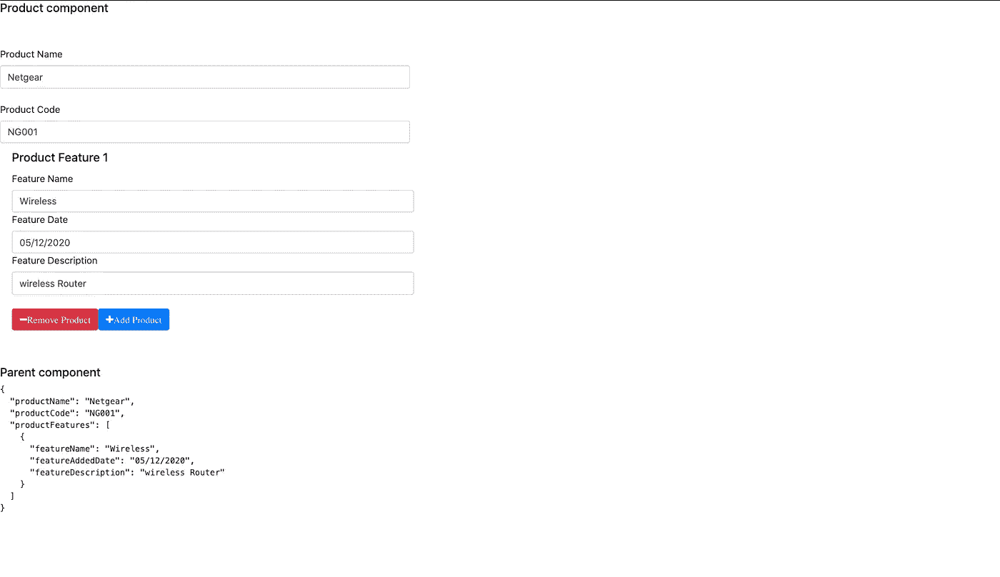

# 角度:使用 Formbuilder 构建反应式表单

> 原文：<https://javascript.plainenglish.io/angular-build-reactive-forms-using-formbuilder-e86a4a2c1381?source=collection_archive---------0----------------------->

表单是 web 应用程序非常重要的一部分。有时我们会遇到表单元素是静态且定义良好的场景。有时候，web 应用程序开发超越了静态表单，进入了动态表单。动态表单没有静态字段。动态窗体和控件可以基于某些事件生成。在这篇文章中，我们将建立一个反应形式使用角度反应的方法。


Photo by [chuttersnap](https://unsplash.com/@chuttersnap?utm_source=medium&utm_medium=referral) on [Unsplash](https://unsplash.com?utm_source=medium&utm_medium=referral)

Angular 支持两种动态控制设计。

*   **模板驱动-** 在模板驱动的表单中对有角度的模板有更多的控制。双向绑定。容易实现。
*   **反应形式-** 非常强大，大部分控制都在组件中。需要 Formbuilder 来构建表单。在这篇文章中，我们将使用反应形式的方法。

# 为什么是反应式？

反应式表单是创建动态表单的一种更灵活的方式。创建模板和反应式表单后，我发现创建反应式表单有以下好处:

*   非常灵活，将创建绑定、错误处理等所有控制权交给开发人员。这导致组件中的代码比模板中的代码多。没有绑定，所以数据模型不可变。
*   非常容易写单元测试。因为大部分代码都在组件中，所以编写单元测试非常容易。
*   与模板驱动方法相比，反应式表单更加复杂。但是一旦开发者习惯了，玩反应式表单就非常容易了。

# 建筑电抗组件

我们正在构建一个产品反应组件。产品有产品名称和产品代码。该产品还有另一个可选参数，即产品特性。产品功能包含功能名称、功能添加日期和功能描述。 ***可以动态添加功能。我们要添加的功能数量没有限制。屏幕看起来会像这样。***



我们正在创建一个反应式子组件产品功能。我们在父组件和子组件之间使用双向数据绑定。`productField`是双向绑定。

```
<app-product-feature [(productField)]=”productField”></app-product-feature>
```

现在添加反应式表单模块的应用内模块文件。反应式模块将能够设计反应式组件。完整的`app.module.ts`将类似于下面的代码。

创建产品子组件。产品子组件包含模板、CSS 和组件文件。检查最后附件中的 GitHub 代码。从`@angular/forms`导入`FormBuilder`、`Validators`和`FormArray`。`FormBuilder`需要设计产品形态模型。`Validators`是控件输入验证所必需的。`FormArray`是构建动态表单功能所必需的。

```
import { FormBuilder,Validators,FormArray } from ‘@angular/forms’;
```

将`productField`定义为输入属性。因为我们有与子组件的双向绑定，所以将`productFieldChange`定义为输出装饰器属性。在构造函数中注入`FormBuilder`作为`fb`。

```
@Input() productField: Product<productFeatures>; 
@Output() productFieldChange = new EventEmitter<any>();constructor(private fb: FormBuilder) { }
```

定义产品特性产品名称和代码。产品名称为必填字段。作为表单数组的产品特征。

```
productFeatureForm = this.fb.group({ 
productName: [‘’, Validators.required], 
productCode: [‘’], 
productFeatures: new FormArray([]) });
```

为简单起见，定义两个 get 属性。获取`f()`和获取`p()`。

```
get f() { return this.productFeatureForm.controls; }get p() { return this.f.productFeatures as FormArray; }
```

当组件初始化时，在窗体数组中添加一个默认功能。单击“添加”按钮时，我们将在产品功能中添加相同的对象。

```
ngOnInit() {this.p.push(this.fb.group({ featureName: [‘’],featureAddedDate: [‘’],featureDescription: [‘’]})); }
```

完整的组件文件如下所示。

在产品组件功能 HTML 中添加表单组属性。将产品名称定义为必填字段。

```
<form *ngIf=”productFeatureForm” [formGroup]=”productFeatureForm”><div class="row required-field"><div class="col-md-4"><label class="cus-form-label">Product Name</label><input class="form-control minimal" id="productName" formControlName="productName" required></div></div></form>
```

因为产品特性在产品内部是一个表单数组。迭代产品特性以显示多个特性。

```
<div *ngFor="let prod of p.controls; let i = index" class="list-group list-group-flush"><div class="list-group-item"><h5 class="card-title">Product Feature {{i + 1}}</h5><div [formGroup]="prod" ><div class="row required-field"><div class="col-md-4"><label class="cus-form-label">Feature Name</label><input class="form-control minimal" id="{{'name' + i}}" formControlName="featureName"></div></div></div></div></div>
```

完整的 HTML 文件如下所示。

# 确认

用于验证必填的必填字段是 isError 属性。提交表单或添加新功能后，将 isError 设置为 true。有关更多详细信息，请查看以下代码块。

```
<div *ngIf=”isError && f.productName.errors” class=”invalid-feedback”><div *ngIf=”f.productName.errors.required”>Product name is required field</div></div>
```

# 添加和删除产品功能

添加新功能时，请在产品表单对象中添加功能对象。添加完成后，向父组件发出更改。

```
addNewProdField(index: number): void {this.p.push(this.fb.group({featureName: [‘’],featureAddedDate: [‘’],featureDescription: [‘’]}));this.productFieldChange.emit(this.productFeatureForm.value);}
```

根据索引移除产品。删除完成后，将更改发送到父组件。

```
removeNewProdField(index: number): void {this.p.removeAt(index);this.productFieldChange.emit(this.productFeatureForm.value);}
```

哇，现在我们可以添加和删除产品功能了。添加删除将通知父组件。

在父组件中，将代码放在下面以检查子组件的属性更改。

```
<h5>Parent component</h5><pre>{{productField | json}}</pre>
```

您可以从子组件中看到 JSON 对象。

```
{
 “productName”: “Netgear”,
 “productCode”: “NG001”,
 “productFeatures”: [
 {
 “featureName”: “Wireless”,
 “featureAddedDate”: “05/12/2020”,
 “featureDescription”: “to connect wireless”
 }
 ]
}
```

# 摘要

在本文中，我们使用 form builder 创建了一个反应式表单。我们还经历了一个动态产品特性组件。特征组件可以动态添加、删除。添加 GitHub 链接，提供下载和更大的学习灵活性。

[](https://github.com/codingindepth/angular-dynamic-reactive-forms) [## 深度/角度-动态-反应-形式

### 此项目是使用 Angular CLI 版本 8.3.21 生成的。为开发服务器运行 ng serve。导航到…

github.com](https://github.com/codingindepth/angular-dynamic-reactive-forms) 

## 进一步阅读

[](/create-a-multi-page-job-application-form-using-angular-f0b1640f4195) [## 使用 Angular 创建多页工作申请表

### 一步一步的教程，以建立一个多页的工作申请表使用 Angular 和 SurveyJS，一个免费的，开源的…

javascript.plainenglish.io](/create-a-multi-page-job-application-form-using-angular-f0b1640f4195)