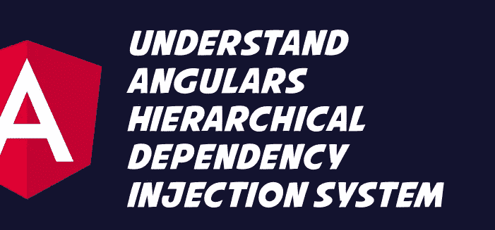

# 角度依赖性注入

> 原文：<https://javascript.plainenglish.io/angular-hierarchical-injection-system-4b80e5cc9dac?source=collection_archive---------6----------------------->


Photo by [patrick lanza](https://unsplash.com/@abyss_?utm_source=unsplash&utm_medium=referral&utm_content=creditCopyText) on [Unsplash](https://unsplash.com/?utm_source=unsplash&utm_medium=referral&utm_content=creditCopyText)

Angular DI 利用了一个分层的注入系统，因此嵌套的注入器能够创建自己的服务实例。因此， ***Angular 定期创建嵌套的注入器。***

> 分层依赖注入系统允许我们为依赖关系定义不同的边界或范围，并遵循组件树结构。

默认情况下，注册到 Angular 的服务是应用程序范围的，但是我们也可以创建隔离到组件子集的服务。

*一旦 Angular 创建了一个指定了提供者的组件的新实例，它也将为该实例创建一个新的子注入器。
类似地，新 NgModule 在运行时的延迟加载也会触发带有自己的提供者的注入器的创建。*

因为子模块和组件注入器是相互独立的，所以它们也将为所提供的服务创建自己独立的实例。

每当 Angular 销毁一个 NgModule 或 component 实例时，它也会销毁该注入器以及该注入器的服务实例。然而，由于注入器继承，我们仍然可以将应用程序范围的服务注入到这些组件中。

组件的注入器是其父组件的注入器的子组件，并且从所有祖先注入器一直继承到应用程序的根注入器。Angular 可以注入该谱系中任何注入器所提供的服务。



# 注射器等级

## 模块注入器层次结构

***@NgModule()*** 或***@ injective()***注释在此层次中用于配置 ModuleInjector。

***injective():***@ injective()装饰器标识一个服务类。当我们在服务本身的***@ injective()***装饰器中指定提供者时(通常在应用程序根级别)，CLI 的生产构建所使用的优化工具可以执行**树摇动**。

它删除我们的应用程序不使用的服务。树抖动导致更小的束尺寸。

```
import { Injectable } from '@angular/core';@Injectable({
  providedIn: 'root'  // <--provides this service in the root ModuleInjector
})export class LoggerService {
  name = 'Logger';
}
```

***@NgModule()提供者数组:*** 我们还可以使用非根 NgModule 的 providers 元数据选项在模块级别配置提供者。通过这种方式，我们可以将提供者的范围限制在该模块上。

这相当于在@ Injectable()元数据中指定非根模块，只是通过提供者提供的服务不是树摇动的。

***文件- > src/app/app.module.ts(提供者)***

```
providers: [
  { provide: LocationStrategy, useClass: HashLocationStrategy }
]
```

## 元素注入器层次结构

它是为每个 DOM 元素隐式创建的。除非在 ***@Directive()*** 或 ***@Component()*** 的 providers 属性中配置，否则 ElementInjector 默认为空。

这样，我们就能够将提供者的范围限制在一个组件及其子组件上。

```
import { Component } from '@angular/core';
import { LoggerService } from './logger.service';@Component({
  selector: 'app-component',
  providers: [ LoggerService ],
  templateUrl: './app.component.html'
})
export class AppComponent { }
```

不管它是组件还是指令，我们都可以使用 providers 属性来配置提供者。一旦完成，它将属于该组件或指令的 ElementInjector。

在这个层次结构中，当我们在一个组件中提供服务后，该服务将通过该组件实例的 ElementInjector 可用。

# 结论

Angular 以其强大的依赖注入系统而闻名。使用依赖注入有很多好处，包括在我们的应用程序中更直接的测试策略和依赖管理。

使用 Angular 的依赖注入系统，我们可以创建称为服务的特殊类，允许我们在组件和功能之间共享逻辑和数据

## 参考

[Angular.io](https://angular.io/)