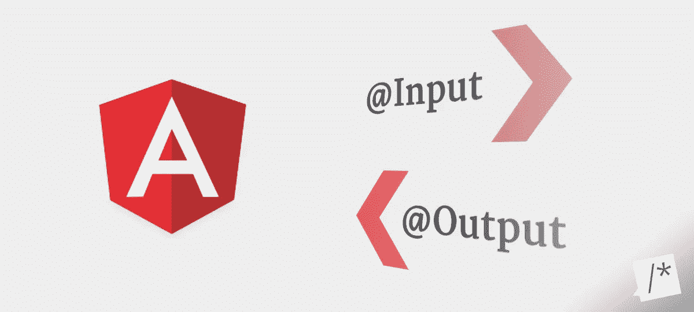
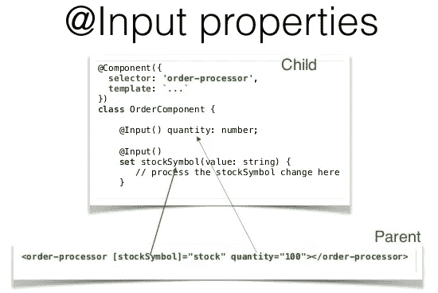
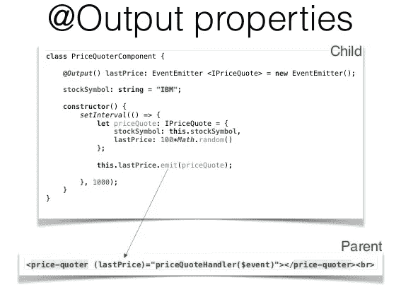
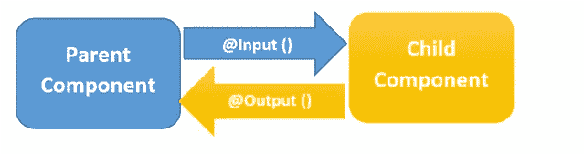

# 角度输入输出属性

> 原文：<https://javascript.plainenglish.io/angular-input-output-properties-cb02a1a543f8?source=collection_archive---------2----------------------->



## 如何处理组件交互

由于 Angular 框架是建立在多个组件之上的，因此需要将数据从父组件传递到子组件。为了做到这一点，我们引入了@Input 和@Output 属性。

我们可以为自己创建的组件定义属性，并使它们在整个应用程序中可用。在 Angular 中，使用" **events** "我们可以通知父组件一些事情已经改变。

**输入**属性指定我们可以在父组件上设置的属性，而**输出**属性标识组件可以触发的事件，以将信息从其子组件发送到其父组件。

# @输入属性

Angular input decorator 只是告诉 *Angular* 嘿，当你找到一个与这个名字绑定的属性时，把它映射到我的另一个名字的组件属性。或者如果我不给你一个别名，就用我的组件属性名。

现在，尽管 Angular 支持这个名称别名，但推荐的做法是在默认情况下避免使用这种方法，而是使用 call 属性名。



装饰器将类字段标记为输入属性，并提供配置元数据。输入属性被绑定到模板中的 DOM 属性。在变化检测过程中，Angular 自动用 DOM 属性值更新数据属性。

让我们看一个例子，我们如何实现这一点。

**子组件:**

```
import { Component, Input } from '@angular/core'; 
// First, import Inputexport class HeroDetailComponent implements OnInit{
  **@Input() heroName: string; // decorate the property with @Input()**
}
```

在上面的示例中， ***@Input()*** 修饰属性 heroName，它具有字符串类型，但是， ***@Input()*** 属性可以具有任何类型，如数字、字符串、布尔值或对象。项目的值将来自父组件。

**子组件模板:**

```
<p>
  {{heroName}} arrived.
</p>
```

现在来看父组件模板，我们将在其中绑定属性。这里，***【app-hero-detail】***是子选择器，在父组件模板中作为指令使用。然后，我们使用属性绑定将子节点中的属性绑定到父节点的属性。

**父组件模板:**

```
<app-hero-detail [heroName]="currentHero"></app-hero-detail>src/app/dashboard/dashboard.component.ts --> 
export class DashboardComponent implements OnInit {
   currentHero = 'Batman';
}
```

在上例中，***【heroName】***是来自子节点的 ***@Input*** 属性，其中 as***current ero***是来自父节点的属性。

# @输出属性

它帮助我们将数据从孩子传递给父母。装饰器将类字段标记为输出属性，并提供配置元数据。在变化检测期间，绑定到输出属性的 DOM 属性会自动更新。

一个 ***@Output()*** 属性通常应该初始化为一个 Angular EventEmitter，其值作为事件流出组件。



***@Output()*** 将子组件中的一个属性标记为一个入口，帮助我们将数据从子组件传递到父组件。然后，子组件必须引发一个事件来通知父组件发生了变化。

要引发事件， ***@Output()*** 必须使用 EventEmitter，它是@angular/core 中用于发出自定义事件的类。

```
import { Output, EventEmitter } from '@angular/core';export class HeroesComponent implements OnInit {
**@Output() newHero = new EventEmitter<Hero>();**addNewHero(hero: Hero) {
    this.newHero.emit(hero);
  }
}
```

这里，

*   **@Output() :** 一个装饰函数，将属性标记为数据从子节点到父节点的一种方式
*   **new hero:*****@ Output()***的名称
*   **新事件发射器<英雄> () :** 告诉 Angular 创建一个新的事件发射器，并且它发出的数据是英雄对象类型。类型可以是任何类型，如数字、布尔等。
*   **addNewHero :** 使用 ***@Output()*** ， ***newHero*** 来引发一个事件，在这个事件中它发出英雄值。

# 总而言之:



*   ***@Input()*** 和 ***@Output()*** 允许 Angular 在父上下文和子指令或组件之间共享数据。它们充当子组件的 API 或应用程序编程接口，因为它们允许子组件与父组件通信。
*   一个 ***@Input()*** 属性是可写的，而一个 ***@Output()*** 属性是可观察的。
*   ***@Input()*** 和 ***@Output()*** 是独立的
*   我们也可以像下面这样做混叠，尽管如前所述不建议这样做。

**元数据别名**

```
inputs: ['input1: heroName'], // propertyName:alias
outputs: ['outputEvent1: newHero']
```

**装饰工走样**

```
@Input('heroName') input2: string;  //  [@Input](http://twitter.com/Input)(alias)
@Output('newHero') outputEvent2 = new EventEmitter<Hero>(); //  @Output(alias) propertyName = ...
```

## 参考

[棱角分明。IO](https://angular.io/guide/template-syntax#input-and-output-properties)

## 用简单英语写的 JavaScript 的注释

我们总是有兴趣帮助推广高质量的内容。如果你有一篇文章想用简单的英语提交给 JavaScript，用你的中级用户名发邮件到 submissions@javascriptinplainenglish.com[](mailto:submissions@javascriptinplainenglish.com)**给我们，我们会把你添加为作者。**

**我们还推出了三种新的出版物！请关注我们的新出版物:[**AI in Plain English**](https://medium.com/ai-in-plain-english)[**UX in Plain English**](https://medium.com/ux-in-plain-english)[**Python in Plain English**](https://medium.com/python-in-plain-english)**——谢谢，继续学习！****