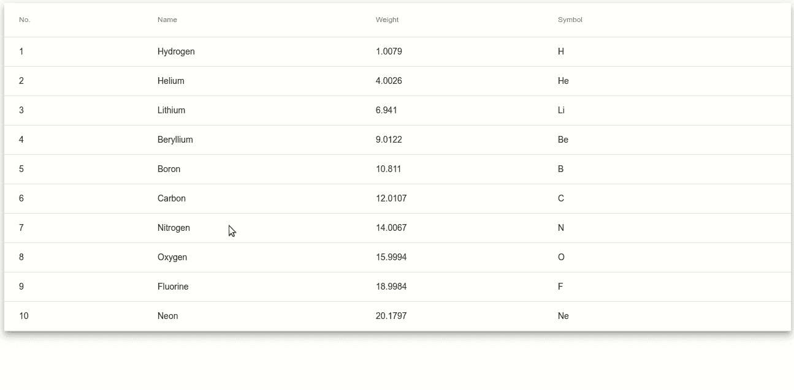
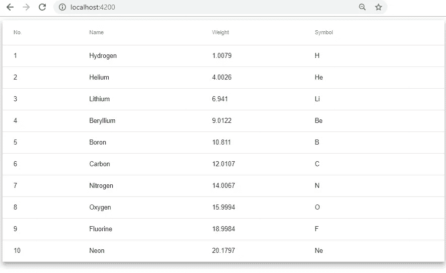
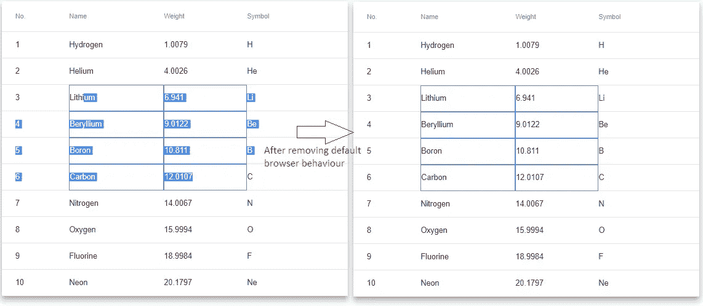
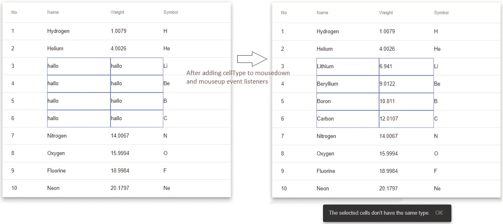

# 角度内嵌-像 Excel 一样编辑表格，无需第三方库

> 原文：<https://javascript.plainenglish.io/angular-material-table-with-edit-function-like-excel-7c2c53332553?source=collection_archive---------0----------------------->



Angular Inline-Edit Table like Excel without Third Party Library

## [网络开发](https://rakiabensassi.medium.com/list/software-engineering-7a179a23ebfd)

## 如何使用角度材质同时编辑多个表格的单元格？

在数字化时代，许多用户已经从 Excel 电子表格迁移到现代网络应用程序，但他们仍然希望找到他们多年来与老朋友 Excel 使用的相同功能。坏消息是，这种不在讨论范围内的期望对于前端开发人员来说可能是一场噩梦。

其中一个非常常见的功能是数据表，它可以在线编辑多个单元格，而不需要点击编辑图标，然后打开一个对话框，用户必须在其中输入单元格的新值。有时，开发人员选择添加一个第三方库，为应用程序提供该功能，因为他们不知道自己实现该功能需要多少时间。

因此，如果您有这样的要求，并且您认为您需要一个第三方库，您会在阅读本文后改变主意。我们在这里需要的只是角形和角形材料。让我们开始吧。

*您可以在 Udemy 上查看我的* ***视频教程****:*[*如何识别、诊断和修复网络应用中的内存泄漏*](https://www.udemy.com/course/identify-and-fix-javascript-memory-leaks/) *。*

## 项目设置

我们将使用 Angular CLI 构建我们的应用程序。首先，我们需要安装它:

```
npm install -g [@angular/cli](http://twitter.com/angular/cli)
```

然后创建我们的应用程序:

```
ng new mat-edit-table
cd mat-edit-table
```

## 密码

好了，该做好事了。我们必须遵循以下步骤:

*   安装角材:

```
npm install @angular/material
npm install @angular/cdk
npm install hammerjs
```

*   导入角度主题。将此行添加到*src/style . SCS*:

*   更新*app module app . module . ts:*

app.module.ts

*   将*app.component.html*内容替换为:

Angular Material basic table

*   将 *app.component.ts* 的内容替换为:

Angular Material basic table

这是运行 *ng serve* 并用浏览器调用 *localhost:4200* 后的结果:



Angular Material basic table

*   现在，我们需要将 *mousedown* 和 *mouseup* 事件侦听器添加到可编辑的单元格中。我们只想编辑*栏中的细胞名称、重量和符号*。

*   正如你所看到的，我们使用了两个新的 CSS 类‘*选中的*’和‘*未选中的*’来显示或隐藏选中单元格周围的蓝色边框，这取决于它们保存在二维数组中的状态*选中的单元格状态*。

添加 keyup 事件侦听器。通过在<表>标签中添加(key up)=“OnKeyUp($ event)”事件侦听器来更新*app.component.html*，并更新 *app.component.ts:*

*   默认情况下，浏览器会在选定区域添加蓝色背景。为了获得更好的 UX，我们将在选择单元格后删除此默认行为:



Remove blue background from table’s cells

完整的代码可以在 [github 这里](https://github.com/rakia/mat-edit-table)获得。

## 最后一件事

我们的 1 表中有两种不同类型的列:字符串和数字。因此，如果用户从不同的列中选择单元格并为它们输入相同的新值，将会很尴尬。因此， *onMouseDown* 和 *onMouseUp* 方法有第三个参数 *cellsType* 。如果用户开始为不同类型的单元格输入值，他将在 snackBar 中收到警告:



Show snackbar if selected cells have different types

今天到此为止。在下一篇文章[中，我将把这个表导出为一个 Angular 库，通过把它添加到 package.json 中，就像其他 npm 依赖项一样，能够在不同的项目中重用它。](https://medium.com/@rakia/multi-edit-table-export-as-an-angular-library-40b37e773fd3)

[](https://levelup.gitconnected.com/multi-edit-table-export-as-an-angular-library-40b37e773fd3) [## 如何用 NodeJS 创建角度库

### 使用 npm 发布导出角度材料表

levelup.gitconnected.com](https://levelup.gitconnected.com/multi-edit-table-export-as-an-angular-library-40b37e773fd3) 

# 想要更多吗？

我为一群聪明、好奇的🧠人写关于工程、技术和领导力的文章💡。 [**加入我的免费电子邮件简讯，独家获取**](https://rakiabensassi.substack.com/) 或在此注册 Medium [。](https://rakiabensassi.medium.com/membership)

*你可以在 Udemy 上查看我的* ***视频课程****:*[*如何识别、诊断、修复 Web Apps 中的内存泄漏*](https://www.udemy.com/course/identify-and-fix-javascript-memory-leaks/) *。*

[](https://medium.com/javascript-in-plain-english/promise-vs-observable-vs-stream-165a310e886f) [## 承诺、可观察和流之间有什么区别？

### 现代编程中的三种风格

medium.com](https://medium.com/javascript-in-plain-english/promise-vs-observable-vs-stream-165a310e886f) [](https://levelup.gitconnected.com/learning-velocity-and-coding-standards-10952f6c9640) [## 为什么编码标准很重要，以及如何衡量开发速度

### 熟悉一个新项目需要多长时间

levelup.gitconnected.com](https://levelup.gitconnected.com/learning-velocity-and-coding-standards-10952f6c9640)