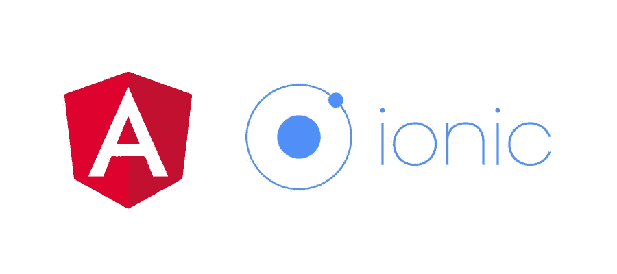

# Angular:使用 WhatsApp API 从 Ionic App 或 PWA 打开 WhatsApp

> 原文：<https://javascript.plainenglish.io/angular-open-whatsapp-from-ionic-app-or-pwa-using-whatsapp-api-143b60f97f50?source=collection_archive---------6----------------------->

## 使用 WhatsApp API 从 Ionic 或 Angular PWA 应用程序打开 WhatsApp 应用程序



## 1.打开 config.xml 并添加:

```
<access launch-external=”yes” origin=”whatsapp://*” />
```

## 2.然后在 HTML 模板中:

```
 <a href=”[https://wa.me/](https://wa.me/whatsappnumber?text=Hello%20World)[WhatsAppNumber](https://wa.me/whatsappnumber?text=Hello%20World)[?text=Hello%20World](https://wa.me/whatsappnumber?text=Hello%20World)">WhatsApp</a>

OR<ion-button href=”[https://wa.me/WhatsAppNumber?text=Hello%20World](https://wa.me/whatsappnumber?text=Hello%20World)">WhatsApp</ion-button> 
```

## 在 WhatsAppNumber 中，你应该使用国际格式(当然没有空格)

*   1 xxx xxx xxxx 美国
*   91 xxx xxx xxxx 印度
*   52 1 xxx xxx xxxx 墨西哥
*   54 9 xxx xxx xxxx 阿根廷

欢迎在评论框中发表评论。如果我错过了什么，或者有什么是不正确的，或者有什么不适合你:)

*更多内容尽在*[***plain English . io***](http://plainenglish.io)