# 学习角度概念:进度条

> 原文：<https://javascript.plainenglish.io/angular-progress-bar-fafacdf65a27?source=collection_archive---------11----------------------->

## 通过构建一个简单的进度条组件来学习 Angular & RxJS 概念

**源代码:** [StackBlitz **🚀**](https://stackblitz.com/edit/angular-ivy-mwcgei?file=src/app/progress-bar/progress-bar.component.ts)

文章目标:通过构建一个进度条，学习基本的角度概念和保持组件简单的策略。

**我们将学到什么:**

*   使用`Inputs` & `Outputs`使我们的组件简单灵活
*   有角度的`@ViewChild()`和`Renderer2`来安全地修改 DOM 元素
*   重构来简化我们的组件代码
*   使用 Angular `async`管道从 RxJS `observable`到我们的组件展开一个值流。

# 进度条

让我们创建一个简单的进度条。下面的片段可能会将细节抽象化，以突出我们正在讨论的内容。完整示例见[源代码](https://stackblitz.com/edit/angular-ivy-mwcgei?file=src%2Fapp%2Fprogress-bar%2Fprogress-bar.component.ts)。

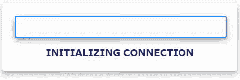

当我们制造一个组件时，感觉就像是一种平衡行为。足够通用以适应未来的用例，但足够具体以适应我们当前的用例。

下面是我们整个组件的一个片段。我们会分解每一块。

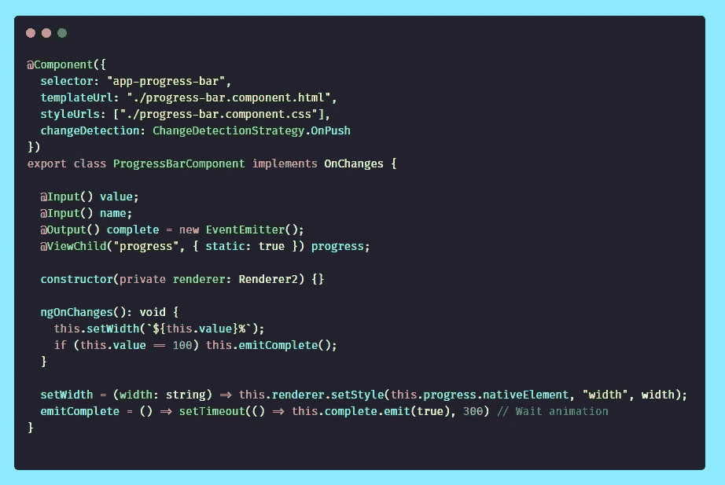

[source](https://stackblitz.com/edit/angular-ivy-mwcgei?file=src%2Fapp%2Fprogress-bar%2Fprogress-bar.component.ts)

> 在简化值和宽度部分，我们将重构组件，以降低 ViewChild 和 Renderer2 带来的一些复杂性。

## 输入&输出& ngOnChanges

我们的组件将定义两个输入:`value` & `name`

如果`value`或`name`来自于`Observable`、`Promise`、`Object`等等，这是无关紧要的。我们所需要的是一个`number` & `string`来让我们的组件知道如何调整进度和显示任务名称。

`ngOnChanges()`将在每次我们的一个输入改变时被调用。

每当`value`改变时，我们将调用我们的`setWidth(width)`函数(更多关于`setWidth(width)`的信息在`Renderer2` 部分)。如果`value`达到 100，我们将通过`complete`输出发出一个事件。

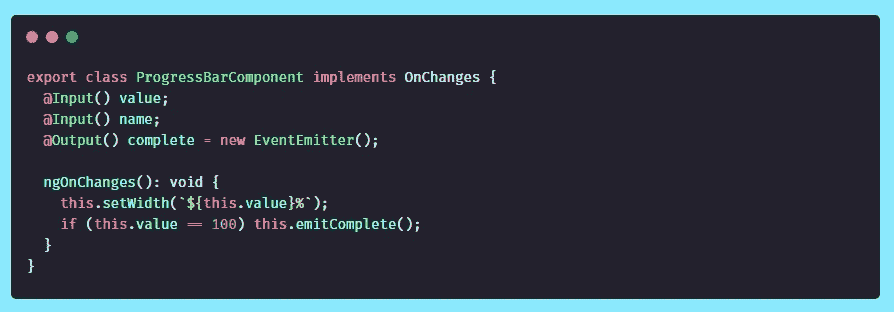

[source](https://stackblitz.com/edit/angular-ivy-mwcgei?file=src%2Fapp%2Fprogress-bar%2Fprogress-bar.component.ts)

我们定义一个单一的输出`complete`。

该组件仅在发出`complete`(`value`等于 100)时定义**。我们让组件用户决定他们想在`complete`做什么**。

相比之下，我们可以在组件内部实现特定的逻辑，在`complete`上执行。这将使组件对我们当前的用例可行，但对未来的用例可能不可行。

## ViewChild 和 Renderer2

`ViewChild`允许我们在组件 HTML 中定位一个元素，并在组件类型脚本中使用它。

`@ViewChild('progress', {static: true})`将针对任何带有`#progress`的 HTML 元素。

`{static: true}`将通知 Angular 在变化检测运行之前[解析查询结果。换句话说，使元素在 Init 上可用。](https://angular.io/api/core/ViewChild/)

尝试删除[示例源代码](https://stackblitz.com/edit/angular-ivy-mwcgei?file=src%2Fapp%2Fprogress-bar%2Fprogress-bar.component.ts)中的`{static: true}`，当调用`setWidth`时，控制台将在第一次更改`value`时记录以下错误:

> 无法读取未定义的属性“nativeElement”

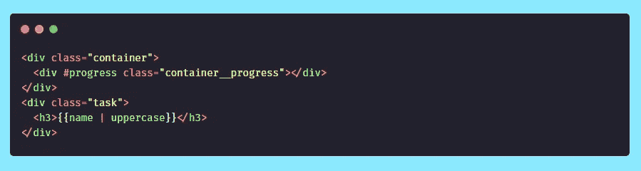

[source](https://stackblitz.com/edit/angular-ivy-mwcgei?file=src%2Fapp%2Fprogress-bar%2Fprogress-bar.component.html)

`Renderer2`是 Angular 提供的一项服务，它抽象了 DOM 的工作。我们将在设置`progress`元素的宽度时使用它。

`name`完全通过角度[插补](https://angular.io/guide/interpolation)处理。对`name`的更改将通过`uppercase`管道大写并显示在 DOM 中。

当它改变时，我们将调用我们的`setWidth(width)`方法，而不是内插和显示`value`。

`setWidth(width)`将改变进度条元素的样式`width`。元素`progress`的样式`background`有一个颜色/渐变，它创建了加载的外观。

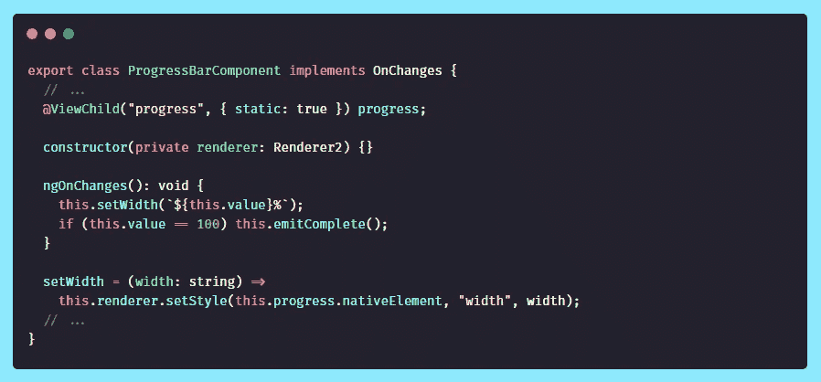

[source](https://stackblitz.com/edit/angular-ivy-mwcgei?file=src%2Fapp%2Fprogress-bar%2Fprogress-bar.component.ts)

## 简化价值和宽度

改变进度条的宽度可以有效地演示如何使用`ViewChild`和`Renderer2`。但是，我们可以通过使用角度样式绑定来简化这段代码。

随着`value`的变化，`[style.width.%]="value"`绑定负责修改元素宽度。

在我们的组件类型脚本中，我们可以删除`ViewChild`、`Renderer2`和`setWidth(width)`函数的所有用法。

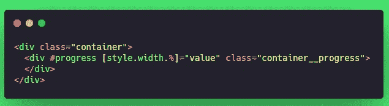

Refactored HTML

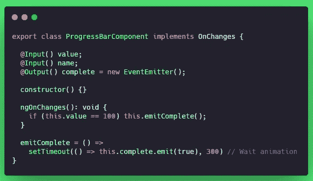

Refactored Typescript

## 使用组件

在我们的例子中，我们将使用`async`管道将一组值从一个可观察对象传输到组件。

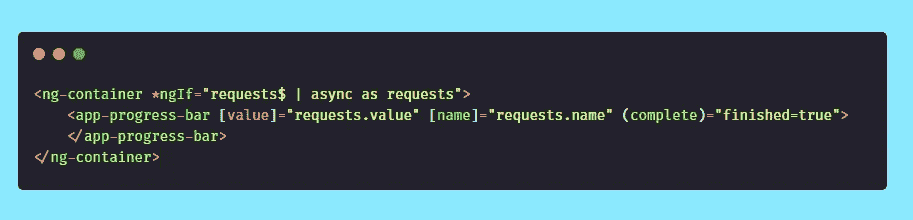

[source](https://stackblitz.com/edit/angular-ivy-mwcgei?file=src%2Fapp%2Fapp.component.html)

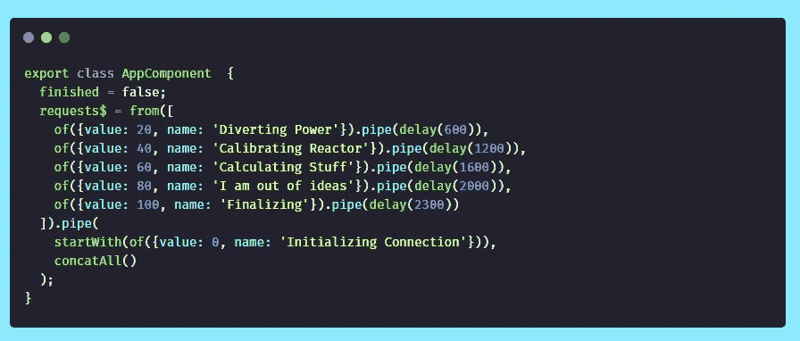

[source](https://stackblitz.com/edit/angular-ivy-mwcgei?file=src%2Fapp%2Fapp.component.ts)

对于上下文，`concatAll()` [仅在前一个内部可观察对象完成后订阅每个内部可观察对象，并将它们的所有值合并到返回的可观察对象中](https://rxjs.dev/api/operators/concatAll)。延迟后，`requests$`将从每个`of`中一次发出一个内容。

`app-progress-bar`不知道`Observables`的用法，也不知道数据是异步的还是同步的。将数字和字符串分别传递给`value`和`name`的任何其他用法也是有效的。

当传入值 100 时，将发出`complete`事件。发生这种情况时，由组件用户(`appComponent`)决定如何处理。

我们可以显示一个完成消息，销毁进度条，导航到一个新的路线，等等…

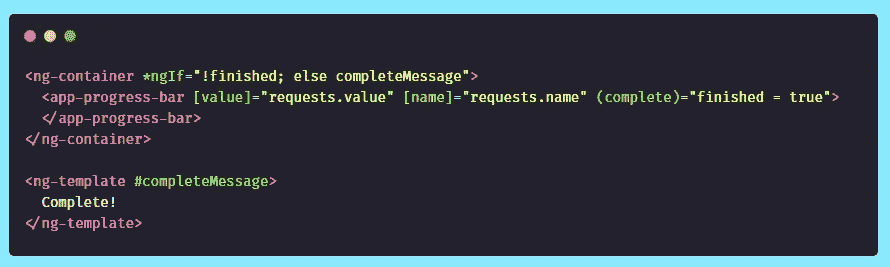

# 结论

我们已经练习了用最少的功能创建一个非常基本的进度条。我们可以通过输入添加更多的定制选项来扩展这个进度条。

例如，我们可以添加一个没有特定加载值的`indeterminate`模式，或者为进度条传递不同的颜色。—尽量保持组件本身简单，但要给组件用户选项和灵活性。

## 参考/灵感

[材料进度条](https://material.angular.io/components/progress-bar/api)

[纯 RxJS 进度条](https://www.learnrxjs.io/learn-rxjs/recipes/progressbar)

[进度条中使用的渐变动画](https://www.gradient-animator.com/)

> ☁️[flotes](https://flotes.app)——尝试演示，不需要登录。或者免费报名。Flotes 是我记笔记和高效学习的方式，即使在我很忙的时候。

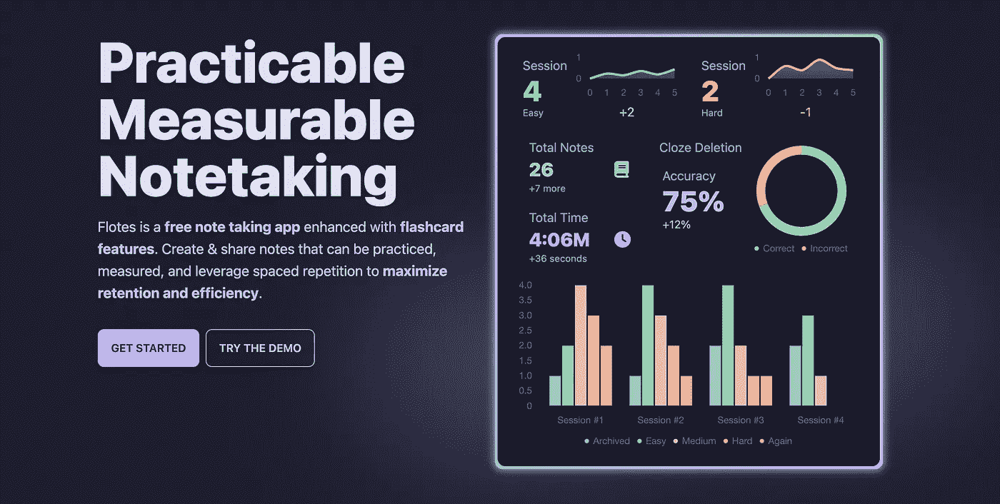

[Flotes](https://flotes.app)