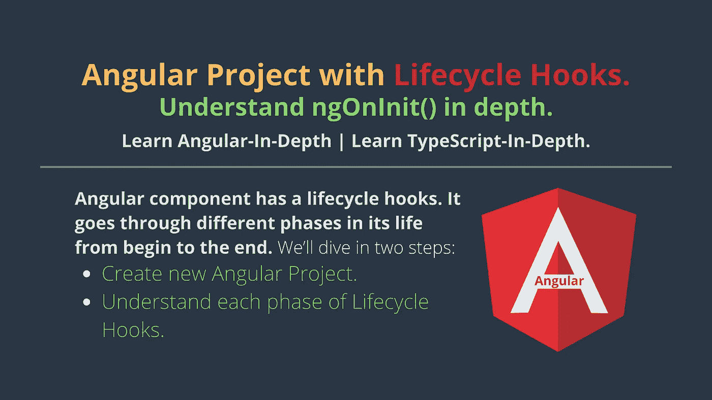
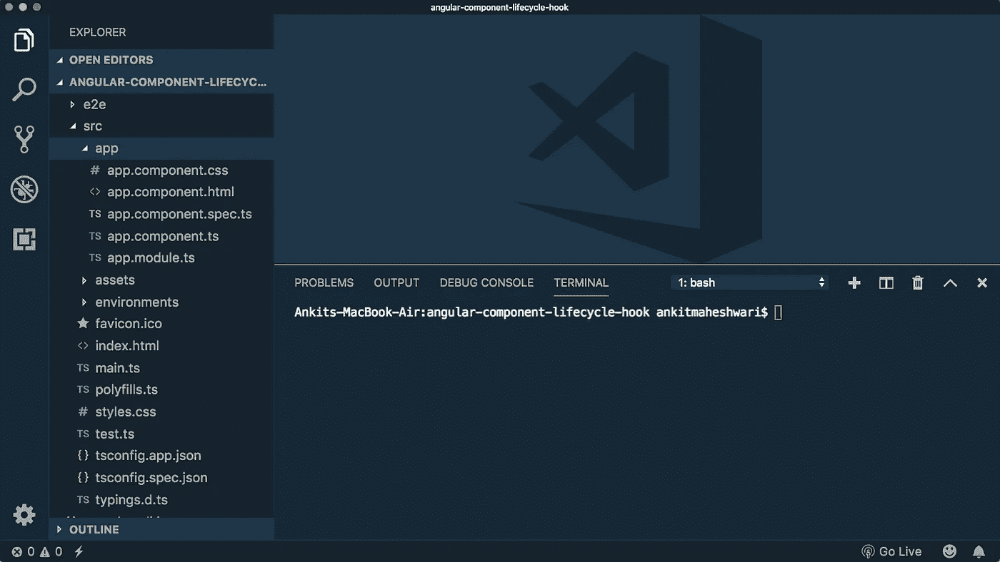
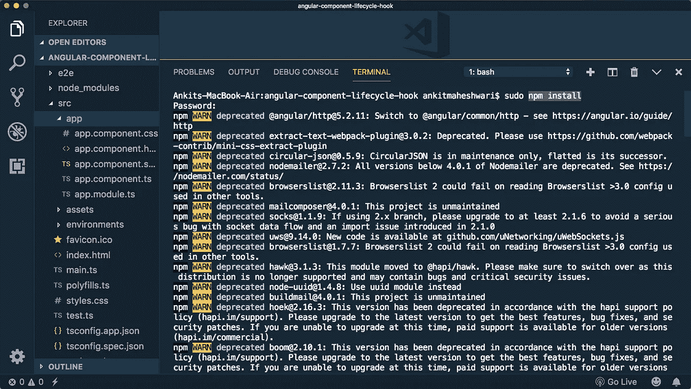
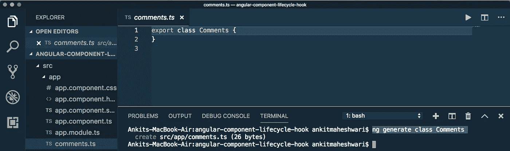
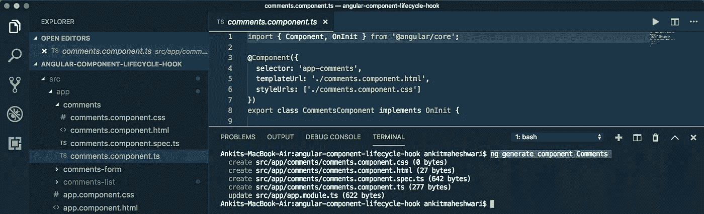
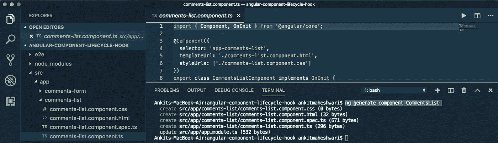
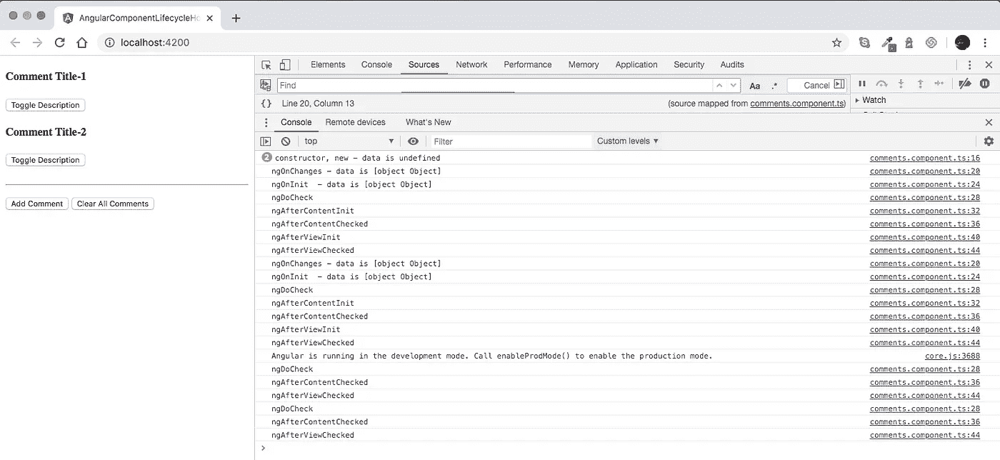
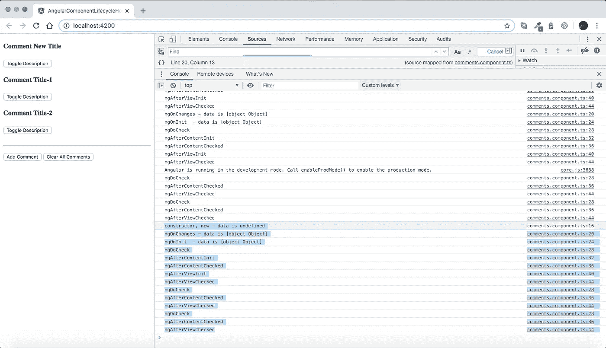

# 带生命周期钩子的 Angular 项目|深入理解 ngOnInit()。

> 原文：<https://javascript.plainenglish.io/angular-project-with-lifecycle-hooks-understand-ngoninit-in-depth-b9919ad09e6?source=collection_archive---------4----------------------->

[](https://medium.com/codechintan/ionic-hide-header-on-scroll-b8828a7a7f86) [## Ionic4 隐藏滚动标题。

### 如何在 Ionic 框架中隐藏内容滚动的标题？

medium.com](https://medium.com/codechintan/ionic-hide-header-on-scroll-b8828a7a7f86) 

角度元件有一个生命周期挂钩。从开始到结束，它经历了生命中的不同阶段。

# 我们将分两步深入:

*   创建新的角度项目。
*   理解生命周期挂钩的每个阶段。



对于源代码: [**克隆这个 GitHub 库**](https://github.com/AnkitMaheshwariIn/angular-component-lifecycle-hook) **。**

# 创建新的角度项目。

#1 创建**新项目**运行此命令:

```
ng new project-name
```

#2 **在 VS 代码中打开项目**文件夹。(安装→ [VS 代码](https://code.visualstudio.com/))



#3 运行`**npm install**`以确保所有依赖项都已安装。
(这将在项目目录中创建新的`node_modules`文件夹)



#4.1 向**创建新类**运行该命令:

```
ng generate class class-name
```

我运行`ng generate class Comments`生成一个类，这将在`src/app/comments.ts`创建一个新的类文件



#4.2 **更新类** :
打开你的`src/app/comments.ts`文件，更新如下:

#5.1 再次**创建新组件**运行该命令:

```
ng generate component component-name
```

我运行`ng generate component Comments`来生成一个组件，这将在`src/app/comments`创建 4 个新文件



#5.2 **更新组件** :
打开你的`src/app/comments/comments.component.ts`文件，更新如下:

#5.3 **更新组件模板** :
打开您的`src/app/comments/comments.component.html`文件，并更新如下:

再次# 6.1**创建新组件**运行该命令:

```
ng generate component component-name
```

我运行`ng generate component CommentsList`来生成一个组件，这将在`src/app/comments-list`创建 4 个新文件



#6.2 **更新组件** :
打开你的`src/app/comments-list/comments-list.component.ts`文件，更新如下:

#6.3 **更新组件模板** :
打开您的`src/app/comments/comments-list.component.html`文件，并更新如下:

#7 **更新应用组件** :
打开你的`src/app/app.component.ts`文件，更新如下:

#8 **更新 App 模块** :
最后，打开你的`src/app/app.module.ts`文件，更新如下:

# 我们成功创建了一个 Angular App。让我们运行这个应用程序..

要运行 Angular app，请运行以下命令:

```
ng serve
```


** NG Live Development Server 正在侦听 localhost:4200，请在 [http://localhost:4200/](http://localhost:4200/) 上打开您的浏览器* * *

如果你的应用在不同的端口上运行，请随意更改 URL。像这样[http://localhost:YOUR-PORT-NO/](http://localhost:4200/)



# 让我们实际了解一下生命周期挂钩。

如果我们点击“添加评论”,那么列表中会添加一条评论，Angular 会创建一个`CommentsComponent`的实例，这将触发生命周期挂钩..看下面——点击“添加评论”后的图片。



此时查看控制台，我们可以看到这些日志:

```
constructor, new - data is undefined
ngOnChanges - data is [object Object]
ngOnInit  - data is [object Object]
ngDoCheck
ngAfterContentInit
ngAfterContentChecked
ngAfterViewInit
ngAfterViewChecked
```

*   我们可以清楚地看到，在调用`constructor`时，输入属性是未定义的。
*   然而，当调用`ngOnChanges`钩子时，输入属性现在被设置为`Comment`对象。

> 重要事项:
> 
> 初始化你的“组件”的最好地方是在 ngOnInit 生命周期钩子中，而不是在构造函数中，因为在这一点上只有输入属性绑定被处理。
> 
> 正如我们在这里看到的,“ngOnChanges”在 ngOnInit 之前调用。
> 虽然使用 ngOnInit 而不是 ngOnChanges 来初始化组件的原因是 ngOnInit 只被调用一次，而 ngOnChanges 在每次输入属性改变时被调用。

## 接下来…

当我们按下“清除所有评论”按钮时，Angular 删除了`CommentsComponent`并调用了`ngOnDestroy`钩子，我们可以在下面的日志中看到:


`ngOnDestroy` calls for 3 times because there were 3 comments.

# 理解生命周期挂钩的每个阶段。

## **组件的钩子按以下顺序执行↙**

****构造函数**
↓ngOnChanges
↓ngOnInit
↓ngDoCheck
↓ngAfterContentInit
↓ngAfterContentChecked
↓ngafterview it
↓ngAfterViewChecked
↓ngondestory**

## **让我们深入了解每个阶段..**

****↓构造函数**
当 Angular 通过调用类上的`new`关键字创建一个组件或指令时，调用这个函数。
举例:`new Comments("do..do..", "do..do..do..do..");`**

**每当组件的某个输入属性/变量发生变化时,**╻NgonCHANGES**╻都会调用**。****

****；****

****ⅸ；当调用给定组件的变化检测器时，调用 ngdoccheck**
。它允许我们为组件实现我们自己的变化检测算法。**

> ****需要知道的重要一点是:**“ngdoccheck”和“NGO changes”不应该在同一个组件上同时实现，因为当我们在“ngdoccheck”中实现自己的变更检测算法时，我们不需要“NGO changes”。**

****ⅸ；ngaftercontentit**
在 Angular 向组件视图执行任何“内容投影”后调用。**

> ****“内容投影”:**如果我们在组件的 HTML 模板中的任何地方添加标签“<ng-Content></ng-Content>。与选择器标签相关联的组件的内部内容将被投影到这个空间中。**

****ⅸ；ngAfterContentChecked**
每次通过角度的变化检测机制检查给定组件的内容时调用。**

****ⅸ；ngafterviewit**
当组件的视图完全初始化时调用。**

****；****

****；使用此钩子取消订阅可观察到的对象，并分离事件处理程序以避免内存泄漏。****

# **完成！🤩理解“有角度的生命周期挂钩”就这么简单。**

> **再见👋👋再见..再见..**
> 
> **请在评论框中自由发表评论……如果我遗漏了什么，或者有什么不正确的地方，或者有什么对你不合适的地方:
> 继续关注更多的文章。**
> 
> **继续关注更多文章:
> [https://medium.com/@AnkitMaheshwariIn](https://medium.com/@AnkitMaheshwariIn)**

**如果你不介意鼓掌吧👏 👏既然它有帮助，我将非常感谢它:)帮助别人找到文章，所以它可以帮助他们！**

**永远鼓掌…**

****

***原为 2020 年 1 月 3 日在*[*https://www.codewithchintan.com*](https://www.codewithchintan.com/angular-project-with-lifecycle-hooks/)*发表。***

# **了解更多信息**

**[](https://www.codewithchintan.com/crud-in-firebase-with-firestore/) [## 如何使用 Firestore 在 Firebase 中进行查询操作来进行 CRUD。(角形/离子形/网状)

### 额外奖励:您将学习创建角度模型、服务和组件]。CRUD -在…中创建、读取、更新、删除操作

www.codewithchintan.com](https://www.codewithchintan.com/crud-in-firebase-with-firestore/) [](https://www.codewithchintan.com/javascript-callbacks-promises-async-await/) [## 使用' Promises' | Async/Await |代替 JavaScript 回调。

### 我们应该使用允许我们访问异步方法并将值返回给同步方法的承诺。还有…

www.codewithchintan.com](https://www.codewithchintan.com/javascript-callbacks-promises-async-await/) [](https://www.codewithchintan.com/two-way-data-binding-in-angular/) [## Angular 中双向数据绑定的背后是什么？

### 数据绑定允许组件和 DOM (HTML 模板)之间的通信。数据绑定有四种形式…

www.codewithchintan.com](https://www.codewithchintan.com/two-way-data-binding-in-angular/) [](https://www.codewithchintan.com/angular-async-pipe/) [## Angular:使用异步管道来管理可观察的订阅并防止内存泄漏。

### Async-Pipe 是一个 Angular 内置工具，用于管理可观察订阅。我们可以轻松简化的功能…

www.codewithchintan.com](https://www.codewithchintan.com/angular-async-pipe/) [](https://www.codewithchintan.com/angular-route-guards/) [## 使用角形护线板保护角形页面。允许/拒绝/重定向。

### 路由保护是 Angular 路由器的一个重要功能，它允许或拒绝用户访问路由页面…

www.codewithchintan.com](https://www.codewithchintan.com/angular-route-guards/) [](https://www.codewithchintan.com/angular-routing/) [## 角度组件的布线|角度布线。

### 路由意味着从一个页面移动到另一个页面。角度使用户能够从一个视图导航到下一个视图…

www.codewithchintan.com](https://www.codewithchintan.com/angular-routing/)**