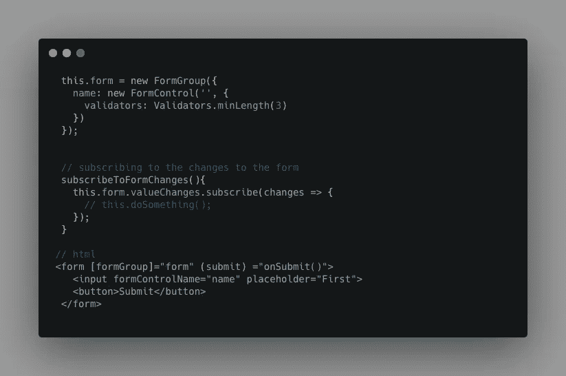
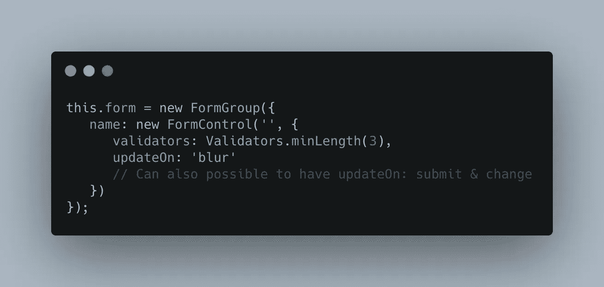

# 用这种简单的配置使角反应形式更快

> 原文：<https://javascript.plainenglish.io/angular-reactive-form-control-updates-things-to-know-27189816d148?source=collection_archive---------0----------------------->


[Image credit](https://unsplash.com/photos/rvWW8uZZYxc)

如果你正在阅读这篇文章，我想你应该知道 Angular 框架。在这篇文章中，我想分享一些提高角反应形式性能的发现。

> 此功能仅适用于 Angular v5

# 背景:

Angular react 表单使用起来非常简单，但是当您开始向表单添加越来越多的表单控件时，它就变得复杂了，并且经常会导致性能问题。其中一个问题是由于表单控件更新和传播到父表单组或表单数组的更新。

首先，让我们创建一个例子，使其易于理解。



这是一个简单的表单组，有一个表单控件`name`。我们订阅了表单值更改，当其中一个表单控件的值更改时，它会接收新的值。在 HTML 模板中，我们将`formGroup`绑定到`form`元素，并将`formControlName`指令绑定到`name`表单控件，该控件是`form`元素的子元素。

现在，让我们考虑一个场景，用户进入输入并开始键入。在这种情况下，Angular `formControlName`指令监听那些输入事件并更新表单控制值。一旦表单控件用新值更新，默认情况下它会发出一个事件让`fromGroup`知道它的值已经改变；在这种情况下，我们在表单组的`valueChanges`上进行的订阅将收到一个新值。

所以这对于简单的表单来说没有任何问题。但是对于有许多表单控件和表单中复杂验证过程的复杂表单，订阅会影响我们都在努力提高的响应能力。

如果我们不需要验证输入，直到用户提交表单，或者直到模糊了任何输入字段？这是很多人在 github 中提出的要求，Angular 团队在他们的 v5 中实现了这个要求。

有了这个新功能，用户可以用下面的配置来配置`FormControl`、`FormGroup`、`FormArray`，由角度用户决定何时更新表单控件。



`updateOn`支柱是可选的，如果没有通过角度使用`change`。

```
// possible values for updateOnupdateOn?: 'change' | 'blur' | 'submit';
```

> 如果在组级别将“updateOn”设置为“blur ”,则所有子控件都默认为“blur ”,除非子控件明确指定了不同的“updateOn”值。

就是这样。希望你觉得有用。感谢阅读！关注我更多有趣的文章。