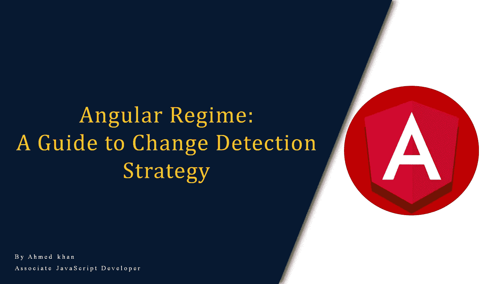
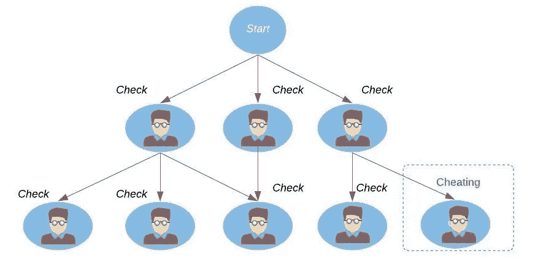
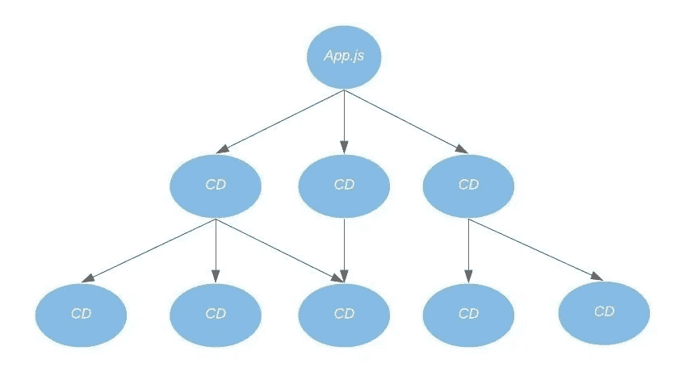
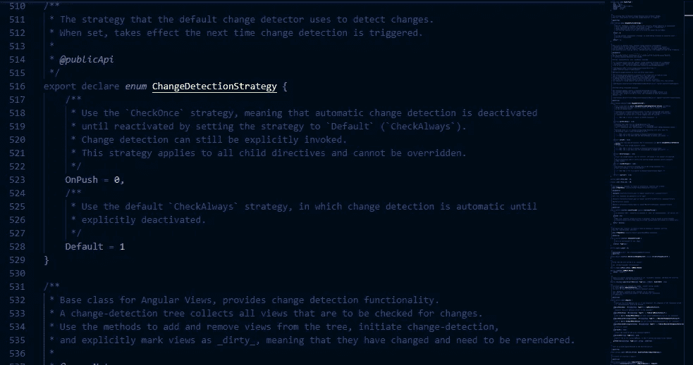
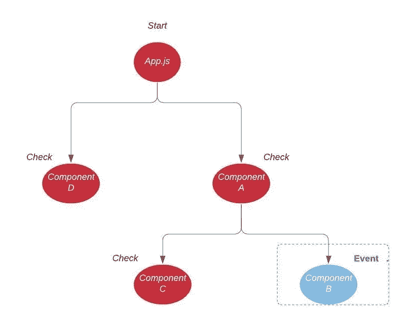

# 角度范围系列:变化检测策略指南

> 原文：<https://javascript.plainenglish.io/angular-regime-series-a-guide-to-change-detection-strategy-2a8a4da46c5c?source=collection_archive---------4----------------------->

## *开发变革可持续应用*



Angular 是最棒的框架之一。它提供您开箱所需的任何东西，绝对是一切。Angular 的变化检测策略是一个非常突出的策略，可以使应用程序流畅快速，但不幸的是，Angular 的官方网站上没有任何指南。

在这篇文章中，我们将深入了解 Angular 在发生变化时的行为。

# 介绍

作为一名 Angular 开发人员，您可能经常只在想要优化您的应用程序性能时才考虑变更检测策略，这里有一个令人震惊的消息，如果 ***变更检测策略*** 使用不当，您可能会降低您的应用程序的性能。

*那么什么是* *变化检测策略以及为什么需要它*？让我们用一个真实的例子来解释这个问题。我发现真实世界的例子很有启发性，更容易抓住主题，而不是用技术定义淹没读者，并使之更加复杂。

# 真实世界的例子



Students cheating example

所以假设学校有考试。老师在学生考试时观察他们。现在，如果老师不知道任何更好的东西，他会关注班上所有的学生，以抓住他们中的任何一个作弊，所以检查每个学生以识别作弊的学生是一项很大的工作。

但是假设老师知道的更多，他知道学生经常作弊。所以在这种情况下，他会一直盯着他们，万一他们试图作弊，老师会立即抓住他们。

所以作弊是变化，学生是组成部分。老师是棱角分明的，他必须检查每个学生/组件，以找到作弊(改变)的人。

简而言之，通过 Angular 中的变化检测，我们可以决定哪些组件需要完全检查，哪些组件只需要针对特定事件进行检查。 ***变化检测*** 是关于每当我们的数据更新时更新视图(DOM)。因此，如果发生变化，Angular 会完全检查所有组件，但我们可以将其限制为对某些组件进行特定检查。

这听起来很有趣，但是 Angular 是如何做到的呢？井幕后 Angular 使用被称为 ***的东西 Zone*** 来处理变化检测。

# Zone.js 是什么鬼？

作为一个有棱角的人，你可能偶尔听说过这个区域。

> 区域是跨异步任务持续存在的执行上下文。你可以把它想象成 JavaScript 虚拟机的线程本地存储器。

因此，简而言之，Zone.js 处理 Angular 应用程序中发生的变化检测的所有细节。Angular 使用 Zone 来决定 UI 的哪个部分将被更新。这省去了我们自己做决定的麻烦，这可能会很麻烦。

还有一个选项是在引导过程中禁用 Zone，这样您就可以负责完成所有困难的工作，或者您可能希望在 zone 之外执行一些任务，在这种情况下，您可以使用 NgZone，它允许您在 zone 之外编写任务。

我们一会儿就会看到这一点，但首先让我们看看它如何改变检测工作。

# 变更检测的工作原理

角度变化检测有两种策略。

*   默认策略
*   OnPush 策略

让我们逐一看看这些策略。



Change Detection Tree

# 变化检测树

在引导过程(应用程序启动)中，每个组件的变更检测器都被创建并与之关联。这些变化检测器(CD)以父子树的形式组合在一起，因此被称为*变化检测树*。在后台，Angular 将`onPush`(也称为检查一次)设置为 0，将 Default(也称为总是检查)设置为 1。



# 默认变化检测策略



change detection strategy — Default

默认情况下，Angular 使用默认策略`ChangeDetectionStrategy.Default`来处理变更，并在 DOM 中同步它们。默认的策略是，每当一个事件被触发时(如 XHR、承诺、用户事件)，从上到下检查整个组件树(变更检测树)。它不知道更改发生在哪里，因此它将遍历整个树，如果有新的值，它将更新该组件的视图。这也被称为 ***脏检*** 。现在，这是一种非常低效的检查方式，因为它运行了许多不必要的更改检测周期，因此会导致性能问题。

Angular 通过使用组件的关联检测器将模板使用的属性的当前值与以前值进行比较来执行更改检测。如果值被更改，`isChanged`场景背后的属性被设置为 true，这反过来更新了 DOM。所以在幕后没有发生深层的对象检查。所有角度都与等于运算符进行比较。

# OnPush 变化检测策略

接下来是 onPush 策略，可以通过在`@Component`装饰器中向`changeDetection`属性提供`ChangeDetectionStrategy.OnPush`来使用。

```
@Component({
  selector: 'ml-department-form',
  templateUrl: './department-form.component.html',
  styleUrls: ['./department-form.component.scss'],
  **changeDetection:** **ChangeDetectionStrategy.OnPush**
})
```

我喜欢称这种策略为金矿策略，因为它允许检测器跳过对组件及其子组件的不必要的检查，也称为 ***脏检查*** 。有了这个策略，Angular 知道在什么时候更新组件:

*   组件和子组件触发一个事件
*   组件输入已更改
*   链接到模板的可观察对象发出一个新值
*   手动调用更改检测

让我们检查一下。

## 组件和子组件触发一个事件

事件是触发变更检测的另一种方式。每当调用输入事件时，总是会触发更改检测。

## 组件输入已更改

每当默认策略中出现任何类型的变化时，Angular 都会触发变化检测，但对于`onPush`策略，Angular 非常挑剔！只有当`@Input`传入新的参考时，才会触发变化检测，这将使`@Input`发出一个新值。

对于两种策略，所有的原始类型都在任何变化时触发变化检测，但是当我们使用对象或数组时，我们通常通过其属性更新对象，如果选择了`onPush`策略，则不会触发变化检测。

为了解决这个问题，我们必须创建一个不可变的对象。不可变对象的值不会改变，但是我们通过给它分配一个新的对象来修改它。因为这种方法的不变性是完整的，所以变更检测将被成功触发。

当使用`onPush`策略时，你有可能会遇到很多错误。这可以通过在整个应用程序中使用不可变对象来防止。因此，如果你忘了修改一个对象，它将使你避免意外的错误。

在上面的例子中，我们使用了两个数组。`list`将包含一些随机数据和另一个带有更新数据的数组。底部有两个按钮，按对象和按值。当您单击“按值”按钮时，如果您观察 click 事件方法，我们只是通过对象的属性来修改对象，因此视图上没有反映任何更改。现在，单击“按对象”按钮，这将触发一个方法，在该方法中，我们通过给底层对象一个新对象的引用来修改它，从而保持不变性。因此，我们可以看到视图中反映的变化。

## 链接到模板的可观察对象发出一个新值

当我们使用 observables 时，有几种方法可以用来访问数据，通常在模板中使用异步管道。 ***异步管道*** 订阅可观察对象并发出最新值，因此从响应发出的更改直接从可观察对象显示。

其工作方式是 ***异步管道*** 在发生变化时标记组件。这有助于 Angular 决定是否执行变化检测。

## 手动调用更改检测

要手动触发变更检测，我们必须依赖基类***changededetorref***。这提供了变化检测功能。变更检测树收集了所有要检查变更的视图。使用这些方法在树中添加和删除视图，启动变化检测，并显式地将视图标记为 *dirty* ，这意味着它们已经发生了变化，需要重新呈现。

```
abstract *class* **ChangeDetectorRef** {abstract markForCheck(): *void* abstract detach(): *void* abstract detectChanges(): *void* abstract checkNoChanges(): *void* abstract reattach(): *void*}
```

我们可以使用这三种方法来手动触发变更检测。

*   **detectChanges():** 如果你的模型(你的类)内的任何东西已经改变，但是它没有反映视图，你可能需要通知 Angular 去检测那些改变(检测局部改变)并且更新视图。

**用例可能是:**

1-变化检测器与视图分离。

2-更新已经发生，但它不在角度区域内，因此，角度不知道它。

3-当第三方功能更新了您的模型，并且您想在此之后更新视图时。

*   **markForCheck():**It**通常在`onPush`选择策略时使用。假设您正在使用`onPush`策略和`@Input`装饰事件触发器。**

```
var obj = {
     name:'ahmed'
   };
```

**然后你像这样更新它:**

```
obj.name = "a new name";
```

**输入值是一个对象，其属性值被直接更改，而不是被赋予一个新的对象引用，因此在这种情况下它不会运行更改检测。视图也不会反映这些变化。在这种特殊情况下，您可以使用`**markForCheck()**` 命令 Angular 在该视图上执行变化检测，如下所示:**

```
this.cd.markForCheck();
```

*   ****ApplicationRef.tick():** 触发整个应用的变更检测**

# **工作时不检测变化**

**正如我们上面已经讨论过的，在没有变化检测的情况下运行任务是可能的。我们可以使用`ngzone`来实现这一点。**

```
constructor(private ngZone: NgZone) {} runWithoutChangeDetection() {
    this.ngZone.runOutsideAngular(() => {
      setTimeout(() => doStuff(), 1000);
    });
  }
```

**这里`setTimeOut`不会触发变化检测。**

## **NgZone**

**NgZone 是 Angular 的内置服务，它使我们能够走出区域，并在需要时重新进入区域。以下是一些可用的方法。**

*   **运行():允许我们进入区域**
*   ****runoutsidenargular:**允许我们走出区域**

**看看下面的例子，以便更好地理解它。**

**上面的例子说明了两个按钮，点击第一个按钮将使它在区域内运行，另一个在区域外运行。区域内的将更新视图，但从外部进行的更新不会反映在视图上。一旦完成，我们再次进入区域内`console.log`完成。**

**这个例子展示了这两种方法的工作情况，以及一个潜在的用例，在这个用例中，当您在后台执行任务并在完成时显示成功消息时，您可能希望也可能不希望在视图上显示任何内容。**

# **结论**

**变化检测策略在 Angular 应用中起着至关重要的作用，每个 Angular 开发者在构建大规模应用时都需要利用它们。我希望这篇文章对你有所帮助，如果你有，**关注我的** [**中型**](https://medium.com/@mrahmedkhan019) **和** [**推特**](https://twitter.com/50shadeofkhan) **获取更多软件开发文章的通知，别忘了点击按钮**。终于！感谢阅读，快乐学习！**

**[](https://medium.com/javascript-in-plain-english/angular-regime-series-tree-shaking-technique-3dc07f5e85a1) [## 树木倾斜地摇晃着

### 用温柔的方式，你可以撼动世界！

medium.com](https://medium.com/javascript-in-plain-english/angular-regime-series-tree-shaking-technique-3dc07f5e85a1) [](https://medium.com/@mrahmedkhan019/angular-regime-series-content-projection-db0085653354) [## 角度范围系列:内容投影

### 如果你在 Angular 1 中工作过，那么你可能已经听说过这个概念的名字…

medium.com](https://medium.com/@mrahmedkhan019/angular-regime-series-content-projection-db0085653354)**