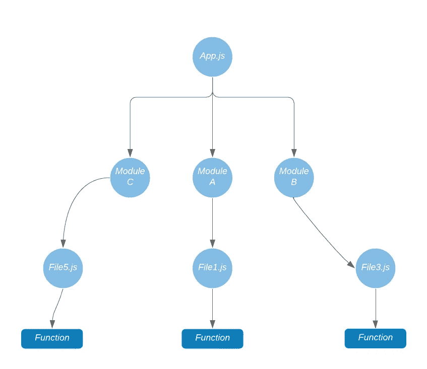
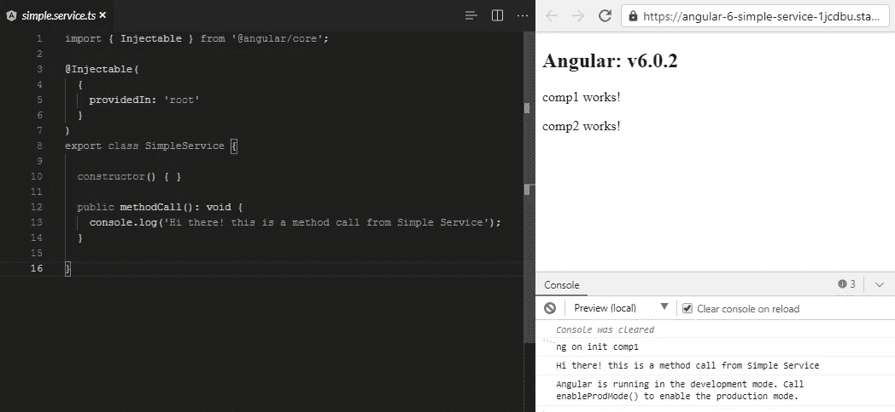
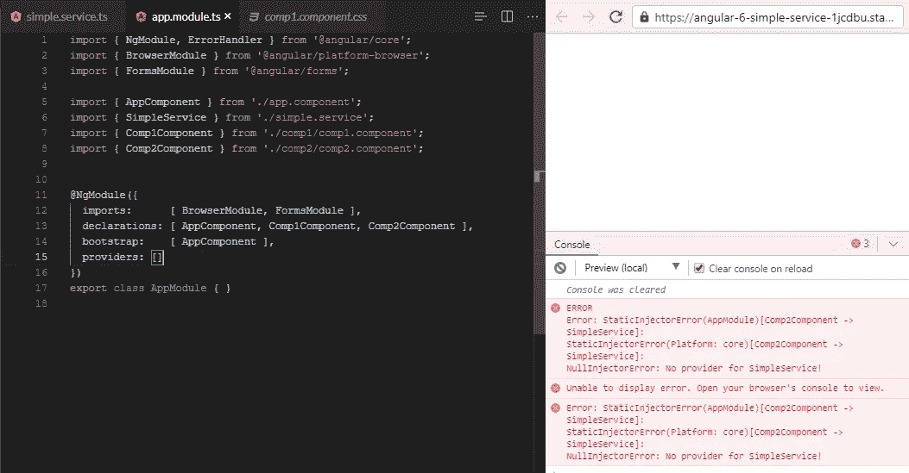
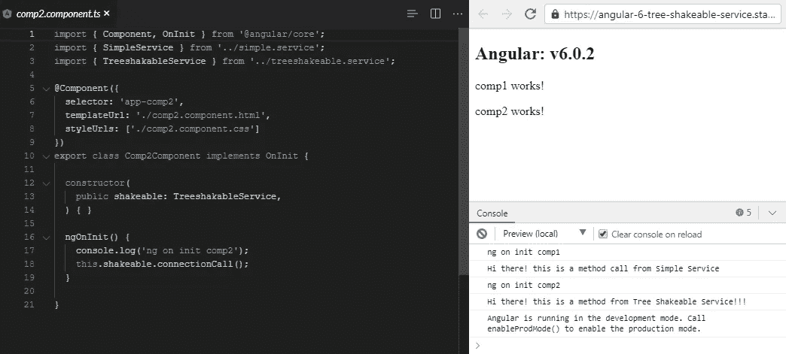
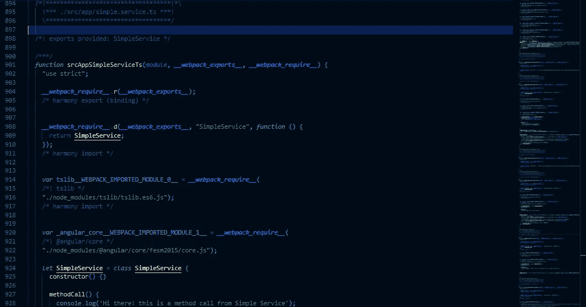
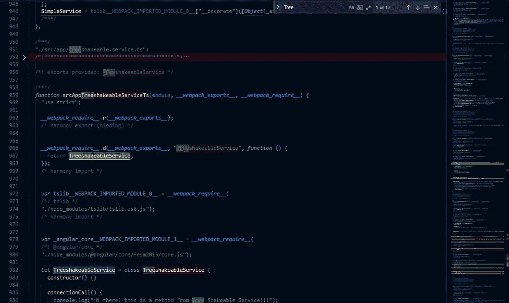

# 角域系列:摇树技术

> 原文：<https://javascript.plainenglish.io/angular-regime-series-tree-shaking-technique-3dc07f5e85a1?source=collection_archive---------0----------------------->

## 用温柔的方式，你可以撼动世界！


# 介绍

在软件开发的世界里，我们大多使用现实生活中的例子来解释一些概念并获得一个好的图景。同样，为了让你更好地理解**摇树**，让我荣幸地给你一个现实生活中的例子。

# 树摇晃

当我们摇动一棵树时会发生什么？好吧，老实说正常人不会真的这么做，但是假设我们会这么做。如果有一些枯叶，好好摇一摇就会掉出来。那是什么意思？这意味着它们对树来说毫无用处，而那些现在被树使用的叶子，它们会在摇动后抓住保持完整。所以换句话说，树摇简单来说就是指**死码消除**。应用程序未使用的代码将从生成的版本中移除。在 Angular 中，它是一个编译器选项，从最终版本中删除代码。这是减少应用程序占用空间的最有效的技术之一。

# 你为什么需要摇树

如果我们想创建一个简单的两行代码 Angular 应用程序，在没有树抖动的情况下，它将花费我们 2.5mb，但在应用树抖动后，大小将大幅减少到几兆字节甚至 KBS，这是一个主要的优势。

**树晃动前:**


Before applying the tree shaking technique

**树摇动后:**

在应用了树抖动技术之后，我们的树抖动掉了无用的模块。



After applying the tree shaking technique

# 它是如何工作的？

有几个现代的捆绑器可以为普通的 javascript 执行树抖动，比如 Rolljs、Webpack 等。它们依赖于 minifiers，例如 uglify 和 Closure 编译器，将整个应用程序代码简化并合并到一个包文件中。对于 Angular，整树摇动技术是内置的。这里唯一的限制是这只适用于 Es5 模块，因为它们使用静态的`import`和`export`。Angular 和 webpack 跟踪 import 语句来执行树抖动，因此它不能与 CommonJS `require`语法一起工作。

**ES5 -ES6 语法:**

```
import X from "y";export Z;
```

**CommonJS 语法:**

```
const X = require("y")module.exports = Z;
```

Angular 可以跟踪模块中的所有组件，但是 Angular 如何跟踪提供商阵列中包含的依赖服务呢？显然 Angular 没有办法跟踪正在使用的服务。因此 Angular 不能在服务上使用树抖动，这是很糟糕的，因为服务消耗的所有内存空间可以在很大程度上减少包的大小。

# 为什么角树不能摇服务？

为了理解这一点，让我们看看我们如何在 Angular 中包含服务。

```
import { NgModule } from '@angular/core';
import { BrowserModule } from '@angular/platform-browser';import { AppComponent } from './app.component';
import { myService } from './myService.service';@NgModule({
  imports: [BrowserModule, FormsModule],
  declarations: [AppComponent],
  bootstrap: [AppComponent],
  providers: [myService]
})
export class AppModule {}
```

如您所见，我们已经将我们的服务包含在`providers`数组中，该数组将我们的服务注册到角度依赖注入服务中。所以现在当任何组件想要使用这个服务时。角度依赖注入将确保这个服务被注入到构造函数中并被导入。

被导入和注入并不意味着服务实际上在使用，这本身就是 Angular 的编译器必须面对的挑战。Angular 编译器检查导入，因此假设服务正在使用中，所以它不会被树动摇。

# 角树可摇动提供者

我们可以使用角树可摇动提供者(TSP)向不同的机制注册我们的服务。新的 TSP 语法如下所示。

```
import { Injectable } from '@angular/core';@Injectable({
  providedIn: 'root'
})
export class myService {
  constructor() {}
}
```

好了，你可以在上面的代码片段中看到`@Injectable`装饰器，我们现在有了一个新的属性`providedIn`。通过这个属性，我们告诉 Angular 在哪个模块中注册我们的服务，而不是在`@NgModule`中注册。

默认情况下，TSP 会将我们的服务注册到根注入器，这使得它可以作为一个单独的服务。使用 TSP 新语法，我们不在 AppModule 中使用 import 语句，而是通过使用`providersIn`直接工作，因此 Angular 将确保该服务仅在导入组件时包含在我们的捆绑包中。

# 工作示例:

为了说明这一点，我们来看一个例子。在这个示例应用中，我们将使用两个组件和两个服务，一个在 NgModule 中使用显式依赖注入，另一个使用`TreeShakeable`服务提供者。

```
import { Injectable } from '@angular/core';@Injectable()  //=========> simple decorators
export class SimpleService {constructor() { }public methodCall(): void { 
     console.log('Hi!  this is a method call from service');
  }
}
```

这是一个简单的服务，它是用一个简单的`@Injectable`装饰器创建的，为了让这个服务工作，我们将像这样把它导入到我们的`AppModule`中。

```
import { NgModule, ErrorHandler } from '@angular/core';import { BrowserModule } from '@angular/platform-browser';import { AppComponent } from './app.component';import { SimpleService } from './simple.service';import { Comp1Component } from './comp1/comp1.component';import { Comp2Component } from './comp2/comp2.component';@NgModule({imports:      [ BrowserModule, FormsModule ],declarations: 
   [ 
      AppComponent, 
      Comp1Component, 
      Comp2Component 
   ],bootstrap: [ AppComponent ],providers: [SimpleService]
})export class AppModule { }
```

在上面的代码中，我们已经在`AppModule`中包含了我们的服务，现在这将被注入到我们的组件中来工作。

```
import { Component, OnInit } from '@angular/core';import { SimpleService } from '../simple.service';@Component({
  selector: 'app-comp1',
  templateUrl: './comp1.component.html',
  styleUrls: ['./comp1.component.css']
})export class Comp1Component implements OnInit {constructor(
     public simpleService: SimpleService,
   ) { }ngOnInit() {
     console.log('ng on init comp1');
     this.simpleService.methodCall();
   }}
```

如果我们检查控制台，我们将看到成功打印的消息。



Simple service injection example

现在让我们转到 AppModule，从装饰器的 providers 数组中删除我们的服务。从提供者中移除服务后，它会立即抛出一个静态注入器错误，因为我们的服务没有在依赖注入器服务中注册。



现在是重头戏！让我们使用树可震动提供者 API 来创建我们的树可震动服务。创建一个新的服务调用`treeshakeable`并添加新的`@injector`装饰语法。

```
import { Injectable } from '@angular/core';@Injectable({
   providedIn: 'root'
})export class TreeshakableService {constructor() { }connectionCall(){
    console.log("Hi there! this is a method from Tree Shakeable     Service!!!");
  }
}
```

添加了`providerIn`之后，我们的服务现在可以被注入和使用，而不需要添加到提供者。现在将其注入 component2 的构造函数中，并调用方法。最后，看看控制台，我们看到以下消息:



Tree shakeable service example

恭喜你。我们已经成功地创建了一个 ***可摇树服务*** 。这对我们意味着什么？嗯，我们之前的服务使用旧的服务提供者 API 来显式地注入依赖，这使得它依赖于导入语句，并且由于我们需要执行树抖动，导入语句使得不可能确定服务是否正在被使用，因此它们都被包括在构建中。现在，随着新的服务提供者 API 的实现，我们的服务只有在通过组件中的 import 语句导入使用时才会被包含。

树摇动服务示例

# 构建概述

接下来让我们看看如何检查构建是否成功地应用了树抖动。为此，首先从 comp2 中移除注入的`treeShakeable`服务，同时移除导入，然后我们必须在终端中运行`ng build`命令。我们正在创建一个没有 prod 标志的构建，因为它完全缩小了文件，然后我们将看不到树的晃动效果。`ng build`另一方面，缩小到足以使构建文件可读。



simple service code included in the build

正如你在上面看到的，在生成构建之后，我们的`main-es5.js`已经包含了一个简单的服务文件，但是如果我们试图搜索可摇树的服务，你将不会在文件中找到它。这是因为它被丢弃了，因为我们已经从组件中删除了 import 语句。现在让我们再次将它添加回去，并调用服务方法，然后再次运行。这一次你会发现它在沿着服务。



treeshakeable service code included in the build

# 结论

通过利用树抖动技术，我们可以减少应用程序的包大小，从而优化应用程序的性能。Angular 的新版本现在用树可摇动的提供者 API 创建服务，所以你不需要做太多的努力。我希望这篇文章对你有所帮助，如果你有，请关注我的 [**中的**](https://medium.com/@mrahmedkhan019) **和** [**推特**](https://twitter.com/50shadeofkhan) **来获取更多关于软件开发文章的通知，不要忘记点击按钮**。终于！感谢阅读，快乐学习！

[](https://medium.com/@mrahmedkhan019/angular-regime-series-content-projection-db0085653354) [## 角度范围系列:内容投影

### 如果你在 Angular 1 中工作过，那么你可能已经听说过这个概念的名字…

medium.com](https://medium.com/@mrahmedkhan019/angular-regime-series-content-projection-db0085653354) [](https://medium.com/@mrahmedkhan019/angular-regime-series-difference-between-promise-and-observable-97e16ced1c1f) [## 角域系列:承诺和可观测之间的差异

### 理解概念上的差异有助于我们决定什么是使用它的最佳位置。

medium.com](https://medium.com/@mrahmedkhan019/angular-regime-series-difference-between-promise-and-observable-97e16ced1c1f)