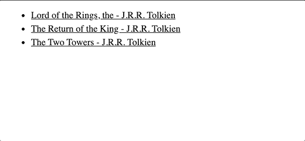
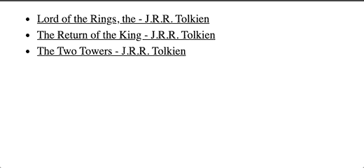

# 角度路由重用策略

> 原文：<https://javascript.plainenglish.io/angular-route-reuse-strategy-b5d40adce841?source=collection_archive---------0----------------------->


Photo by [Steve Johnson](https://unsplash.com/@steve_j?utm_source=unsplash&utm_medium=referral&utm_content=creditCopyText) on [Unsplash](https://unsplash.com/s/photos/storage?utm_source=unsplash&utm_medium=referral&utm_content=creditCopyText)

当导航离开一条路线时，Angular 破坏相应的组件，除非新路线使用相同的组件(例如，如果我们从`/user/12`导航到`/user/57`)。Angular 在可能的情况下重用组件，但在其他情况下会破坏它们以释放内存，这是大多数情况下需要的行为。

```
 /user/12    ---------------------------------->   /user/57
  UserComponent                                     UserComponent /user/12     -------------> /users ------------>   /user/57
  UserComponent           UserListComponent         UserComponent
```

在第一种情况下，`UserComponent`将被重用。不过在第二个版本中，`UserComponent`将在导航到`/users`时被销毁，并在导航到`/user/57`时被重新创建。

当你知道你很快会再次需要一个组件时，销毁它是你想要避免的。与往常一样，Angular 提供了一个解决方案，并让您通过实现[routereustrategy](https://angular.io/api/router/RouteReuseStrategy)类来定义自己的重用策略。

# 主/详细界面

您可以从实现自己的重用策略中获益的一个经典例子是主/细节接口。在这样的界面中，用户通常在主视图(元素列表)和细节视图之间切换。在每次导航后销毁/重建这些页面并不是最佳选择。

你可以看看下面的 gif，在我们每次关闭详细信息页面时，列表出现之前会有一个小的延迟。这是因为 list 组件在每次构建时都会获取图书。我们可以通过缓存和重用列表组件来防止这种情况。



# 定制路由重用策略

为了防止在视图之间导航时组件被破坏，我们需要实现自己的路由重用策略。我们创建一个实现抽象类`RouteReuseStrategy`的类`CustomRouteReuseStrategy`，并在我们的模块中提供它。

如你所见，为了实现`RouteReuseStrategy`类，我们必须实现五个方法(它们的定义来自 [Angular 文档](https://angular.io/api/router/RouteReuseStrategy)):

*   `shouldDetach`:确定该路由(及其子树)是否应该分离，以便以后重用。
*   `store`:存储分离的路线。
*   `shouldAttach`:确定是否应该重新附加此路由(及其子树)。
*   `retrieve`:检索先前存储的路线。
*   `shouldReuseRoute`:确定是否应该重复使用一条路线。

Angular 的默认路由重用策略如下所示:

Source: [Angular Source Code](https://github.com/angular/angular/blob/master/packages/router/src/route_reuse_strategy.ts)

如前所述，如果新路由与前一个路由具有相同的配置(使用相同的组件), Angular 就会重用该路由，否则就不会。我们希望保持这种行为，所以我们复制了这个`shouldReuseRoute`函数的实现。如果你想防止 Angular 在从`/user/57`导航到`/user/12`时重用组件，这个函数将是改变的正确位置，但这不是我们打算做的。

我们对其他四种方法感兴趣。`shouldDetach`和`store`在你离开一条路线时被调用。如果`shouldDetach`返回`true`，那么我们需要`store`该路由，因为我们希望以后重用它。`shouldAttach`和`retrieve`在输入路线时被调用。如果`shouldAttach`返回`true`，我们希望重用之前存储的路线，而不是构建新的组件。

# 存储和检索列表组件

要缓存列表组件，我们首先需要存储它。因此，当路由路径等于列表视图的路径时，我们应该将`true`返回到`shouldDetach`，在我们的例子中是`list`。我们需要自己保管，但这听起来很简单。我们只需要存储与我们的路线相对应的`DetachedRouteHandle`，例如使用路线路径作为关键字存储在`Map`中。

储存到此为止。现在，当回到列表视图时，我们想要重用我们存储的路由句柄，如果我们有一个的话。因此，如果我们的`storedRoutes`中有给定路线路径的值，我们将`true`返回到`shouldAttach`。检索路由句柄很容易，我们从`storedRoutes`返回对应于路径的值。

list 组件现在被存储和重用，避免了每次进入主视图时都必须获取书籍。我们再也看不到这种短暂的延迟。



这是一个简单的例子，但我希望它能帮助您了解如何实现定制的重用策略。这五种方法一开始可能看起来有点混乱，但是它们实际上有明确定义的角色:

*   `shouldReuseRoute`允许您决定是否允许 Angular 在引用相同组件类的路径之间导航时重复使用相同的组件对象，或者 Angular 是否每次都应销毁和重建组件。
*   `shouldDetach`和`store`分别让你决定一个组件是否应该以后存储，如果是，让你存储它。当离开一条路线时，它被调用。
*   `shouldAttach`和`retrieve`分别让你决定是否重用一个存储的组件，而不是创建一个新的组件，如果是，让你把这个存储的组件交给 Angular。当输入一条路线时，它被调用。

**来源**:

这个例子是使用 [OpenLibrary](https://openlibrary.org/dev/docs/api/books) 构建的。书籍可以从它们的 ISBN 中获取，因此要获取三本指环王书籍作为一个 JSON 对象，我们调用:

```
[https://openlibrary.org/api/books?format=json&jscmd=data&bibkeys=ISBN:0261103253,ISBN:9780261102361,ISBN:9780618002245](https://openlibrary.org/api/books?format=json&jscmd=data&bibkeys=ISBN:0261103253,ISBN:9780261102361,ISBN:9780618002245)
```

## 进一步阅读

[](https://bit.cloud/blog/how-to-reuse-react-components-across-your-projects-l4pz83f4) [## 如何在项目中重用 React 组件

### 最后，您完成了为应用程序中的表单创建一个奇妙的输入字段的任务。你对……很满意

比特云](https://bit.cloud/blog/how-to-reuse-react-components-across-your-projects-l4pz83f4) 

*更多内容看* [***说白了。报名参加我们的***](https://plainenglish.io/) **[***免费周报***](http://newsletter.plainenglish.io/) *。关注我们上* [***推特***](https://twitter.com/inPlainEngHQ) ，[***LinkedIn***](https://www.linkedin.com/company/inplainenglish/)***，***[***YouTube***](https://www.youtube.com/channel/UCtipWUghju290NWcn8jhyAw)***，以及****[***不和***](https://discord.gg/GtDtUAvyhW)*** *对成长黑客感兴趣？检查出* [***电路***](https://circuit.ooo/) ***。***