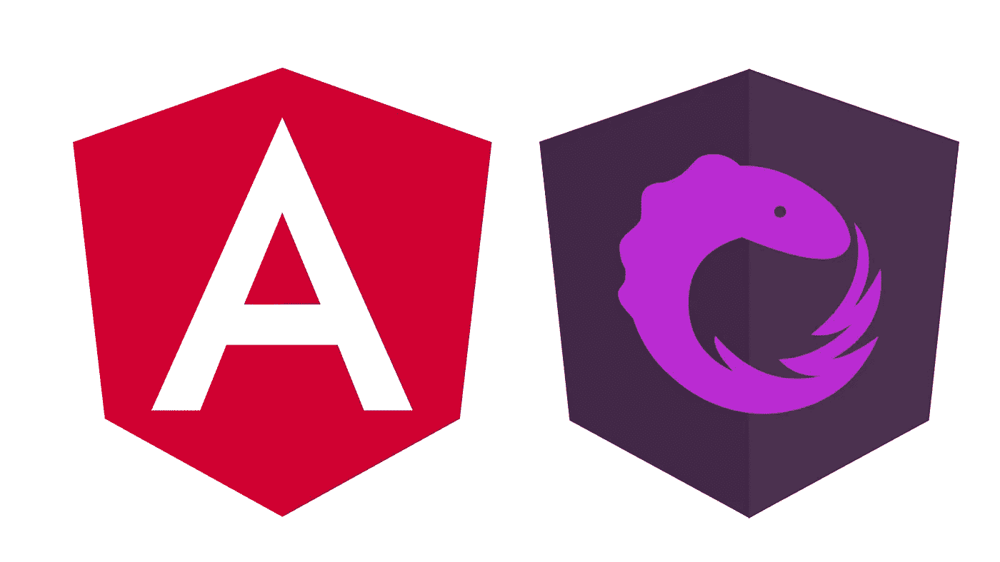

# 使用 NgRx 的角度状态管理

> 原文：<https://javascript.plainenglish.io/angular-state-management-using-ngrx-f9d0e92f617a?source=collection_archive---------3----------------------->

## Angular 最流行的状态管理库 Redux 模式的简单介绍



在现代前端开发时代，将应用程序的关注点分离成组件是很常见的。虽然这带来了许多好处，并带来了一定程度的简单性，但当几个组件都依赖于相同的数据时，也会带来复杂性。

如果没有深谋远虑，很容易导致组件之间的数据依赖，因此划分的预期好处只是一厢情愿的想法。

没有提到 [Redux](https://redux.js.org) ，任何关于国家管理的讨论都是不完整的。Redux 既是一个模式，也是库的名称，模式以它的名字命名。Redux 通常与 [React](https://reactjs.org) 应用程序相关联，尽管该库也可以在 [Angular](https://angular.io) 中使用，但更常见的是使用 [NgRx](https://ngrx.io) 构建的应用程序，这是 Angular 最流行的状态管理库。

用 NgRx 建立一个项目可能会令人望而生畏，因为这是一个复杂的主题，但是我想向您展示一个非常简单的入门方法，一旦您学习了 redux 模式的基础，就可以在这个基础上进行构建。

# TLDR:给我看看代码！

好吧，大人物，你想要密码？你猜对了:

[](https://github.com/Maloric/angular-ngrx) [## Maloric/angular-ngrx

### NgRx - Maloric/angular-ngrx 中状态管理的简单介绍

github.com](https://github.com/Maloric/angular-ngrx) 

发疯吧。如果你想以后再来听更详细的说明，我不会因此而反对你。

# 入门指南

不言而喻，你需要一个有角度的项目来工作。出于本教程的目的，我们将使用 Angular CLI 创建一个，但是您应该能够毫不费力地将相同的步骤应用到现有的项目中。

假设您已经安装了 NPM，我们将从创建一个空项目开始。如果使用 npx 命令，则不需要全局安装 Angular CLI，如下所示:

```
npx ng new angular-ngrx
```

接受所有默认值，然后在您最喜欢的 IDE 中打开`angular-ngrx`文件夹。另外，在命令行中导航到新的`angular-ngrx`文件夹，并运行以下命令:

```
npm install — save-dev @ngrx/core @ngrx/store
```

NgRx 库被分离出来，这样你就可以只安装你需要的部分，现在我们只关注这两个。这家商店是我们真正感兴趣的，所以让我们开始吧。

通过在命令行中运行以下命令启动您的应用程序:

```
npm run start
```

几秒钟后，应用程序将启动并运行。要进行检查，请在[打开您的浏览器 http://localhost:4200/](http://localhost:4200/) 查看它所有的荣耀。还没有太多，但是我们马上会改变它。

## 获取一些数据来玩

首先，我们需要一些数据。我们将使用优秀的 [JSONPlaceholder](https://jsonplaceholder.typicode.com) 服务生成 100 条虚假数据记录。转到[https://jsonplaceholder.typicode.com/posts](https://jsonplaceholder.typicode.com/posts)并将输出保存在新的工作空间中为`/src/app/data/posts.ts`(您需要创建数据文件夹)。像这样包装输出:

```
export const POSTS = <PASTE YOUR DATA HERE>;
```

## 出第一个组件

现在让我们创建几个组件来利用这些数据。在新命令行中运行以下命令(让应用程序在原始命令行中运行)。

```
npx ng generate component posts -s -t
npx ng generate component post-count -s -t
```

在这些例子中，我用内联模板和样式生成了组件。如果你喜欢单独的 HTML 和 CSS 文件，只需移除`-s`和`-t`开关。一旦组件生成，用以下内容替换`/src/app/app.component.html`的内容:

```
<app-post-count></app-post-count>
<app-posts></app-posts>
```

当您在浏览器中刷新应用程序时，您应该会看到以下输出:

```
> post-count works! 
> posts works!
```

它看起来并不漂亮，但它表明这两个新组件正在工作。是时候把它们连接到一些数据上了。

## 插入数据

通常我们会通过 REST API 或类似的东西获取数据。通过使用服务在组件之外进行所有的数据访问总是一个好主意。这不仅允许您在应用程序中重用逻辑，还会使您的组件和数据访问逻辑更容易测试(这个主题将在以后讨论)。

让我们使用 CLI 创建一个新服务:

```
npx ng generate service blog
```

很好很容易！享受它，因为从现在开始，它会变得更加复杂。

在我们开始钻研 NgRx 之前，让我们用传统的方法在页面上获取一些数据。首先，更新新服务中的代码，以匹配以下内容:

`getPosts`方法是通常情况下 HTTP 请求的替身，返回可观察到的帖子。如果你以前没有遇到过可观察的事物，把它们想象成可以用不同的数据解决多次的承诺。它们是由一个名为 [RxJs](https://rxjs-dev.firebaseapp.com) 的库提供的复杂但强大的工具。现在，我们使用 RxJs 的`of`方法将数据作为可观察值返回。

接下来，让我们将数据拉入我们的组件中，并向最终用户显示。更新`/src/app/posts/posts.component.ts`如下:

我们已经注入了 posts 服务，并将`service.getPosts()`的结果分配给组件的公共属性。注意到我们在房产后面加了一个美元符号吗？这是一种表明变量是可观测值的常见方式，因为与可观测值交互不同于与正常数据交互。

我们还使用`async`导管循环通过`posts$`的输出。这是将数据从可观察的“常规”属性(即一系列帖子)中取出的捷径。

在你的浏览器中，你应该会看到一个帖子标识和标题的列表。让我们做一些类似于计数后组件的事情。像这样更新类型脚本:

这里的不同之处在于，我们将帖子映射到代表帖子数量的值。

## 首先要解决的问题

你们中眼尖的人可能已经注意到，我们现在有两个组件在 PostsService 上调用同一个方法。记住，这个方法应该去某个地方从一个应用编程接口中获取数据，这似乎效率很低。这也意味着，我们的两个部门可能会在职位数量上存在分歧。如果这两个请求在不同的时间完成，那么一篇帖子可能已经被删除或添加了。

我们可以通过让一个组件与另一个组件对话来解决这个问题，但是这会很快变得混乱，我们希望避免组件之间相互依赖。在两个组件共享的服务中存储这种状态更有意义。

为此，我们可以使用 rjs 推出我们自己的状态管理解决方案，但我们不是第一个。这当然是一个可行的方法——事实上，NgRx 只是使用 Redux 模式的想法的一个扩展。因此，我们将跳过推出我们自己的状态管理解决方案的部分，并学习如何使用 NgRx 来完成它。

# 什么是 Redux？

Redux 模式有几个决定性的特征:

1.  所有(或大多数)应用程序状态都有一个存储，而不是每个组件上存储的状态。
2.  该存储是不可变的(它不能被直接更改——相反，更改会创建该存储的新副本)。这使得更改检测更加简单，因为对存储的任何更改都需要一个新的状态对象。与遍历一个潜在的复杂对象来寻找变化相比，JavaScript 检测一个新的对象引用要容易得多。
3.  状态的变化以动作的形式描述。每个操作都有一个类型(例如“删除产品”)，也有一个有效负载(例如要删除的产品的 ID)。
4.  动作在共享消息总线上被分派，并由名为**reducer**的纯函数处理。这些本质上是 switch 语句，它们寻找给定的动作类型，然后在动作生效后返回表示状态的新对象。

## 还原剂

记住以上内容，让我们开始创建我们的第一个减速器。如前所述，reducer 的工作是处理动作并返回更新后的状态。传统上，这将以 switch 语句的形式编写，但是现在 NgRx 提供了一种更结构化的方式来完成同样的工作。将以下内容放入`/src/app/data/reducer.ts`:

定义我的状态通常是我做的第一件事。应用程序状态可以比作客户端数据库。通常情况下，它只和页面一样长，当页面重新加载时就会丢失。但是通过将所有的应用程序状态存储在一个地方，稍后将它保存在本地存储应该是微不足道的，从而允许用户从他们停止的地方重新开始。有时，再次从服务器获取数据是有意义的，但是一些状态信息，例如选择了哪一行，是特定于一个用户的，可能值得在页面加载之间保存。

但这是另一个问题。现在，让我们考虑一下我们拥有什么和我们需要什么。上面的`BlogReducer`除了分配初始状态之外，实际上什么也不做。稍后，我们将添加处理动作和更新状态的功能。但是首先，让我们将减速器连接到我们的应用程序，并修改初始状态。

我们需要做的第一件事是修改`/src/app/app.module.ts`,这样我们就可以在任何需要的地方注入 NgRx 存储。添加正确的导入，然后将以下内容添加到`imports`数组中:

## 选择器

接下来，我们将添加第一个选择器。选择器负责从状态中获取数据，并将其转换为组件需要的形状。我们需要两个选择器:一个用于帖子，一个用于帖子计数。这些可以添加到它们各自的组件中，但是将它们添加到服务中也同样容易(并且更具可重用性)。

> *`***createSelector***`***方法*** *NgRx 提供了创建高效选择器的方法，这些选择器利用记忆来存储具有相同输入的先前结果。然而，由于这是一个介绍，我将向您展示一个更简单，但效率较低的技术。对于大多数应用程序来说，这已经足够了，您可以稍后使用* `*createSelector*` *将这些简单的选择器替换为记忆选择器。**

## *编写我们的第一个选择器*

*让我们回到我们的服务。NgRx 利用 observables 将数据从存储中导出，所以我们将使用我们的服务将这些 observables 存储在一个地方。打开博客服务，并对其进行修改以匹配以下内容:*

*注意`getPosts`不再返回任何数据？Redux 有一个单向的数据流，这意味着组件从存储中读取数据，然后调度操作来更新存储。这是 **CQRS** 模式(Redux 基于此)的一个特性，它建议将读取数据和写入数据的操作分开。*

*之前我们发现调用`getPosts`两次是低效的，因为它将进行两次相同的 HTTP 调用。现在，通过订阅集中存储，我们只需要调用一次方法，这样效率就高多了。考虑到这一点，我们需要更新我们的组件，从可观察的数据中提取数据，而不是从`getPosts`中提取数据。*

```
*posts$ = this.service.posts$; // posts.component.ts
postCount$ = this.service.postCount$; // post-count.component.ts*
```

*回到你的浏览器，你会发现我们所有的帖子都不见了。您可以通过向`initialBlogState`添加 posts 来进行试验，以查看组件是否正确连接。*

## *行动*

*接下来，我们将创建几个动作，并告诉 reducer 如何处理它们。对于本教程，我们将只创建两个动作:`DeleteProduct`和`ProvideProducts`。后者表示从外部存储(比如 REST API)加载的产品。*

*NgRx 让你创建新动作变得很容易(不是说以前很难，而是现在更容易了)。只需将以下代码放入`/src/app/data/actions.ts`:*

*传递给`createAction`的第一个值只是为了日志记录或调试的目的描述动作，所以可以随意选择适合自己的描述性格式。如果您有一个大型应用程序，其中多个关注点被分成多个模块，那么一种常见的方法是在动作名称前面加上模块名称。*

*第二个参数是可选的，描述动作的*有效负载*的形状。虽然你不一定要提供这些，但这确实会让你的生活更轻松，因为你以后会用到这些动作。*

*有了这些行动，我们现在要做的就是派遣他们。分派动作的最佳位置是在您的服务中——您的组件不应该关心您是否使用 NgRx。*

*更新服务的`getPosts`方法以匹配以下内容，确保导入您刚刚创建的动作:*

*如果你刷新你的浏览器，你会发现什么都没有改变。那是因为我们之前移除了组件对`getPosts`的调用。因为我们只需要调用该方法一次，所以现在我们可以把它放在我们的`AppModule`构造函数中。像这样在`/src/app/app.module.ts`中添加一个构造函数:*

*但是等等，它仍然不起作用。那是因为我们还没有告诉 reducer 如何处理`ProvidePosts`动作，所以我们的状态在我们的帖子应该在的地方仍然有一个空数组。*

## *减速器中的操作动作*

*打开`/src/app/data/reducer.ts`并将`BlogReducer`改为如下，确保从 NgRx 和您的`ProvidePosts`动作中导入`on`方法:*

*这是我们可以编写的内容的手写版本，但是与较短的版本相比，对于 JavaScript 开发新手来说很容易理解:*

*如果您对 ES6 和 Typescript 的一些更好的部分感到满意，那么可以随意使用稍微不那么冗长的第二种方法。*

*回到浏览器，你应该会发现文章已经重新出现，并且在页面顶部有正确的计数。恭喜你，你刚刚制作了你的第一个 NgRx 应用！*

# *延伸目标*

*我们还有一个动作没用过。如果你想把你的新知识应用到实践中，试着给每篇文章添加一个删除按钮，每当点击它的时候就调度`DeletePost`动作。您还需要更新减速器，以便它能够处理`DeletePost`动作。*

*如果你遇到困难，请查看本页顶部我的 GitHub repo 的链接，如果你仍然遇到困难，[来 Twitter 上找我](https://www.twitter.com/maloric85)。*

# *结论*

*你可能想知道这样做的好处是什么——毕竟，仅仅显示一些帖子就感觉工作量很大。以下是我能想到的一些好处:*

*   *多个组件可以使用相同的数据，而不会相互依赖。这导致了一个简单的架构。复杂性更少===问题更少。*
*   *动作提供了一个分离点，使得组件更容易测试。*
*   *通过选择器调整数据有助于重用，从而提高性能。在我们的`posts$`选择器的情况下，它仅在数据改变时运行一次，即使相同的数据被用于通知`postCount$`选择器。*
*   *轻松访问应用程序的数据使得扩展相关功能变得更加容易。通常只是为现有数据编写一个新的选择器。*
*   *调试应用程序时，单一状态非常有用。Redux DevTools 的 Chrome 扩展特别有用。*
*   *任何 redux 模式最难的部分是初始设置。随着应用程序的增长，它一次又一次地收回成本。*
*   *NgRx 的高级特性提供了进一步的性能优势，比如内存化。*

*Redux 不是一种通用的方法，但它是一种灵活的方法。我们在这里采用的方法是对 NgRx 的浅尝辄止，但是还有一些高级功能，比如副作用、特性状态、高级选择器等等。对于较小的应用程序，你甚至可能根本不需要 redux，但是你可能会越来越喜欢它，以至于你不会考虑构建一个没有它的应用程序。*

*【JavaScript 用简单英语写的一句话:我们总是乐于帮助推广高质量的内容。如果你有一篇文章想用简单的英语提交给 JavaScript，用你的中级用户名发邮件到 submissions@javascriptinplainenglish.com[给我们，我们会把你添加为作者。](mailto:submissions@javascriptinplainenglish.com)*