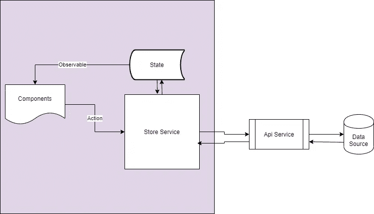
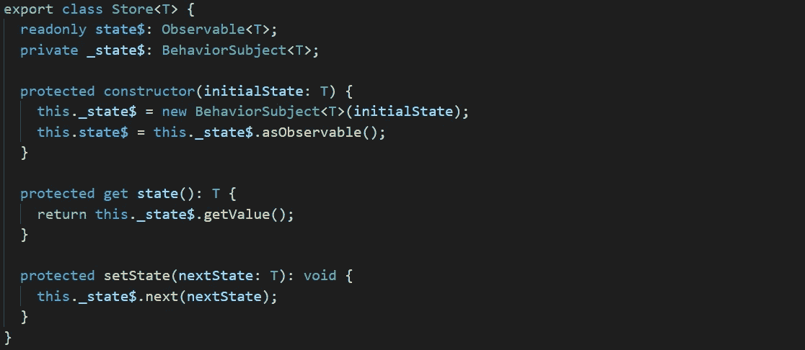
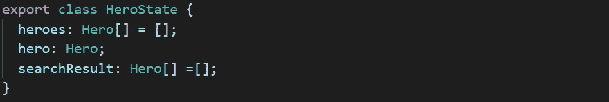
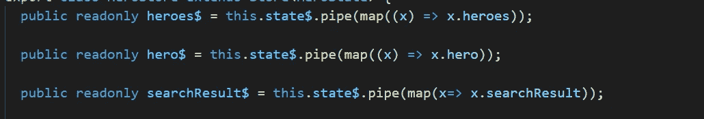
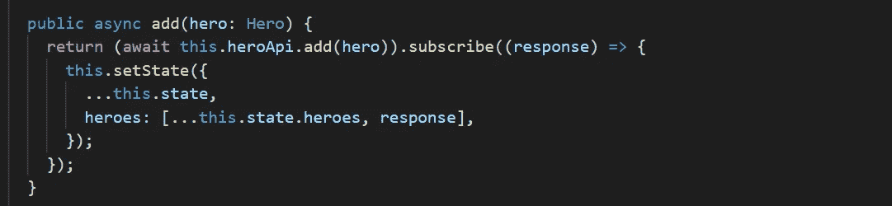
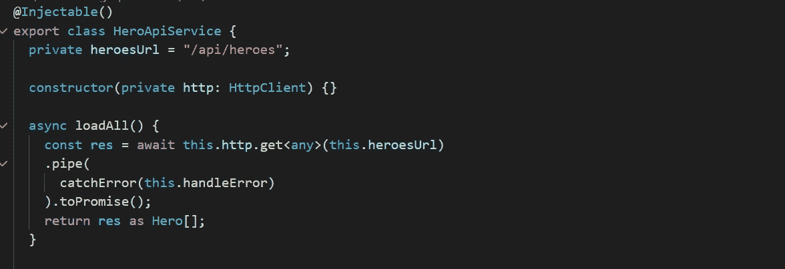

# 具有可观察服务模式的最简单角度状态管理

> 原文：<https://javascript.plainenglish.io/angular-state-management-with-observable-service-pattern-27b18538f4c3?source=collection_archive---------3----------------------->

## 使用可观测数据服务的简单而有效的解决方案


Photo by [James Harrison](https://unsplash.com/@jstrippa?utm_source=medium&utm_medium=referral) on [Unsplash](https://unsplash.com?utm_source=medium&utm_medium=referral)

Angular 状态管理是任何 Angular App 的核心，但没有放之四海而皆准的解决方案。虽然 Ngrx 是最流行的角度状态管理框架，但它过多的样板代码使它对许多中小型应用程序来说是多余的。

本文讨论了一个简单而有效的角度状态管理模式，它使用了可观察的数据服务。

我想要实现的是通过使用类似于 R [edux](https://redux.js.org/) 模式的概念获得以下主要好处。

*   **单一来源的真相**
*   **单向数据流**
*   **组件级不可变状态**

一个演示 [Hero 应用](https://github.com/sunnyy02/HeroesWithSimpleStateObservable)可以作为如何用这种模式实现 Angular 应用的例子。

## 概观

下图说明了模式的数据流，它类似于 Redux 流。通过应用程序的数据流顺序如下:

*   当用户执行动作时，事件/动作被发送到商店服务
*   如果需要，存储服务调用 API 服务(副作用)
*   API 调用返回后，存储服务更新状态
*   新状态通过可观察的 steam 发布
*   订阅该状态的组件重新呈现 UI



## 商店服务

在 Redux 的世界里，商店保存着全局的应用程序状态树，状态描述了应用程序在特定时间点的状况。

在这个示例应用程序中，我们使用`HeroStore`作为一个可观察的商店服务，作为一个商店在整个应用程序中提供数据。并且它可以被注入到任何需要状态的组件中。

```
@Injectable()
export class HeroStore extends Store<HeroState> 
```

`HeroStore` 服务从抽象的`Store`类扩展而来。Store 类的核心是 Rxjs 行为主体。它被用作私有的可观察实例来保存状态，并向订阅者发出任何更改。

请注意，暴露的是只读的 observable `state$`而不是 BehaviorSubject，以加强从存储服务到组件的单向数据流。一个`setState` 方法被提供为受保护的，更新状态的唯一方式是来自`HeroStore` 服务。



## 状态切片

hero state 类表示 UI 所需的状态数据的类型定义。



在演示应用程序中，每个单独的组件都需要一个状态片段，即仪表板组件需要`heroes`数据来显示前 5 个英雄。我们用只读的可观察的存储服务公开状态数据片。



通过 Rxjs 映射操作符，它在组件中被公开为可观察的，并通过异步管道绑定到 UI。


```
<a *ngFor="let hero of heroes$ | async"><h4>{{hero.name}}</h4></a>
```

## 行动方法

在`HeroStore` 服务中，CRUD 操作方法被公开来更新状态。下面的`add`方法就是一个例子。

`add` 动作方法触发一个 API 服务调用来添加新的`hero` 对象并更新全局状态。请注意，spread 操作符用于在更新状态之前创建状态的副本，以确保不变性。



更新后的状态将从存储服务中发布，状态数据切片的所有订阅者都将得到通知，UI 也将更新。订户不知道哪一方导致了状态改变，他们只是被通知了状态改变。这使得组件与应用程序的其他部分解耦。

## 副作用

当进行外部 API 调用并且状态因此而改变时，会产生副作用。在 Ngrx 中，Ngrx 效果库作为一个中间件来监听动作，触发副作用，并将动作返回到 reducer 中。

在这个模式中，我想避免 Ngrx 效应的复杂性，所以动作方法触发 API 服务调用(副作用), Rxjs 观察对象被链接起来处理这些副作用的结果。

API 服务被分离到一个`HeroApiService` 类中，以隔离与副作用相关的代码，从而实现可维护性，API 服务的唯一消费者是`HeroStore` 服务。换句话说，不允许组件直接调用 API 服务，每个请求都必须通过 store 服务发送。



## 几个音符

在这种模式下，大多数组件变得简单而被动。首先，它从状态片段中获取输入，状态片段是来自商店服务的链接/映射的可观察对象，并通过异步管道绑定到 HTML。然后，它通过调用商店服务动作方法来处理用户交互。

当您的应用程序增长时，您可能会发现状态的复杂性不断增加。然后，可能是时候将您的商店服务按照全局或特性模块划分成不同的服务了，您也可以使用 Rxjs 操作符，如`combinelatest` 或`mergeAll` 来映射/分割 UI 要使用的状态。

## 结论

这种可观察的存储服务是一种易于实现的模式，并且保留了那些复杂得多的状态管理框架的大部分优点。另一个好处是，商店服务有助于避免“事件汤”，当使用太多的个人角度服务，到处订阅 observables 时。

编程快乐！

*如果您还不是 Medium、* [***的付费会员，您可以通过访问此链接***](https://sunnysun-5694.medium.com/membership) *进行注册。你可以无限制地阅读媒体上的所有报道。我会收你一部分会员费作为介绍费。*