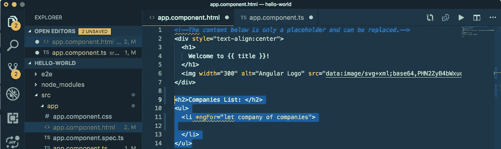

# 角度模板语法:指令、插值、属性绑定、事件绑定

> 原文：<https://javascript.plainenglish.io/angular-template-syntax-directive-interpolation-property-binding-event-binding-part-4-547e2512d8fe?source=collection_archive---------4----------------------->

## 什么是有角？(第四部分)

工作原理… |如何开始…

> 如果*你还没有涉及到本系列的*[*Part—3*](https://medium.com/@AnkitMaheshwariIn/role-of-webpack-in-angular-part-3-of-series-what-angular-is-5058d445e45c)*我推荐你查看这个链接→*[web pack 在 Angular 中的作用？|系列之三|什么是角？](https://medium.com/@AnkitMaheshwariIn/role-of-webpack-in-angular-part-3-of-series-what-angular-is-5058d445e45c)

# Angular 的模板语法扩展了 HTML 和 Javascript 的语法。

让我们通过在。ts 文件—该列表包含技术公司的名称。看起来👇12 号线

list of companies at line no. 12

对于这个列表，我们不需要任何数据类型👆在本演示中，我们也没有使用任何 ***变量*** *声明，如****var****或****let****——我们将在本系列的后面介绍数据类型和声明。*

现在，让我们遍历 HTML 模板中的公司列表。在这里，我们将`*ngFor`指令放在第 11 行的`<li>`标签*上👇*

`*ngFor` directive on a `<li>` tag *at line no. 11*

对于`*ngFor`，列表中的每个公司都会重复`<li>`标签。现在，让我们深入了解一下*ngFor *—*

# 1.1)指令* `*ngFor*`

`*ngFor`是一个`structural directive` *—* ***任何带星号*的指令都是一个结构指令*** *。*结构指令通常通过添加、删除和操作它们所附加的元素来塑造或重塑 DOM 的结构。

*   (DOM **或**或**D**Document**O**object**M**odel 是一个 Document 对象，表示显示在该窗口中的 HTML 文档。)
*   (**元素**在 HTML 中是开始标签、它的属性、结束标签以及它们之间的一切的集合。*在上面的例子中* `*<li*` *是一个开始标签——看上面的图片👆第 11 行，* `**ngFor*` *是属性，* `*</li>*` *是结束标记——看上图👆13 号线*

# 2)插值语法{{ }}

上述代码中的小修改…

**{{ }} is a syntax of Interpolation**

**{{ }}是插值** *的语法——看上图👆13 号线*。

现在，让我们深入到插值中

**插值将属性值渲染为文本***——在上面的例子中👆这将呈现列表*中的公司名称，以显示财产的价值。这里`company`是插值{{}}内的属性，这个属性值将显示公司名称*——如:* `'Apple'`或`'Google'`或`'MI'`等..

注意:这个属性值的名字可以是任何东西*——这只是作为参考。以下代码也是有效代码:*

property name could be anything

最后，看下面*👇*上述代码的输出预览*👆*

*the list of company name*

# 3)属性绑定[ ]语法

上述代码中的小修改…

*added <a> element (at line no. 16) to make each company name a link*

在上面的代码*中👆我们添加了<一个>元素(在第 16 行)使每个公司名称成为一个链接。并通过使用属性绑定`[ ]`语法将链接的“标题”设置为公司名称*。

看👇`[title]`在 16 号线

*the ‘title’ over the href will be :* `the company name + the word "details"` *| example: “*`Apple details"`

*在上述情况下👆href 上的“标题”将是:* `the company name plus the word "details"` *例如:* `Apple details`

*   插值`{{ }}`让您将属性值呈现为文本；和
*   属性绑定`[ ]`允许您在模板表达式中使用属性值。

最后看下面*👇*上述代码的输出预览*👆*

It shows title: “Apple details” — on hover over Apple

**到目前为止，我们已经介绍了以下内容:**

*   指令`*ngFor`
*   插值语法`{{ }}`
*   属性绑定语法`[ ]`

*接下来将是另一个*指令*ngIf

# 1.2)指令*ngIf

上述代码的小修改…我们将更新我们的公司名单。ts 文件 *—让我们将公司列表作为字符串列表中的对象列表。看下面👇第 13–16 行，包含公司名称和描述的对象。*

*list of objects from line no. 12 to 28*

在 HTML 模板中添加`
`元素。还添加了一个`*ngIf`指令，这样 Angular 只在当前公司有描述的情况下创建`
`元素。*看下面👇22-24 号线*

`using *ngIf` directive in `
` element at *line no. 22–24*

上面的代码*👆现在显示公司的名称和描述。*请注意，公司“诺基亚”没有描述段落。因为公司的“诺基亚描述”属性在列表中为空，Angular 不创建`
`元素—包括单词“描述”。

**指令** `***ngIf="company.description"**` **检查** `**company**` **对象**中 `**description**` **的值，只有在对象中找到`
`元素的值时，才显示该元素。*看下面👇22-24 号线***

directive `*ngIf="company.description"` checks the value of `description` in `company` object

带有公司名称和描述的最终输出。*看下面👇公司“诺基亚”没有描述段落。*

*the company ‘Nokia’ does not have description paragraph*

# 4)事件绑定( )语法

现在，添加一个按钮，让用户可以与朋友分享一个公司。将按钮的`click`事件绑定到`share()`方法(在`.ts`文件中)。事件绑定在 click 事件周围使用一组括号`( )`，如下面的`<button>`元素所示:*请看下面👇第 26 行*

`'click` event’ to the `share()` method, event binding uses a set of parentheses, `( )`, around the ‘click event’

每个公司现在都有一个“分享”按钮。*看下面👇*

each company now has a “Share” button

`share()`方法(在`.ts`文件中)。*看下面👇第 31—33 行*

`share()` method at *line no. 31–33*

测试“共享”按钮:

Test the “Share” button

该模板现在具有公司列表和共享功能。**在这个过程中，你已经学会了使用 Angular 的模板语法的五个常见特性:**👇

1)结构性指令

*   1.1)指令`*ngFor` *—* ***迭代模板中的元素。***
*   1.2)指令`*ngIf` *—* ***检查属性值。***

2)插值语法`{{ }}` *—* ***将属性值渲染为文本。***

3)属性绑定语法`[ ]` *—* ***在模板表达式中呈现属性值。***

4)事件绑定语法`( )` *—* ***事件绑定使用一组圆括号*** `***()***` ***，将 click 事件括起来。***

这是这一部分的内容，下一部分再见👋👋

> 如果*你还没有涉及到本系列的*[*Part—3*](https://medium.com/@AnkitMaheshwariIn/role-of-webpack-in-angular-part-3-of-series-what-angular-is-5058d445e45c)*我推荐你查看这个链接→*[web pack 在 Angular 中的作用？|系列之三|什么是角？](https://medium.com/@AnkitMaheshwariIn/role-of-webpack-in-angular-part-3-of-series-what-angular-is-5058d445e45c)
> 
> 敬请期待第五集
> [https://medium.com/@AnkitMaheshwariIn](https://medium.com/@AnkitMaheshwariIn)

如果你不介意给它一些掌声👏 👏既然有帮助，我会非常感谢:)帮助别人找到这篇文章，所以它可以帮助他们！

永远鼓掌…

