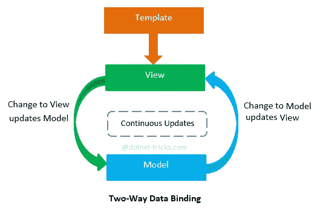

# 角度双向数据绑定—简单介绍

> 原文：<https://javascript.plainenglish.io/angular-two-way-data-binding-an-easy-introduction-35c87648c652?source=collection_archive---------1----------------------->


## 学习角度双向数据绑定技术的基础

Angular framework 提供的最大特性之一是它管理应用程序逻辑和呈现给用户的视图之间的变量变化的方式。

通过绑定一个变量，你告诉 Angular 观察它的变化，如果检测到变化，框架会负责**相应地更新视图**。

*与以前的编码范式相比，这种方法是开创性的，并且是使 Angular 如此受欢迎的主要特性之一* ***，*** *，在此之前，使用* ***普通 JavaScript*** *甚至像****【jQuery****这样的库，更新用户屏幕上显示的内容取决于开发人员。*

# 单向绑定

**双向数据绑定**顾名思义，是指通过使用特定的模板语法来创建**双向数据流**的能力。

你可以控制这个流程，你甚至可以决定哪一层可以修改你的变量的值。

显示绑定值的最常见方式是将它们显示为另一个 DOM 元素的子元素。

我们可以从模板中引用我们的变量，用两边的大括号把它的名字**括起来。**

请记住，此方法只提供单向数据绑定。

为了在屏幕上显示名为 *"first_name"* 的变量的值，我们需要在组件的模板中创建一个绑定。

```
<p>{{ first_name }}</p>
```

因为我们使用括号来区分变量名和普通文本，**我们也可以将这个语法和文本**结合起来。

```
<p>Hello, my name is {{ first_name }} {{ last_name }}</p>
```

# 将变量作为属性传递

一些 HTML 元素和角度组件**要求使用属性将值传递给它们。**

这些数据绑定被称为属性绑定。

语法是相似的，就像我们将值附加到元素的子元素上，不同的是**我们使用了带有属性**的语法。

通过属性获取值的元素之一是**输入标签**。

```
<input id="first_name" value="{{ first_name }}" />
```

因为到处都有大括号看起来有点混乱，有一个替代语法**更好，也是推荐的语法。**

```
<input id="first_name" [value]="first_name" />
```

在内容中没有大括号，现在属性名用方括号**括起来，双引号**里面是我们的变量名**。**

# 绑定到事件

到目前为止，我们只使用数据绑定来显示从控制器到视图的变量值。

## *但是如果我们想对用户的行为做出反应呢？*

我们要做的是**将相应的事件(例如点击事件)绑定到组件逻辑**中声明的方法。

为此，我们使用属性，用圆括号将我们要绑定的事件的名称括起来:

```
<button (click)="onButtonClicked()">Change First Name</button>
```

我们要触发的方法是`onButtonClicked`。

当然，我们也有**来实现我们的组件**中的方法:

# 传递事件对象

在鼠标事件(以及其他事件)的情况下，通常需要接收原始事件来访问有用的信息。

我们可以通过使用特殊的`*$event*`语法将原始事件传递给我们的方法:

```
<button (click)="onButtonClicked($event)">Change Name</button>
```

*注意，该参数的拼写必须和上面完全一样，包括美元符号。*

我们可以通过向我们的方法添加一个参数来接收事件:

```
onButtonClicked(evt: MouseEvent) {
    ...
}
```

# 什么是双向数据绑定？

通过双向数据绑定，Angular 不仅监视变量的变化，还跟踪用户的动作(例如输入元素和按钮点击),并且**相应地更新绑定变量**。



这样，代码中的变量总是代表视图中显示的内容。

# 如何在 Angular 中使用双向数据绑定

有一个常用的指令使得双向数据绑定成为可能，它被称为 **ngModel** 。

**NgModel** 可以和 **form-elements** 一起使用，比如输入，实现双向数据绑定。

为此，我们必须使用一个非常特殊的语法: **[(ngModel)]** 。

> 它是单向和事件绑定语法的组合。

```
<input [(ngModel)]="first_name" />
```

使用这种语法，变量“first_name”的值不仅显示为输入值**，而且当用户在输入字段**中键入时，这两个值都会改变。

# 双向数据绑定的工作原理


事实证明，组合语法不是巧合，它只是一个更漂亮的版本，一个普通的数据绑定在屏幕上显示值，一个事件绑定**更新变量值。**

上面的例子也可以写成:

```
<input [ngModel]="first_name" (ngModelChange)="first_name = $event" />
```

**这个版本比**更长，但是给了你更多的控制发生了什么，而不是仅仅用最近的事件更新***【first _ name】***变量的值，**当值改变时你可以做各种事情**。

# 结论

在本教程中，我们发现了如何在 Angular 应用程序中使用数据绑定的强大功能，这是对该主题的快速介绍，但它足以提高模板语法的效率，并为您提供了开始创建更复杂的解决方案的基础。

*感谢阅读！*