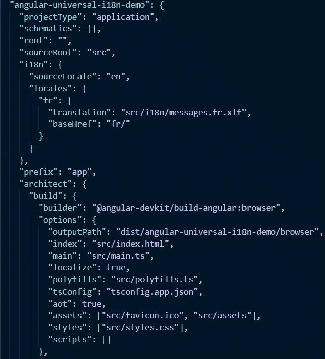

# Angular Universal 和 I18n 一起工作

> 原文：<https://javascript.plainenglish.io/angular-universal-and-i18n-working-together-8828423e8a68?source=collection_archive---------3----------------------->

Illustration by [Thomas Renon](https://www.behance.net/ui-ux-designs?fbclid=IwAR1W38mG5qeH3pyA08JTpJHsn4L3HuBgdiBsU7YYKQ2XDtjxrzMauG9K-2M)

最近，我尝试用 Angular 设置国际化和服务器端渲染(SSR)。经过几天的挖掘，并近乎疯狂地试图让一些东西对用户和开发者友好，我想分享我的经验，并希望帮助处于相同情况的人。

让我们在这里设定目标。我们希望有一个完整的 SSR 应用程序，有多个页面，能够在运行时改变语言，最后但并非最不重要的是，一个友好的方式为开发人员做他们的工作，没有疯狂的架构。你可以在这里找到最终结果。

***先决条件*** :你需要在你的机器上安装 Node 和 Angular CLI 9。

*编辑* : *在这篇文章的第一个版本中，有人提出了视图源 HTML 没有翻译，会给网络爬虫带来问题的问题。这个新版本解决了这个问题。*

# 从 CLI 开始

angular CLI 提供了许多工具，将在我们的旅程中为我们提供帮助。让我们创建一个新的应用程序并进行设置。

我们在这里完成了两件事。首先，使用 CLI 工具创建一个应用程序，然后为 NgUniversal 添加配置。

您可以看到，与常规 Angular CLI 应用程序相比，有一些新文件:

File explorer of an SSR Angular application

主要焦点是 *server.ts* 文件。对于那些熟悉 Express on Node 的人来说，他们会意识到这个文件主要充当静态文件的 web 服务器。Angular CLI 为我们完成了所有设置，并在 *package.json:* 中添加了一些新命令

*dev:ssr* 命令相当于 ssr 应用程序的 *ng serve* 。 *build:ssr* 命令为生产构建您的应用程序，而 *serve:ssr* 启动为您的生产应用程序服务的 express 服务器。最后一个， *prerender* 不仅可以像在生产环境中一样构建您的应用程序，还可以预渲染页面以进行优化。

让我们从运行第一个命令 *dev:ssr 开始。*

[http://localhost:4200](http://localhost:4200)

现在让我们添加另一个页面*/首页*，为文章的其余部分奠定基础。我将跳过细节，因为这部分不是本文的目的，所有内容都与常规应用程序相同。如果你需要这部分的帮助，你可以参考[角度文件](https://angular.io/guide/router)。这是我们应该有的:

并且在*本地主机*上:

[http://localhost:4200/first-page](http://localhost:4200/first-page)

SSR 应用程序的所有基础都准备好了。是时候攻克 i18n 了！

# i18n(角度)

直说吧，Angular 中的 i18n 实现是痛苦的。它被设计成高度优化的(确实如此)，但是它绝对不是开发者友好的。有一个优秀的库 ngx-translate 用不同的方法处理内部化。它的优化程度较低，但更容易集成。然而，我发现这个库不能很好地与 Angular Universal 一起工作(在撰写本文时版本 9 是最新的)。此外，目前还不清楚 ngx-translate 是否会长期存在(见[此处](https://github.com/ngx-translate/core/issues/783))。这就是为什么我们将重点放在 Angular 团队提供的 [i18n 工具](https://angular.io/guide/i18n)上。

首先，让我们用 cli 添加它:

您应该会看到一些提示您的问题。选择最适合自己的。在这里，我们选择英语作为主要语言，法语作为附加语言:

软件包 [ngx-i8nsupport/tooling](https://github.com/martinroob/ngx-i18nsupport) 为您提供了一些工具来帮助您进行翻译。最有用的一个是 xliffmerge 工具，它可以将新的翻译自动合并到它们的文件中，而不用覆盖你过去的工作。

让我们用 i18n 属性给我们的应用程序添加一些翻译(更多细节见[文档](https://angular.io/guide/i18n#mark-text-with-the-i18n-attribute))。

现在是时候将它们提取到翻译文件中了。您可能已经注意到您的 *package.json* 有一个新脚本' *extract-i18n* '。我们需要修改它来匹配来自 *angular.json* 的配置。

您应该会看到创建的文件夹 src/i18n:

File explorer after extracting i18n keys

它应该是这样的:

源代码是 messages.xlf，messages.en.xlf 已经被翻译(注意<target state="”final”">)，我们只需要将法语的翻译添加到 messages.fr.xlf 中(注意<target state="”new”">表示您需要翻译该部分)。</target></target>

翻译到此为止。所有的石头都准备好了，现在让我们处理最后也是最有趣的部分。

# 服务于多个地区

要构建具有多个地区的应用程序，我们可以在命令行中使用 *localize* 参数。在我们的用例中，一个更好的解决方案是将它固定在 *angular.json* 文件中。为此，我们可以将它添加到构建选项部分。我们还需要添加一个 i18n 部分，指示“en”作为源语言，在那里找到法语翻译，并为其设置适当的 baseHref(不要错过这一步，这是提供适当翻译的关键)。

angular.json

运行 build 命令后，我们应该会看到:

File explorer after build

现在让我们让 *server.ts* 文件分发我们构建的正确版本:

第一步是将参数 *lang* 添加到 app 方法中。该参数用于指向正确的 dist 文件夹，并在应用程序中提供正确的 [LOCALE_ID](https://angular.io/api/core/LOCALE_ID) 。第二步在 run 方法中。基本上，每种语言都有自己的 express 实例。这些将由 master express 实例执行。当 baseHref 为'*fr【T7]'时，我们重定向到法语实例。当它是' *en* 或'/'时，我们重定向到英语实例。运行 serve 命令后，您应该会看到以下内容:*

English version

French version

就这样，我们同时运行两个版本的应用程序！这种方法的唯一缺点是，当你切换语言时，应用程序会重新加载。除此之外，在运行时没有切换语言的问题！

# 翻译视图-源

如果您输入 URL*view-source:http://localhost:4200/fr/*，您会注意到 HTML 文件没有被翻译。这将导致一个问题，网络爬虫找到我们的翻译页面。这是因为我们没有本地化我们的服务器构建。然而，当我们这样做时，我们最终得到了两个服务器包，而不是一个！这意味着我们不能使用我们的 *server.ts* 来服务两种语言…

我们希望在开发时保持热重装能力和动态语言改变。因此，我们将保持与之前开发模式相同的东西，只是在生产中添加一些额外的步骤。

首先，我们将使我们的 server.ts 实际上只在 dev 模式下运行。

我们还将创建一个仅在生产中使用的 *proxy-server.js* 文件:

该文件将获取法语和英语包，并在需要时提供给它们。

最后一步是稍微更新一下配置。我们需要本地化服务器的生产版本，并将 *proxy-server.js* 添加到 *dist* 文件夹中。

在 package.json 中，让我们更新 *build:ssr 和 serve:ssr* 命令(您需要安装 cpx 包作为开发依赖项):

现在可以拥有完全本地化的版本:

Build result

和翻译的视图-源:

view-source:localhost:4200/fr/

# Prerender 命令

prerender 命令是一个非常有用的生产工具。顾名思义，它会为你伪装应用程序的 HTML 页面，以便更快地提供服务。Angular CLI 会自动为您生成此命令。为此，只需在命令行中执行 *npm run prerender* ！

# 最后的话

我们现在有了一个友好的翻译 SSR 应用程序 Angular，我们可以在没有(太多)额外步骤的情况下即时更改语言。希望它能帮助其他开发人员在没有这种设置的情况下更容易地编写代码！

谢谢你一直读到最后，我希望它能帮助一些人！欢迎留下反馈，我会很乐意回答。黑客快乐！

## **用简单英语写的 JavaScript**

喜欢这篇文章吗？如果有，通过 [**订阅我们的 YouTube 频道**](https://www.youtube.com/channel/UCtipWUghju290NWcn8jhyAw) **获取更多类似内容！**