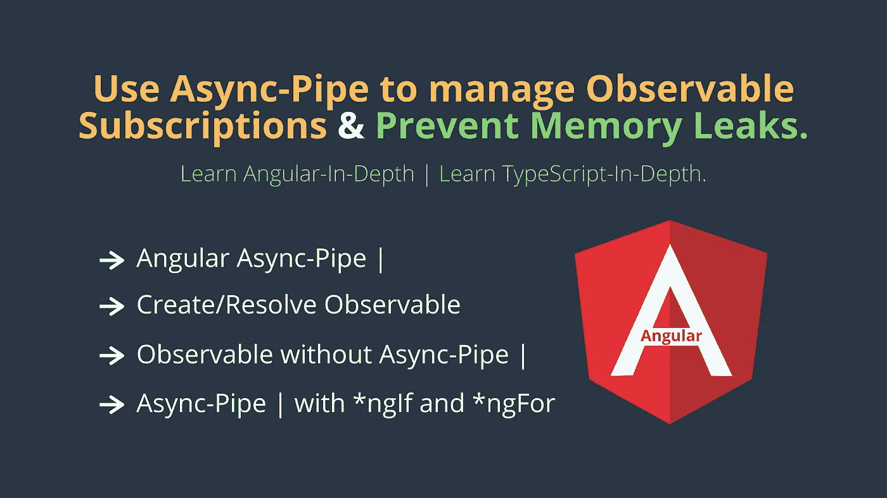

# Angular:使用可观察订阅和异步管道来防止内存泄漏。

> 原文：<https://javascript.plainenglish.io/angular-use-async-pipe-to-manage-observable-subscriptions-and-prevent-memory-leaks-db6c043d360?source=collection_archive---------0----------------------->

[](https://medium.com/codechintan/ionic-hide-header-on-scroll-b8828a7a7f86) [## Ionic4 隐藏滚动标题。

### 如何在 Ionic 框架中隐藏内容滚动的标题？

medium.com](https://medium.com/codechintan/ionic-hide-header-on-scroll-b8828a7a7f86) 

**Async-Pipe** 是一个 Angular 内置工具，用于管理可观察订阅。我们可以使用异步管道轻松简化角度代码的功能。让我们学习使用异步管道|可观察订阅。

> Async-Pipe 管理可观察订阅，可观察订阅是一种变量类型，它的值在任何时候发生变化时都会被跟踪，以确保我们总是获得更新的值。我们订阅一个可观察对象来获取它的更新值。

# 我们将学习使用异步管道:

*   用[插补数据绑定](https://medium.com/@AnkitMaheshwariIn/angular-template-syntax-directive-interpolation-property-binding-event-binding-part-4-547e2512d8fe)。
*   与[不同的指令](https://medium.com/@AnkitMaheshwariIn/angular-template-syntax-directive-interpolation-property-binding-event-binding-part-4-547e2512d8fe)如`*ngIf`和`*ngFor`。

# 角形异步管道

angular 异步管道“允许订阅观察 angular 模板语法中任何内容的值”。它还负责自动取消订阅可观测量。

# #1 创建->实现“可观察”。

在本例中，我们将创建一个具有非常简单的可观察对象的组件，该组件每秒钟递增一个值并输出该值。
(基本上这个可观察到的只是向上计数)
**例-1:** 创建一个新的组件或者打开自己的组件(如果已经有一个的话)。要创建新的，请运行以下命令👇👇

```
ng g component YourComponentName
```

现在，打开你的`***.component.ts`，更新下面的代码👇👇
(确保用您的组件名称替换`HomePageComponent`。同样的，`selector`、`templateUrl`和`styleUrls`的名字会被你的名字代替。)

(我们必须“实现 OnInit”才能使用“OnInit”。了解更多-> [点击此处👆](https://www.codewithchintan.com/angular-async-pipe/www.codewithchintan.com/difference-between-constructor-and-ngoninit/)

# #2 显示->解析“可观察”。

为了显示值，我们将引用 observable 属性，并使用异步管道解析 observable:

现在，打开你的`***.component.html`，添加这段代码👇👇

```
<p>{{ observableNumber | async }}</p>
```

了解更多关于[插值语法](https://medium.com/@AnkitMaheshwariIn/angular-template-syntax-directive-interpolation-property-binding-event-binding-part-4-547e2512d8fe)**{ { } }**–>[点击此处👆](https://medium.com/@AnkitMaheshwariIn/angular-template-syntax-directive-interpolation-property-binding-event-binding-part-4-547e2512d8fe))

“observableNumber”的输出将在您的屏幕上显示计数值，并且每秒递增。

# #3 解析“可观察的”——不使用“异步管道”。

“observable”的一个非常常见的用例是显示从 REST-Endpoint/API 接收的值，因为 Angular HttpClient 返回一个 Observable。
在这里，我们将学习从“REST-Endpoint/API”中“解析可观察到的”返回。

为什么我们需要**使用异步管道？我们可以通过多种方式订阅 observables。默认方式(无角度)是手动订阅可观察值，并用该值更新单独的属性，查看下面的示例:👇👇
**例-2:** 打开你的`***.component.ts`，更新下面的代码👇👇**

我们现在可以在不使用异步管道 :
的情况下**绑定到属性(我们不使用‘Observable number’而是使用‘latest value’来获取更新的值，因为我们已经在‘ngOnInit’函数中订阅了‘Observable number’来解析‘Observable’)👇👇**

现在，打开你的`***.component.html`并添加这段代码👇👇

```
<p>{{ latestValue }}</p>
```

“latestValue”的输出将在屏幕上显示计数值—每秒递增—与我们在前面的示例 1 中看到的一样。

# 那么我们为什么要使用异步管道呢？

在**例-2** 中我们手动订阅了可观察的，我们也需要手动取消订阅。否则，当组件被销毁时，我们就有内存泄漏的风险。

要解决这个问题，“当组件被销毁时，我们需要取消订阅”。最好的地方是' **ngOnDestroy'** 生命周期挂钩:

打开你的`***.component.ts`，更新下面的代码👇👇

做同样事情的一个更干净和更有反应性的方法是使用‘rxjs take until’操作符和另一个观察对象/主题，当组件被销毁时我们完成这个操作。在这种情况下,“takeUntil”操作员负责退订。

打开你的`***.component.ts`，更新下面的代码👇👇

*   当处理每个订阅的多个可观测量时，这种方法特别有用，因为我们不需要保存所有订阅的列表。
*   毕竟，当使用角度异步管道时，这个额外的语法是不必要的，因为一旦组件被破坏，管道本身会负责**从可观察的**中取消订阅。因此，如果没有别的，异步管道使我们的代码更干净。
*   此外，上面显示的方法不能与用于组件性能优化的 **onPush 变化检测**策略一起工作。另一方面，异步管道可以很好地解决这个问题。

# 这就是为什么“无论何时何地，只要有可能，我们都应该使用异步管道”。

# #4 异步管道，带*ngIf 和*ngFor

**With *ngIf**
[插值](https://medium.com/@AnkitMaheshwariIn/angular-template-syntax-directive-interpolation-property-binding-event-binding-part-4-547e2512d8fe) {{ }}不是唯一可以使用异步管道的数据绑定。我们也可以将它与*ngIf [指令](https://medium.com/@AnkitMaheshwariIn/angular-template-syntax-directive-interpolation-property-binding-event-binding-part-4-547e2512d8fe)一起使用:

现在，打开你的`***.component.html`试试这段代码👇👇

```
<p *ngIf="(observableNumber$ | async) > 5">{{ observableNumber$ | async }}</p>
```

注意，在这种情况下,*ngIf 指令中的大括号是绝对必要的。

只有当‘observable number＄’的值大于 5 时，上述

才会可见。

**使用* NGF for**
我们可以像使用*ngIf [指令](https://medium.com/@AnkitMaheshwariIn/angular-template-syntax-directive-interpolation-property-binding-event-binding-part-4-547e2512d8fe)一样使用异步管道用于*** NGF for**。但是要使用**异步管道**我们必须需要数组类型的可观察值，而不仅仅是单个值。看到这个了吗👇👇

现在，我们可以在*ngFor 指令中使用它，就像这样👇👇

```
<p *ngFor="let item of items$ | async">{{ item }}</p>
```

# 结论

我们可以使用角度异步管道来防止内存泄漏。
我们涵盖的东西有:
**#1** 创造——>实现‘可观察’。
**#2** 显示- >解析‘可观察’。
**#3** 解析“可观察的”——不使用“异步管道”。
**【4】**带*ngIf 和 ***** ngFor 的异步管道。

# 接下来，学习使用' Promises' | Async/Await |来代替 JavaScript 回调。

点击这里↓阅读

[](https://www.codewithchintan.com/javascript-callbacks-promises-async-await/) [## 使用' Promises' | Async/Await |代替 JavaScript 回调。

### 我们应该使用允许我们访问异步方法并将值返回给同步方法的承诺。还有…

www.codewithchintan.com](https://www.codewithchintan.com/javascript-callbacks-promises-async-await/) 

# 搞定了。🤩理解“为什么使用异步管道来管理可观察订阅”就是这么简单。

再见👋👋

> 请在评论框中随意评论…如果我错过了什么，或者什么是不正确的，或者什么对你不起作用:)
> 
> 更多文章敬请关注:
> [https://medium.com/@AnkitMaheshwariIn](https://medium.com/@AnkitMaheshwariIn)

如果你不介意给它一些掌声👏 👏既然有帮助，我会非常感谢:)帮助别人找到这篇文章，所以它可以帮助他们！

永远鼓掌…


*原载于 2019 年 12 月 31 日*[*https://www.codewithchintan.com*](https://www.codewithchintan.com/angular-async-pipe/)*。*

# 了解更多信息

[](https://www.codewithchintan.com/crud-in-firebase-with-firestore/) [## 如何用 Firestore 在 Firebase 中进行 CRUD 与查询操作？(角形/离子形/网状)

### 额外收获:你将学会创建角度模型、服务和组件]。CRUD -创建、读取、更新、删除操作在…

www.codewithchintan.com](https://www.codewithchintan.com/crud-in-firebase-with-firestore/) [](https://www.codewithchintan.com/javascript-callbacks-promises-async-await/) [## 使用' Promises' | Async/Await |代替 JavaScript 回调。

### 我们应该使用允许我们访问异步方法并将值返回给同步方法的承诺。还有…

www.codewithchintan.com](https://www.codewithchintan.com/javascript-callbacks-promises-async-await/) [](https://www.codewithchintan.com/two-way-data-binding-in-angular/) [## Angular 中双向数据绑定的背后是什么？

### 数据绑定允许组件和 DOM (HTML 模板)之间的通信。数据绑定有四种形式…

www.codewithchintan.com](https://www.codewithchintan.com/two-way-data-binding-in-angular/) [](https://www.codewithchintan.com/angular-async-pipe/) [## Angular:使用异步管道来管理可观察的订阅并防止内存泄漏。

### Async-Pipe 是一个 Angular 内置工具，用于管理可观察订阅。我们可以轻松简化的功能…

www.codewithchintan.com](https://www.codewithchintan.com/angular-async-pipe/) [](https://www.codewithchintan.com/angular-route-guards/) [## 使用角形护线板保护角形页面。允许/拒绝/重定向。

### 路由保护是 Angular 路由器的一个重要功能，它允许或拒绝用户访问路由页面…

www.codewithchintan.com](https://www.codewithchintan.com/angular-route-guards/) [](https://www.codewithchintan.com/angular-routing/) [## 角度组件的布线|角度布线。

### 路由意味着从一个页面移动到另一个页面。角度使用户能够从一个视图导航到下一个视图…

www.codewithchintan.com](https://www.codewithchintan.com/angular-routing/)