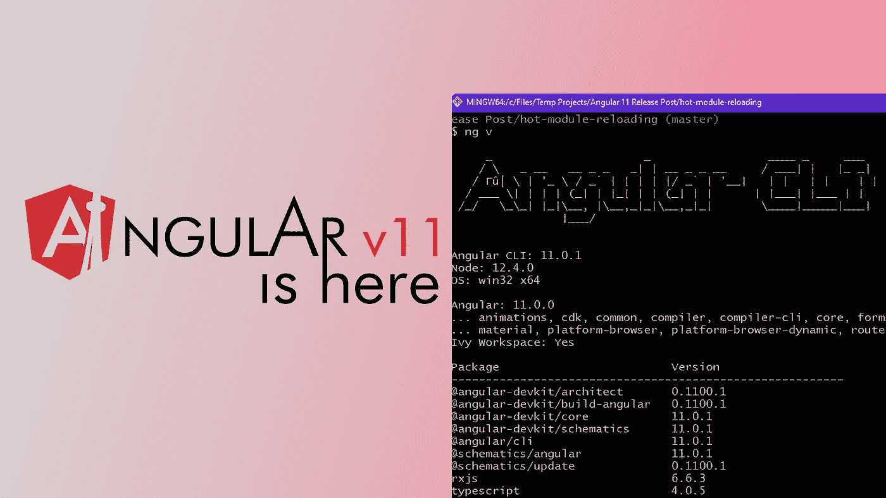
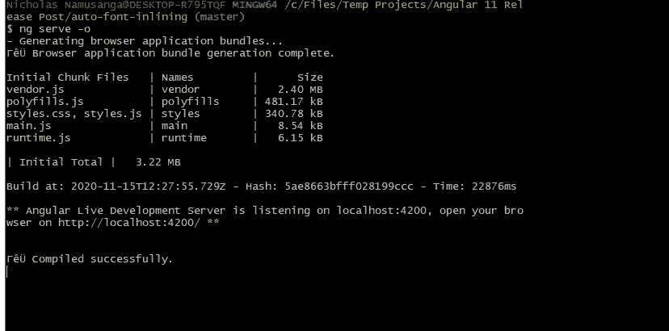
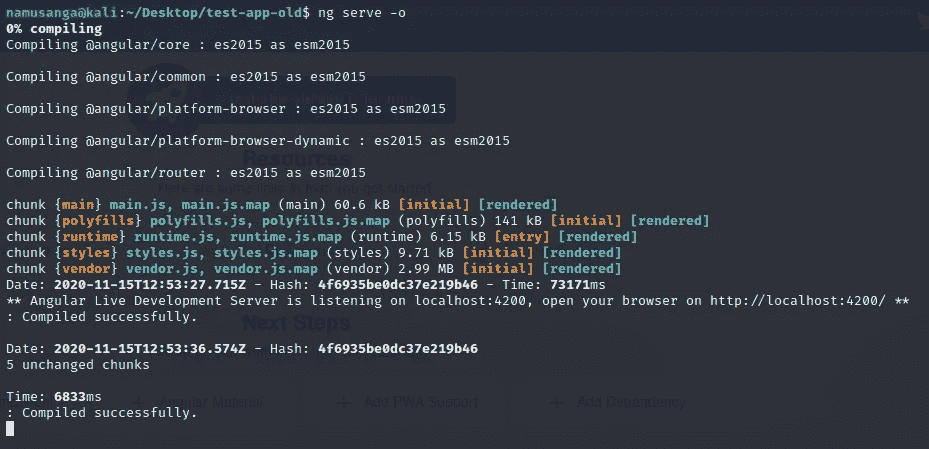
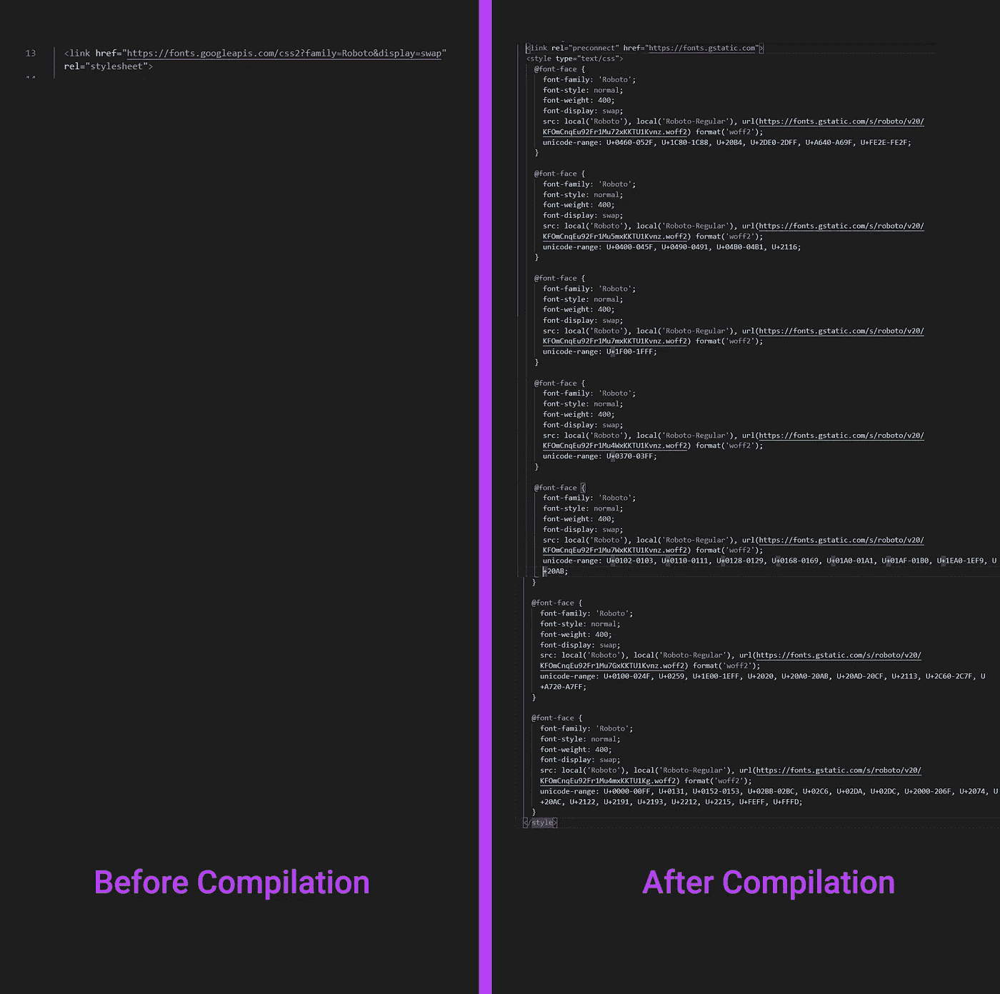
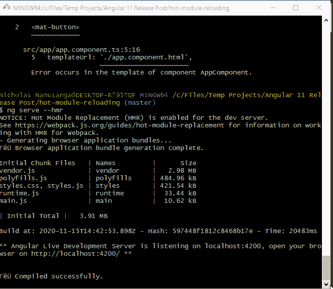
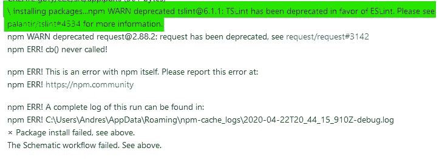

# 角版 11 出来了！

> 原文：<https://javascript.plainenglish.io/angular-version-11-is-out-a-comprehensive-look-and-why-you-might-want-update-your-projects-5db652ce110c?source=collection_archive---------2----------------------->

## 让我们仔细分析一下新特性



angular 的第 11 个版本已经发布，我们有一些有趣的更新要看看。在这篇短文中，我将带您了解您需要了解的最重要的新特性，并指出为什么您可能希望或不希望更新您的项目。

我先警告一下，如果您还没有将 angular cli 版本更新到最新的 v11，您可能无法使用`ng new`创建新的 angular 项目。要解决这个问题，只需运行:

```
npm install -g @angular/cli@latest
```

这将使你运行最新版本的 angular cli，你现在应该可以创建新的项目了，这个问题似乎源于 angular 中默认的林挺系统的死亡，我稍后会谈到这一点。现在我们来谈谈特性！🎉

## 更好的命令行格式



Version 11 Command-Line Compile Output

这是一个大问题。在 angular 中工作的开发人员通常花更多的时间在命令行上，而不是 react 上，这是因为受人喜爱的`ng cli`,所以 angular 11 在这方面做了一些重大改进。



The Old CLI 😒😒

现在，您将得到一些整洁的表格，以便对您编译的组件进行排序，从而允许您在文件之间进行快速的大小比较。在新 cli 的许多其他地方也可以看到这种表结构。就个人而言，我会更新这个功能。

## 自动字体内联

这很可能是 angular 的这个版本中最大的改进，尽管围绕它是否有帮助还有一些争论。

Angular 现在下载项目中使用的字体，并将它们添加到构建文件中。请注意，这仅发生在为生产而构建时，这可以通过使用:

```
ng build --prod
```



Comparing fonts before and after compilation

点击上面的图片，看看 angular 对从 [fonts.google](http://fonts.google.com) 导入字体 Roboto 的代码所做的修改。

我认为这是一个非常令人印象深刻的特性，并且对 angular 程序的加载时间增加了一点点改进。

**警告::**当您将旧的 angular 项目更新到 CLI v11 时，此功能可能会导致某些字体出现问题。您可以通过将下面的代码添加到 package.json 文件中来为您的项目关闭它，从而解决这个问题:

```
"optimization": { 
  "scripts": true,
  "styles": false,
  "fonts": true
}
```

如果问题仍然存在，您可能需要检查这个[问题](https://github.com/angular/angular-cli/issues/19350)。

## 热模块重装

热模块重载现在允许 angular 11 在你编辑代码时刷新页面内容，而无需刷新网站。这肯定是有角度的试图赶上反应，但它肯定是一个受欢迎的变化，为小的开发时间，它会节省你。

默认情况下，这个特性是禁用，但幸运的是，可以通过运行以下命令在 angular v11 项目中轻松启用:

```
ng serve --hmr -o
```

这是我现在在我的网站上更新一个组件时看到的，漂亮



With HMR enabled

希望 angular 决定在未来做一些工作，让我们在导入新组件时不需要手动重启编译过程。

这就是大的变化，我现在将谈论你是否应该更新你的项目到新的版本。

## 你应该在新项目中完全使用 v11

当使用早于 v11 的 Angular CLI 版本创建新项目时，您可能会得到一个与不推荐使用 TSLint 相关的错误。



该问题似乎与 npm 有关。到目前为止，我找到的解决方法是将主`ng`包管理器改为 yarn，而不是 npm。您可以使用以下命令:

```
ng config -g cli.packageManager yarn
```

如果你真的想使用旧版本的 angular，你可以这样做，或者升级到最新版本。下次你想创建一个新的 angular 应用程序时，你可能想突出显示这一部分，不过我会建议新应用程序使用最新版本的 CLI。

> 嘿，想找一个好的远程 web 开发者？我有空！😊在 namusanganicho@gmail.com 或推特上给我喊一声

## 您应该将旧项目更新到 Angular V11 吗

对于已经有 Angular v10 或更早版本的项目的人来说，有一些事情需要考虑更新，特别是对于大型项目；

*   **自动字体内联** →如果您在项目中使用内联字体，请放心，Angular 可以在您为生产构建时做出突破性的改变，因为它具有新的字体内联功能。该功能旨在通过优化项目中的外部字体来缩短加载时间。问题是浏览器通常会缓存普通字体，所以如果你的程序使用普通字体，比如 Roboto，Helvetica 等，这可能不会对你的程序有很大影响。这些很有可能已经被缓存在用户的浏览器中。如果你还在考虑更新这个功能，我建议只有在你的应用程序中使用了很多罕见的字体时才这么做。
*   **Webpack 5 支持→** 这是 angular v11 中的另一个功能，可能对使用基于 angular 的大型应用程序的人有用。特别是 Web Pack 中的**树摇动**特性，该特性允许构建过程自动删除代码中未使用的部分，如方法，并将总体上减少生产构建的大小。如果这是你一直在努力解决的问题，你肯定会想进一步了解这个更新。查看此[链接](https://webpack.js.org/guides/tree-shaking/)了解更多信息。

您需要将 Webpack 5 添加到您的 package.config 中的 resolutions 中，并作为您的包管理器切换到 yarn，这样才能工作。

我建议在一个单独的项目中进行测试，在实际应用程序中进行测试之前，先感受一下这些变化会如何影响项目的构建。

*   老实说，我们都知道这一天即将到来。对于那些仍在为传统的 Internet Explorer 版本开发应用程序的人来说，末日到了。对于 11 之前的版本，Angular 11 中的支持已被删除。*(明白了吗？* *)* 反正，是啊，发生了。老实说，我甚至不知道有移动 IE，但它也失去了支持。因此，对于仍然瞄准这些平台的两个开发者来说，你肯定不想更新。或者你想更新并停止支持这些浏览器。

最后，我不认为 ng V11 对我正在更新的项目有足够的改变，所以我不会更新任何已经运行的项目。不过我会在所有新项目中使用新版本。

非常感谢你看了这篇文章，让我知道你对评论中的变化有什么想法，你会更新吗？为什么？暂时干杯。🤗