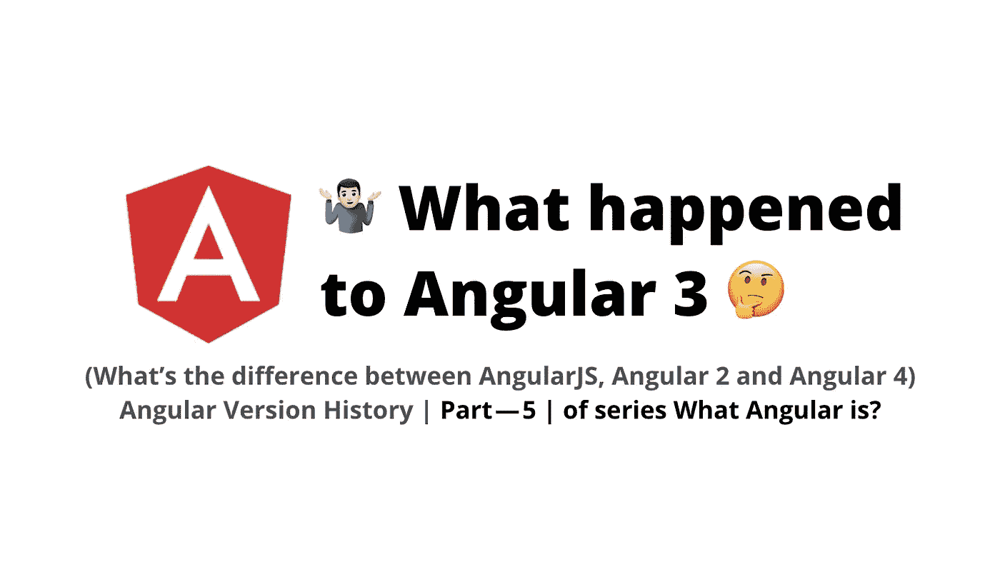
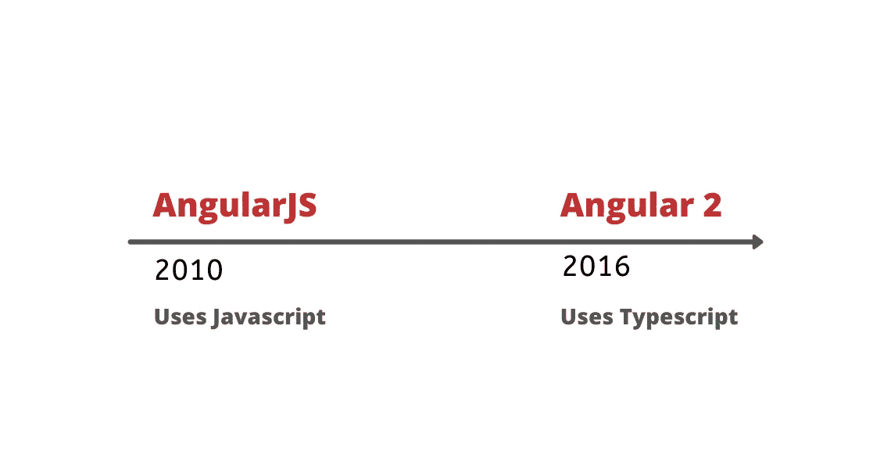

# AngularJS，Angular 2，Angular 4 的区别，Angular 3 怎么了？

> 原文：<https://javascript.plainenglish.io/angular-version-history-difference-between-angularjs-angular-2-and-angular-4-part-5-of-8ff9913f2964?source=collection_archive---------0----------------------->

## 什么是有角？(第五部分)

工作原理… |如何开始…

> *如果*你还没有涉及到本系列的 [Part — 4](https://medium.com/@AnkitMaheshwariIn/angular-template-syntax-directive-interpolation-property-binding-event-binding-part-4-547e2512d8fe) ，推荐你查看这个链接→ [Angular 模板语法(指令、插值、属性绑定、事件绑定)|系列的 Part—4 | Angular 是什么？](https://medium.com/@AnkitMaheshwariIn/angular-template-syntax-directive-interpolation-property-binding-event-binding-part-4-547e2512d8fe)

# AngularJS，Angular 2 和 Angular 4 有什么区别…

AngularJS 于 2010 年推出 Javascript 框架，用于构建客户端应用。很快它变得流行起来，Angular 团队开始添加新功能。但是该框架的设计不符合当今应用的需求，而且过于复杂，因此 **Angular 团队决定使用 typescript** 重写原始框架，结果 **Angular 2 于 2016 年中期**问世。*看👇*

👉**这个新版本的 Angular 2 完全不同，而且更好**👌**框架起角 1 *。***

**Angular 2** 使用打字稿语言，这是一个**更简洁**和**更容易理解和使用。**

***Typescript****:是编译成 Javascript 的语言。使用 Angular 时，Typescript 是非常常见的——因为即使 Angular 也是用 Typescript 编写的。点击了解更多* → [*角度语法*](https://medium.com/@AnkitMaheshwariIn/angular-template-syntax-directive-interpolation-property-binding-event-binding-part-4-547e2512d8fe)

*接下来，在 Angular 2 中奇怪的向上渐变。看👇下面，2.3 之后突然 4 出来了…*

**🤷🏻‍♂️《棱角 3》怎么了🤔**

Angular 由几个不同的库组成，这些库通过 NPM 作为独立的节点包分发。

( **Angular 核心库** —我们在每个应用程序中都使用)，( **Angular 编译器库** —编译我们的代码)，( **Angular http 库** —用于调用 http 服务)，( **Angular 路由器库** —用于为应用程序添加导航)以及其他一些库。

所有的库都有相同的版本，除了路由器库的版本是 3.3 | Angular 3 的所有其他库没有大的变化。

接下来，**角 4 来了**👏👏—Angular 版本的所有后缀都被删除，只将版本 4 称为 Angular 框架。现在，我们有两种有棱角的*👇*

*   **AngularJS ( 1.x )** —是用 Javascript 编写的第一代 Angular。
*   **Angular ( 2+ )** —这个 Angular 是指 Angular 2 或以后的版本，我们简单的称之为 Angular。就像我是一个角度开发者，不是角度 2 或角度 4，我们只称我们为**角度开发者👨‍💻**。

只有当我们发布或者我们想升级代码时才需要版本，比如:从 Angular 4 升级到 Angular 5。

这是关于角度版本历史的——下一部分见👋👋

> *如果*你还没有涉及到本系列的 [Part — 4](https://medium.com/@AnkitMaheshwariIn/angular-template-syntax-directive-interpolation-property-binding-event-binding-part-4-547e2512d8fe) ，推荐你查看这个链接→ [Angular 模板语法(指令、插值、属性绑定、事件绑定)|系列的 Part — 4 |什么是 Angular？](https://medium.com/@AnkitMaheshwariIn/angular-template-syntax-directive-interpolation-property-binding-event-binding-part-4-547e2512d8fe)
> 
> *敬请期待 Part—6* [*https://medium.com/@AnkitMaheshwariIn*](https://medium.com/@AnkitMaheshwariIn)

如果你不介意给它一些掌声👏 👏既然有帮助，我会非常感谢:)帮助别人找到这篇文章，所以它可以帮助他们！

永远鼓掌…

