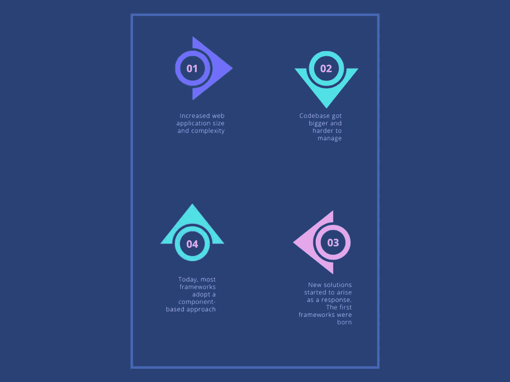
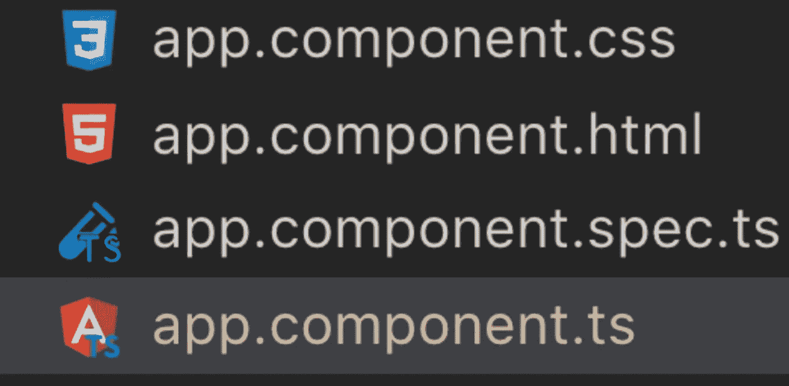
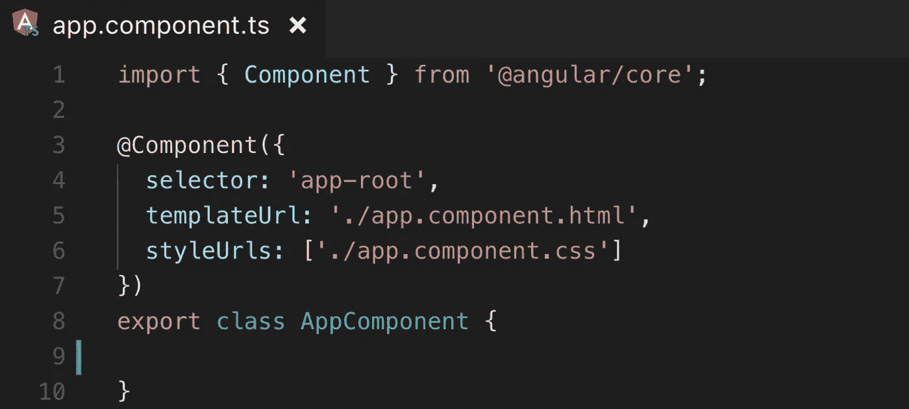
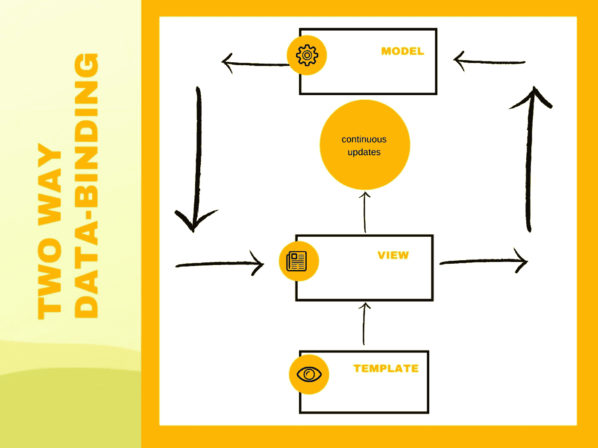
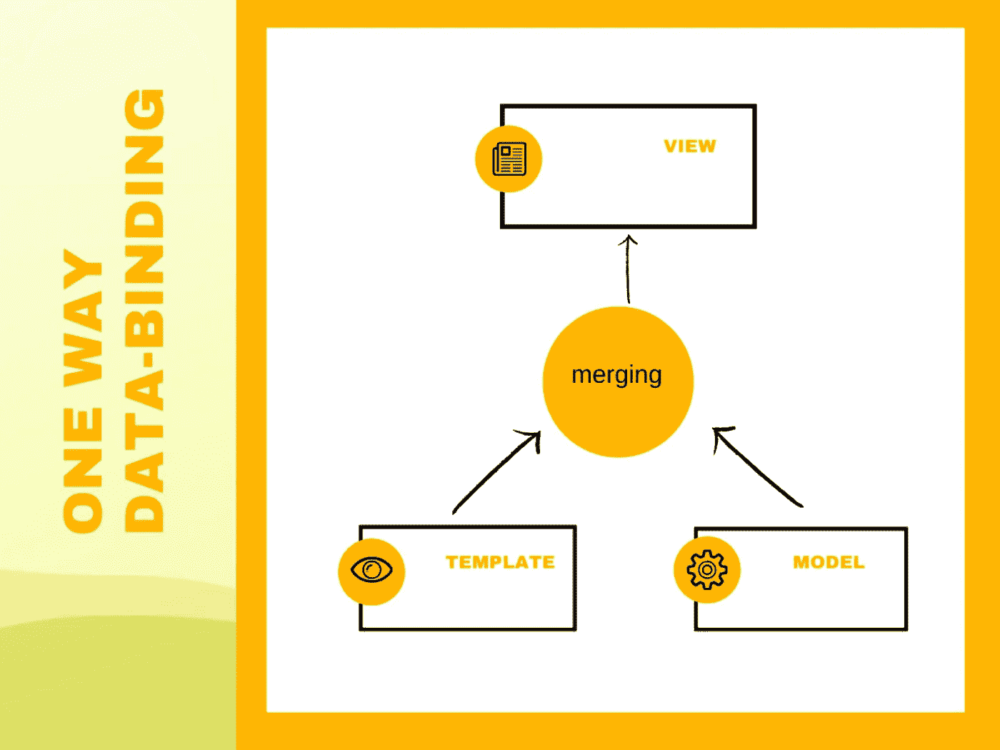

# Angular vs React:基于组件的战争

> 原文：<https://javascript.plainenglish.io/angular-vs-react-a-component-based-battle-f5245fa2f544?source=collection_archive---------5----------------------->

在现代的 web 开发世界中，我们可以看到这些年来，新的技术模式和趋势是如何出现的。互联网的使用越来越多，使得 web 应用程序比以往任何时候都更加复杂。开发人员的代码也是如此，它增加了规模、维护问题和测试难度。

**框架开始作为这个复杂问题的答案出现**，开发人员开始使用它们并享受它们。今天，我们可以发现一种使用这类工具的新模式:**web 组件的使用**。

# " web 组件已经成为现代 web 应用程序 UI 的最基本的元素."

特别是，我们可以看到基于组件的方法被应用在两个最流行的 JavaScript 框架中: **Angular 和 React。**这两个框架试图从它们那里获得最好的**可能的优势**，特别是，我们可以看到这种方法产生了以下好处。

*   **基于重用的**:一旦你定义了一个组件，你就可以在你的应用程序中重用它，减少开发时间和重复。
*   **更容易的测试**:这意味着，如果你的一个组件有问题，你只需要在一个地方修复它，然后它的其他实例就会随之而来。
*   **更好的维护**:与上面类似，一个地方进行修改和重用代码的可能性将使你的 web 应用程序更容易维护。
*   **使用第三方工作组件的能力**:立即开始在您的应用程序中使用其他人开发的经过测试的高质量组件。

本文展示了两种最现代的 JavaScript 框架如何实现基于组件的方法，以及它们之间的区别。让我们开始吧:

# #1 组件结构

我们要分析的第一个区别是最基本的一个:**这些组件在 Angular 和 React 中是如何构造的？**

# #1.2 角度

# “组件是 Angular app 最基本的 UI 构建块。Angular 应用程序包含一个角度组件树。”—棱角分明的官方文件

Angular 组件的第一个任务是显示一个页面和它的特定数据，**所有这些连同对指令、管道和字符串插值的支持**。第二个是管理视图和模型之间的数据绑定。一旦我们运行 **ng generate component** 命令来创建一个新的角度组件，我们可以看到下面的示例结构出现

有了这张图，我们可以识别出以下几个部分:

*   HTML 模板视图文件
*   组件逻辑的类型脚本文件
*   用于设置视图样式的 CSS 文件
*   用于测试的临时 **.spec.ts** 文件

所以每个角度组件通常都有自己的视图，描述它的外观。一个保存逻辑的 TypeScript 文件和一个使视图更酷的 CSS 文件。

通过看我们的**。ts** 文件，我们可以更深入地发现组件的内部工作

如您所见，组件只是一个简单的 JavaScript 类，带有一个叫做**装饰器的东西，在我们的例子中是****@ Component**。选择器部分是我们调用组件的方式。 **TemplateUrl** 指定 html 视图文件的位置，而**style URL**表示样式文件在我们项目中的位置。

# #1.3 做出反应

同样对于 React 来说，组件是组成我们 UI 的最基本的元素。然而，在这种情况下，**我们没有像 Angular** 中那样的文件分离，相反，我们将使用一个名为 **JSX 的 JavaScript 扩展(**查看下一节以了解更多关于它的细节**)。因此，我们将把组件的所有图形细节和逻辑放在一个地方。它的样式可以在同一个组件文件中定义，也可以从[外部文件](https://create-react-app.dev/docs/adding-a-css-modules-stylesheet/)中导入。**

还要注意，在 React 中，当创建一个新组件时，我们有不同的选项可供选择:**使用一个类或者一个无状态的功能组件**。

第一个类似于我们在 Angular 中看到的，只是一个 JavaScript 类，它扩展了 React.component，如下所示:

`**class** myComponent **extends** React.Component {`

`**render()** {`

`**return** **<h1>**I'm a component.**</h1>**;`

`}`

`}`

而第二个，即使名字很吓人，也只是一个返回 React 组件的函数。

`**function** sayHello(props) {`

`**return** **<h1>**Hello, {props.name}**</h1>**;`

`}`

使用无状态功能组件减少了处理类的开销，为我们提供了更简洁的源代码，但是最重要的是，它不允许我们处理组件的状态。

# #2 JSX vs HTML

如前所述，Angular 和 React 组件之间的一个巨大差异是您定义它们的外观的方式。对于 Angular，您将拥有一个经典的 HTML 文件+特定于框架的指令，如 **ng-if** 或 **ng-repeat** 。而在 React 中，**您将在组件定义**中拥有您的逻辑和视图定义。

这个操作的结果是使用 **JSX** 实现的，它是 JavaScript 语言的一个扩展，允许你像这样定义你的代码:

`// a mixture of HTML and JavaScript`

`const displayStudents = (`

`<ul>`

`{students.map(name => <li>{name}</li> )}`

`</ul>`

`);`

后一种方法的优点是你可以在一个地方定义所有的东西，一旦你知道了 HTML 和 JavaScript，你就不必像在 Angular 中那样处理框架细节视图指令。

# #3 JavaScript 与 TypeScript

React 使用 JavaScript，而如果你想开始使用 Angular，你将不得不使用 TypeScript。**在第一种情况下，许多开发人员已经知道了 Javascript，所以这可以被认为是一种职业，加上你在使用它编写代码时的自由**。TypeScript 是 JavaScript 的超集，它允许你利用它对静态类型、类和接口的支持(其中一些特性现在是 ES6 最新标准的一部分)。

使用 JavaScript 的优势包括:

*   它背后有一个庞大的开发者社区，使它成为一种流行的语言
*   支持本机浏览器
*   极度的灵活性

`let decimal = 10; // variable definition`

`// function definition`

`function add(a, b) {`

`return a + b;`

`}`

使用 TypeScript 的优点包括:

*   静态打字
*   更大项目的更好选择
*   更好的开发体验和测试变得更加容易

`let decimal : number = 10; // typed variable definition`

`// typed function definition`

`function add(a : number, b : number) {`

`return a + b;`

`}`

# #4 常规 DOM 与虚拟 DOM

虽然 Angular 组件通过与我们习惯使用的常规 DOM 交互来工作，但 React 决定在这方面进行彻底的改变。事实上，当使用这个框架时，您将使用被称为:**虚拟 DOM 的东西。**虚拟 DOM 将查看以前的 HTML 相对于当前 HTML 的变化，**它将确保只更新必要的部分。**

这就是 React 如此快速的原因，也是在处理数百个数据请求时给您带来巨大优势的原因。

# #5 数据绑定

在创建组件时，Angular 和 React 之间的另一个大区别是**它们如何管理数据绑定**。在 Angular 中，我们定义了双向数据绑定。这意味着对 UI 元素的每一次更改都会反映到模型中，对模型本身的每一次修改都会反映到我们的 UI 中。

而在 React 中工作时，我们只有**单向数据绑定**。这意味着对状态的每一个改变都会反映到视图中。然而，**改变 UI 并不会更新状态。**

# #6 国家管理

状态管理对这两个框架都非常重要。如上所述，Angular 附带了捆绑在中的**数据绑定，而 React 为处理这项任务提供了**不同的方法**。每个组件都可以有自己的状态，用它们你可以创建有状态的组件来保存应用程序的一部分的状态记忆。**

当涉及到状态管理问题时，第三方库也变得流行起来。 [Redux](http://redux.js.org/) 就是其中之一。这个库背后的主要思想是**将应用程序的整个状态保存在一个单独的对象**中，这个对象可以通过与称为**reducer 的组件分开实现的纯函数来改变。**

Redux 可以与 Angular 和 React 一起使用，当开发人员的产品足够大时，它可能会变得特别有用。

# 结论

就这样，希望这篇文章给你提供了理解基于组件开发的重要性和优点以及 Angular 和 React 如何实现它们的工具。