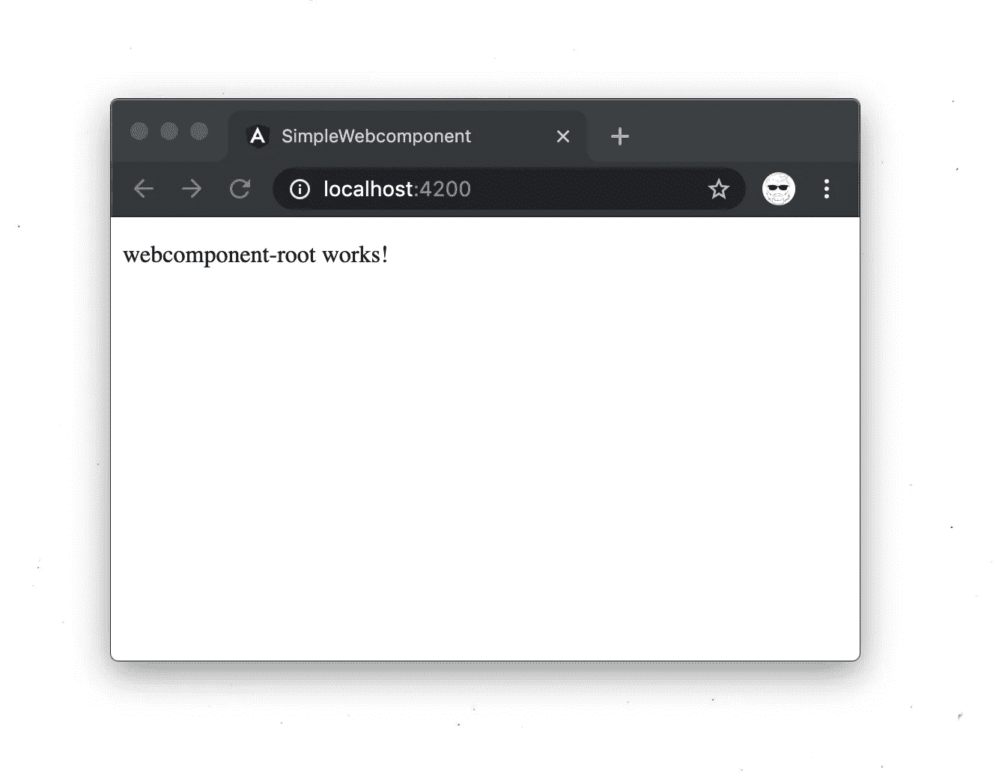
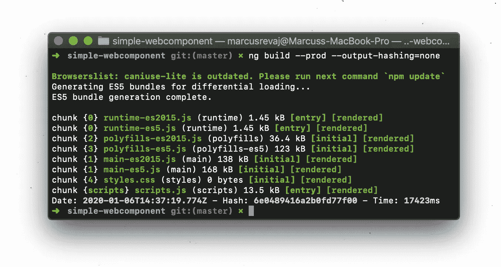
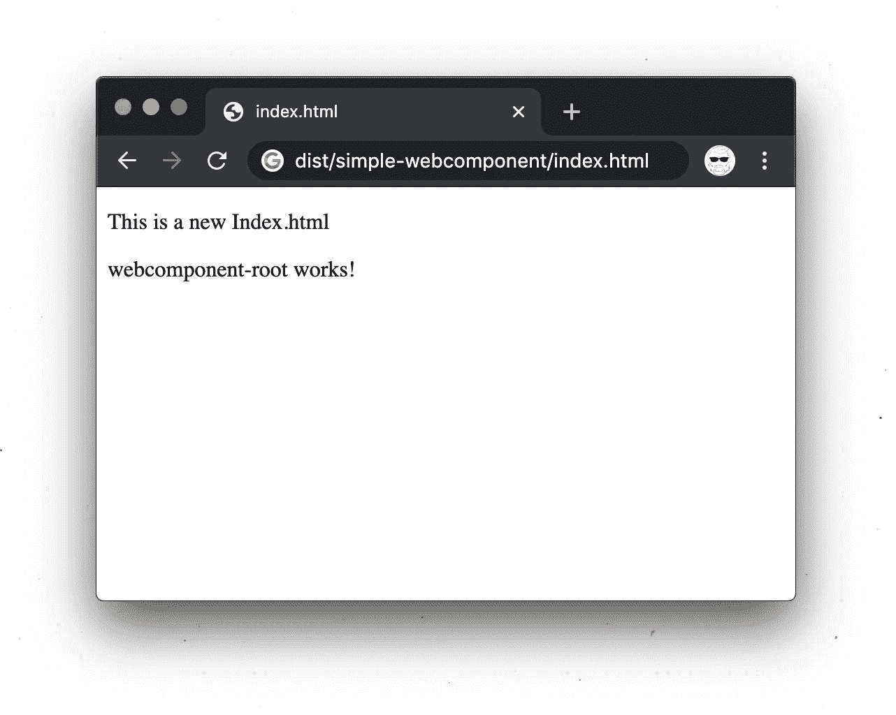
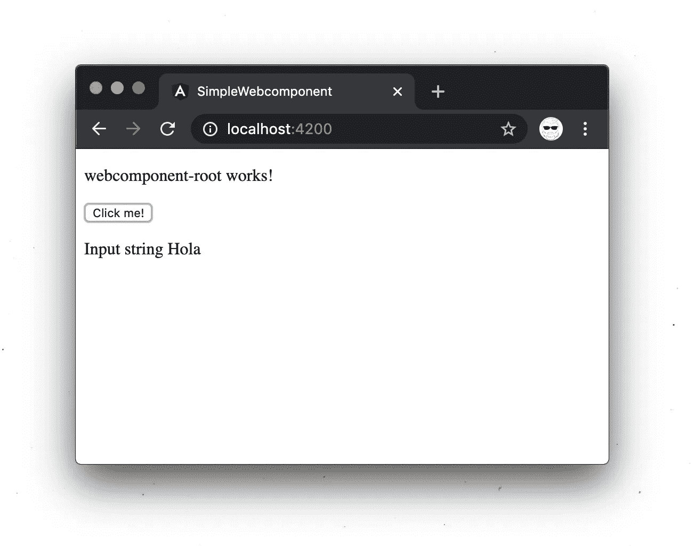
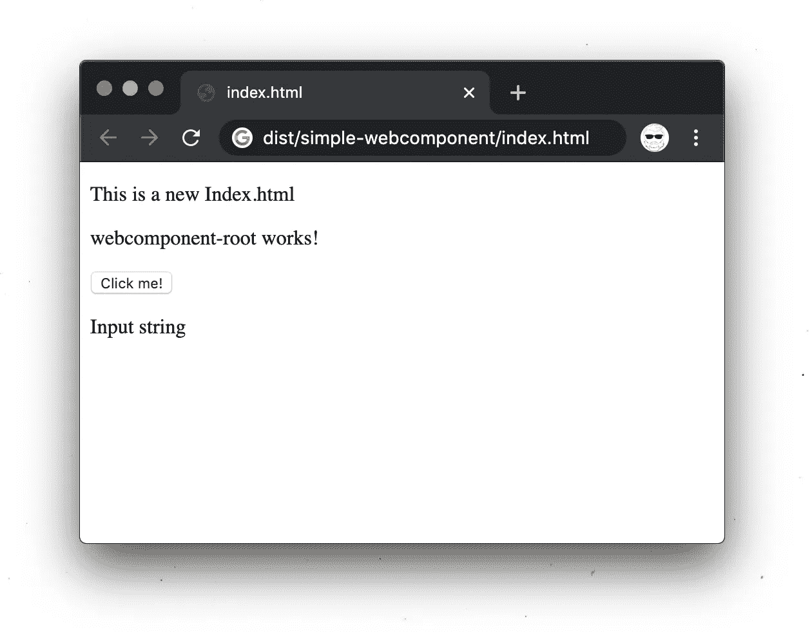

# 有角度的 web 组件？那些是什么？

> 原文：<https://javascript.plainenglish.io/angular-web-components-what-are-those-80da596932e2?source=collection_archive---------2----------------------->

Photo by [Free To Use Sounds](https://unsplash.com/@freetousesoundscom?utm_source=unsplash&utm_medium=referral&utm_content=creditCopyText) on [Unsplash](https://unsplash.com/s/photos/small-boxes?utm_source=unsplash&utm_medium=referral&utm_content=creditCopyText)

自从 web 组件被引入以来已经有一段时间了，但是我们中的许多人甚至还没有听说过它们(或者甚至没有尝试过它们)。

不要被标题误导了，它们不是只在**角**建造的。你可以继续在**React/Vue/Polymer/Stencil**甚至 **vanilla JS** 和 good old **HTML** 中构建它们。

Angular 给你的唯一东西是我们 Angular 开发者喜欢的伟大的工具(尽管其他人可能不同意)。

但是撇开实现不谈，让我们先来谈谈什么是 web 组件以及我们如何使用它们。

接下来让我们深入了解一下 **Angular** 中的实用指南。

> **Web 组件**被 [Mozilla 文档](https://developer.mozilla.org/en-US/docs/Web/Web_Components)定义为可重用的定制元素，具有**封装的**功能。

这意味着，你可以创建自己的定制 **HTML** 元素(比如`<my-first-custom-element>`)，在**限定的**范围内执行逻辑。

这基本上意味着您需要与元素建立一个通信通道，否则您将无法发送/接收数据。

已经为您设置了发送。所需要的只是 **HTML** 属性值，比如`<my-first-custom-element input=”red”>`

但是要接收数据，您需要添加**事件监听器**，它将连接到您的元素并监听确切的**事件发射**。

这可能会带来很多痛苦，因为你需要处理父结构中的所有事件，而且随着页面中 **web 组件**数量的增加，这可能会变得混乱，除非应用某些**模式和实践**。

总之 **web 组件**所允许的，是一个清晰的逻辑分离，通过将你实际的**单片**前端分割成多个独立的部分。

如果你正在从事任何尖端技术，你可能不会直接看到好处，但是一旦你面对一个**旧的遗留单片应用**，它有一个 **web 服务器**，它也作为前端提供者。

# 不，不，不…当然不是你想象中的前台。

当我说前端时，我不是指作为静态资产提供的 **SPA** 。
我指的是纯粹的 **HTML** 和 **JavaScript** 页面，它们是从一个模板在服务器端生成的，比如 **jsp** 、 **ejs** 、 **php** 或任何其他。

如果你发现自己处在一个不能废弃整个应用程序并重新开始的地方，那么用 **web 组件**慢慢扼杀**应用程序可能是解决这种情况的方法。**

> TLDR；你可以在这里查看 angular web 组件示例[。](https://github.com/marrej/angular-webcomponents)

# 让我们从构建一个简单的 web 组件开始

与任何其他 angular 项目一样，我们从`ng new simple-webcomponent`开始，创建我们的起始项目。

为了回答我们的 **Angular CLI** builder，

**否**以角度路由、

**SCSS** 为样式表格式。

就让 **Angular CLI** 施展它的魔法吧。:D

在我们进一步讨论之前，我们先来谈谈 **Angular** 中 **web 组件**的架构。

您可能习惯于将 **AppComponent** 作为您的应用程序的根(当然，如果您习惯于 angular ),但是为了能够在开发中测试 web 组件并在编译时让它完美运行，我们需要在它下面的一个级别上创建一个 web 组件根。

您所需要做的就是，导航到您的 **AppComponent、**所在的目录，并使用`ng g c webcomponent-root`创建一个 webcomponent-root

要查看我们工作的结果，清理整个 root.component.ts 并添加`<app-webcomponent-root></app-webcomponent-root>`标签(或者您定义的选择器，如果您编辑了**web component-root . component . ts**选择器属性)。

看起来棒极了！

但是，不要抱太大希望，因为我们仍然只是在角度试验场。我们需要更新我们的 **app.module.ts** 中的一些东西，以便能够构建我们的 webcomponent。

让我们快速浏览一下 **app.module.ts** 看看我们现在有什么。

如你所见，我们正在**引导**我们的 **AppModule** 中的 **AppComponent** 。

我们想要做的，是定义我们的自定义元素( **WebcomponentRoot** )，将它用作**入口组件**，然后**引导**我们的应用程序。

尽管这在 **@NgModule** 装饰器中无法实现，所以我们将在装饰器和 **AppModule** 的实例之间分割它。

在我们做这些之前，我们还需要安装`@angular/elements` 包，它允许我们定义自定义元素。

所以请运行`ng add @angular/elements`。

让我们看看我们将在 **app.module.ts** 中引入的更改。

你所需要做的，就是复制现有的 **NgModule** decorator，换出入口组件的引导程序，并添加 **APP_BASE_HREF** 作为提供者(如果你问为什么它是必要的，它会向你显示你的资产应该是服务器的 **URL** )。

然后只需在 **AppModule** 的构造函数中添加自定义元素，定义自定义元素(同时选择其名称)，并引导应用程序(因为我们确实从 **@NgModule** 中抛出了 bootstrap 子句)。

现在，我们和一个正常工作的 web 组件之间唯一的障碍是…

# **建造它**

运行`ng build –prod –output-hashing=none`命令( **output-hashing none** 非常方便，如果你想以编程方式使用文件名，否则会在文件名中创建散列)。

我还建议将脚本放入您的 **package.json** 中，以方便您的工作。

正如您所看到的，构建创建了一些文件，我们需要压缩这些文件以减轻 web 组件的加载: )

我们可以利用 **bash** 的能力将文件压缩在一起

`cat dist/simple-webcomponent/runtime-es2015.js dist/simple-webcomponent/polyfills-es2015.js dist/simple-webcomponent/scripts.js dist/simple-webcomponent/main-es2015.js > dist/simple-webcomponent/component.js`

现在，您应该在应用程序工作区的**dist/simple-web component**文件夹中看到一个 **component.js** 文件。

我们只需抓取 **component.js** 文件，并在您喜欢的任何位置创建一个新的**index.html**(您也可以只重写 **dist** 文件夹中的**index.html**，因为它不会被用于任何东西，但它会在下一次构建时被清除，所以我不建议这样做)。

这就是你现在应该看到的。

好极了。所以我们刚刚创建了有史以来最简单的 web 组件！

这很好，但是在现实世界中，我们的 **web 组件**将是一个大的**前端**的一部分。因此，我们需要我们的 webcomponent 以特定的方式运行，传入数据，并能够接收外部响应。

**我们如何实现这一目标？**

我们利用**@输入**&**@输出**，将数据传入&输出。

因此，首先让我们注释 Webcomponent 设置部分(带有**entry component**“web component root”)并取消注释测试设置部分(因为我们希望看到更改:)。

然后打开我们的 **webcomponent-root** (或者你的 **webcomponent** 的 base)。

如您所见，我们已经将 **@Input** 与将传递给我们的组件(' text ')的值关联起来，并将 **@Output** 与我们的 **EventEmitter** ('notify ')关联起来，因此我们可以开始监听我们从父组件中的 **EventEmitter** (使用 **notifyUsers( )** )发出的值。

为了实际上能够看到变化，比如输入值，或者能够触发事件发射器，让我们更新 **HTML** 文件。

好的，很好，现在我们只需要更新保存对我们的 **web 组件**的引用的文件。当我们在 Angular 环境中测试时，对 **web 组件**的引用可以在**app.component.html**中找到。

我们需要更新这个文件来测试我们的 **webcomponent** 的输入和输出。

如您所见，输入是一个单词 Hola，它将显示在屏幕上，我们已经将 notify 事件绑定到 **userNotification( )** 函数，该函数只输出**发出的值**。

但是不要忘记，我们需要添加一个函数，一旦事件在 **app.component.ts** 中发生，这个函数就会被调用。

单击该按钮后，您应该会在开发人员工具中看到一个控制台日志。

太好了！我们已经让它在我们的测试环境中运行了，但是让我们看看如何用普通的 **JavaScript** 将它连接到一个普通的 **HTML** 文件中。

注释掉 **app.module.ts** 中的 testing setup 部分，并取消注释 Webcomponent setup 部分(即带有入口组件“ **webcomponent root** ”的部分)。当然，构建它并通过压缩结果创建新的 **component.js** 。

您可以像上次一样使用相同的**index.html**，让我们通过只更新 **component.js** 文件来观察会发生什么。(不要忘记，如果你像我一样懒惰，在 **dist** 之外创建 index.html，它也会被构建删除，所以你需要再次复制代码)

如您所见，因为我们没有添加输入文本，所以在**输入字符串**之后没有显示任何内容。因为我们也没有连接 notify 事件，所以我们没有从按钮上的点击获得日志。

为了连接我们的输出，我们需要使用一个 **querySelector** 找到我们的 webcomponent，然后监听一个选定类型的事件(我们的是 **notify** )。

幸运的是，输入的工作方式和以前一样(我们只需要在`<web-component>`的文本属性中传递值“Hola”)。

在更新的文件中签出它。

现在我们有了一个正常工作的 web 组件，它可以接收数据，也可以根据需要发送数据。

这在实际应用中也可以用来传输数据，比如你可能需要从你的父应用程序传递的 **JWT** 令牌(或者不取决于保密程度，或者你的 **JWT** 需要的保护)。请谨慎使用，因为它将在页面的 **HTML** 中可见。

我们已经在 **Angular** 中介绍了 **web 组件**的基础知识，我们将在下一部分继续路由。

希望你喜欢这篇文章，我将期待你的下一篇文章。

祝你今天休息愉快！

马库斯