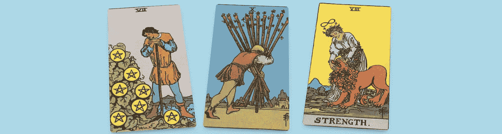

# 使用 JavaScript 🃏动画 3 卡塔罗牌阅读

> 原文：<https://javascript.plainenglish.io/animate-a-3-card-tarot-reading-using-javascript-e40c1f3635e9?source=collection_archive---------3----------------------->

## 使用 React.js 和 react-spring 创建的可轻弹手势动画为这张 3 张塔罗牌提供了动力🔮

> 根据[占星术的答案](https://astrologyanswers.com/tarot/3-card-spread/)，塔罗牌中的[“过去—现在—未来”](https://astrologyanswers.com/tarot/3-card-spread/)读数使用了三张牌读数

# 轻轻弹开所有三张卡，它们就复位了

这 3 张塔罗牌是我的[塔罗牌动画文章](https://medium.com/@derek_develops/how-to-make-a-tarot-card-deck-in-react-with-gestures-76ab4ec8933c)的后续。

为了更好地理解 react-spring 作为一个库，让我们来探讨一下这 3 张卡片的阅读和整个卡片组之间的主要区别。

# 新功能的实现

## 特点 1。从这副牌中只选择 3 张牌

这是一个简单的改变——我在洗牌的函数中将第 33 行的“return array”改为“return array.splice(0，3)”。

## 特点二。增加 y 运动，而不仅仅是 x 运动

R eact-spring 可轻松实现 x 轴运动、x 轴运动和 y 轴运动。我将第 41 行的 useGesture 调用从“delta:[xdeta]”更改为“delta:[xdeta，yDelta]”，并将“direction: [xDir]”更改为 direction: [xDir，yDir]。“我还添加了第 49 行，以便卡片可以垂直弹出。

## 特点三。以响应的方式将 3 张卡片分隔成一个读数

第 62 行控制定位，所以我用窗口大小对其进行了调整:“$ { x+(window . inner width/5)* I-window . inner width/5 } px，${y}px，0)`)”。

## 特点 4。用 z-index 将活动卡提升到其他卡之上

Z-索引是这里的关键。我在第 19 行的 from 帮助器中添加了“zIndex: '0 '”。然后我加了“const zIndex = down？1 : 0”到第 52 行。最后，我在第 63 行将 zIndex 作为动画 div 样式的一部分进行了传递。

Photo by [Kayla Maurais](https://unsplash.com/@kaylamaurais?utm_source=medium&utm_medium=referral) on [Unsplash](https://unsplash.com?utm_source=medium&utm_medium=referral)

[德里克·奥斯汀博士](https://www.linkedin.com/in/derek-austin/)是《职业规划:如何在 6 个月内成为一名成功的 6 位数程序员 一书的作者，该书现已在亚马逊上架。