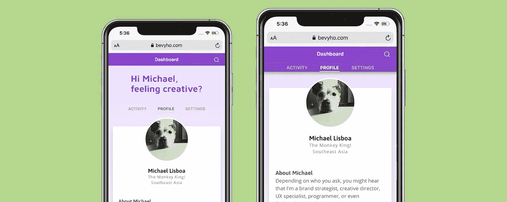

# 动画标签导航和反应弹簧更好的体验。

> 原文：<https://javascript.plainenglish.io/animate-a-better-pwa-experience-with-react-spring-e8fbe76d2160?source=collection_archive---------3----------------------->

## 如果你给你的观众一个充满爱的 UX 代码体验，他们会喜欢你的。



Tabs are great UX, but they shouldn’t get in the way of your content.

## “我们如何在不到 2 秒的时间内，在小小的手机屏幕上传达我们的重大创意信息*和*转化销售？”

> 各地营销人员的悲叹声。

品牌需要解决他们以前从未处理过的问题。诸如屏幕分辨率、易读性、用户体验、手势、点击、滑动等挑战…


This is what we’re going to make. Simple, right?

更重要的是，访问者花了太多的时间关闭弹出窗口，滚动，屏蔽，没有足够的时间看你的内容。内容*在付费广告中承诺*。

## 在移动设备上，你的网站应该像一个本地应用程序。

我们的目标是在人们的世界中接触和激发他们——而不是强迫他们适应我们的世界。

在这个 UX 的`片段中，我们将从大的技术画面中截取一小部分，并通过轻扫添加许多味道。我们将制作一个动画标签模型，以引人注目和直观的方式传递您的精彩内容。`

`[](https://vimeo.com/385078814) [## 观看视频

### 使用反作用弹簧制作可折叠标签的动画。

vimeo.com](https://vimeo.com/385078814) 

请随意将其余内容转发给您的开发团队合作伙伴。` 

# `开始编码吧。`

## `首先，让我们安装一些东西。`

`我假设您已经设置了 [React 开发环境](https://reactjs.org/docs/getting-started.html)，所以我将跳过这一部分*。*`

`我试过几个 React 动画包，胜出的是 react-spring。它易于使用，有很好的文档记录，有很多示例代码，并且有一个非常活跃的社区。在此获取信息和样品代码[。](https://www.react-spring.io/)`

`此外，由于我们的目标是触摸屏设备，我们需要安装*反应-使用-手势*包。在此获取信息和样品代码[。](https://www.npmjs.com/package/react-use-gesture)`

`用`npm install react-spring react-use-gesture`安装两者。`

## `一个小小的旁注…`

`本文不是创建选项卡 UI 组件的教程。相反，当你的观众被你的内容吸引时，我们会把注意力放在移动标签上。`

`在我的例子中，我选择定制 [UIKit](https://getuikit.com/docs/tab) tabs 模块。然而，[有](https://codesandbox.io/s/ojlvn780r6)有[有](https://alligator.io/react/tabs-component/)有[吨](https://medium.com/@diegocasmo/a-simple-react-tabs-component-47cac2cfbb5)的 React tab 例子摆在那里，所以你应该用你喜欢的，感觉最舒服的，真的没关系。`

## `“选项卡”组件。`

`我们将创建选项卡作为可重用的组件，可以导入到任何组件或应用程序中。让我们首先创建一个名为`Tabs.js`的新文件。`

`你看到我做了什么吗？我们使用 React 挂钩在展开/折叠位置之间切换组件。我们还从 react-spring 导入了`useSpring`钩子和`animated`来生成我们的动画，以及`useGesture`来触发触摸事件。但是，稍后会详细介绍。`

``tabLabels`参数是一个标签列表，将显示为单独的选项卡。例如，你可以做到`

```
["Sign Up", "Pricing", "Contact Us"]
```

``children`参数让我们将标签内容包含在组件中，而`...props`用于将其他内容传递给组件，如`className`或任何我们感兴趣的内容。`

`接下来，我们设置`useState(true)`来初始化扩展状态。也就是说，当有人登陆网页时，标题内容和标签会展开，显示大标题，以及我们的标签导航。`

`目前，我们只有选项卡容器和标题。如果我们运行这段代码，除了标题之外，我们不会看到其他任何东西。所以让我们添加标签按钮！`

`这里发生了很多事情，所以让我们从头到尾看一遍。`

`在标题之后，我们为选项卡按钮添加了一个新的`div`,并将其包含在类名中:`

```
${tabsExpanded ? "tabs-default" : "tabs-collapsed"}
```

`那叫做[三元运算符](https://developer.mozilla.org/en-US/docs/Web/JavaScript/Reference/Operators/Conditional_Operator)，它在说，`

*   `如果`tabsExpanded`为*真，*则添加 CSS 类`"tabs-default"``
*   `要不然，类就是`"tabs-collapsed"`。`

`但是，`tabsExpanded`从何而来？还记得吗，在上面我们添加了`useState(true)`变量，将`tabsExpanded`设置为 *true* ？是的，在那里。`

`我想你明白我们的目的了。我们将使用`useState`和`setTabsExpanded`变量来切换标签的位置！`

`我们在这段代码中添加的最后一个东西是`tabLabels.map()`，它遍历一个`tabLabels`数组，创建选项卡按钮。所以，这里有一个关于我们为什么这样做的小解释…`

> `我们希望我们的标签组件可以在任何地方导入！`

`这意味着，我们应该能够传递一个变量来通知我们的标签，当有人点击它们时，它们应该加载什么内容。否则，我们将不得不在每一个使用标签的页面中复制&粘贴代码。那是一件可怕的事情。`

`因此，相反，我们将变得非常聪明，只需传递一堆标签，这样我们就可以用它们作为 id 来加载我们想要的每个标签的内容。明白了吗？明白了吗？很好！`

`下面是我们迄今为止所取得成就的快速回顾:`

1.  `我们已经创建了一个可重用的选项卡组件。`
2.  `在选项卡组件中，我们使用`useState`来初始化选项卡的默认扩展视图。`
3.  `并且，我们使用`.map()`遍历一组标签来创建标签按钮，并识别当有人点击按钮时我们想要加载的内容。`

`哇，这么少的代码取得了很大的进步。`

## `设置触摸手势。`

`既然我们已经显示了选项卡，我们需要让它与触摸屏手势一起工作。也就是说，我们希望我们的选项卡容器在用户向上滑动时折叠，向下滑动时展开。我们可以用`useGesture`这样做，就像这样:`

`好吧，这 7 行代码有点复杂，所以让我们一行一行地读一遍:`

```
onDrag: ({ down, direction: [, y], delta: [yDelta] }) => {
```

`附加一个`onDrag`事件来捕获滑动手势，并添加内置参数`down`、`direction`和`delta`。由于我们只关心*向上*和*向下*刷卡，所以我们只想要`y-axis`方向和`yDelta`。`

```
const trigger = Math.abs(yDelta) >= 1;
```

`设置一个`trigger`变量来触发动画。代码在说，“如果`yDelta`的绝对值大于等于 1，那么`trigger`的值就是*真*”。`

```
const dir = y > 0 ? -1 : 1;
```

`设置方向变量，`dir`。这个三元运算符说，“如果用户在屏幕上向下滑动(`y > 0`)，那么`dir`等于-1，否则，`dir`等于 1，向上滑动”。是的，这有点不直观，但你知道，无论如何。`

`这是使这一切工作的一行:`

```
if (!down && trigger) dir < 0 ? setTabsExpanded(true) : setTabsExpanded(false);
```

`这段代码在说，`

*   `“如果手势不是简单的点击(`!down`)并且`trigger`为*真*(滑动超过我们定义的`yDelta`)，`
*   `“然后检查`dir`是否是*向下滑动* ( `dir < 0`)。`
*   `如果滑动方向是*向下*，则将选项卡容器设置为展开状态`setTabsExpanded(true)`，`
*   `"或者将选项卡容器设置为折叠:`setTabsExpanded(false)`"`

`哇，我刚刚读了几遍，笑了。希望这对你来说够清楚了。如果没有，请告诉我！`

## `让我们动起来吧。`

`到目前为止，我们还没有添加任何酷的动画效果，我们的标签页还是有点无聊。好消息是 react-spring 让这个*变得非常*简单。让我们添加我们的动画代码，用`useSpring`，像这样:`

`这应该是不言自明的，但这里有一个小的演练:`

`我们使用`useSpring`钩子来设置一系列 CSS 样式，这些样式根据我们的`tabsExpanded`变量是真还是假来切换。`

`比如，你看到那条线`marginTop: tabsExpanded ? 0 : -60`了吗？那是使我们的标签上下移动的线。代码在说，`

*   `“如果`tabsExpanded`为*真*，那么组件的顶部位置为 0px(展开)，`
*   `"否则最高位置是-60px . "`

`另外，看看那行写着，`fontSize: tabsExpanded ? "1em": "0em"`。这就是让我们的标题文字由大变小的原因。`

`您可以添加更多想要制作动画的样式。在我的例子中，我想要的其他动画是字体颜色和改变选项卡容器的背景颜色。`

`这就是所需要的，react-spring 会完成剩下的工作！(react-spring…好牛逼)`

## `将我们的动画功能附加到标签上。`

`我们快到了！首先，快速回顾一下我们到目前为止所取得的成就:`

1.  `我们已经创建了一个可重用的选项卡组件。`
2.  `我们设置代码来监视向上/向下滑动手势。`
3.  `当用户滑动时，我们设置我们想要的动画样式。`

`现在，我们只需要通过将手势事件和动画附加到选项卡上来将它们连接在一起。我们将通过更新我们的`return()`语句中的标记来做到这一点。`

`我们正在做几件事。首先，我们正在更新`div` s，用`<animated.div />`将它们标记为“可动画”。这样做，我们只是让 react-spring 知道那些才是它应该注意的`divs`。`

``

`An animated Tab component that can be reused anywhere.`

`更有趣的是，您会看到我们已经将`{...bind()}`添加到了父/容器`div`中。这就是我们附加上面创建的`bind`函数的地方，带有`onDrag`事件和`useGesture`钩子。这设置了我们的容器`div`来观察用户何时上下滑动来触发动画。`

`再往下一点，我们将`style={tabStyle}`添加到选项卡容器中，引用我们上面制作的`tabStyle`函数，执行我们希望在用户上下滑动时触发的动画。`

## `这是所有的代码。`

`仅仅 64 行代码就要写很多东西！现在，您最终的选项卡组件可能是这样的:`

## `让它工作的 CSS`

`我用的 CSS 是主观的。就我而言，我对这个应用程序有非常具体的 UX 和交互需求。`

`关键的一点是，当用户向上滑动时,“. tab-container”会向上移动(折叠),当用户向下滑动时，它会向下移动。我选择了一个粗糙的 flexbox 解决方案，但是里程数可能会根据你的 UI 需求而变化。`

`现在，如果你在触摸设备上运行代码，你应该能够上下滑动，并愉快地观看你的标签动画。`

``

`Swipey goodness!`

## `这些都很好，但是更大的设备和桌面浏览器呢？`

`显然，当有人从更大的设备(如平板电脑或桌面浏览器)访问我们的 PWA 时，我们不需要或不希望我们的选项卡折叠。相反，我们希望页面像其他网站一样直观地滚动，这样我们的用户就能得到预期的行为。对我们来说，有一个非常简单的解决方案:`

`现在，在更大的设备和桌面浏览器上，你的网站会像用户期望的那样滚动。完美！`

``

`Delivering the expected, and intuitive, scrolling experience for desktop.`

## `如何在你的应用中使用它`

`现在我们有了一个可重复使用的标签组件——以及手势跟踪和酷动画——我们可以随时将它放入任何*组件或应用程序中！*`

# `打烊了，谢谢，`

`一直读到这一页的底部。我希望你在制作一个非常酷的 React 组件的 UX/编码中得到乐趣！`

`我很想听听你的问题、启示和侮辱，所以请随意联系。`

## `还有，获取 GitHub 上的代码。`

`[](https://github.com/MichaelLisboa/react-spring-animation-tab-ui) [## Michael Lisboa/react-spring-animation-tab-ui

### 一个简单，酷，基于触摸/手势的动画标签使用反应弹簧

github.com](https://github.com/MichaelLisboa/react-spring-animation-tab-ui)`