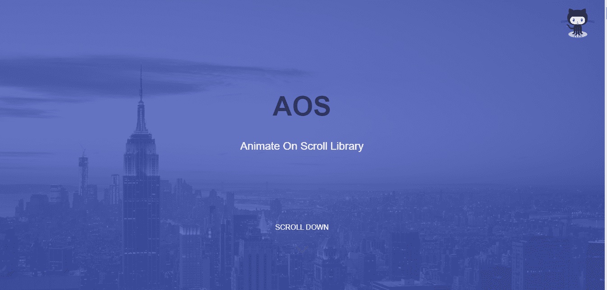

# 只需一行代码就能让滚动内容生动起来

> 原文：<https://javascript.plainenglish.io/animate-content-on-scroll-with-just-one-line-of-code-9222af203aff?source=collection_archive---------7----------------------->

## 使用令人惊叹的 AOS 图书馆



[AOS library demo](https://michalsnik.github.io/aos/). Source: Author.

作为开发人员，我们花了大量的时间试图让我们的网站变得漂亮。

然而，让我们的网站*感觉*漂亮是很复杂的。

这就是动画发挥作用的地方。

使用动画，你可以让你的网站充满活力，并决定内容的流向。

值得庆幸的是，有一些很棒的库可以让我们轻松地制作网站动画。

一个这样的图书馆是 AOS 图书馆，我已经用了几个月了。

在我开始讨论如何用这个库添加令人惊奇的动画之前，我们必须首先列出使用动画的好处。

1.  **流畅性**:通过适当的弹出和淡入淡出动画，你可以增加网站对用户输入的反应和显示数据的流畅性。
2.  如果讲故事或展示幻灯片是你网站的目标之一，那么动画是必须的。
3.  当你的网站的内容逐渐加载而不是突然出现时，它给人的印象是这个网站是精致和专业的。
4.  **上下文:**在长网站中，动画可以很好地用来给用户提供上下文，让他们知道还没有到达页面，下面还有更多内容。

现在我们已经概述了动画的一些用途，我们可以开始了。

## 装置

启动并运行 AOS 图书馆非常简单。

您可以使用软件包管理器(如 NPM)通过运行以下命令来安装该库:

```
npm install --save aos@next
```

然后，我们需要将库和 CSS 导入到脚本文件中。

```
import AOS from 'aos';
import 'aos/dist/aos.css';
```

然而，我将使用另一种方法，这需要我们修改我们的索引 HTML 文件，如下所示。

我们需要在索引 HTML 文件中添加样式表，方法是在`<head></head>`标记之间添加下面一行:

```
<link rel="stylesheet" href="https://unpkg.com/aos@next/dist/aos.css" />
```

我们还需要添加一个 JavaScript 文件。为此，将下面一行粘贴到结束的`</body>`标签的末尾。

```
<script src="https://unpkg.com/aos@next/dist/aos.js"></script>
```

就是这样！您已经成功安装了 AOS 图书馆。

## 初始化

现在我们已经有了 AOS 库的设置，我们需要首先初始化它。

您可以在您的 JavaScript 文件以及 HTML 文件中使用下面的代码行在`<script></script>`标签之间这样做:

```
AOS.init();
```

初始化是一行，但是，你也可以传递可选的设置对象，这将允许你设置油门延迟，动画频率，偏移，持续时间，等等。

你可以在这里找到更多关于那个[的信息。](https://github.com/michalsnik/aos#1-initialize-aos)

## 添加动画

现在最精彩的部分来了。

AOS 图书馆大大简化了添加滚动动画。

我们只需要用适当的 `**data-aos**` **属性**包装我们想要制作动画的内容。****

```
<div data-aos="fade-in">...
...Content to be animated...
....</div>
```


Fade in Animation on loop. Source: author.

我们甚至可以通过使用`data-aos-*`属性来调整动画以适应我们的需求。

我发现自己调整的一些常见属性是动画的持续时间和轻松程度。

为了定制持续时间，我们可以为`data-aos-duration`属性提供以毫秒为单位的时间，如下所示:

```
<div data-aos="fade-in" data-aos-duration="8000">
</div>
```

调整的完整列表如下所示:

```
<div
    data-aos="fade-up"
    data-aos-offset="200"
    data-aos-delay="50"
    data-aos-duration="1000"
    data-aos-easing="ease-in-out"
    data-aos-mirror="true"
    data-aos-once="false"
    data-aos-anchor-placement="top-center"
>
</div>
```

但是你怎么知道支持的动画列表呢？

**可在** **处** [**找到支持动画的完整列表以及锚点放置和缓动功能。**](https://github.com/michalsnik/aos#animations)

## 自定义动画

尽管本库为我们提供了一套全面的动画，但它知道有时我们需要自定义动画，因此给了我们添加动画的能力。

我们需要在 CSS 文件中使用`[data-aos=”new-animation”]`。这里“新动画”是我们自定义动画的名称。

*您可以随意设置名称，但要确保它不与* [*内置的名称相匹配。*](https://github.com/michalsnik/aos#animations)

您可以通过以下方式制作自定义动画:

```
[data-aos="new-animation"] {
  opacity: 0;
  transition-property: transform, opacity;

  &.aos-animate {
    opacity: 1;
  }

}
```

正如你所看到的，CSS 动画的标准关键帧的原则在这里适用。

然而，我们用`&.aos-animate`代替`to`。

为了使比较更简单，这里有一个标准的普通 CSS 动画示例。

```
@keyframes example {
  from {
    opacity: 0;
  }
  to {
    opacity:1;
  }
}
```

现在要使用这个“新动画”,我们可以像使用任何其他内置的 AOS 图书馆动画一样简单地使用它。

```
<div data-aos="new-animation"></div>
```

使用`data-aos-*`属性可以像其他内置动画一样设置其他属性，如持续时间。

这大大简化了添加和定制动画。

## 结论

构建网站和应用程序每天都变得越来越复杂，像这样的库消除了不知疲倦地工作以完善这些动画的负担。

AOS 库甚至可以使用框架和普通的 JavaScript。此外，一旦安装，使用它非常简单。

尽管这个库很简单，但我们有很多选项来真正定制动画，以满足我们的网站需求。

使用这样的库可以帮助你专注于最重要的事情。

这样的库对于开发人员来说是一个福音，他们有一个很紧的期限，并且想要开发出不仅看起来漂亮而且感觉一样的网站。