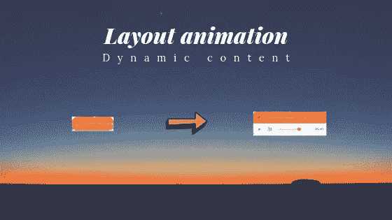

# 使用 reaction-native 制作元素布局的动画，而不需要知道容器的初始大小

> 原文：<https://javascript.plainenglish.io/animate-the-layout-of-an-element-with-react-native-without-knowing-the-initial-size-of-the-2ae633ab3221?source=collection_archive---------6----------------------->

T 今天，我需要一个客户在一个 reaction-native 应用程序中水平动画化一个绝对位于屏幕底部的条。

此栏由一个位于右下方的按钮组成，当您单击该按钮时，该按钮会放大到屏幕的宽度。

然而，我遇到了几个困难:

*   interpolate 函数是显式的，需要输入范围(其初始大小未知)和输出范围(100%的屏幕宽度)作为参数。在我写这篇文章的时候，react native 不支持自动确定大小的自动值……
*   我无法推断我的组件的内容的初始大小，因为它是可变的，我的应用程序是多语言的，不同的翻译没有相同的字符数，简而言之:我不知道基本组件的大小。

**如何为初始尺寸未知的零部件设置动画？**

# 有几个窍门，但其中一个很简单！

我试了一点废话，可以举个例子，用`onlayout`道具的一个分量来计算初始尺寸，不过到最后，最好的解决方法如下:

**使用将在 0%到 100%之间动画化的** `**minWidth**` **(或 minh8)。**

> **这是怎么回事？**

当我们有 0%的最小宽度时，元素自然会占据它需要的空间，并且将与最小宽度规则进行比较，让我们想象它需要 30px，最小的是 0px，因为 0%的最小宽度，它的大小将保持在 30px。

现在我们有了 100%，它的大小计算为 30px，而`minWidth`为 100%(也就是说 372px 宽)，我们发现规则不匹配，所以它会自然增长。