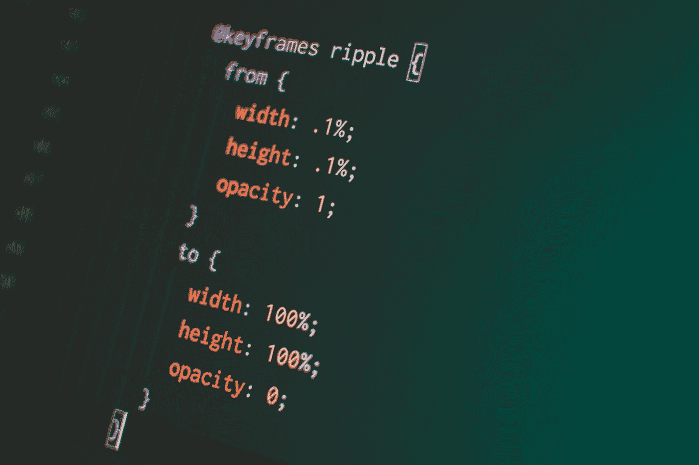

# 角度变化检测触发的动画

> 原文：<https://javascript.plainenglish.io/animating-changes-in-angular-f7059bb5ae05?source=collection_archive---------0----------------------->



Photo by [Pankaj Patel](https://unsplash.com/@pankajpatel?utm_source=medium&utm_medium=referral) on [Unsplash](https://unsplash.com?utm_source=medium&utm_medium=referral)

Angular features pretty [强大的工具包](https://angular.io/guide/animations)创建 CSS 过渡和动画。但是有时我们需要一些简单的东西来让我们的网络应用看起来更有活力。在本文中，我们将介绍一种简单的方法，使用由变化检测周期触发的 CSS 转换来动画显示角度组件的变化。

我在这里描述的方法可以应用于触发几乎任何类型的 CSS 动画，但我们将重点放在只是让我们的文本闪烁橙色，如果改变，我们不打算使用角度动画套件:


开始吧！

# 首先让我们创建基本的 Angular 应用程序:

*   **使用**[**【stackblitz.com】**](http://www.stackblitz.com)**:**创建一个简单的角度 app

在你的现代浏览器中输入'[*https://stackblitz.com/fork/angular*](https://stackblitz.com/fork/angular)'。这将分叉和引导简单(iest)角应用程序，你可以在线编辑。

*   **现在让我们添加一个按钮和一个方法，每次按下都会改变单词“Angular”:**

让我们转到*app.component.html*，在 *app.component.ts:* 中添加带有(click)事件的按钮，该事件将触发“buttonClicked()”方法

```
<hello name="{{ name }}"></hello>
<button (click)="buttonClicked()">hit me</button>
```

在 app.component.ts 中，我们实现了“buttonClicked”方法——它所做的只是在单词“Angular”上再添加一个“r”:

```
[@Component](http://twitter.com/Component)({
  selector: 'my-app',
  templateUrl: './app.component.html',
  styleUrls: ['./app.component.css']
})
export class AppComponent {
  name = 'Angular';
  buttonClicked() {
    this.name += "r"
  }
}
```

*   现在试着按一下按钮，你应该已经可以正常工作了:


# 让我们以动画形式展示变化:

我们将使用简单的 CSS 过渡和关键帧来激活文本更新。正如您所注意到的，在我们的*app.component.html*中，我们有一个简单的“hello”组件，它的 name 属性绑定到 app.component.ts 的“name”属性(现在是单词“Angular”)——我们将在这个“hello”组件内部工作并更新它:

*   首先，让我们将类绑定[ngClass]添加到一个简单的对象“pulsingText”中，其中一个属性“pulsing”最初设置为 false。现在将它设置为 true 将使我们的

    # 标签获得 CSS 类”。脉冲”添加到它。并且将其设置为“假”将移除这样的类:

```
import { Component, Input } from '[@angular/core](http://twitter.com/angular/core)';
[@Component](http://twitter.com/Component)({
  selector: 'hello',
  template: `<h1 [ngClass]="pulsingText">Hello {{name}}!</h1>`,
  styles: [`
    .pulsing {
        animation-iteration-count: 1;
        animation: pulse 0.5s;
        animation-direction: alternate;
    }
  `]
})
export class HelloComponent {
  [@Input](http://twitter.com/Input)() name: string;
  pulsingText = {
    pulsing: false
  }
  ngOnChanges(changes) {
    this.pulsingText.pulsing = true;
  }
}
```

*   那我们补充一下。组件装饰器的“样式”部分中的脉动 CSS 类定义(如上所示)
*   接下来，让我们添加 Angular 的生命周期钩子 [ngOnChanges](https://angular.io/api/core/OnChanges) ，每次@Input 的 name 值改变并触发添加类时都会调用这个钩子。脉动到我们的< h1 >标签
*   最后，让我们添加关键帧动画(过渡),它将把我们更改的文本不透明度和颜色从初始状态更改为橙色/降低的不透明度，然后再返回:

```
...
[@Component](http://twitter.com/Component)({
  selector: 'hello',
  template: `<h1 [ngClass]="pulsingText">Hello {{name}}!</h1>`,
  styles: [`
    .pulsing {
        animation-iteration-count: 1;
        animation: pulse 0.5s;
        animation-direction: alternate;
    }
    [@keyframes](http://twitter.com/keyframes) pulse {
    0% {
        opacity: 1;
        color: black
    }
    50% {
        opacity: 0.3;
        color: orange;
    }
    100% {
        opacity: 1;
        color: black;
    }
}
  `]
})
...
```

现在你会看到，当应用程序加载时，转换被触发一次，但在点击按钮时仍然不起作用，这是因为我们需要删除一些东西。每次动画结束后，从我们的

# 标签**脉冲类。**

为此我们可以使用(animationend)事件绑定:

```
<h1 [ngClass]="pulsingText" (animationend)="pulsingText.pulsing=false">Hello {{name}}!</h1>
```

现在按下按钮应该会触发动画(。添加了脉冲类)，然后在动画结束时，它将被重置。脉动类被移除)，以便在下一个改变检测周期中当“名称”改变时。脉冲类可以通过 ngOnChanges 再次重新添加，然后通过(animationend)事件再次移除。

以上只是一个模式，当然，对于一个真正的应用程序，你需要添加更多的“肉到骨头”(像检查这样的动画是否已经运行等)，但希望这是一个有用的技巧。

这里是完整的 stackblits.com app:[https://stackblitz.com/edit/angular-gzzs48](https://stackblitz.com/edit/angular-gzzs48)

[](https://stackblitz.com/edit/angular-gzzs48?embed=1&file=src/app/hello.component.ts) [## angular-gzzs48 - StackBlitz

### 导出到 Angular CLI 的 Angular 应用程序的启动项目

stackblitz.com](https://stackblitz.com/edit/angular-gzzs48?embed=1&file=src/app/hello.component.ts) 

感谢阅读！