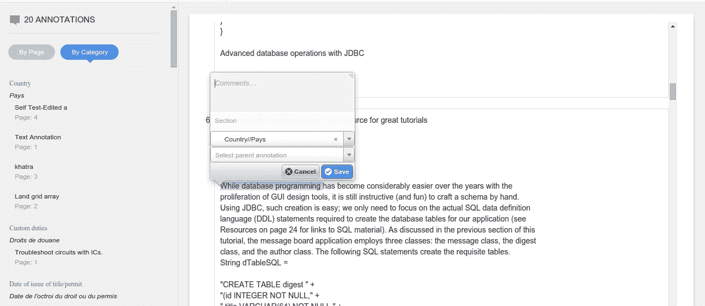

# 如何将 Annotator.js 与 Node.js 一起使用

> 原文：<https://javascript.plainenglish.io/annotatorjs-store-with-nodejs-9b5cf1f4e670?source=collection_archive---------6----------------------->

如果您想对 web 进行注释，并且正在寻找一个简单可靠的解决方案用于您的项目，那么 Annotator.js 是一个非常棒的库。这个库非常灵活，您可以在任何应用程序中使用它，但是出于本文的考虑，我将在 Node.js 中使用它，并设置一个基本存储。我假设你已经准备好了一个基本的 Express 服务器，我将要使用的数据库设置是 Mongodb，好了，让我们开始吧。

首先我们需要从[注释器](http://annotatorjs.org/)网站下载注释器，你会得到两个文件，一个是注释器 JavaScript 文件，另一个是注释器 CSS 文件，将它们粘贴到你的项目文件夹中。

上述代码所做的是在我们创建的注释中添加一些数据，它包括一些插件，如 UI 和存储插件，在存储插件中，我们有一些选项，我们将使用这些选项在后端执行 crud 操作，并使我们的注释持久化，我们为注释器添加了一个前缀，以便在服务器上获取数据和发布数据，该前缀为[*https://localhost:3000/API*](https://localhost:3000/api)*因此任何 crud 操作都可以执行 在客户端，将向服务器发送一个带有我们添加前缀的请求。如上所示，我们添加了两条路由，一条用于创建，另一条用于搜索，*

*因此，当创建注释时，会向 localhost:3000/API/annotation/fileName 发出请求，当加载文档时，get 请求会发送到 localhost:3000/API/search/fileName,`window.btoa()`函数用于对文件名进行 Base64 编码。*

*这是客户端注释器客户端设置，现在我们将创建我们的注释器存储。*

*这是我们创建注释并将其保存在数据库中的路径，因此在前端，当创建注释时，post 请求将被发送到此路径，因此我们从请求体中获取报价、范围和文本，并创建一个对象以使用唯一 id 保存在数据库中，我们需要编辑和删除注释，作为响应，我们以上面写为`annotateobj`的格式呈现保存的文档，我们的注释保存在数据库中。*

*现在一步完成了，我们的存储还剩四步，下一步是在文档加载时获取注释。*

*现在，当页面加载时，GET 请求被发送到 localhost:3000/API/search/{ fileName }，该文件的所有注释都从数据库中获取，我们唯一需要做的就是将结果呈现为 object，格式如下*

*将应用注释，现在只剩下两条路线，我将一起解释它们，*

*请记住，我们为每个注释添加了一个唯一 ID，我们只添加了两个 url，您一定想知道为什么我没有添加更新和删除路由。这是因为这些路由是默认实现的，但是您可以自己定义这些 URL。我使用了预定义的 URL，所以与其他路由类似，发送一个 put 和 delete 请求。对于 put 请求，我们获取更新的对象，创建一个具有唯一 id 的对象，保存它，并发送新对象作为响应。删除它真的很简单。我们只需要通过 id 找到那个注释，删除那个注释，然后发送没有那个注释的响应。*

*现在，您已经拥有了我们的整个注释器存储库并正在运行，您可以在任何应用程序、任何框架中使用它，核心概念保持不变。*