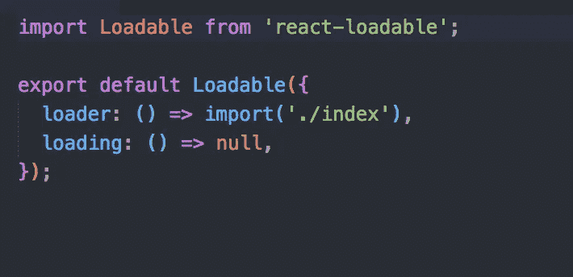

# 高级 React js:React+Redux+Sagas 的最佳实践

> 原文：<https://javascript.plainenglish.io/another-react-tutorial-best-practices-for-react-redux-sagas-19d62851725?source=collection_archive---------1----------------------->

coffee for thought

首先，快速介绍一下什么是 React。这是一个用于构建用户界面的 JavaScript 库。它一问世就改变了前端开发的格局。因此，如果你渴望成为一名前端 web 开发人员，学习 React 或 Vue.js 这样的库在当今的行业中几乎是必不可少的。如果你刚刚开始学习 React，这里有一个很棒的教程。[https://reactjs.org/tutorial/tutorial.html](https://reactjs.org/tutorial/tutorial.html)。

我记得我开始学 React 的时候。我总是有一种焦虑的感觉，我永远无法学会我需要的一切，不断变化的 JavaScript 语言笼罩着我的头，如果我做对了什么，我总是会问自己，这真的是最好的方法吗？在数百个在线教程、Youtube 搜索和未喝完的(很可能是未洗过的)咖啡之后，我终于牢牢抓住了 React 试图将什么带入 JavaScript 表中。

然而，我一直在努力寻找一个教程，将 React 的所有高级概念捆绑到一个紧凑的教程中。

此外，我记得当它们被用在一个大的源代码中时，我很难理解这些概念。这就是本文试图填补的空白。高级工具和概念嵌入到我们的简单应用程序中，这仅用于教程目的，如果你的应用程序不需要它们，你不应该使用这些概念。

闲聊到此为止。我们来谈谈代码。从这个 repo 下载完成的代码，并按照自述文件，这样你就可以看到并感受到我们将要在这里构建什么。https://github.com/jelorivera08/react-starter-pack[。](https://github.com/jelorivera08/react-starter-pack)

Landing page of the app

上面，您可以看到显示的计数状态和四个触发各自操作的按钮。他们的行为不言自明。

selectors

转到计数器容器中的 selectors.js 文件，我们在这里处理的第一个高级概念是 **createSelector。**通过查看代码，首先，const count 变量使用 state.get('count ')获取 redux 状态树内部的计数状态。

然后，我们使用上述方法创建一个选择器。这个帮助我们格式化从 redux 状态树中接收到的状态/数据，通过这样做，我们节省了大量时间来编写新的函数，这些函数处理状态重构或格式化目标状态，每次我们需要它来在前端呈现一些东西。在这个例子中，我没有改变我收到的状态。我只是出于演示的目的返回了普通状态。

然后，结果函数将在 mapStateToProps 内部使用，对于 mapStateToProps，接下来要配置的自然是 mapDispatchToProps。

create actions

每当调度 reducer 动作时，我们总是必须向 reducer 声明它的类型和相应的开关情况，reducer 稍后将进入这个状态，以便改变应用程序的状态。有了 reduxsauce 的 createActions 包，我们可以一石二鸟。为了从这个包中充分受益，我们还应该用 reduxsauce 格式化 reducer。

reducer

以上是我们 app 的减压器。初始状态被 fromJS API 封装在不可变的包中，随着包名的应用，它保护初始状态不被改变。React 对这一概念非常严格，因此请始终牢记这一点。reduxsauce 中的 createReducer API 有两个参数。

第一，初始状态。第二，对象拥有动作类型和值的键，一旦类型匹配调度调用，reducer 将触发这个函数。然后，Merge 会相应地更改 redux 状态树。现实生活中没有不知道如何处理异步 API 调用的应用程序，对吗？没错。

redux saga

这是我们节目的传奇部分。一切都是一样的，除了我们称呼自己行为的方式。我们利用之前创建的类型动作，并在我们的 watcher saga 中使用它们，以便调度异步调用，这将在稍后影响我们的 redux 状态树。

延迟是为了模拟网络延迟，以获得更好的应用异步体验。哦，最后，让我们确保不要忘记性能。

code splitting

代码分割是提高 web 应用程序性能的一个很好的方法。JavaScript 代码对用户数据的影响最大。请记住，通过代码拆分，最终用户只需下载数据消耗效率所需的部分代码。

## **总之，**

有很多软件包和工具可以帮助我们，软件工程师创建一个更干净和更有效的代码。这是有代价的，理解底层系统的代价，那就是*在 React 中的思考。*

学习 React 需要你将你的编码范式转变成一种与以前前端编码思维模式大不相同的范式。我在本文中讨论的工具和软件包概括了在 React 中漂亮而高效地编码所需的那些原则，这就是优秀开发人员的素质。

*总是一些小事。*

至此，我希望我已经通过这篇小文章帮助您加深了对 React 的理解。干杯！