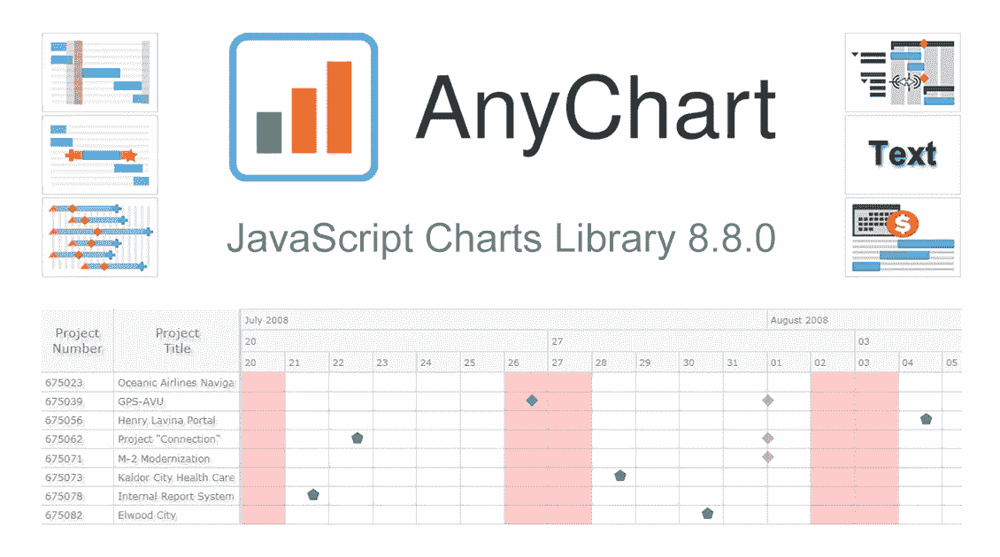
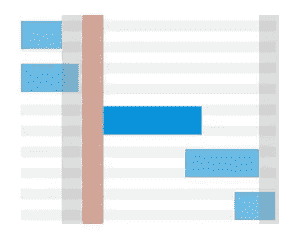
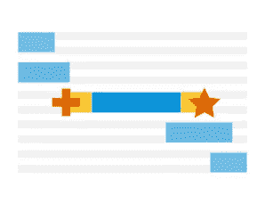
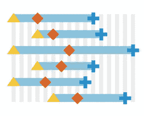

# AnyChart JS Charts 8.8.0 发布了新的激动人心的数据 Viz 特性

> 原文：<https://javascript.plainenglish.io/anychart-js-charts-8-8-0-released-with-new-features-e104260a7b56?source=collection_archive---------7----------------------->

我们刚刚更新了我们的 [JavaScript 图表库](https://www.anychart.com)，增加了令人兴奋的新特性和改进！在 AnyChart JS 的 8.8.0 版本中，重点是对[甘特图](https://www.anychart.com/products/anygantt/overview/)的增强。它们将有助于轻松地使您的项目和资源数据可视化更加深入。我们还升级了基本和时间序列图表以及地图。下面是新的重要产品的概述。请务必检查它，下载更新的版本，并享受！

# 新的 JavaScript 图表库特性

## **周末、节假日和非工作时间着色**

项目和资源甘特图现在可以选择[给节假日、周末和非工作时间](https://www.anychart.com/products/anygantt/gallery/Gantt_General_Features/Milestones_Preview_Marker_Type.php)着色。使用 [1](https://api.anychart.com/anychart.core.ui.Timeline#weekendsFill) 、 [2](https://api.anychart.com/anychart.core.ui.Timeline#holidaysFill) 和 [3](https://api.anychart.com/anychart.core.ui.Timeline#workingFill) 方法设置如何显示 [4](https://api.anychart.com/anychart.core.gantt.Calendar#holidays) 和 [5](https://api.anychart.com/anychart.core.gantt.Calendar#schedule) 方法定义的周末、节假日和非工作时间。

## **开始/结束标记**

在项目甘特图中，现在可以用[显示实际条形图、比较基准条形图和进度条形图的开始和结束标记](http://anychart.stg/products/anygantt/gallery/Gantt_General_Features/Start_and_End_Markers.php)。

使用以下方法:
[start marker()](https://api.anychart.com/?entry=startMarker)
[end marker()](https://api.anychart.com/?entry=endMarker)

## **资源图表上的里程碑**

在资源甘特图中，现在您可以用[显示里程碑](http://anychart.stg/products/anygantt/gallery/Gantt_General_Features/Milestones_on_Resource_Chart.php)来表示重大事件。

这个新特性允许你在一行中可视化多个里程碑和单独的工具提示。

## **使用鼠标滚轮缩放**

我们还添加了一个选项来改变使用鼠标滚轮时甘特图的行为:
[缩放或滚动](http://anychart.stg/products/anygantt/gallery/Gantt_General_Features/Start_and_End_Markers.php)。

使用 [zoomOnMouseWheel()](https://api.anychart.com/anychart.core.ui.Timeline#zoomOnMouseWheel) 进行更改。

## **文字阴影效果**

对于所有图表(和地图)中的大多数文本元素，现在您可以使用 text shadow()方法[调整文本阴影](http://anychart.stg/products/anygantt/gallery/Gantt_General_Features/Resource_Gantt_Chart_with_Adaptive_Labels_Format.php)。阴影效果有助于在某些背景色上显示文本，或者使您的可视化效果更具震撼力。

## **财年班次**

甘特图中财政年度的开始现在可以设置为今年或明年的任意月份。

这允许您在财务或预算年度中正确显示时间线。

# 其他改进

此外，我们对 JS 图表库的改进包括:

*   基本图表中的背景角设置现在可以用百分比或像素来设置。
*   sunburst 图表标签的性能得到了显著增强，现在它们可以呈现超过 20，000 个点。
*   柬埔寨的地图已经反映了磅湛省被分成两个省:磅湛省(湄公河以西)和 Tbong Khmum 省(湄公河以东)。

此外，还有其他增强和缺陷修复。检查您正在使用的产品的版本历史，以跟上最新的变化:

# 分享反馈

你觉得我们的 JavaScript 图表库的主要新版本怎么样？接下来您希望看到哪些功能和改进？

[将您的反馈发送给我们](https://www.anychart.com/support/)，我们将很乐意根据您的需求调整路线图。

**享受 AnyChart JS 图表 8.8.0！**

*原载于 2020 年 5 月 22 日 https://www.anychart.com**[*。*](https://www.anychart.com/blog/2020/05/22/javascript-charting-library-new/)*