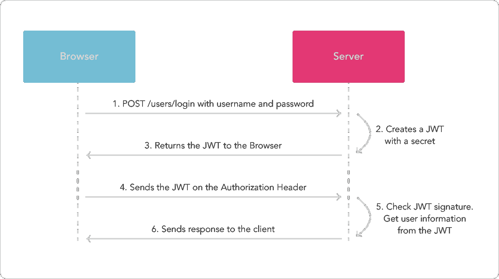
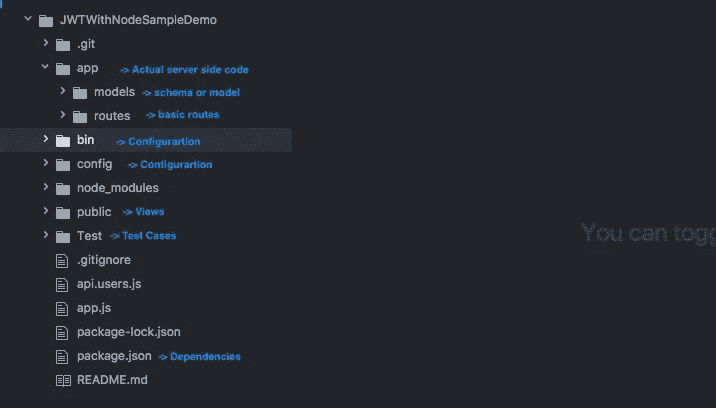
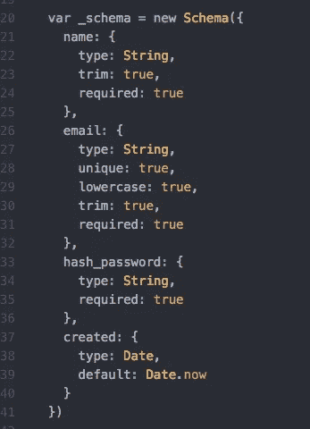
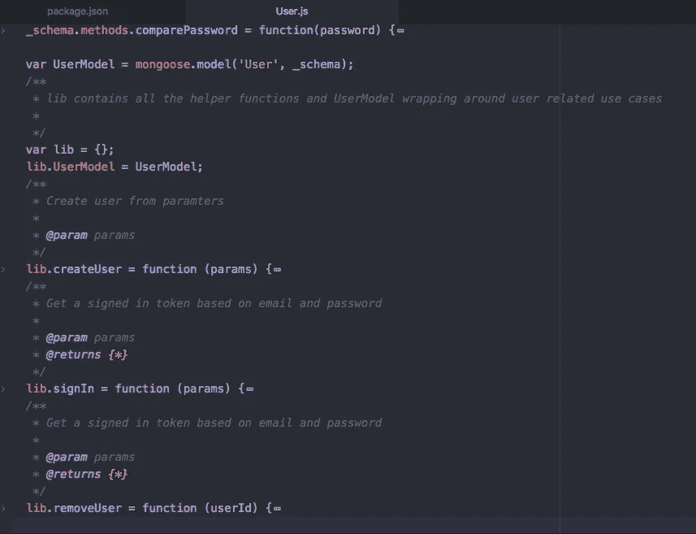
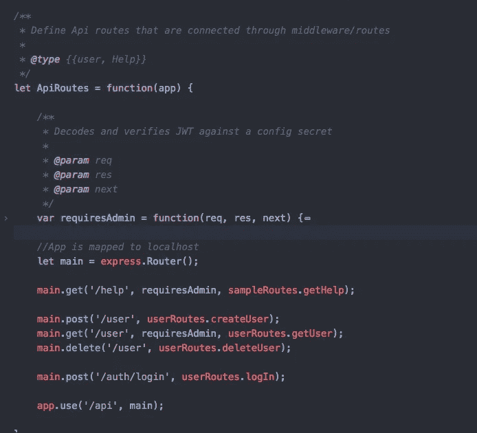
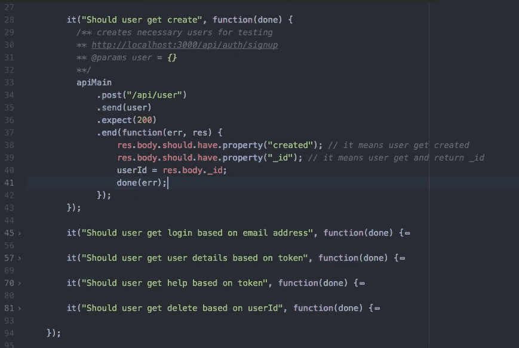

# 在 Node.js 中使用 JWT (JSON Web Token)的 API 认证

> 原文：<https://javascript.plainenglish.io/api-authentication-using-jwt-json-web-token-in-node-js-6f65848ed6c8?source=collection_archive---------3----------------------->

[**什么是 JWT**](https://jwt.io/introduction/) **？**

JSON Web Token (JWT)是一个开放标准( [RFC 7519](https://tools.ietf.org/html/rfc7519) )，它定义了一种紧凑且独立的方式，以 JSON 对象的形式在各方之间安全地传输信息。该信息可以被验证和信任，因为它是数字签名的。jwt 可以使用秘密(使用 **HMAC** 算法)或使用 **RSA** 的公钥/私钥对进行签名。

JWT 是如何工作的？

JWT working system

**实施**

1.  项目的基本结构

basic project structure

2.在 package.json 中添加所需的依赖项

3.创建用户模型

user schema

4.创建用户模型处理程序

user model handlers

5.使用中间件创建用户路线

create routes

6.为路线创建 mocha 测试用例

test cases

完整的代码库可以在 GitHub [这里](https://github.com/santoshshinde2012/JWTWithNodeSampleDemo)找到。

*更多内容请看*[***plain English . io***](http://plainenglish.io/)