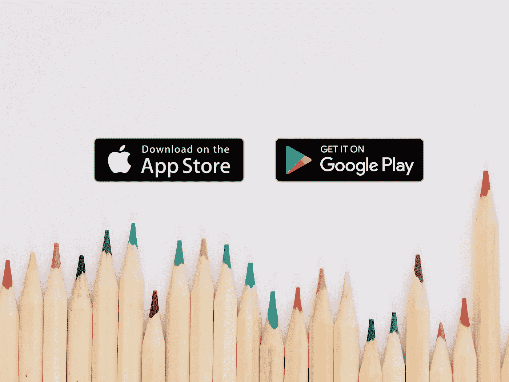

# 应用商店和 Google Play:提交清单

> 原文：<https://javascript.plainenglish.io/app-store-google-play-submission-checklist-d13d78309d56?source=collection_archive---------9----------------------->

## 向 App Store 和 Google Play 提交申请所需信息的简单清单。

Background’s photo by [Jess Bailey](https://unsplash.com/@jessbaileydesigns?utm_source=unsplash&utm_medium=referral&utm_content=creditCopyText) on [Unsplash](https://unsplash.com/s/photos/background?utm_source=unsplash&utm_medium=referral&utm_content=creditCopyText)

我目前的一个客户要求我提供一份在 App Store 和 Google Play 上发布他们的应用程序所需的最基本的信息列表。我又一次不记得我把这样的清单保存在哪里了😅。

这就是为什么，我没有向他们收取费用，而是将这些信息打包成一个公开的博客帖子，我会尝试，希望在你的帮助和投入下，保持更新。

# 上次更新

这篇博文最后一次更新【2020 年 11 月 3 日星期二。

# 分配

要在**应用商店**和 **Google Play** 中分发应用，必须回答以下问题:

1.  该应用程序是在世界各地都可以下载，还是只在特定国家可用？

例如，如果您将分发限制在“瑞士”等国家，则在另一个 App Store 所在国家(如“德国”)注册了帐户的潜在用户将无法找到并下载该应用程序。

2.它是免费的还是卖多少钱？

3.这个应用程序包含广告吗？

4.哪个类目对 app 最精准最有效？

您可以通过以下链接找到类别列表和介绍:

*   应用商店:[https://developer.apple.com/app-store/categories/](https://developer.apple.com/app-store/categories/)
*   Google Play:[https://support . Google . com/Google Play/Android-developer/answer/113475？hl=en](https://support.google.com/googleplay/android-developer/answer/113475?hl=en)

此外， **Google Play** (仅)请求有关应用程序内容的以下信息:

5.内容评级:应用程序必须接受官方评级机构的内容评级。

例如:PEGI 三号。为了获得这些，Google Play 控制台内置了一个逐步向导。

6.目标受众:应用的目标年龄段

# 外部链接

这两个商店都需要链接，外部网址，如数据隐私或使用条款的信息。

**应用商店:**

*   数据保密
*   支持:潜在用户可以请求帮助的页面链接
*   营销:一个关于你的申请的商业信息页面的链接
*   版权:拥有合法权利的名称或实体

**Google Play:**

*   数据保密
*   使用条款:我实际上不确定它是否需要。下次提交新申请时我会检查一下。
*   电子邮件:商店中也会出现的联系人电子邮件

# 信息

要在商店中介绍和展示您的应用程序，您需要提供不同的信息，如标题、描述等。必须提供这些，并且必须符合特定的最大长度(包括空格)。

**应用商店:**

*   姓名:马克斯。30 个字符
*   字幕:max。30 个字符
*   宣传文字:max。170 个字符

苹果建议用它来抓住新的潜在用户的眼球。值得注意的是，它可以被更新，而不必提交新的构建。

*   描述:最大。4000 个字符
*   关键词:max。100 个字符(包括逗号)。逗号分隔的关键字列表。

**Google Play:**

*   姓名:马克斯。50 个字符
*   简短描述:max。80 个字符
*   描述:最大。4000 个字符

# 截屏

最后，这些是为你的应用程序提供惊人截图的要求。

**应用商店:iPhone**

1.  6.5 寸(iPhone 11 Pro Max，iPhone 11，iPhone XSMax，iPhone XR)

*   最少 3 张截图，最多 10 张
*   1242 x 2688 像素(纵向)或 2688 x 1242 像素(横向)

2.5.5 英寸(iPhone 8 Plus、iPhone 7 Plus、iPhone 6s Plus)

*   最少 3 张截图，最多 10 张
*   1242 x 2208 像素(纵向)或 2208 x 1242 像素(横向)

**应用商店:iPad**

1.  12.9 英寸(iPad Pro(第四代、第三代))

*   最少 3 张截图，最多 10 张
*   2048 x 2732 像素(纵向)或 2732 x 2048 像素(横向)

2.12.9 英寸(第二代 iPad Pro)

*   最少 3 张截图，最多 10 张
*   2048 x 2732 像素(纵向)或 2732 x 2048 像素(横向)

正如你所注意到的，为了以防万一，两款 iPads 所需的截图尺寸是一样的😉。

**Google Play:**

1.  图标

*   JPEG 或 32 位 PNG
*   512 像素乘 512 像素
*   高达 1 MB

2.特色图片:帮助在 Google Play 的不同位置推广您的应用的横幅

*   JPEG 或 24 位 PNG(不透明)
*   1024 x 500 像素
*   高达 1 MB

3.手机截图

*   最少 2 张截图，最多 8 张
*   JPEG 或 24 位 PNG(不透明)
*   介于 320 像素和 3840 像素之间
*   16:9 宽高比(用于风景截图)
*   高达 8 MB

4.7 英寸平板电脑截图

*   多达 8 张截图
*   JPEG 或 24 位 PNG(不透明)
*   介于 320 像素和 3840 像素之间
*   16:9 宽高比(用于风景截图)
*   高达 8 MB

5.10 英寸平板电脑截图

*   多达 8 张截图
*   JPEG 或 24 位 PNG(不透明)
*   介于 320 像素和 3840 像素之间
*   16:9 宽高比(用于风景截图)
*   高达 8 MB

请注意，以上两个平板电脑截图都是可选的。

# 结论

两家商店都提供了更多的选项，比如视频或各种格式，但是这篇博客文章的目标只关注基本需求。

我希望它对你也有用，如果你注意到自出版以来有什么遗漏或改变，请让我知道。

到无限和更远的地方！

大卫

在 Twitter 上联系我，为什么不试试在 T2 的 DeckDeckGo 上做你的下一次演讲。