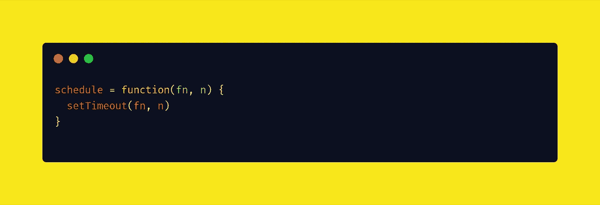
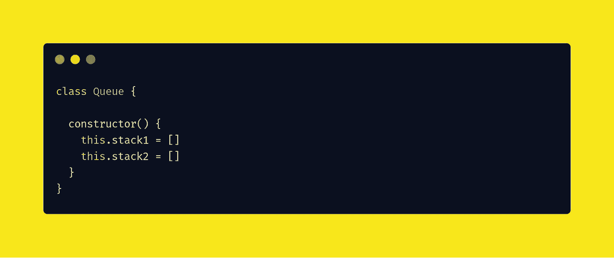
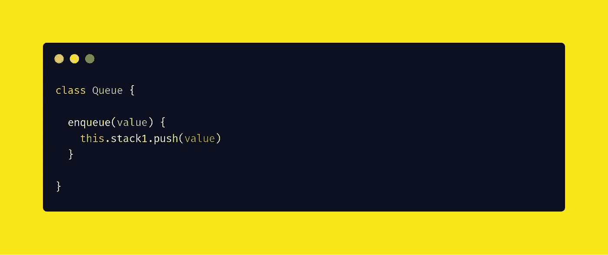
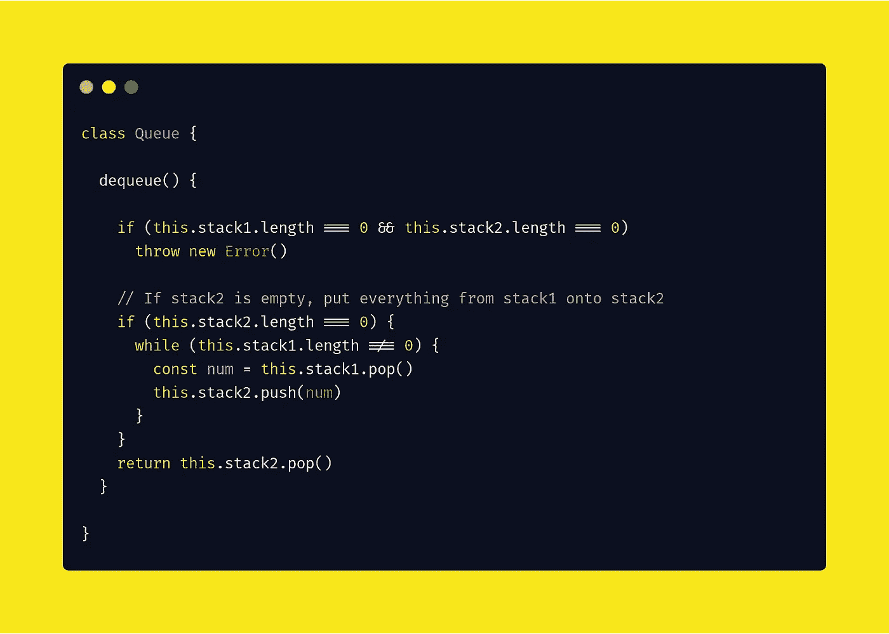
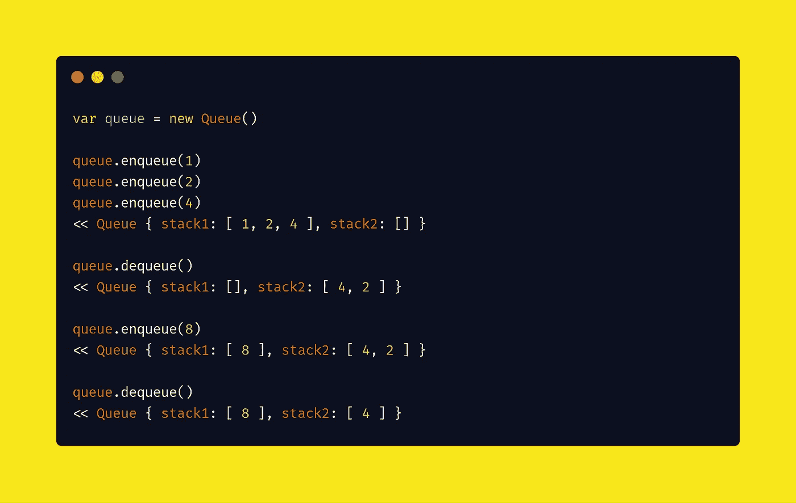
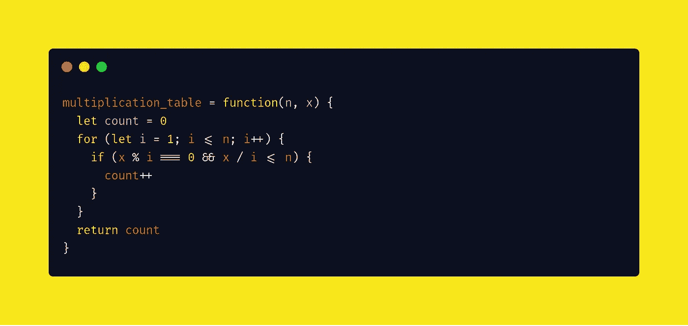
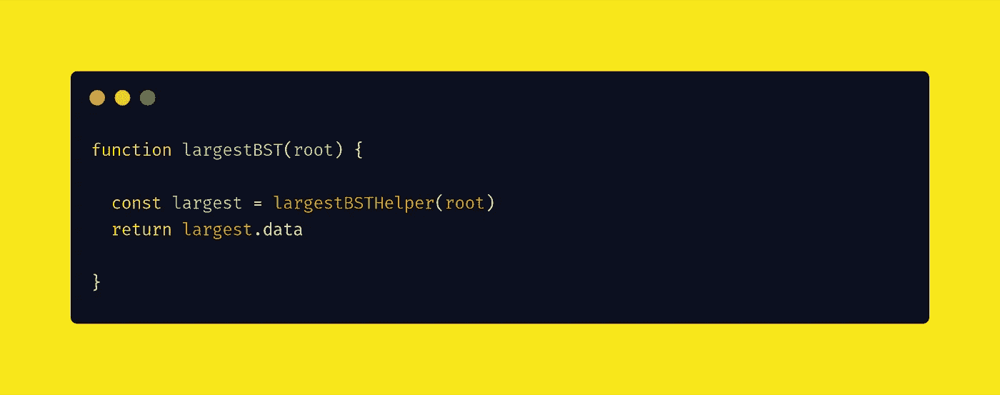
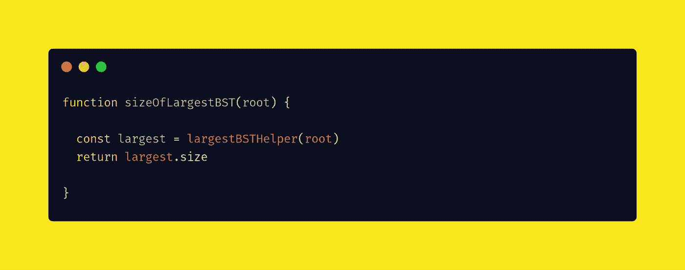
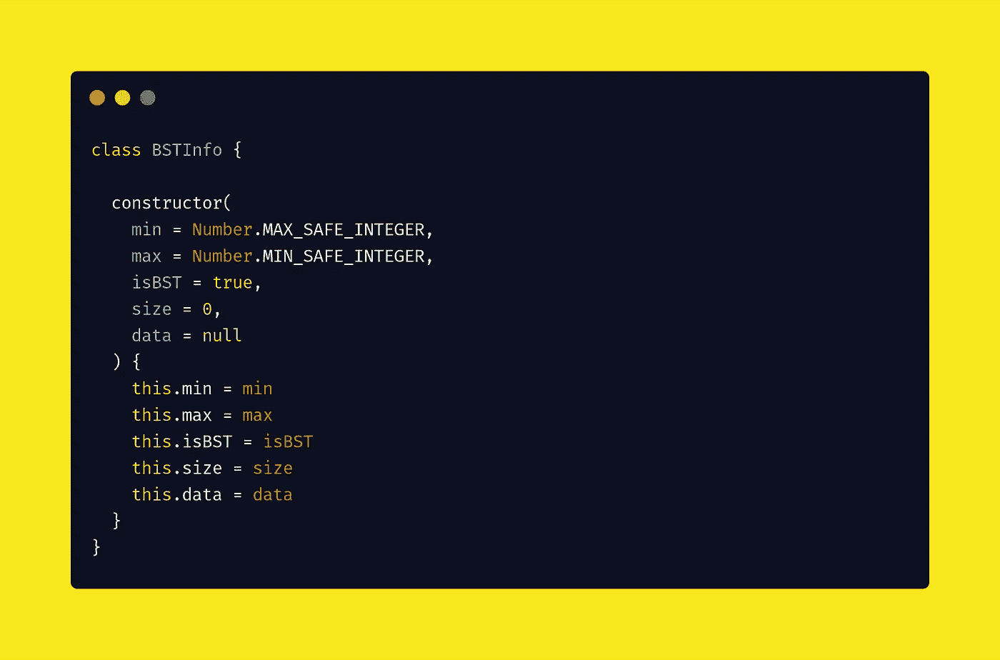
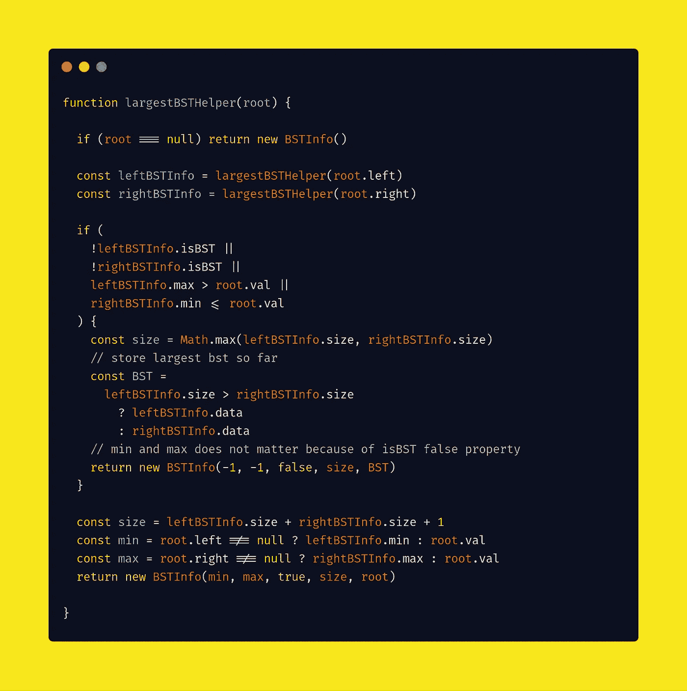

# 苹果编码面试问题

> 原文：<https://javascript.plainenglish.io/apple-coding-interview-questions-fcdaf0931d47?source=collection_archive---------1----------------------->

## *2020 年 5 月 6 日更新*

## 日常编码问题

它们是受真实编程面试启发的各种各样的问题，带有深入的解决方案，清晰地带您了解每个核心概念。

> 通过每天解决一个问题，变得格外擅长编写面试代码。

我们将一起使用 JavaScript 解决这些问题。

# 问题#1

## 问题

实现一个作业调度器，它接受一个函数`f`和一个整数`n`，并在`n`毫秒后调用`f`。

## 解决办法

我们将使用`setTimeout`内置函数。有人有更好的解决方案吗？

# 问题#2

## 问题

使用两个堆栈实现队列。回想一下，队列是一个 FIFO(先进先出)数据结构，具有以下方法:enqueue，它将一个元素插入到队列中，以及 dequeue，它将该元素移除。

## 解决办法

首先，我们初始化一个空队列，有两个栈。Javascript `array`可以像`stack`一样工作。

接下来，我们向队列中插入一个元素。

然后，我们从队列中删除一个元素。

最后，让我们试着测试一下这个解决方案。

# 问题#3

## 问题

假设您有一个 N 乘 N 的乘法表。也就是说，一个 2D 数组，其中第 I 行第 j 列的值是(i + 1) * (j + 1)(如果索引为 0)或 i * j(如果索引为 1)。

给定整数 N 和 X，写一个函数，返回 X 在 N 乘 N 乘法表中出现的次数。

例如，给定 N = 6，X = 12，您应该返回 4，因为乘法表看起来像这样:

桌子上有 4 个 12。

## 解决办法

# 问题#4

## 问题

给定一棵树，找出最大的 BST 树/子树。

给定一棵树，返回作为 BST 的最大的树/子树的大小。

## 解决办法

这是一个时间复杂度为 O(N ),空间复杂度为 O(d)的解。

编写一个`largestBST()`函数，返回最大的 BST 树/子树。

编写一个`sizeOfLargestBST()`函数，返回 BST 中最大的树/子树的大小。

编写`constructor()`函数来初始化`BSTInfo`类。

最后，我们编写了`largestBSTHelper(root)`函数，该函数返回 BST 中最大的树/子树的信息。

很简单，对吧？

我会更新苹果在这篇文章中提出的新问题🔖它重新阅读并获得最新的问题和解决方案。

感谢阅读😘，再见👋，别忘了👏最多 50 次并跟随！