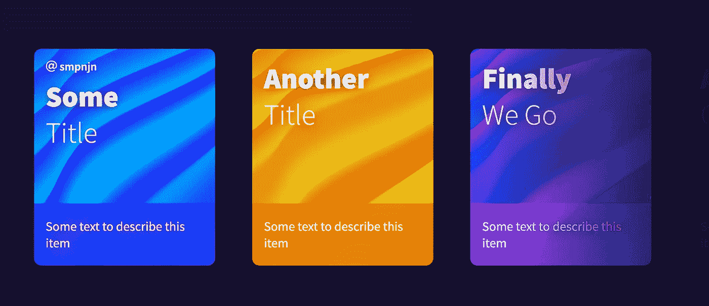
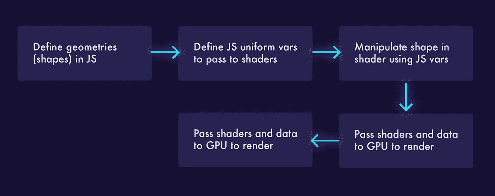

# 如何用 WebGL 和 Three.js 创建动画卡片

> 原文：<https://javascript.plainenglish.io/apple-music-like-cards-with-webgl-6256de5aa32?source=collection_archive---------5----------------------->

The effect we will be achieving in this tutorial.

苹果最近开始在 Apple Music 上推出有吸引力的动画卡片。像这样的动画和效果确实推动了网站的参与，并最终导致更多的转化。

我**本教程将涵盖掌握这种效果的要点。**

[**链接到 CodePen 演示**](https://codepen.io/smpnjn/pen/mdrWPpK)

# 第一步。三个。射流研究…

正如我在 WebGL 上做的许多教程一样，我们将使用三个。JS 来达到这个效果。我们将使用的过程看起来有点像这样:

一旦我们导入了 Three.js，我们就在 js 中设置好了一切。这里要注意的关键点是统一变量，这些变量可以被改变，并立即导致 WebGL 渲染的改变。

# 第二步。着色器

在我们的代码中，我们目前有一个平面表，当我们在浏览器中加载它时，它只会显示为一个平面表。该表由许多顶点组成，这也是在我们的 Javascript 中决定的(顶点是我们创建几何图形时的参数之一)。**着色器调整我们在 Javascript 中创建的每个顶点的形状，并且是用类似 c 的语言编写的。**

为了创造折叠效果，**我们需要改变纸张，使其自身弯曲并折叠**。我们还需要调整颜色，使纸张的某些部分比其他部分更暗。因为我们可以更新传递给着色器的变量，所以我们可以添加自定义悬停效果:

WebGL 中只有两种着色器——顶点和片段，分别控制*位置*和*颜色*。对于我们的顶点着色器，我们将沿着 z 轴调整该点，因此它在某些点上升并像一张纸一样折叠。我们还将添加一些随机定位到 x 和 y 轴，使用噪声。

vUv refers to the position of the vertex, so vUv.x is [x], vUv.xx is [x, x], etc.

对于我们的片段着色器，我们将混合 Javascript 中定义的低颜色和高颜色，并根据我们在顶点着色器中使用 mix()函数创建的 z 轴移动来显示它们。

# 第三步。旋转木马

我们希望我们的旋转木马既是可滚动的，也是可拖动的。为此，我们需要参与 4 种不同类型的活动:

*   **指针向下** —用户点击了转盘
*   **pointerup** —用户已经完成拖动
*   **指针移动** —用户正在拖动旋转木马
*   **滚轮** —用户在转盘中滚动

# 完整！

完整的代码可以通过下面的链接查看。通过本教程，很容易看到如何开始利用 WebGL 使您的最新项目更具交互性。希望你喜欢这个教程，看看下面的源代码:

*   [CodePen 演示](https://codepen.io/smpnjn/pen/mdrWPpK)
*   [Github 回购](https://github.com/smpnjn/webgl-apple-cards)
*   [在推特上关注更多](https://twitter.com/smpnjn)