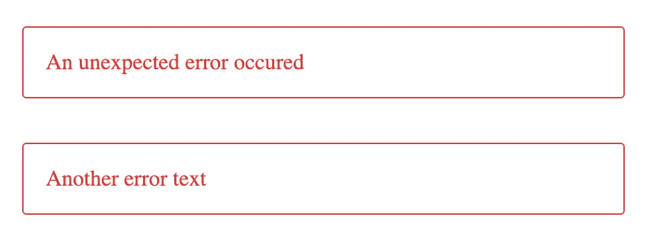
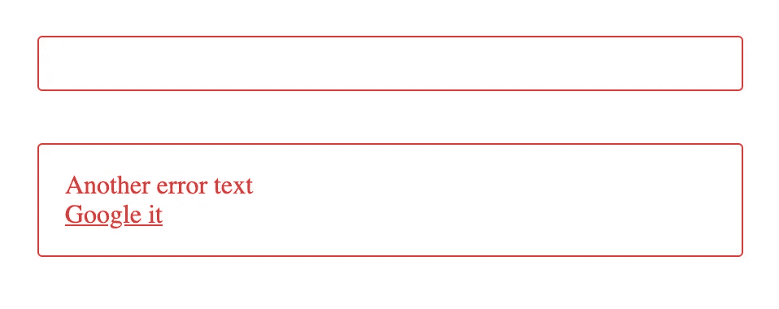
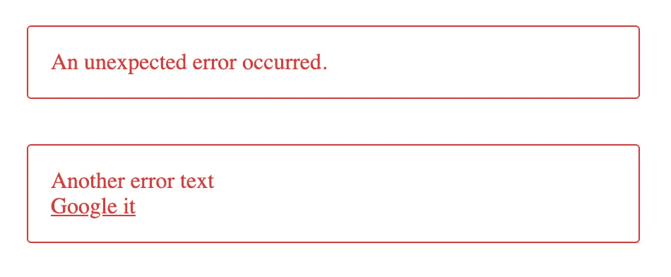

# 应用 DRY 原则，使角度代码不容易出错，更容易维护

> 原文：<https://javascript.plainenglish.io/apply-the-dry-principle-to-make-angular-code-less-error-prone-and-easier-to-maintain-2bc4af0592ad?source=collection_archive---------2----------------------->

## 在 Angular 中使用 ng-content、ng-template 和 ng-container 以及 ngTemplateOutlet

Photo by [Florian Klauer](https://unsplash.com/@florianklauer?utm_source=unsplash&utm_medium=referral&utm_content=creditCopyText) on Unsplash

组件是独立的，易于重用。通过帮助我们应用 DRY 原则(不要重复你自己)，他们使前端代码更不容易出错，更容易维护。

一个组件只编写一次，但是可以反复使用，无论是通过在不同的地方手动使用它的选择器，还是通过使用类似`*ngFor`的角度结构指令。

您经常需要将数据从父组件传递到子组件。例如，让我们制作一个组件来显示错误消息:

要向组件传递一个简单的错误文本，可以使用一个`@Input`。你可以给这个属性一个默认值，例如，`An unexpected error occurred`,当你不向子组件传递任何文本时，这个值就会显示出来。

只要您想要传递给子组件的数据是一个 JavaScript 值(字符串、对象、数字等等)，就可以这样做。但是，如果您想将一些 HTML 内容传递给子组件，例如一些带有图像或链接的内容，该怎么办呢？

您可以为这种情况创建一个特殊的组件，但是这需要您复制样式(重复您自己)。您还可以为链接或图像的 url 添加一个新的`@Input`。但是在这两种情况下，创建具有新类型内容的新类型的错误消息将会要求您创建另一个组件，再次重复您自己，或者添加另一个`@Input`。

有更好的方法。其实不止他们一个。

# ng-内容方式

您可以使用`ng-content`将您想要的任何内容传递到错误卡。

`ng-content`用作占位符。您可以使用它在子组件中添加动态内容。当呈现组件时，`<ng-content></ng-content>`将被您在父组件的子组件标签之间所写的内容替换。在上面的例子中，我们没有给第一个错误卡任何内容，它将保持为空。在第二个错误卡的标签之间，我们添加了一些文本、一个`div`和一个链接。它们将显示在错误卡内，取代`<ng-content></ng-content>`:

但是现在已经没有默认值了，给一个默认值会很棘手(不是不可能，但是很棘手)。另一个解决方案是使用带有`ngTemplateOutlet`属性的`ng-template`和`ng-container`，这个解决方案使我们能够给我们的错误一个默认值。

# ng 模板和 ng 容器方式

## ng 模板

`ng-template`允许您定义一个角度模板。就其本身而言，模板，也就是说标签及其内容，并没有被呈现。该模板可以与其他模板组合，并由结构指令和代码引用。只有在使用*时才会被渲染。*

它通常与一个`*ngIf`指令一起使用:

我们将在这里用一个具有`ngTemplateOutlet`属性的`ng-container`来使用它。

## 天然气容器

`ng-container`实际上什么都不做，但这就是它如此有用的原因。该元素不会呈现，但其内容会呈现，并且您可以向其附加一个结构指令。

不能将两个结构指令附加到同一个元素:

你可以添加一个`div`元素，但是除了修复你的双向问题之外，它什么都不会用，甚至会破坏你的布局。使用`ng-container`你可以有一个模板元素来应用第二个 strucutral 指令，但是这个元素本身不被呈现，它不在 DOM 中显示(但是它的内容被显示)。

我们将在`ngTemplateOutlet`指令中使用它。在我们的例子中，我们只有一个结构指令，但是我们仍然使用`ng-container`来避免创建一个虚拟的 HTML 元素来保存我们的`ngTemplateOutlet`。

## `ngTemplateOutlet`

`ngTemplateOutlet`是使我们能够实例化角度模板的指令。

我们使用模板的`defaultTemplate`引用作为`ngTemplateOutlet`的值，以便在 div 中实例化模板。如果我们不想使用`div`，我们可以使用`ng-container`元素。

## 模板作为输入

现在，我们可以将所有这些组合成一个解决错误卡问题的方案。我们的错误卡组件有一个引用为`defaultTemplate`的错误的默认模板。在使用错误卡组件的父组件中，我们可以为错误创建一个模板，在下面的例子中，我们创建了一个带有`div`和链接`a`的模板。然后，我们可以将这个模板作为输入传递给错误卡组件。错误卡组件呈现传递的模板(如果有)，否则使用其默认模板。

这些指令，`ng-content`，`ng-template`和`ng-container`帮助你创建可重用的定制组件。我希望这篇文章能帮助您理解如何将它们结合起来，以便在不同类型的内容中重用组件。