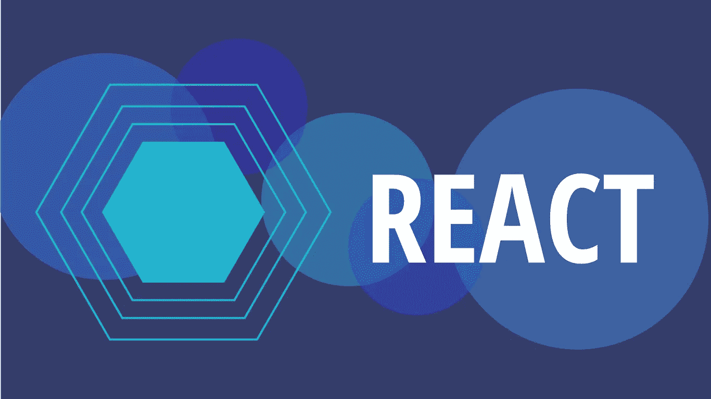
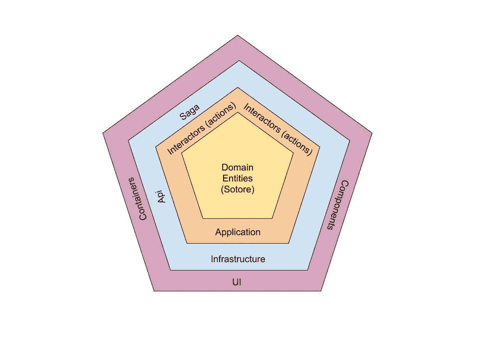

# 使用 React 应用原子设计方法和六边形架构

> 原文：<https://javascript.plainenglish.io/applying-atom-design-methodology-and-hexagonal-architecture-using-react-6dbb1863a5d5?source=collection_archive---------2----------------------->

## 首先，由于文章内容的性质，这是一篇观点文章。这是一种“试试看它如何工作”的情况。我所做的是将 Atom 设计方法和六边形架构的一些原则应用到 React 项目中。因此，这是一篇展示我这样做的冒险经历的文章。

⚠️ **重要:**

*   阅读我对代码的评论。他们可能有助于理解*为什么*我做了一些事情。我还在注释中留下了文件的存放路径。
*   这只是构建项目文件夹和文件的一种方式。你甚至可以使用比这更简单的东西。

⚠️ **注:**

*   我将把这篇文章分成两部分:六边形架构和原子设计方法论。

# 一切是如何开始的

几周前，我读了一篇来自网飞的关于六角形建筑的文章。这种架构如何将所有东西从领域中分离出来，具有不同的层，每个层都有自己的职责，避免了软件不同部分之间的强制，这真的很有趣。在阅读本文的前几天，我正在从事的一个新项目的架构师要求我将这个架构应用到 React 项目中。开始时，我挣扎了很久，因为这不是我的领域，而且我缺乏与架构相关的知识。当我阅读的时候，除了架构师对这个架构的一些概念的解释，我可以有一些关于如何在使用 React 的前端项目中工作的心智模型。

# 归根结底，一切都与概念有关

你可以接受一个概念并应用它，或者从中获得灵感。我就是这么做的。从六边形建筑中，我得到了下一个概念:

> 六边形架构的理念是将输入和输出放在我们设计的边缘。业务逻辑不应该依赖于我们公开的是 REST 还是 GraphQL API，也不应该依赖于我们从哪里获取数据——数据库、通过 gRPC 或 REST 公开的微服务 API，或者只是一个简单的 CSV 文件。— **网飞**

*   **领域层**:业务逻辑。我知道这是应用程序的核心，其中有**实体**和规则验证，它不能知道或与任何外部层相关，我可以模糊地看到，它可能是我的应用程序的领域:Redux。Redux，作为我的应用程序的集中状态和逻辑，它可以是我的领域层的核心。应用程序可以有实体——用户、帖子、信用、评论等等——还可以有我的应用程序的状态。如果您以前使用过 Redux，并将它视为一个实体数据库，那么这是有意义的。*(记住，我只是在使用概念或其中的一部分。)*
*   **应用**:这一层由用例表示。它意味着最终用户正在用应用程序或软件做什么。在这种情况下，它可以是任何一个**动作——网飞图中的**交互器——由用户输入执行。
*   **基础设施**:这一层包含任何与外部资源交互的东西，比如 RestFul API、SOAP、gRCP 调用和 DB 连接。对于前端的情况，它将是您的 API 模块调用任何 API 或连接到数据库。
*   **UI:**最后的外层。这应该是最后一个，因为这是用户最后会与之交互的东西。在这种情况下，应该是组件—容器、屏幕、路由器等。

我得出的六边形图大概是这样的:

The (5-sided) Hexagonal Diagram — (sorry I wrote Sotore and it should be Store)

我觉得这看起来不错，因为我是第一次做这个。当然，一切都可以改进，或者在前端项目中使用它可能是一个坏主意(正如我所说，这是一篇观点文章😄).最终的项目结构应该是这样的:

# 那个六角形的怪物！👾

## 领域层

领域层是最简单的部分，因为它只包含应用程序和实体的状态。下面是代码的样子。*(我使用一个文件作为实际案例示例。)*

## 应用层

在这里，我添加了与我的应用程序交互的所有动作，然后与基础设施层中的一些服务交互。为了创建动作，我使用 Redux Toolkit 中的`createSlice`。Redux Toolkit 允许减少你以前可以做的代码量。其中一个很酷的特性是它利用了[Immer](https://github.com/immerjs/immer)——我已经用了一年了——Immer 是一个处理不可变对象的快速库。它使用了代理对象。

⚠️ **注意:**如果你使用`createAction`创建一个动作，不要马上把它传递给 reducer 对象。当`createSlice`函数将状态和有效载荷分配给给定的函数时，用`createAction` 创建的函数将接收实际有效载荷时的状态。这可能会导致一些不良行为。为了避免这种情况，请使用 spread 操作符将其添加到最终动作对象中。

正如你在代码中看到的，我喜欢将与故事相关的功能放在一起，并将其余的操作放在它们之上。

现在店铺的配置。这是一个非常干净简单的配置，包含了项目可能需要的基本东西。我建议您阅读来自 [Redux toolkit](https://redux-toolkit.js.org/api/configureStore) 的 API 文档，因为这段代码使用了该库中的一些函数。我还强烈建议您删除旧代码，开始使用 Redux toolkit 中的功能。

在继续 Redux-Saga 配置之前，我将向您展示一些测试。我不是写测试的专家，我还在学习中，所以如果你发现任何错误或者你知道更好的方法，请在下面贴出答案让我知道😃。对我来说，测试必须简单，我只需要从给定的输入测试最终的**预期的**输出。因此，从这些行动中，我看到了接下来我应该测试的东西。

*   如果操作返回正确的对象。
*   如果调用的操作从存储中返回初始状态。
*   应该使用给定的有效负载来调用该操作。

以上面的代码为例，我有两个动作: **fetchUsers** 和 **fetchUsersSuccess。**

在这个测试中，我利用了来自 [Jest](https://jestjs.io/docs/en/getting-started) 的漂亮函数`toMatchSnapshot`。

## 基础设施层

请记住，在这一层中，我们将拥有与外部资源通信所需的所有模块和服务。我做的第一件事是对所有常用的 HTTP 动词方法(POST、PUT、DELETE、GET)进行抽象，你可以使用任何库来做这件事。在接下来的代码中，我使用了 Axios。我喜欢 Axios😍，它已经有了一些安全配置，我大部分时间都不用担心，而且它背后有一个巨大的社区。下面的代码可以被改进以取消请求并添加一个更加个性化的配置，但是对于一个实际的例子来说，这个是可以的。

下一个代码将是我如何测试上面的代码形式。我想我需要测试我的 API 模块实现中每个动词的成功和失败响应。

是时候展示一下我的 Redux-Saga 配置了。对于那些不知道 [Redux-Saga](https://redux-saga.js.org/) 的人来说，这是一个管理应用程序副作用的伟大库。关于 Saga 的一个很酷的事情是，它利用了函数生成器，这意味着你可以暂停你的承诺，避免回调地狱，你也可以并行进行多个调用。它利用中间件与 Redux 很好地集成在一起。如果你注意了商店配置，saga 中间件已经在那里了。我通常使用以下[传奇模式](https://redux-saga.js.org/docs/advanced/RootSaga.html)中的一种来装载我所有的传奇。

然后我有一个单独的 saga 文件，它只与相应的动作交互。按照上面的例子，我的动作在`user`文件夹中，我的传奇也在`user`文件夹中，它将只包含来自那些动作的请求。

我认为以这种方式保存传奇使得测试和维护变得容易。我从 saga 测试的是:

*   如果分叉的佐贺在监听给定的动作。
*   如果效果调用传奇，而这个传奇返回成功或失败的响应。

考虑到这几点，我使用上面的示例得出的代码应该如下所示:

## 附赠曲目😋

关于传说的额外提及。在处理传奇故事时，你还可以使用另一种模式。这可能是你在网上找不到的，因为我是为我工作的公司做的。这种模式允许你在你的容器挂载之前*注入*传奇。这样，如果你有很多传奇故事，你的项目的起点就不会很慢。

首先，我需要使用 Redux 的`context`。(你可以从 React `context` API 中制作自己的。

如你所见，我将 **injectedSagas、tasks** 和 **addTasks** 函数作为参数传递。当连接的容器被调用时，`addTasks`将派生所有的传奇。被注入的 Sagas 将保存所有被注入的 Sagas **名称**以跟踪它们**。**任务数组也是需要的，它可能是有用的，例如，如果你从你的应用注销，你留下了一些调用外部 API 的传奇，你可以取消那些传奇，防止任何不良行为。

商店配置文件也必须稍作修改。我将采用上面的例子并更新它。

要通过各自的容器调用传奇，您必须将容器连接到传奇。为此，你必须添加传奇故事，并给一个独特的名字。

最后叉传说。我将使用上面的同一个例子，对它进行一点点更新。

这样你就有了“异步”传奇。你可以把这个模式和其他模式混合起来。想怎么玩就怎么玩吧！。

**第二部分** : [原子设计方法论](https://medium.com/@diegoAlbertoMV/applying-atom-design-methodology-and-hexagonal-architecture-using-react-part-ii-c51d0d7ece9)

仅此而已。一如既往，我希望你喜欢这篇文章，并发现它是有用的。感谢您的时间和阅读，任何反馈都是非常欢迎的！😃。

感谢我的丈夫 J. Drake 帮我审阅这篇文章。❤️

干杯！

## **一封来自简明英语的短信**

你知道我们有四份出版物和一个 YouTube 频道吗？你可以在我们的主页 [**plainenglish.io**](https://plainenglish.io/) 找到所有这些内容——关注我们的出版物并 [**订阅我们的 YouTube 频道**](https://www.youtube.com/channel/UCtipWUghju290NWcn8jhyAw) **来表达你的爱吧！**