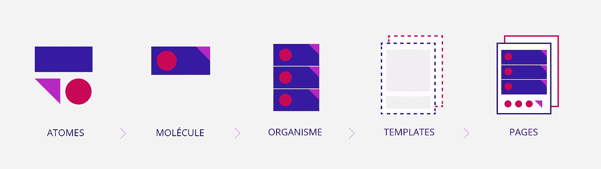
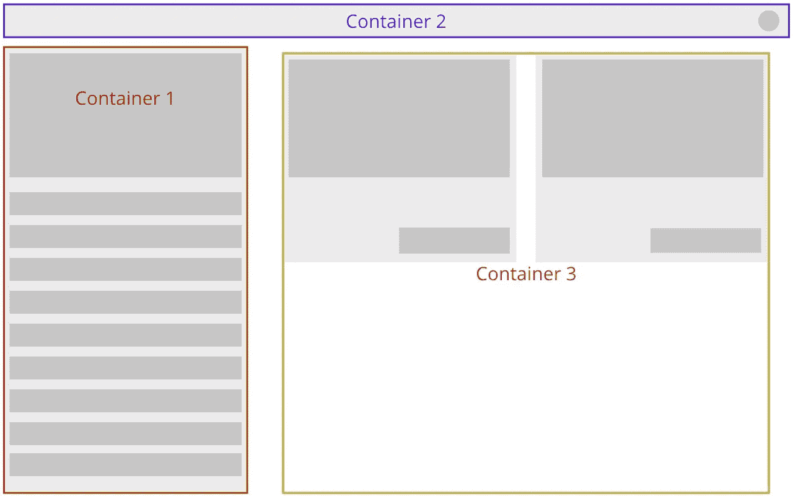
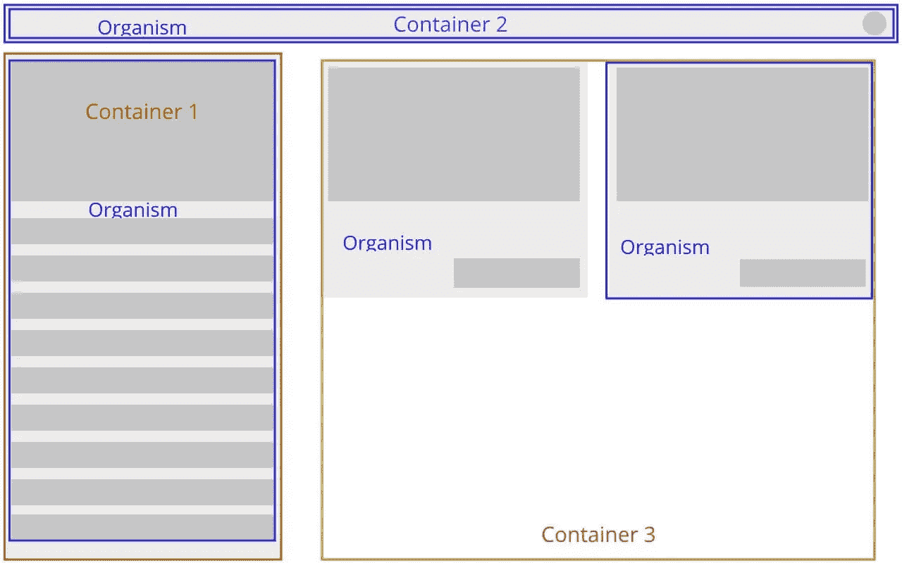
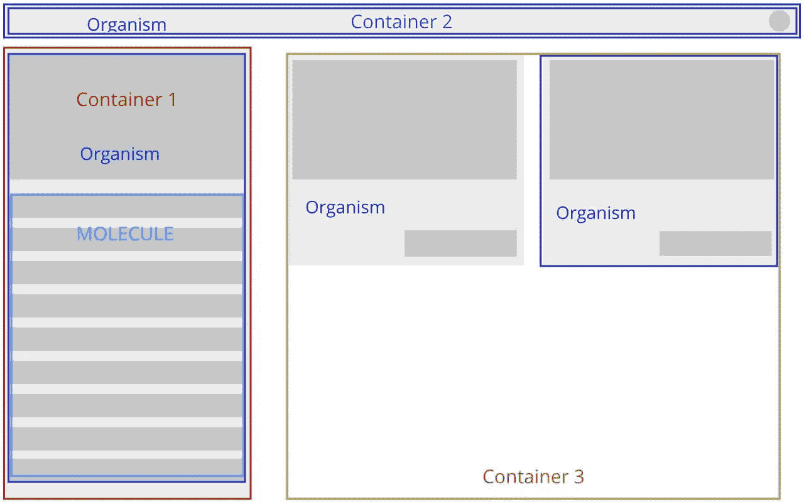
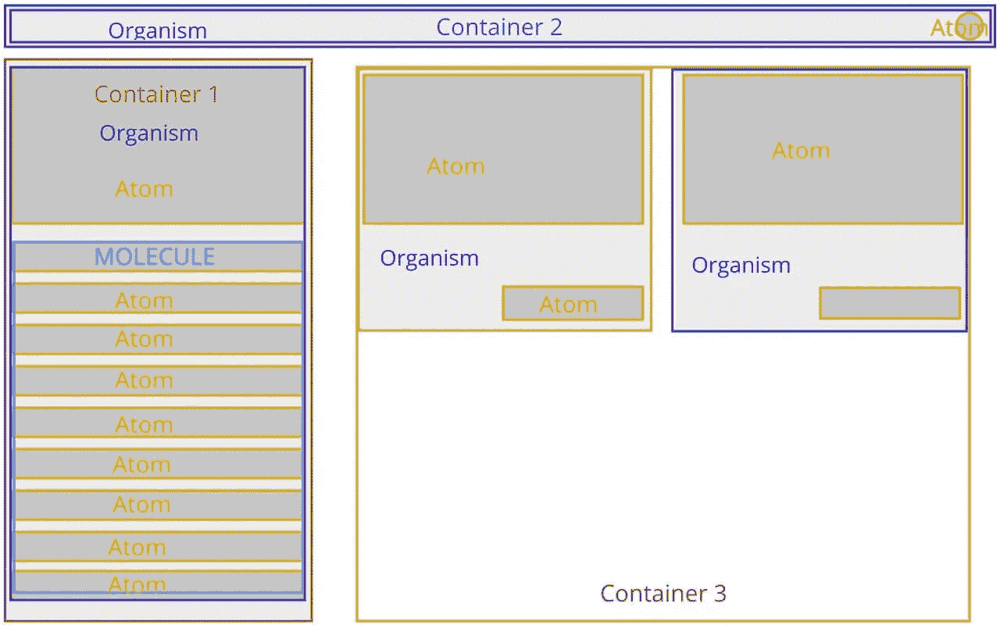

# 使用 React 应用原子设计方法和六边形架构—第二部分

> 原文：<https://javascript.plainenglish.io/applying-atom-design-methodology-and-hexagonal-architecture-using-react-part-ii-c51d0d7ece9?source=collection_archive---------1----------------------->

## 这是我上一篇文章[“使用 React 应用 Atom 设计方法和六角形架构”](https://medium.com/javascript-in-plain-english/applying-atom-design-methodology-and-hexagonal-architecture-using-react-6dbb1863a5d5)的下一部分。

I extracted this image from: [http://site-backelite-wordpress-int.ppr-5-4.bkt.mobi/2016/03/atomic-design-a-promising-co-creation-method/](http://site-backelite-wordpress-int.ppr-5-4.bkt.mobi/2016/03/atomic-design-a-promising-co-creation-method/) — It does not belongs to me.

首先，这不是什么新鲜事。我在这里要解释的是**我**如何将原子设计应用到我的组件中，你可以做同样的事情，也可以做不同的事情，因为我在这里表达的不是一个标准，这只是我在六角形架构的 **UI 层**中看到的文件夹结构。这篇文章是一个个人的旅程，我将要讨论的一切对你们中的一些人来说可能是“错误的”。所以，也就是说，如果你发现你不同意的地方，我很乐意听听你对此事的想法😄。

# 什么是 Atom 设计方法论？

在给你我对此的理解之前，我想让你去看看这个链接:[原子设计方法论](https://atomicdesign.bradfrost.com/chapter-2/#:~:text=Atomic%20design%20is%20atoms%2C%20molecules,parts%20at%20the%20same%20time.)。这是从 Atom 设计开始的最佳链接之一。尽管如此，我还是给出了一个非常简单的解释:Atom Design 将您的最终模型或原型划分为更小的可重用组件，赋予它们特定的功能。每个大的部分都是由较小的部分以分层的方式组成的。

让我向您展示下一个简单的模型，一步一步地解释 Atom 设计方法下组件的整个概念。

> *⚠️将从 React 开发的角度描述 Atom 设计各部分的定义。*

Basic mockup

# 模板、有机体、分子和原子⚛️

模板由所有需要的**生物体、分子、**和**原子组成。**在继续介绍这些概念之前，我想说明这一部分非常重要，因为你也可以看到你可能需要多少个容器。从现在开始，模板将在 React 环境下有一个新的定义。我想到了类似这样的东西:一个*模板在概念上代表了你在一个页面或屏幕上可能拥有的所有容器。请记住，容器将拥有所有复杂的逻辑*。从上面的模型，我可以看到下一个**可能的**容器。

Possible containers that the screen/page might have.

容器的这种划分对于识别下一个组成部分非常有用:生物体**。**生物体是组成模板的小段。一个生物体可以由许多**分子**或**原子**组成，但不能由其他生物体**组成。理论上，一个有机体不应该有逻辑，但也可能有例外。如果是这样，试着做一个非常简单的逻辑，是组件的一部分，不依赖于容器逻辑。**

All the Organisms

现在是时候看看分子是什么了。分子比生物体小。可以由**原子**组成，但不一定非得是**。**这些类型的组件是高层次的**原子**，这是因为原子是组件的最基本形状，根本不需要逻辑。从我作为例子的模板中，你可以看到一个分子。

The Molecules

最后是最小的组成部分:原子。它们可以在任何地方，唯一严格的规则是它们不能有任何逻辑。它们应该是非常简单的组件。

All the found atoms!

# **构建您的组件**

现在，您可能想知道:我如何在 React 中使用它？让我们回到[上一篇文章](https://medium.com/javascript-in-plain-english/applying-atom-design-methodology-and-hexagonal-architecture-using-react-6dbb1863a5d5)中的十六进制文件夹结构，添加您可能需要的文件夹，将组件视为 Atom 设计的一部分。文件夹结构应该是这样的。

因为你已经知道模板的哪一部分是有机体、分子和原子，你现在可以开始写组件，从最小的开始到整个页面。在下一张图中，我展示了原子可能是什么。

List of the possible Atoms Components

在下一个例子中，我将组件放在一个文件中，但是它们应该在各自的文件中。此外，我所做的组件只是上面图像中的三个，我不认为你需要更多来了解这个想法。

> 注意:记住总是使用 PropTypes 和 defaultProps😜

*(我在假装使用* [*样式的组件*](https://styled-components.com/) *💅)*

正如你所看到的，这些组件是微小而基本的。他们只是画 UI，没有逻辑。现在分子。这种情况下的分子只是一个包含`Item`成分的`List` 成分。有时需要考虑非常重要的一点，因为分子是由原子组成的，在某些情况下，分子成分会继承组成它的原子的属性。下面你可以看到这种情况的一个例子。

⚠️生物不会被命名为通用组件，这意味着它们不会被命名为:`Button`、`Alert`或`Item`。相反，它们应该与上下文相关，而不是与屏幕相关。把模板左边的有机体想象成一张专辑中的歌曲列表，因此这个组件可能被命名为`ListSongs`；有点**一般** ( `List`)但同时**具体** ( `Songs` )。

最后，这种生物将成为一个容器的一部分，正如我在上面的一张图片中所定义的那样。这个容器和其余的容器将只渲染它们自己的组件——有机体、分子和原子——防止在不需要时进行额外的渲染。此外，所有这些容器都将成为单个屏幕(*模板*)的一部分，它们也可以在其他屏幕上重用。

我希望让你注意到这个想法是有用的。感谢您的时间和阅读，任何反馈都是非常欢迎的！😃。

感谢我的丈夫 J. Drake 帮我审阅这篇文章。❤️

干杯！