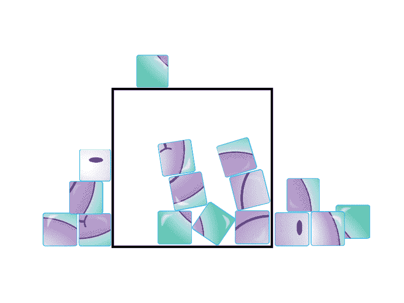
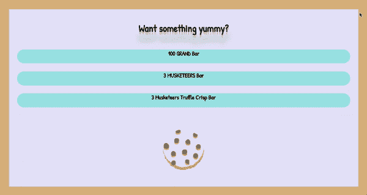
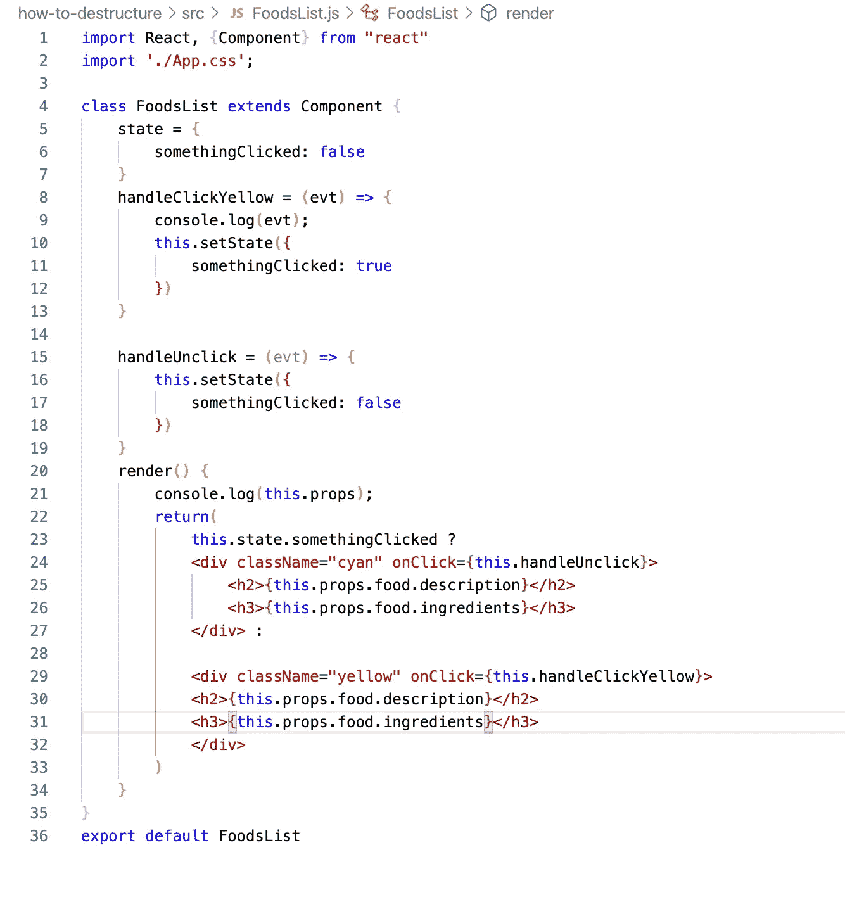
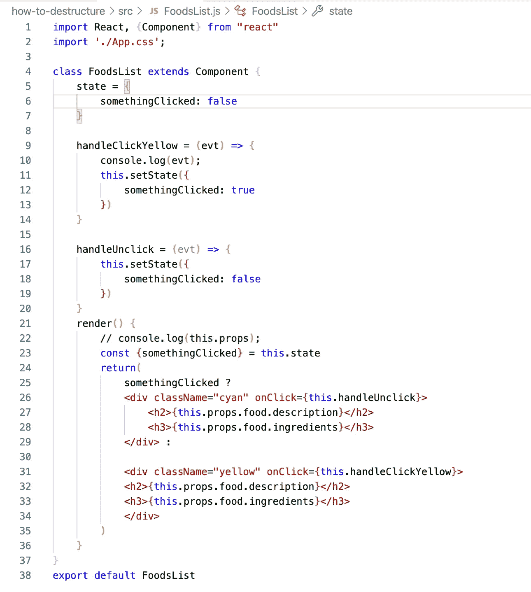
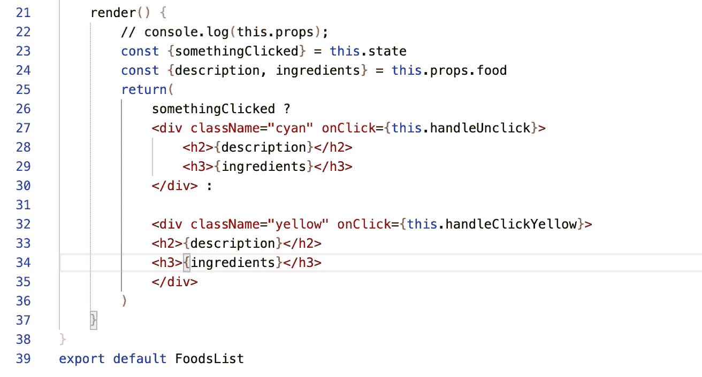
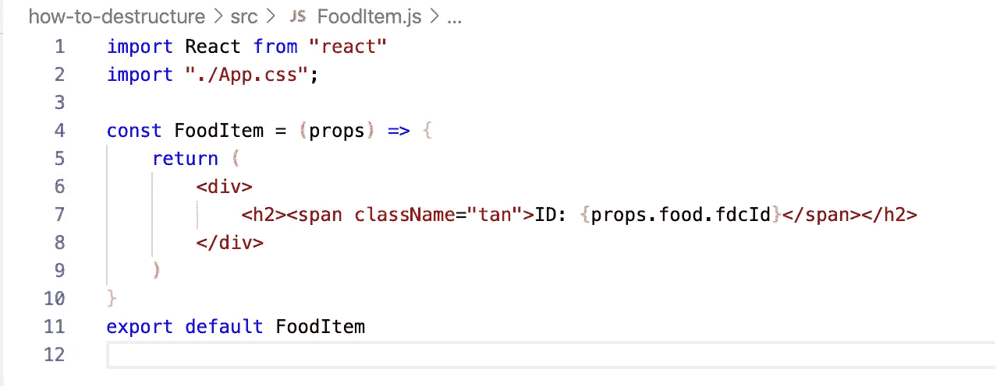
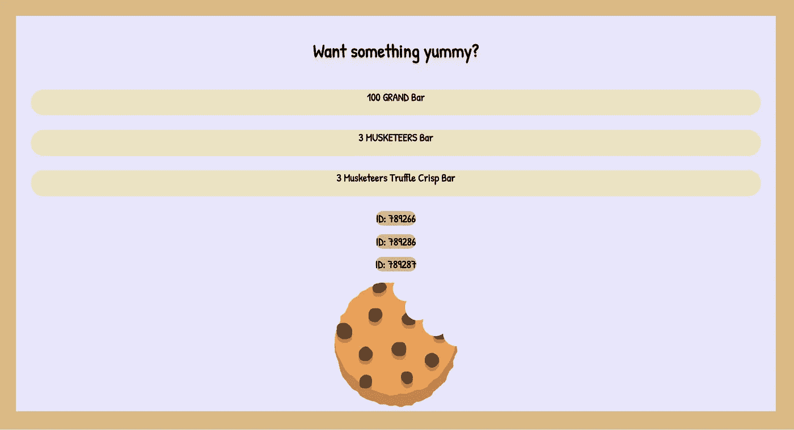

# 在 React 中应用基本析构

> 原文：<https://javascript.plainenglish.io/applying-basic-destructuring-in-react-ede119aab03e?source=collection_archive---------18----------------------->

欢迎光临！如果你以前在 React 工作过，你可能听说过术语**destructing**。析构是一个 ES6 约定，允许我们开发人员从数组中的数据提取值，或者从对象中提取属性。这很有用，因为我们可以选择我们需要的属性，并将它们赋给一个变量。解构的好处包括:

*   句法糖:只是看起来美观而已！
*   更干净简洁的代码:不用一遍遍重复“this.state”或者“this.props”。

析构不会改变正在使用的对象或数组。它通过合并我们想要使用的部分数据来简化代码，使得在处理组件之间的属性、状态和数据流时更容易阅读。

# **使用析构**

值得注意的是，析构在基于函数的组件和基于类的组件中的用法是不同的。让我们来看看每一种方法。

为了展示析构是如何工作的，我使用美国农业部的 API 创建了一个具有读取功能的小应用程序，并提取了一些数据显示到 DOM:

在上面的图片中，我从一个对象访问了三个关于糖果条的描述——100 Grand Bar、3 shootiers Bar 和 3 shootiers Truffle Crisp Bar。可以在[这里](https://github.com/Ginger-Mano/how-to-destructure)找到该应用的链接！

# **类组件中的析构**

在分解代码之前，它看起来像这样:

您可以看到，我们在第 5–7 行将“somethingClicked”的状态设置为 false。在 return 部分，有一个三元语句使用 state 来决定何时返回一个类名为“yellow”或“cyan”的

。在每一个 div 中，都有一个

## 标签，带有食物描述的道具。让我们先摧毁这个国家。为此，我们必须:

1.  以“const”开始我们的变量
2.  使用花括号“{}”来保存我们正在提取的数据
3.  使变量等于“this.state”
4.  将“this.state”从调用“somethingClicked”的位置删除

现在让我们看看代码是什么样子的:

通过查看上面的图像，在渲染部分的第 23 行:

1.  我们用 const 开始变量
2.  我们将从 state 中提取的属性“somethingClicked”放在花括号内
3.  我们让 const {somethingClicked}等于“this.state”
4.  在第 25 行，我们在点击之前删除了“this.state”

太棒了。现在我们必须处理道具。在 h2 标签中，道具是从花括号内带有“description”属性的组件传递下来的:

## { this . props . food . description }

。对于道具，我们将遵循上述 4 个步骤:

在 render 部分的第 24 行，我们创建了一个变量，接受两个提取的属性“description”和“ingredients”，并将它们等同于“this.props.food”(因为对象有嵌套数据，“food”包含在“this.props”的末尾。在许多情况下，可能仅需要“this.props”)。然后在我们的 h2 和 h3 标签中，我们删除了“描述”和“配料”之前的“this.props.food”。我们在第 23-24 行提到过 this.state 和 this.props.food，以后再也不用提了。

# **在功能组件中析构**

函数组件在析构时使用类似的约定。记住，在功能组件中没有状态，我们不需要使用术语*这个*。下面是函数组件在析构之前使用 props 的样子:

为了销毁 props，我们将在第 5 行的 return 之前设置变量，并在第 7 行的“fdcId”之前删除“props.food ”:

现在你知道了！在函数组件中进行了析构！现在来看这个应用程序，我们可以在条形描述下面看到 3 个 ID 号:

# 外卖食品

React 中的析构在很多方面都非常有用。请记住:

*   它提供了句法糖
*   保持我们的代码简洁明了
*   在函数和类组件之间的使用是不同的
*   让美国开发人员了解最新的 ES6 惯例

感谢阅读！我希望这些基本的析构技术是有帮助的！如果有，通过 [**订阅我们的 YouTube 频道**](https://www.youtube.com/channel/UCtipWUghju290NWcn8jhyAw?sub_confirmation=true) **获取更多类似内容！**