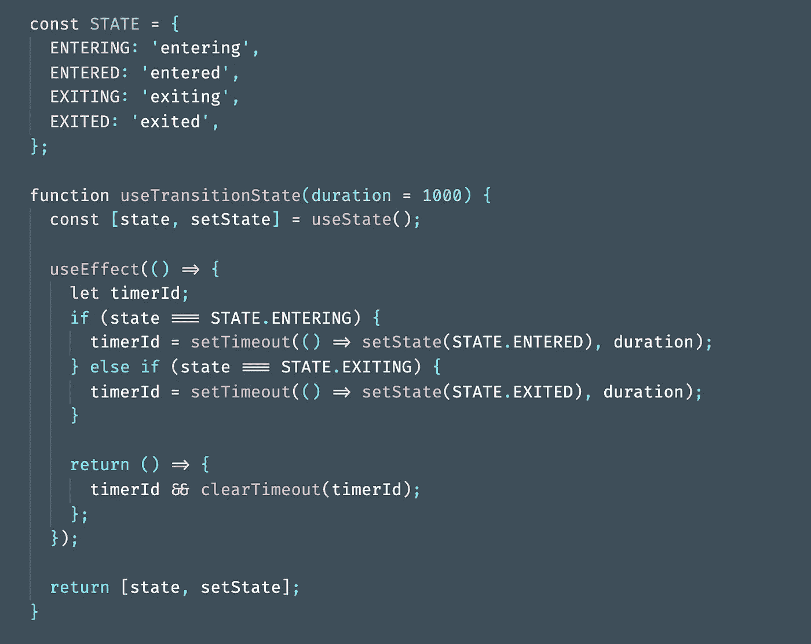
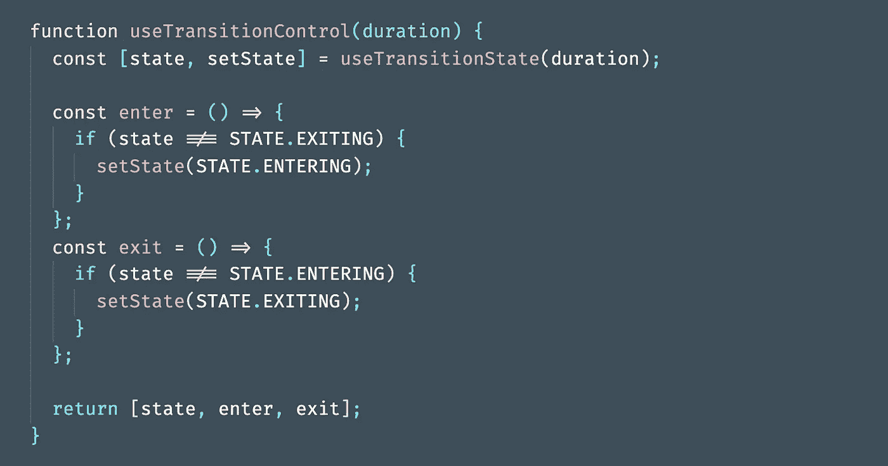

# 使用 React 挂钩应用 CSS 过渡

> 原文：<https://javascript.plainenglish.io/applying-css-transitions-with-react-hooks-7bd84671bc6b?source=collection_archive---------2----------------------->

Photo by [Chris Lawton](https://unsplash.com/@chrislawton?utm_source=medium&utm_medium=referral) on [Unsplash](https://unsplash.com?utm_source=medium&utm_medium=referral)

虽然有许多流行的库，如 [React Transition Group](https://reactcommunity.org/react-transition-group/) 和 [React Motion](https://github.com/chenglou/react-motion) 来制作组件动画，但了解某个东西如何工作的最好方法之一是从头开始构建它。在本文中，我们将学习如何只用钩子创建进入和退出过渡。

首先，下面是组件生命周期中的各个过渡阶段。

1.  安装好的
2.  进入
3.  进入
4.  出口
5.  退出
6.  未上炮架的

当一个组件被**挂载**时，这意味着它作为一个 DOM 元素出现，不管它的风格如何。当**卸载**时，意思相反，即从 DOM 中移除。传统上，在一个元素被挂载后，在回车上合成动画是没有问题的，但是当它被卸载时，动画就比较棘手了，因为 React 会在过渡前移除元素。因此，我们需要一个过渡性的退出状态来隐藏元素。

我们将逐步构建完整的功能，所以让我们从一个简单的钩子`useTransitionState`开始，它将通过提供的`duration`从`entering -> entered`和`exiting -> exited`改变状态。这是通过`useEffect`钩子实现的，它允许你执行副作用，比如在 DOM 更新后执行定时器。作为一个清理功能，我们将确保计时器被清除，以避免内存泄漏。

接下来，我们将把这个钩子放在另一个钩子`useTransitionControl`中，这个钩子为用户提供了两个回调函数来在进入和退出状态之间切换。

现在我们已经准备好在一个实际的组件中使用它了。我们必须为它提供一个 css 样式的对象，以便根据不同的转换状态来应用，并提供`transition`属性来平滑效果。

如果我们想卸载组件，我们可以很容易地添加一个条件逻辑，当状态为`exited`时返回`null`。这对于呈现列表或其他组件组非常有用。

下面是最终结果！

*注意*:在这个例子中使用了内联样式，但是一般来说，类对于转换更有性能。另一种选择是使用 CSS-in-JS 解决方案，比如样式化组件。*

喜欢这篇文章吗？如果是这样，通过 [**订阅解码获得更多类似内容，我们的 YouTube 频道**](https://www.youtube.com/channel/UCtipWUghju290NWcn8jhyAw) **！**