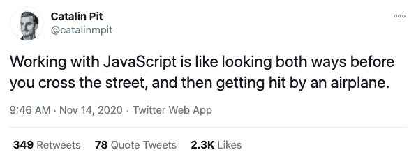
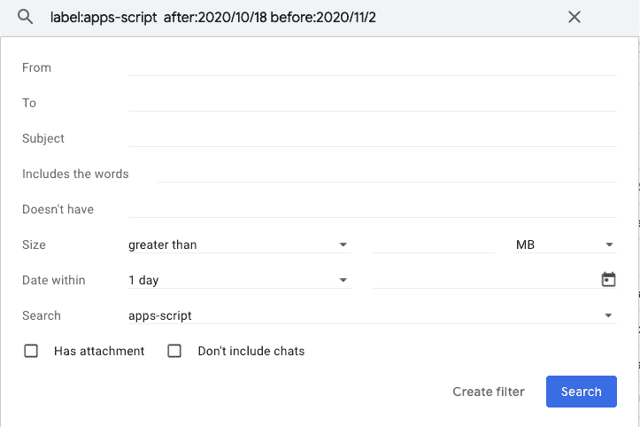
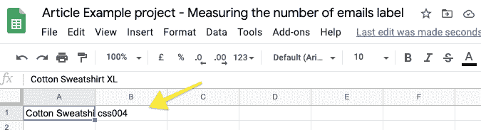
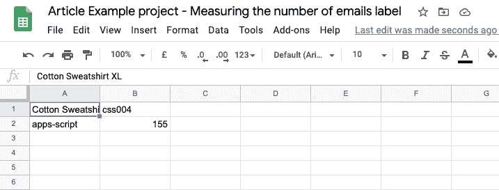

# Google Apps 脚本示例项目

> 原文：<https://javascript.plainenglish.io/apps-script-example-project-get-the-number-of-emails-with-a-specific-label-d7e1fb2e998b?source=collection_archive---------5----------------------->

## 获取带有特定标签的电子邮件数量


Photo by [Andreas Dress](https://unsplash.com/@andreasdress?utm_source=medium&utm_medium=referral) on [Unsplash](https://unsplash.com?utm_source=medium&utm_medium=referral)

软件开发很难。这条推文说明了专业开发人员有时是如何看待他们的工作的:



[https://twitter.com/catalinmpit/status/1327533237065969666](https://twitter.com/catalinmpit/status/1327533237065969666)

事情并不总是这样。在这篇文章中，我将展示一个*公民开发者*如何使用 Google Apps 脚本快速从想法转变为可行的解决方案。

*公民开发者是指使用公司 IT 认可的开发和运行时环境创建新的业务应用程序供他人使用的用户。过去，最终用户应用程序开发通常局限于使用 Microsoft Excel 和 Access 等工具构建的单用户或工作组解决方案。然而，今天，最终用户可以使用共享服务、第四代语言(4GL)风格的开发平台和云计算服务来构建部门、企业甚至公共应用。(*[*https://www . Gartner . com/en/information-technology/glossary/citizen-developer*](https://www.gartner.com/en/information-technology/glossary/citizen-developer)*)*

对我来说,*公民开发者*可以是任何发现 Google Apps 脚本的人。这篇文章就是从这个角度写的。我不会讨论使代码健壮和可维护所需做的所有事情。你写代码，你对使用和生命周期负责。

# 从用例到应用程序

第一步是理解用例。这意味着提出正确的问题。前景是自动化一些可以手动完成的事情。对于公民开发者来说，从这里开始非常重要。

在示例用例中，我们希望记录在某个时间段内具有某个标签的电子邮件的数量。这些信息应该记录在谷歌表。

如果我们打开这个，我们会得到:

1.  统计一段时间内收到的带有标签的电子邮件数量
2.  将这些信息记录在谷歌表单中

第一步是手动重现这些步骤。这里唯一的挑战是统计电子邮件。因此，我们确保可以手动完成这项工作:



Gmail screenshot of the search window

一旦我们确定我们可以手动完成所有的步骤，我们需要把它翻译成代码。这就是 Google Apps 脚本文档的用处([https://developers.google.com/apps-script](https://developers.google.com/apps-script))。

在我们的例子中，我们可以从 Gmail 推送信息，或者将信息拉进 Google 表单。为了获得更好的想法，我们可以看看指南[https://developers.google.com/apps-script/overview](https://developers.google.com/apps-script/overview)中的“扩展谷歌工作空间”部分。这里没有提到 Gmail，但是提到了 Google Sheets。

现在我们有几个选择。我们要么通读整份文件([https://developers.google.com/apps-script/guides/sheets](https://developers.google.com/apps-script/guides/sheets))并试着理解，要么浏览文件并试着找到一些我们可以开始的东西。我通常选择最后一个选项。在这种情况下，第一步是:

"要创建一个绑定脚本，从谷歌工作表中选择**工具>脚本编辑器**"

和一些将向工作表写入内容的代码:

```
function addProduct() {
  var sheet = SpreadsheetApp.getActiveSheet();          
  sheet.appendRow([‘Cotton Sweatshirt XL’, ‘css004’]);
}
```

## 手放在床单上

因此，我们创建一个工作表并打开脚本编辑器。或者您可以创建一份此表的副本:[文章示例项目—测量电子邮件标签的数量](https://docs.google.com/spreadsheets/d/19N5nkEi-1q1i3QLRhYsZ6EULv0Uizr27E87kMCLKyKI/edit#gid=0)

打开编辑器后，将代码粘贴到编辑器中。当我们运行代码时，我们得到一个结果:



让我们把它变得更像最终结果:

```
function countEmails() {
  var sheet = SpreadsheetApp.getActiveSheet();
  sheet.appendRow([‘apps-script’, 155]);
}
```

当我们运行代码时，我们看到标签和计数。



## 动手吧，开始计数

下一步是从邮件中获取实际的计数。这需要对 Apps 脚本中的服务有一点了解。打开参考页面上的 Google Workspace Services 部分([https://developers.google.com/apps-script/reference](https://developers.google.com/apps-script/reference))。我们想用 Gmail 做点什么，所以让我们打开 GmailApp 页面。

这是一个棘手的部分。这里我们需要将手动操作映射到应用程序脚本代码。这可能需要一些时间来发现。在我们的例子中，我们进行搜索，我们可以使用:[https://developers . Google . com/apps-script/reference/Gmail/Gmail-app # search(String)](https://developers.google.com/apps-script/reference/gmail/gmail-app#search(String))

我们已经有了查询，所以我们可以这样尝试:

```
function myFunction() { var threads = GmailApp.search(‘label:apps-script after:2020/10/18  before:2020/11/2 ‘); console.log(threads.length)}
```

确保用您自己的工作查询替换我的查询

有两个新东西，console.log()和 threads.length()。相信我，再运行一次代码。

## 双手合十，齐心协力

我们的脚步是

1.  统计一段时间内收到的带有标签的电子邮件数量
2.  将这些信息记录在谷歌表单中

也就是说:

```
function countEmails2() { var threads = GmailApp.search(‘label:apps-script after:2020/10/18 before:2020/11/2 ‘);
  var sheet = SpreadsheetApp.getActiveSheet() sheet.appendRow([‘apps-script’, threads.length]);}
```

# 包扎

在这篇文章中，我讨论了一个*公民开发者*可以采取的快速自动化任务的步骤。目标不是编写漂亮的可维护代码，而是将手工任务分解成可以编程的步骤。这样，流程就变得简单且易于管理。