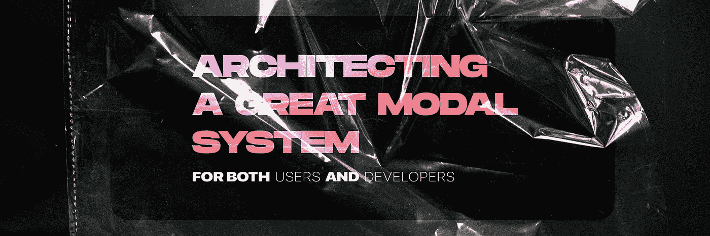
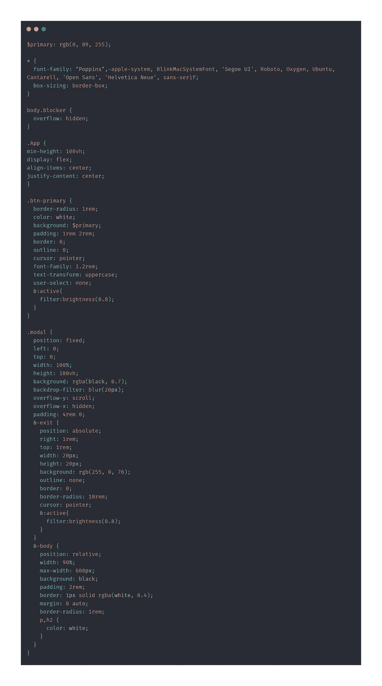
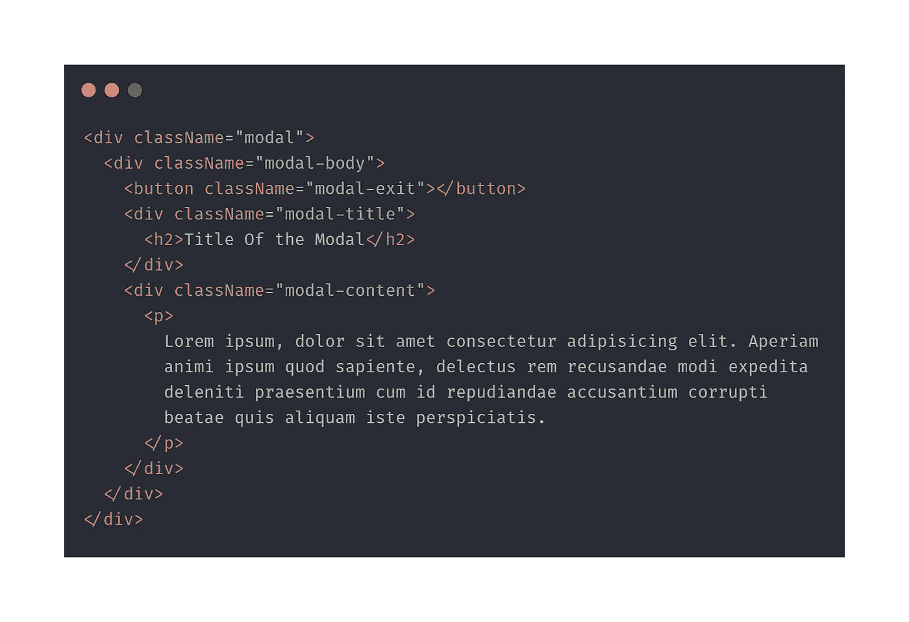
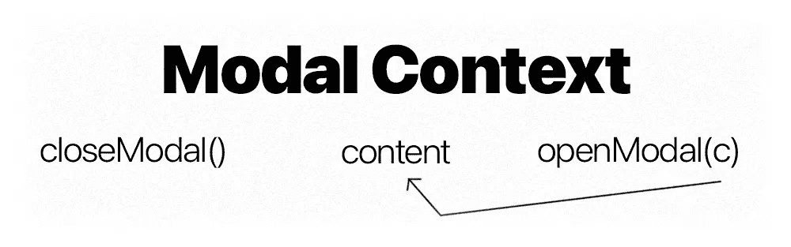
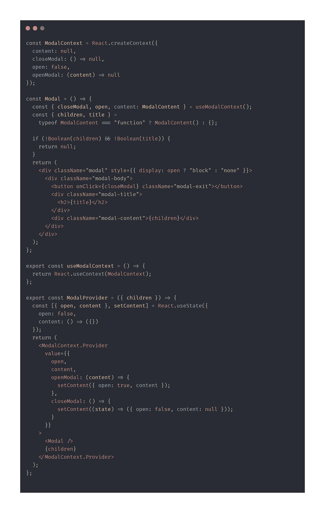
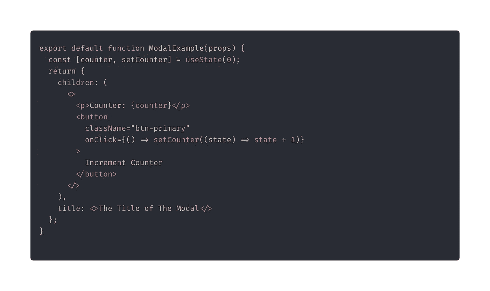
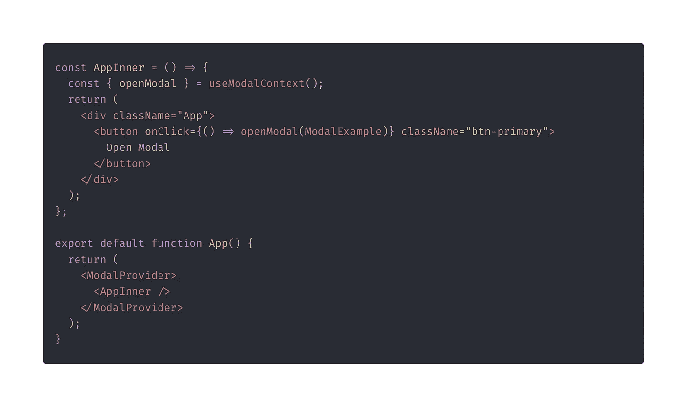
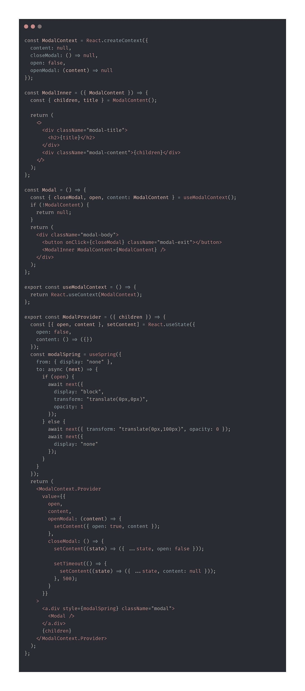

# 用 React 设计和制作模型

> 原文：<https://javascript.plainenglish.io/architecting-and-making-a-modal-with-react-75bf652ccc70?source=collection_archive---------4----------------------->

## 而不牺牲用户或开发人员的体验

# 我们为什么爱做出反应？

how I usually be

这是一个声明式 UI 构建工具。它以一种让一个组件做一件事的方式来分离关注点，而且它做得非常好。目前，我们编写函数，这些函数被其他函数调用，它们在屏幕上显示一些东西。很简单，也应该如此💅。我可以说几天我为什么喜欢这个库，但是我不会说，因为你们想做一个更好的模型。

# **先决条件—** 故事和造型

aka the boring stuff

该模式有一个带主体的包装。该主体有一个标题、退出按钮和内容。只是复制和粘贴样式，但我鼓励你写自己的。大多数样式来自用户故事。

包装器是固定的，因为我们总是希望它在视图的前面。当用户单击按钮时，模式在视图中打开，提供上下文中的内容，例如，阅读更多按钮。如果用户在主体外部或退出按钮上单击，则模式关闭。应该有一个进入/退出动画，并且模态内容在动画的整个持续时间内保持可见。当模式在视图中时，用户不能滚动页面。

the .scss file

the html

好了，现在已经解决了这个问题，我们可以开始讨论细节了。

# 建筑——肉和土豆

how this thing is gonna go down

我们会把整个事情放在一个环境中。上下文有两个功能和一个状态。上下文将公开这两个函数。一个函数将接受一个组件，该组件将放在内容变量中。另一个将关闭模态，一旦动画完成，它将清除内容。该内容将是一个准挂钩，这将公开一个有 2 个键{标题，儿童}的对象。这将允许我们使用钩子，而不牺牲可定制性。很简单。我们开始吧。

ModalContext.jsx — AKA the meat and potatoes

让我们弄清楚到底发生了什么。我们正在创建一个带有初始值的模态上下文，并创建一个助手钩子 useModalContext。我们正在创建实际的模态扩展组件，它将使用模态的内容作为一个“钩子”,它将公开一个孩子和标题属性。

让我们创建第一个模态扩展组件。我们只是要做一个普通的函数组件，返回一个对象，而不是 JSX。

Example Content for the Modal aka our Quasi Hook

怎么叫情态？这其实很简单。首先，我们需要将我们的应用程序包装在 ModalProvider 和 on the click 函数中，我们将使用我们漂亮的小 openModal 函数将模态扩展组件放入 ModalContext 的内容中。

App.jsx — This is basically how your app is going to look like.

# 用反应弹簧增加一些闪光

我可能有偏见，但我爱 React-Spring。这是目前 React 最好的动画库。它在你的组件之外制作动画，所以它不会渲染组件一百万次(或者准确地说是每秒 60 次)。它是声明性的，而且钩子非常棒。

为此，我们将不得不重新安排一切，这样我们就不会因为这样做而产生无数的错误，然后我会告诉你为什么。

首先，我移动了模态的父对象，这样我就可以将弹簧移动到模态上下文中，这样可以获得更好的性能和响应。然后，我将 ModalContent 移到另一个组件中。这很难解释，但是在执行这些准钩子时，会有堆栈跟踪错误。React 通常不想这么做，所以你得稍微欺骗一下(但是嘘，不要告诉任何人🤫).这避免了任何和所有的错误。

# VAC —瞧，注意事项

就我所见，一个也没有。我正在为一家相当大的公司(是一家汽车公司)的网站使用这个模态组件，它一直都很顺利。他们有 50 种不同的形式，有台阶和其他东西，而且支撑得非常好。

here’s the sandbox

Hey, that’s me

# 社交——跟踪我

我是一名全栈开发者。我举重(不是现在，因为整个 COVID 的事情)。我看动漫。我写 JavaScript，我没有斯德哥尔摩综合症。

🔗[网站](https://alekangelov.com/)

🔒[领英](https://www.linkedin.com/in/alekangelov/)