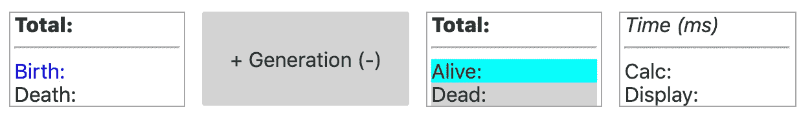
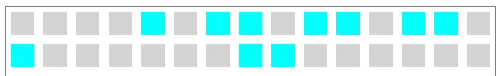

# 用 Svelte 构建的 web 应用程序的架构

> 原文：<https://javascript.plainenglish.io/architecture-of-a-web-application-built-with-svelte-1ea9614228f4?source=collection_archive---------1----------------------->


通过这篇文章，我想让你和我一起踏上一段旅程。这个旅程是关于发展一套规则，以利用过去两年中最令人惊叹的新软件开发工具之一。

# 放弃

作为一名架构师，我有时必须提供代码来说明想法背后的概念。但是不要指望我解释这些代码是如何工作的以及为什么工作。你会找到很多比我更好的资源。

# 介绍

当我偶然发现 [**苗条的**](https://svelte.dev/) 时，我被拥有一种构建 web 应用程序的新方法的前景迷住了。首先吸引我的是用 html 编写代码的自然习惯——不像在 React、Vue 或 Angular 等熟悉的框架中那样被复杂的结构所困扰。

我开始研究[文档](https://svelte.dev/docs)，遵循[教程](https://svelte.dev/tutorial)和[示例](https://svelte.dev/examples)，尝试 [REPL](https://svelte.dev/repl) 编写我的第一个简单应用程序——姑且称之为*App.html*。

这三个块很容易识别:任何要在屏幕上绘制的 *html* 元素、*style/>*来定义相应的 css，以及 *< script/ >* 来用 JavaScript 编写所需的代码。

但是这个片段不能在浏览器中运行。它有一个事件处理程序 *{clicked}* 的快捷方式，必须先翻译。这就是苗条的人在幕后做的事情。它将代码编译到一个浏览器友好的环境中，翻译快捷方式并将所有部分放置到位。

让我们看一个简单的起点*index.html*

```
<!doctype html>
<html>
<head>
 <meta charset='utf8'>
 <meta name='viewport' content='width=device-width'>
 <title>Conway's Game of Life</title>
 <link rel='stylesheet' href='global.css'>
 <link rel='stylesheet' href='bundle.css'>
 <script defer src='bundle.js'></script>
</head>
<body></body>
</html>
```

为了提供这个 html 文件，Svelte 需要编译并将 **html** 和 **JavaScript 代码**捆绑到 *bundle.js* 中，将 **css 代码**捆绑到 *bundle.css* 中。瞧啊。

我们现在可以愉快地开始编码了——用这三个块填充我们的*App.html*。Svelte 并没有规定你如何构建你的代码。它只是一个工具，让你找到自己的方式作为一个编码和生产纯 html 之后，直接在浏览器中运行。让我们看看如何将应用程序分割成可理解的部分。

# 成分

亲爱的，我把应用程序缩小了！

*App.html*现在使用组件*Button.html*(*导入按钮…* )公开他的名字(*导出字母名字*)并传播由父组件 *{clicked}* 处理的 on:click 事件。
为了容易区分组件和原生 html 元素，它们的名称必须大写，如*<****B****按钮……/>*。

这是一个非常简单的例子，仅仅是闻到奥斯曼厨房里的香草味。我建议你去看看更复杂的一种，找出它不同的味道。为此，我编写了一个 web 应用程序，以朴实无华的可视化方式展示了“ [**【康威的人生游戏】**](https://en.wikipedia.org/wiki/Conway%27s_Game_of_Life#Rules) ”。对 [**完整源代码**](https://github.com/jcschmidig/Game-of-Life) 感兴趣请点击链接。您还可以在这个 [**jsfiddle**](https://jsfiddle.net/vq341tcd/1/embedded/result/) 中找到生成的 html 页面。

# 作文

这个“单人游戏”由三部分组成:


Starting conditions (<Start/>; Start.html)



Game button and statistics (<Game/>; Game.html)



Board with its fields (<Board/>; Board.html)

正如你可能猜到的，所有三个部分都在*App.html*中构建自己的组件

App.html

你在这里看到的应该已经很熟悉了。三个组件< *Start/ >* 、< *Game/ >* 和< *Board/ >* 被给定一些输入数据，并传播不同的事件，这些事件必须由父应用程序(*App.html，参见下面的*)。

在这个相当大的介绍之后，我想继续我答应你要制定的规则。背后的原因是， **Svelte** 是一个工具，在推荐某些行为的同时，并没有也无法强制执行我提议你的严格使用。

# 规则 1:使用流量控制

必须有一个地方来控制应用程序的流程。这通常是集成组件的事件被分派到的根组件。让我们看另一个例子，通过<start>组件的透镜减少 App.html:</start>

*< Start/ >* 组件有一个绑定到 *{dimension}* 的输入字段和一个*on:click*event { create board }触发( *dispatches* )父组件上的*事件，其参数为 **dimension** (板长)。*

*这种结构自然地让信息从一个组件流向另一个组件。*

# *规则 2:保持关注点的分离*

*通过对不同的任务严格使用不同的组件，我们可能能够单独构建有用的模块，以便在许多不同的情况下很好地集成。*

*正如我们已经看到的，这样一个组成部分*

*   *公开了一个默认的 html、css 和数据接口( *export let < var >* )，这些接口可以导入到任何其他组件中(*import<Component>from……*)。*
*   *将( *on:click* )或调度(*on:click = {<method>}*)事件传播到父组件，使流程在一个地方得到控制。*

***但还有更多。**
下面的代码片段显示了一个组件***Measure.html***，正如您所料，它能够启动和停止计时器，并返回上次运行的差值。
首先，您会发现默认的组件界面通常包含 html、css 和脚本。
其次，还有另一个 *<脚本>* 标签，增加了属性 *context="module "。*虽然保存在同一个文件中，但是本节中的 JavaScript 代码没有连接到默认组件接口，必须完全独立地实现。*

*其主要目的是映射支持组件可视化的逻辑。在这种情况下，它公开了一个 *createMeasure* 函数，返回一个用 JavaScript 对象封装的接口。*

*以下代码片段显示了该组件在*App.html*中的用法:*

*现在你可以看到*Measure.html*是如何服务于其他组件的。由*App.html(create measure)*实例化，通过事件由*棋盘*组件启动和停止，最后由*游戏*组件通过 *showDiff* 变量显示。*

# *规则 3:维护状态*

***斯韦特的**最大优势在于其反应性。这自然是通过以下方式实现的*

*   *观察默认组件界面的任意变量(*导出让<变量>* )*
*   *使用特殊语法指定附加观察值( *$: var= <值>，*见下文)*

*一旦这些可观察到的东西发生了变化，依赖于其中一个的每个组件都会立即更新。*

*举个例子，我们来看看*板卡*组件使用的 *Field* 组件的镜头，该组件由 *App* 组件控制。*

**Board* 组件暴露了一个参数( *export let rows* ，见下文)由*App.html*用来初始化该板(*<Board { rows }……/>*)。在任何事件(清除、创建、翻转)中，*板*变量是新设置的，并通过可观察部分(*$:……*)触发*行的更新。**

**Board* 组件在暴露的*行* ( *{#each …}* )的每个单元格中实例化一个*字段*组件，并提供一个组件接口，该接口提供了操作( *create* ， *clear* ， *…* )其状态的方法。*

**字段*组件接受三个参数( *index、state、changed* )，并使用 css 类( *{colorState}* 、 *{colorCycle}* 来反映单元格的状态以及它是否已更改。顺便说一下，这是在屏幕上更新 DOM 元素的最快技术。
同样，可观察值( *$: …* )用于在单元状态改变时保持这些变量最新。*

# *摘要*

***Svelte** 让你自然地编码 html，关心后台所有模糊的东西。*

*通过遵循三条黄金法则，您能够构建丰富而复杂的 web 应用程序:*

*   ***#1:使用流量控制** 这意味着一个好的应用程序设计，把它分解成小的组件，不管它们的目的是可视化还是展示一些逻辑，或者两者都有。子组件中的事件被传播到根组件并通过 observables 返回到子组件，从而触发流。*
*   ***#2:保持关注点分离** 通过用一种创建方法编写组件，将逻辑与表示严格分离，这种创建方法在提供给其他组件的 JavaScript 对象中返回其接口。这概括了你的逻辑，给你一个体面的睡眠。*
*   ***#3:维持状态**
    这听起来比实际简单。有三种变量:成分变量、可观察变量和自由变量。Svelte 观察组件参数以触发 DOM 更新，并根据其输入保持观察值最新。将这些变量与用于内部逻辑的任何其他变量严格分开，不要在它们的作用域之外更改它们。*

# *结论*

*苗条的人做了一件惊人的工作。构建上面提到的 web 应用程序，我发现它是*

*   *原型制作非常快*
*   *产品代码非常小(压缩了大约 7 kB，包括 html、css、JavaScript 和 sveltejs 代码)*
*   *通过直接更新 DOM 和尽可能使用 css 来提高性能*

*苗条的组件是 [Web 组件](https://www.w3.org/wiki/WebComponents/)更好的兄弟姐妹，谢谢 [Rich Harris](https://medium.com/u/a11f7c00cbbe?source=post_page-----1ea9614228f4--------------------------------) 提供了一个神奇的工具！*

*我希望你喜欢阅读，有一个伟大的时间！*

## *本文中使用的链接*

*   *[苗条的](https://svelte.dev)*
*   *[康威的人生游戏](https://en.wikipedia.org/wiki/Conway%27s_Game_of_Life#Rules)*
*   *[Github 上的源代码](https://github.com/jcschmidig/Game-of-Life)*
*   *js dild 上的[生产代码](https://jsfiddle.net/vq341tcd/1/embedded/result/)*