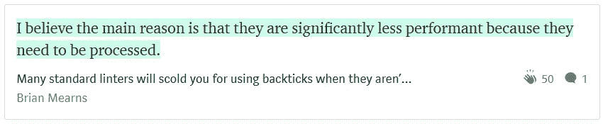
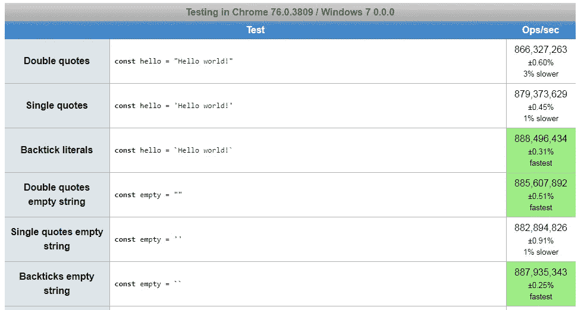
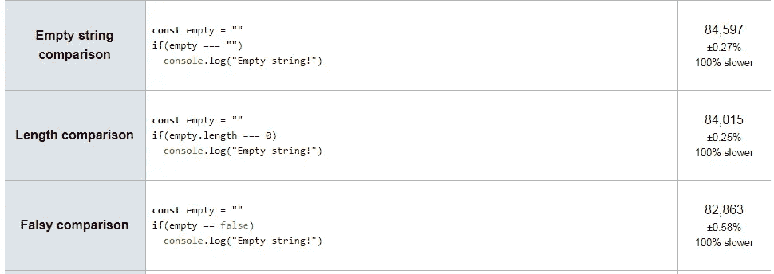
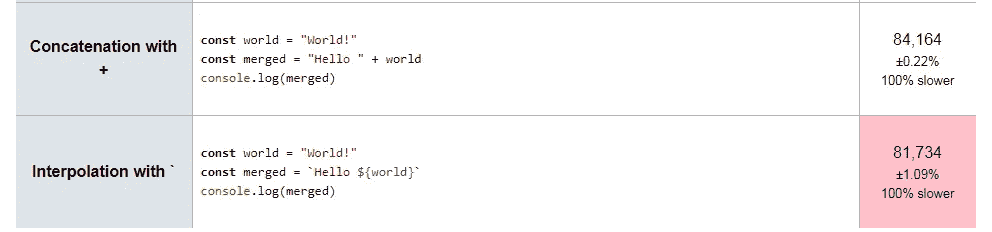

# 反斜线(``)比 JavaScript 中的其他字符串慢吗？

> 原文：<https://javascript.plainenglish.io/are-backticks-slower-than-other-strings-in-javascript-ce4abf9b9fa?source=collection_archive---------1----------------------->

## 我使用 jsperf 运行了一些测试，以找出哪个字符串字符运行得最快，以及与空字符串进行比较是否比检查空字符串的其他方法慢。

Photo by [Evi Radauscher](https://unsplash.com/@eviradauscher?utm_source=medium&utm_medium=referral) on [Unsplash](https://unsplash.com?utm_source=medium&utm_medium=referral)

# JavaScript 中字符串文字的速度

一个 [最近](https://medium.com/@mearns.b/many-standard-linters-will-scold-you-for-using-backticks-when-they-arent-actually-needed-i-2e20ffcc8ff6)在[我的中型博客](https://medium.com/@derek_develops)上的评论让我想知道在 JavaScript 中用于创建字符串文字的字符之间是否存在性能差异:

作者布莱恩·梅恩斯带着一个我从未想过的有趣观点来访。他说反斜线文字的性能较低(换句话说，较慢)，因为它们需要处理。

换句话说，我们希望从反斜线文字得到的变量插值是一个致命的弱点——处理模板文字会降低性能。

这让我想知道这是否是真的，如果是这样的话，这是否是那些性能优化之一，现在计算机速度如此之快已经不重要了。还是说对于 JavaScript 性能来说还是大事？

这让我想知道，如果我们选择只使用反斜线文字，我们会牺牲多少性能，就像重新呈现组件和重新呈现 DOM 一样。额外的组件重新渲染会降低应用程序的速度，但是多次重新渲染 DOM 会降低性能。

Photo by [Cosmic Timetraveler](https://unsplash.com/@cosmictimetraveler?utm_source=medium&utm_medium=referral) on [Unsplash](https://unsplash.com?utm_source=medium&utm_medium=referral)

# 与 jsperf 的性能比较

使用一个字符创建的字符串文字比使用另一个字符创建的要慢？这听起来很奇怪，有点荒谬，但这是真的吗？

类似地，我读到过使用空字符串`“”`通过比较来检查一个字符串是否为空比检查长度或进行虚假的比较要慢。但这也有关系吗？

Photo by [Ludomił](https://unsplash.com/@ludovenividivici?utm_source=medium&utm_medium=referral) on [Unsplash](https://unsplash.com?utm_source=medium&utm_medium=referral)

# 解决方案:用 jsperf 进行速度测试

我想找到答案，所以我使用免费工具 [jsPerf](https://jsperf.com/) 运行了[一些测试用例](https://jsperf.com/string-speed-comparison)来测量性能。我检查了三组代码片段:

1.  单引号、双引号和反引号；
2.  用于检查空字符串的字符串比较；和
3.  带反斜杠的插值与字符串连接

结果是 ***触目惊心！***

Photo by [Fezbot2000](https://unsplash.com/@fezbot2000?utm_source=medium&utm_medium=referral) on [Unsplash](https://unsplash.com?utm_source=medium&utm_medium=referral)

# 第一个测试:创建字符串和空字符串

B acktick 文字实际上是**创建最快的字符串文字**，尽管差别不到 1%。

在创建 Hello World 字符串和空字符串时，`jsperf`都选择反斜线作为最快的字符串文字。

从这个角度来看，像 ESLint 这样的 linter 没有理由在默认情况下不允许使用模板文字(反勾号`` ` ),至少没有理由认为反勾号的性能较差。

Photo by [Sean O.](https://unsplash.com/@seantookthese?utm_source=medium&utm_medium=referral) on [Unsplash](https://unsplash.com?utm_source=medium&utm_medium=referral)

# 第二个测试:检查空字符串

又一个城市传说被终结了！使用字符串文字实际上导致最快的比较，虽然也是不到 1%。

值得注意的是，创建字符串文字(第一组测试)比在 JavaScript 中运行这些比较测试要快 10000 多倍。

因此，即使在创建字符串文字上花费了额外的时间，创建字符串文字也可能比你的其他代码要快得多。

像几乎**每秒钟可以创建**1 万亿个字符串文字**比**快。

公平地说，我使用了非常短的字符串，在处理大量数据时，性能可能会有很大差异。

Photo by [Derek Thomson](https://unsplash.com/@derekthomson?utm_source=medium&utm_medium=referral) on [Unsplash](https://unsplash.com?utm_source=medium&utm_medium=referral)

# 第三个测试:拼接与插值

困难在于:插值实际上比字符串连接要慢，这也是我认为 Brian Mearns 最初的观点。

另一方面，我不认为 Brian 建议我们放弃代码可读性，回到字符串连接。

而且，对于我的观点“如果我们要标准化，就让我们标准化反斜线”——这仍然是有效的，因为反斜线对于非内插字符串来说是一样快，正如我们在第一轮测试中看到的那样。

换句话说，内插法可能比字符串串联法慢，但是大多数 JavaScript 开发人员会倾向于使用反斜线文字，因为这样可以写出更简洁的代码，尽管对性能影响不大。

Photo by [Michael Monahan](https://unsplash.com/@mondophoto?utm_source=medium&utm_medium=referral) on [Unsplash](https://unsplash.com?utm_source=medium&utm_medium=referral)

# 总结:字符串是 Javascript 中的字符串

使用`jsperf`测试字符串文字的性能，我发现不同文字的执行速度只有很小的差异。

这些都在测量误差范围内，所以 JavaScript 中不同类型的引用文字在性能上可能没有实际差异。

我们可以消除反引号很慢的神话，同时仍然认识到大多数人更喜欢单引号或双引号的可读性。

正如我[之前写的](https://medium.com/javascript-in-plain-english/the-real-difference-between-single-quotes-and-double-quotes-in-javascript-3d00bf720bcd)，我通常在变量插值和多行字符串中自由使用双引号和反斜线。

没必要挑剔！😁

Photo by [Sai Kiran Anagani](https://unsplash.com/@_imkiran?utm_source=medium&utm_medium=referral) on [Unsplash](https://unsplash.com?utm_source=medium&utm_medium=referral)

# 其他资源:

*   [Jimmy Breck-McKye](https://medium.com/u/b980e772eb8?source=post_page-----ce4abf9b9fa--------------------------------) 在他的博客上写了一篇关于如何使用`jsperf`的指南[:](http://www.breck-mckye.com/blog/2014/08/using-jsperf-a-how-to-guide/)

 [## 使用 jsPerf:操作指南

### 如果您对测试特定 JavaScript 的性能感兴趣，您可能会对 jsPerf 感兴趣…

www.breck-mckye.com](http://www.breck-mckye.com/blog/2014/08/using-jsperf-a-how-to-guide/) 

*   [SitePoint](https://www.sitepoint.com/measuring-javascript-functions-performance/) 有一篇关于使用内置`performance.now()`函数测量 JavaScript 代码性能的文章:

 [## 测量 JavaScript 函数的性能- SitePoint

### 性能在软件中一直扮演着至关重要的角色。在网络上，性能甚至更重要，因为我们的用户…

www.sitepoint.com](https://www.sitepoint.com/measuring-javascript-functions-performance/) 

*   [Nicolás Bevacqua](https://medium.com/u/bede4dfef55e?source=post_page-----ce4abf9b9fa--------------------------------) 写道，在 [PonyFoo](https://ponyfoo.com/articles/template-literals-strictly-better-strings) 的所有情况下，模板文字严格优于其他字符串:

 [## 模板文字严格来说是更好的字符串

### 假设有一个 ES6 代码库，有几种方法可以在字符串中进行插值。你可以使用字符串连接…

ponyfoo.com](https://ponyfoo.com/articles/template-literals-strictly-better-strings) 

*   Andrew Odri 的这个 [StackOverflow 答案](https://stackoverflow.com/a/29083467)提供了额外的数据，在字符串文字的性能方面发现了类似的结果:

 [## ES6 模板文字比字符串连接快吗？

### 感谢贡献一个堆栈溢出的答案！请务必回答问题。提供详细信息并分享…

stackoverflow.com](https://stackoverflow.com/a/29083467) 

*   [Maya Shavin](https://medium.com/u/98cbd966a4c9?source=post_page-----ce4abf9b9fa--------------------------------) 报告称，字符串连接或插值是否更快可能取决于浏览器，因此可能不值得优化:

 [## ES6 Cool stuff——带有模板文字的新 JS 字符串

### 嗯，字符串支持是现代语言为用户界面提供的一个很好的特性。问题是去哪…

medium.com](https://medium.com/front-end-weekly/es6-cool-stuffs-a-new-js-string-with-template-literals-c23a8af11b2) 

*   我将在 [Better Programming](https://medium.com/p/6fd21b089672) 的后续文章中检验使用 Babel 来传输反签文字是否会恢复任何性能损失:

 [## Babel 会把反斜线(``)编译成引号吗？这会让 JavaScript 代码更快吗？

### Babel 将使用 transform-template-literals 插件编译 ES2015 特性反斜线文字

medium.com](https://medium.com/better-programming/does-babel-compile-backticks-to-quotes-and-does-that-make-javascript-code-faster-6fd21b089672) 

Photo by [Mickey O'neil](https://unsplash.com/@mickeyoneil?utm_source=medium&utm_medium=referral) on [Unsplash](https://unsplash.com?utm_source=medium&utm_medium=referral)

[Derek Austin](https://www.linkedin.com/in/derek-austin/)博士是《职业规划 [*:如何在 6 个月内成为 6 位数成功程序员*](https://www.amazon.com/dp/B0BRJDLJ43) 的作者，现在亚马逊上有售。