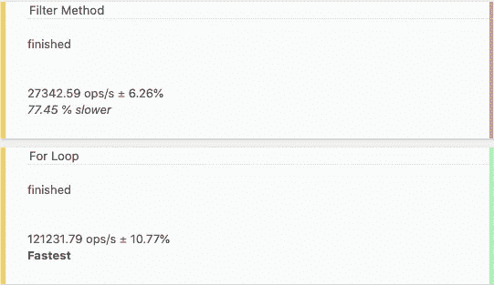
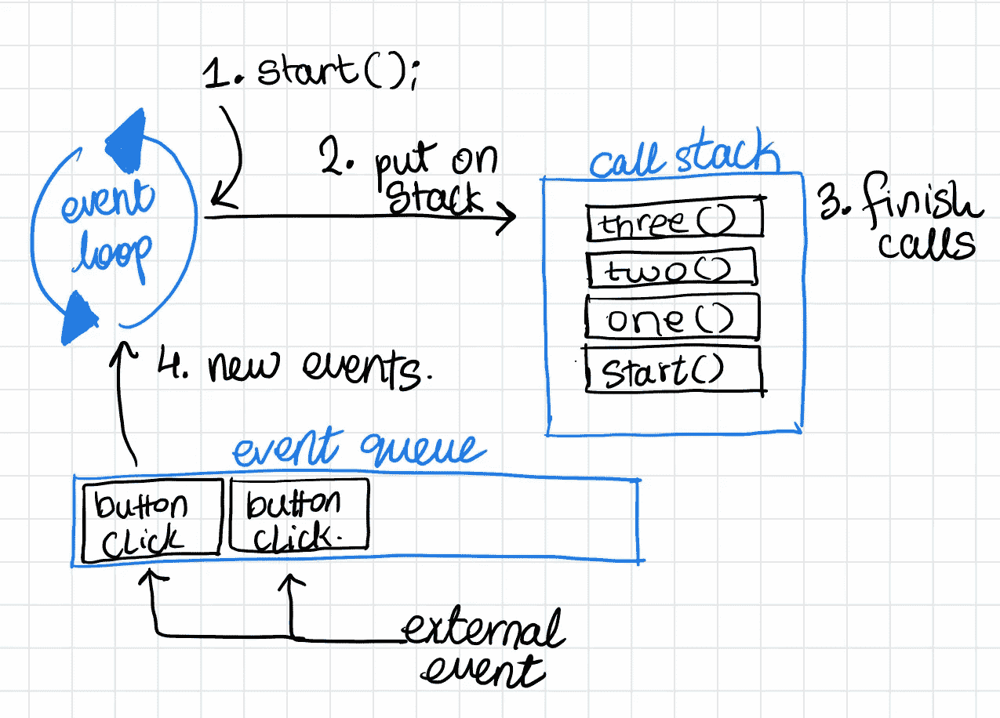

# JavaScript for 循环比 filter()和 forEach 好吗？()

> 原文：<https://javascript.plainenglish.io/are-for-loops-better-than-arrays-filter-or-foreach-methods-f54b6880d201?source=collection_archive---------1----------------------->

## 在过去的几年里，ES6 中的 filter()、forEach()和 map()等方法变得非常流行。但是他们真的更好吗？

我们都习惯了 Array.map 和 Array.filter 为我们提供的简洁代码，但是对于现实世界的应用程序来说，正则 for 循环比这些方便的方法更好吗？

在将 Array 类中的方法与“旧的”for-loop 方法进行比较时，我们将考虑几个指标:性能、可读性和可伸缩性。下面是我们今天要比较的环路类型的一个示例:

```
const items = [’abc’, ’def’, ’ghi’, ’jk’];
```

这是`filter`方法的一个完美用例:

```
const threes = items.filter(item => item.length === 3);
```

或者解决问题的 for 循环方法:

```
const threes = [];
for(let i = 0; i < items.length; i++) {
  if (items[i].length === 3) {
    items.push(items[i]);
  }
}
```

# 寻找最好的

对于本文中我们考虑的所有方法，很明显它们的时间复杂度是 **O(n)** 。也就是说，在最坏的情况下，我们至少需要数组中的每个元素来解决这个问题。想想看:我们无法过滤掉长度为 3 的项目，除非*实际上查看每一个项目。如果我们停在中间，也就是 O(n/2)，我们还没有解决问题。*

考虑到我们有相同的时间复杂度，我们需要考虑三个问题:

*   哪种方法更快？
*   哪种方法的可扩展性更强？
*   哪种方法更具可读性和可维护性？

## 因素一:性能

在 JavaScript 中，可以用每秒操作数来计算性能。虽然我们不能直接访问 CPU 来测试我们的代码在如此接近“金属”的地方的性能，但是我们可以做的是测试我们的代码运行的速度。

我们将利用一个名为 [Benchmark.js](https://benchmarkjs.com/) 的库来帮助我们，这将为我们提供具有统计意义的结果。Benchmark 将多次迭代运行我们的代码，并为我们计算出结果的平均值。为了进行测试，我选择了一个包含 1000 个“Person”对象的数组，这些对象的属性包括:姓名、年龄和性别。对于我们的基准测试，我们将**过滤**任何年龄超过 10 岁的人。

```
const people = [
  {name: ’Jane Doe’, age: 32, gender: ”Female”},
  ... 999 other persons
}
```



Screenshot by the Author, Aman Bhimani. Library: Benchmark.js.

令我们惊讶的是，for 循环比`Array.filter`方法快得多。准确地说，Filter 方法比 for loop 慢 77%。这是为什么呢？一个原因可能是 for 循环同步运行，filter 方法为数组中的每个元素创建一个新函数。然后，这个新函数被放到调用堆栈上，并由事件循环逐个运行。这种开销需要时间，而 for 循环完全忽略了这一点，并在同一个函数中运行您的操作。

很明显，如果我们从每秒操作数或时间的指标来看，for 循环是纯粹性能的明显赢家。我们将不得不看看它在其余两个指标中的位置，以及它是否是一个明显的赢家。

## 因素二:可读性

当然，编写代码的主要因素之一是可读性。可读性更好的代码更容易维护，即使它只是一个简单的 for 循环。当我们在 for 循环中看到*单词*而不是数字时，我们就明白了。数组附带的方法名比编写 for 循环更具描述性。

*   indexOf =查找匹配的第一个元素的索引
*   forEach =对每个元素运行函数
*   filter =筛选任何匹配的元素

```
const threes = [];
for(let i = 0; i < items.length; i++) {
  if (items[i].length === 3) {
    items.push(items[i]);
  }
}
```

让我们以之前的三为例，对其进行更深入的分析。

*   第一行没有意义，我们创建了一个新的数组来保存我们过滤的元素，但是它没有添加任何业务逻辑。
*   第二行也是无意义的—它只是在整个数组中循环，这里没有业务逻辑。
*   第三行是逻辑，我们需要长度为 3 的元素。
*   第四行也没有逻辑——它只是结束了我们的函数。

```
const threes = items.filter(item => item.length === 3);
```

当我们将它与我们的过滤器示例进行比较时，它被限制在一行中，这一行包含了所有需要的逻辑。

## 因素三:可扩展性

为了理解 JavaScript 中的可伸缩性，我们需要首先理解 JavaScript 在核心部分是如何工作的:事件循环和事件队列。由于 JavaScript 是单线程的，我们一次只能运行一个操作。现代网站和网络应用程序需要同时进行多项操作，那么这是如何实现的呢？事件循环通过共享浏览器窗口可用的单线程来实现这一点。



Sketch by the author, Aman Bhimani.

上图描述了 JavaScript 事件循环是如何工作的。我们有事件队列，它将事件存放在先进先出队列中。当一个函数在事件循环中启动时，它会创建自己的“调用堆栈”，所有的函数引用都放在这个堆栈中。但问题是，这对我们真的有帮助吗？

不幸的是，for-loops 或 forEach 不使用事件循环，但它们是同步运行的(for-loops)或放在调用堆栈上的(forEach)。这也意味着使用这些循环数据的方式中的任何一种都会**阻塞**任何其他需要在主线程上运行的任务。

作为一个例子，我们可以考虑下面的代码。在装载正文时，我们启动一个函数，打印前 10，000 个数字。我们有一个按钮可以运行打印“你好”的功能。

```
function start() {
  for(let i = 0; i < 10000; i++) {
    console.log(i);
  }
}function print() {
  console.log('HELLO');
}
```

index.html:

```
<body onload="start()">
  <button onclick="print()">print</button>
</body>
```

当页面加载时，开始打印数字。如果我们在 数字 9999 前按下*按钮，不会立即打印出来。这是因为按钮`onclick`事件，被放在事件队列中。一旦事件循环可以自由调用下一个事件，它就会运行。我们使用哪种类型的循环进行迭代并不重要。*

```
1
2
————-> click button
3
...
9994
9995
9998
————-> click button
9999
HELLO
HELLO
```

# 我们如何让它变得更好？

如果您的数组大小“很小”，那么使用常规的旧 for 循环显然对运行时性能更好。但是，如果您正在寻找最大的可伸缩性，我们需要更好地思考。我们需要滥用语言机制，利用事件循环。从现在开始，有几条路可以走:

*   每次迭代都是一个新事件
*   数组的每个“块”都是一个新事件

在我们的下一个练习中，我们将尝试创建一个“for”循环，该循环将事件循环考虑在内，并使这种 for 循环思想对于更大的数组集合具有无限的可伸缩性。