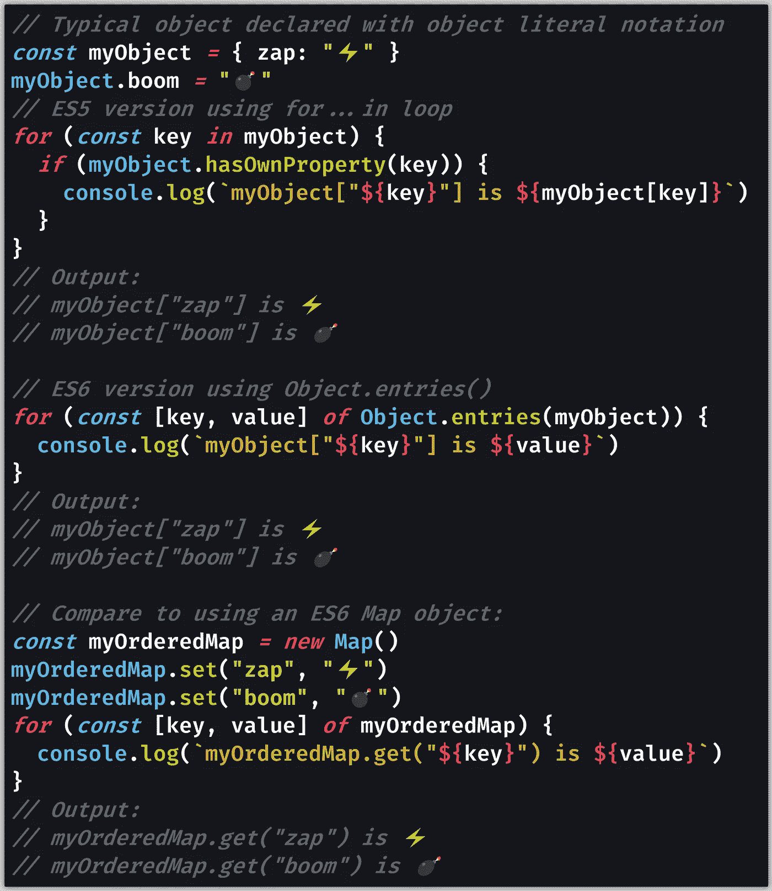

# JavaScript 对象键是有序的和可迭代的吗？

> 原文：<https://javascript.plainenglish.io/are-javascript-object-keys-ordered-and-iterable-5147eedb26ce?source=collection_archive---------2----------------------->

## JavaScript 对象属性有内在的顺序吗？可以根据对象键的顺序迭代一个 JavaScript 对象吗？你可能在找`Object`的表哥:`Map`。

Photo by [Samantha Lam](https://unsplash.com/@contradirony?utm_source=medium&utm_medium=referral) on [Unsplash](https://unsplash.com?utm_source=medium&utm_medium=referral)

# JavaScript 对象键是有序的吗？

JavaScript 对象是一个迷人而有用的工具。对象充当 JavaScript 的“[哈希映射](https://www.interviewcake.com/concept/javascript/hash-map)”(也称为“哈希表”)的主要实现，将对象键(字符串)链接到任何类型的指定值。

> “JavaScript 是基于简单的基于对象的范例设计的。对象是属性的集合，属性是名称(或*键*)和值之间的关联。”— [MDN 文档](https://developer.mozilla.org/en-US/docs/Web/JavaScript/Guide/Working_with_Objects)

从技术上讲，JavaScript 中的一切都是幕后的对象，包括它的“[一级函数](https://developer.mozilla.org/en-US/docs/Glossary/First-class_Function)”这意味着您可以使用[点语法(](https://developer.mozilla.org/en-US/docs/Web/JavaScript/Reference/Operators/Property_accessors) `[.](https://developer.mozilla.org/en-US/docs/Web/JavaScript/Reference/Operators/Property_accessors)` [)](https://developer.mozilla.org/en-US/docs/Web/JavaScript/Reference/Operators/Property_accessors) 来访问任何变量的属性，遵循[原型继承](https://developer.mozilla.org/en-US/docs/Web/JavaScript/Inheritance_and_the_prototype_chain)。结果是你可以在一个字符串上调用`[.length](https://developer.mozilla.org/en-US/docs/Web/JavaScript/Reference/Global_Objects/String/length)`:`"hi".length // 2`。

然而，JavaScript 对象有一个致命的缺陷:从保持“插入顺序”的意义上来说，它们不是完全可迭代的换句话说，对象不记得对象键的添加顺序。

# 将 JavaScript 对象键与数组进行比较

为了说明 JavaScript 对象键不是有序的，让我们将它们比作一个数组:一个按特定顺序排列的简单项目列表。

[JavaScript 数组](https://medium.com/javascript-in-plain-english/how-to-check-for-an-array-in-javascript-6ad20f7a0e21)从索引 0 到列表中的最后一项有一个定义的顺序，使用`[.push()](https://developer.mozilla.org/en-US/docs/Web/JavaScript/Reference/Global_Objects/Array/push)`添加到数组中的项保持它们被添加的顺序。这就是术语“插入顺序”的含义

区别在于当您迭代(意味着循环)对象键时，它们是否保证处于正确的顺序。数组有一个有保证的顺序，所以我们称它们为[可迭代对象](https://developer.mozilla.org/en-US/docs/Web/JavaScript/Reference/Iteration_protocols#Iterable_examples)。

对于数组和其他可迭代的对象(比如[字符串](https://medium.com/javascript-in-plain-english/how-to-check-for-a-string-in-javascript-a16b196915ff)，它允许你通过字符进行迭代)，你可以使用`[for...of](https://developer.mozilla.org/en-US/docs/Web/JavaScript/Reference/Statements/for...of)`循环来访问每一项。

对于对象，你必须使用`[for...in](https://developer.mozilla.org/en-US/docs/Web/JavaScript/Reference/Statements/for...in)`循环来代替。由于对象没有有序的对象键，所以不能使用`for...of`。

> "一个`for...in`循环以任意顺序遍历一个对象的属性."— [MDN 文档](https://developer.mozilla.org/en-US/docs/Web/JavaScript/Reference/Statements/for...in)

此外，当使用`for...in`时，由于继承自 JavaScript 的原型链，除非您做一些额外的检查，否则您可能会在循环中出现继承的对象键。

> 如果你只想考虑对象本身的属性，而不是它的原型，使用`[getOwnPropertyNames()](https://developer.mozilla.org/en-US/docs/Web/JavaScript/Reference/Global_Objects/Object/getOwnPropertyNames)`或者执行`[hasOwnProperty()](https://developer.mozilla.org/en-US/docs/Web/JavaScript/Reference/Global_Objects/Object/hasOwnProperty)`检查(也可以使用`[propertyIsEnumerable()](https://developer.mozilla.org/en-US/docs/Web/JavaScript/Reference/Global_Objects/Object/propertyIsEnumerable)`)— [MDN 文档](https://developer.mozilla.org/en-US/docs/Web/JavaScript/Reference/Statements/for...in)

`for...in`循环的另一个缺点是定义为`[Symbol](https://developer.mozilla.org/en-US/docs/Web/JavaScript/Reference/Global_Objects/Symbol)`对象的对象键不会被迭代，只有那些定义为字符串的对象键才会被迭代。虽然这可能是您想要的，但也可能不是——您可能想要对每个对象属性进行循环，不管它是如何定义的。

您确实可以使用`[Object.keys()](https://developer.mozilla.org/en-US/docs/Web/JavaScript/Reference/Global_Objects/Object/keys)`方法将对象键作为一个可迭代对象来访问，这允许您使用一个`for...of`循环，但是不能保证结果对象键的顺序。

> "`**Object.keys()**`方法返回给定对象自己的可枚举属性**名称**的数组，其迭代顺序与普通循环相同。"— [MDN 文档](https://developer.mozilla.org/en-US/docs/Web/JavaScript/Reference/Global_Objects/Object/keys)

`[Object.values()](https://developer.mozilla.org/en-US/docs/Web/JavaScript/Reference/Global_objects/Object/values)`或`[Object.entries()](https://developer.mozilla.org/en-US/docs/Web/JavaScript/Reference/Global_Objects/Object/entries)`的行为是相同的——对象属性的顺序可以随插入顺序而变化。

# 一个`Map`有有序的对象键

如果你绝对需要你的对象键被排序，那么使用一个`[Map](https://developer.mozilla.org/en-US/docs/Web/JavaScript/Reference/Global_Objects/Map)`对象，它是在 ES6 (ECMAScript 2015)中引入的。

除了您需要调用`.get()` ( `[Map.prototype.get()](https://developer.mozilla.org/en-US/docs/Web/JavaScript/Reference/Global_Objects/Map/get)`)、`[.set()](https://developer.mozilla.org/en-US/docs/Web/JavaScript/Reference/Global_Objects/Map/set)`和`[.has()](https://developer.mozilla.org/en-US/docs/Web/JavaScript/Reference/Global_Objects/Map/has)`而不是通常的[点语法](https://developer.mozilla.org/en-US/docs/Web/JavaScript/Reference/Operators/Property_accessors) `[.](https://developer.mozilla.org/en-US/docs/Web/JavaScript/Reference/Operators/Property_accessors)` [或括号](https://developer.mozilla.org/en-US/docs/Web/JavaScript/Reference/Operators/Property_accessors) `[[]](https://developer.mozilla.org/en-US/docs/Web/JavaScript/Reference/Operators/Property_accessors)` [属性访问器](https://developer.mozilla.org/en-US/docs/Web/JavaScript/Reference/Operators/Property_accessors)之外，`Map`的工作方式就像一个典型的对象。

您还需要通过使用`[new](https://developer.mozilla.org/en-US/docs/Web/JavaScript/Reference/Operators/new)`关键字以及`[Map](https://developer.mozilla.org/en-US/docs/Web/JavaScript/Reference/Global_Objects/Map/Map)`[构造函数](https://developer.mozilla.org/en-US/docs/Web/JavaScript/Reference/Global_Objects/Map/Map)，`new Map()`来显式声明`Map`，而不是我们通常用于对象的对象文字符号(`{}`)。

你能把一个物体转换成一个`Map`吗？当然，但是我们已经丢失了对象键的排序信息，所以没有什么好的理由这样做。如果 JavaScript 对象需要有序的对象键，那么首先应该使用`Map`。

下面是一个代码示例，就有序对象键而言，它比较了典型对象和`Map`的行为:

[View raw code](https://gist.github.com/DoctorDerek/c4528ead671aabd8129f6c6ee8947a9d) as a GitHub Gist

正如我们从示例中看到的，当使用`for...in`或`Object.entries()`时，对象键*看起来*是有序的，但是这种外观可能会产生误导——这些对象的顺序在 JavaScript 中并不保证。

使用`Map`对象也比传统的 JavaScript 对象灵活得多，因为您可以使用任何类型作为`Map`的键。普通对象只接受字符串(和`Symbol`对象)作为关键字。

# 为什么对象键没有排序？归咎于 Internet Explorer

检查*为什么* JavaScript 缺少有序对象键实际上很有趣。在 MDN 文档中，我们发现了以下内容:

> 尽管 ECMAScript 使对象的迭代顺序依赖于实现，但似乎所有主流浏览器都支持基于最早添加的属性的迭代顺序(至少对于不在原型上的属性)。
> 
> 然而，在 Internet Explorer 的情况下，当在属性上使用`delete`时，会导致一些混乱的行为，阻止其他浏览器使用像对象文字这样的简单对象作为有序关联数组。
> 
> 在 Explorer 中，虽然属性*的值*确实被设置为`undefined`，但是如果稍后添加回一个同名的属性，该属性将在原来的*位置被迭代——而不是在删除该属性然后再添加回来之后的迭代序列的末尾。”— [MDN 文档](https://developer.mozilla.org/en-US/docs/Web/JavaScript/Reference/Operators/delete#Cross-browser_notes)*

JavaScript 中对象键无序有两个原因。首先，[ECMAScript 规范](https://www.ecma-international.org/publications/standards/Ecma-262.htm)允许对象的迭代顺序在不同的实现之间有所不同。第二，Internet Explorer 对`[delete](https://developer.mozilla.org/en-US/docs/Web/JavaScript/Reference/Operators/delete)`[操作符](https://developer.mozilla.org/en-US/docs/Web/JavaScript/Reference/Operators/delete)如何作用于对象键有一个奇怪的实现。

如果您需要一个带有有序对象键的“[有序关联数组](https://en.wikipedia.org/wiki/Associative_array#Ordered_dictionary)”，那么您可以为常规 JavaScript 对象设计几种替代方案。

> 如果您想在跨浏览器环境中使用有序关联数组，请使用一个可用的`[Map](https://developer.mozilla.org/en-US/docs/Web/JavaScript/Reference/Global_Objects/Map)`对象，或者用两个单独的数组(一个用于键，另一个用于值)模拟这种结构，或者构建一个单属性对象的数组，等等— [MDN 文档](https://developer.mozilla.org/en-US/docs/Web/JavaScript/Reference/Operators/delete#Cross-browser_notes)

然而，我的建议是省去那些麻烦，直接使用`Map`。毕竟，我们现在在现代 JavaScript 中有了`Map`对象，或者我们可以使用类似 [Babel](https://babeljs.io/) 的工具通过 [polyfill](https://medium.com/better-programming/compiling-vs-polyfilling-in-javascript-6bbc5707a253) 得到一个对象。

这意味着使用 ES6 `Map`对象将是 JavaScript 中有序对象键的最佳解决方案。

**编码快乐！**💮`(●'◡'●)`💮

[Derek Austin](https://www.linkedin.com/in/derek-austin/)博士是《职业编程:如何在 6 个月内成为一名成功的 6 位数程序员 》一书的作者，该书现已在亚马逊上架。