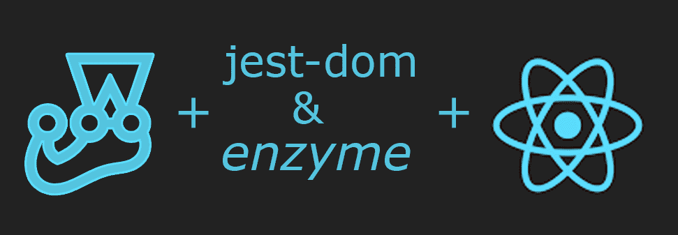
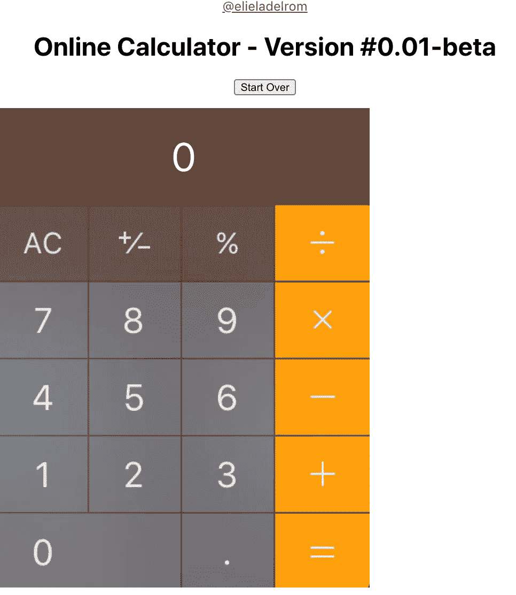
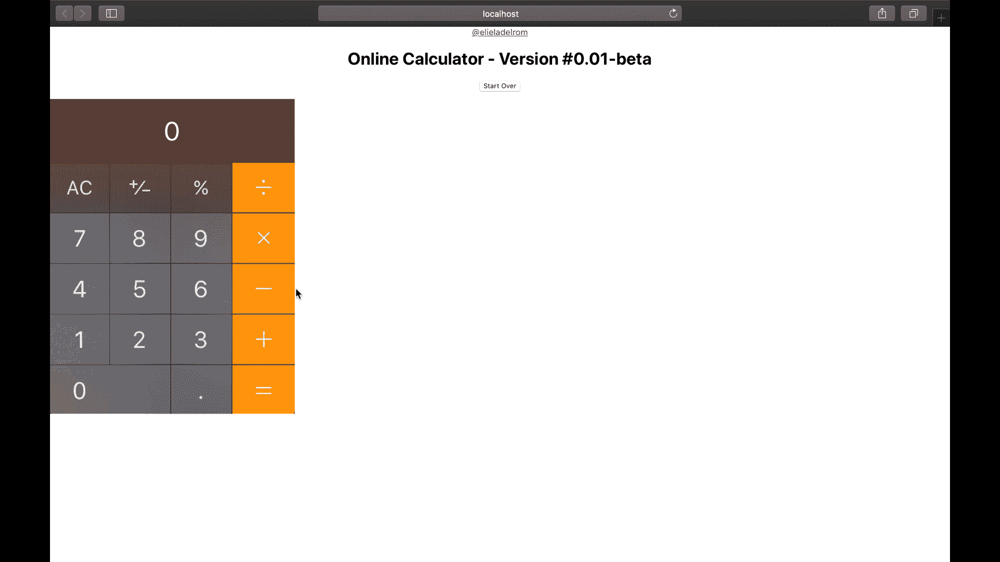
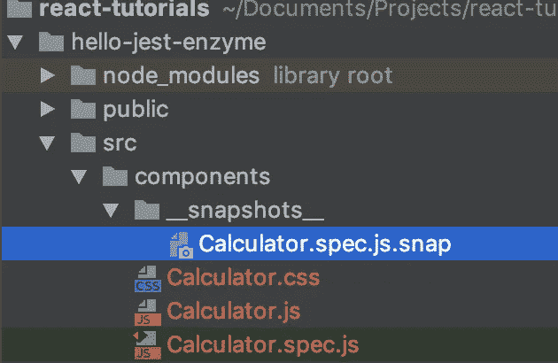
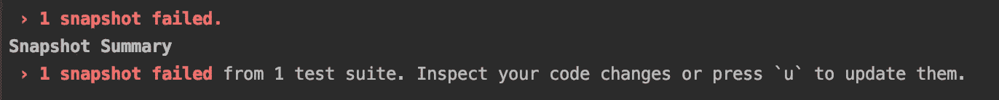

# 用 Jest、Jest-dom 和 Enzyme 对 React 应用进行单元测试

> 原文：<https://javascript.plainenglish.io/are-you-not-testing-your-react-app-instantly-test-with-jest-enzyme-a-reactjs-2020-tutorial-e9ce0182d66d?source=collection_archive---------2----------------------->

如果你曾经想测试你的 React 应用却找不到时间来设置它？按照我将在本教程中向你展示的步骤，你也可以像专业人士一样立即开始测试你的应用程序。



就最终结果而言。我们将构建这个自定义计算器组件，并对其进行测试；



**什么是 Jest？**

[](https://github.com/facebook/jest) [## 脸书/杰斯特

### 令人愉快的 JavaScript 测试。在 GitHub 上创建一个帐户，为脸书/jest 的发展做出贡献。

github.com](https://github.com/facebook/jest) 

Jest 是一个 JavaScript 单元测试框架。它可以用于任何 JavaScript 项目。你正在做一个打字项目吗，点击这里查看我的 Jest TS 文章。

Jest 是测试运行器、断言库和模拟库，如果需要的话，还可以提供快照。

*   开发者就绪:全面的 JavaScript 测试解决方案。适用于大多数 JavaScript 项目。
*   即时反馈:快速、交互式的观察模式只运行与更改的文件相关的测试文件。
*   快照测试:捕获大型对象的快照，以简化测试并分析它们如何随时间变化。

笑话文件:[https://jestjs.io/docs/en/tutorial-react](https://jestjs.io/docs/en/tutorial-react)

**什么是 Jest-dom**

`[jest-dom](https://github.com/testing-library/jest-dom)`是一个使用自定义匹配来扩展 Jest 的库，使得对 DOM 元素的断言更加容易。

jest-dom 不需要使用 React 测试库，但是它使得编写我们的测试更加方便。

jest-DOM doc:[https://no riste . github . io/react jsday-2019-testing-course/book/intro-to-react-testing/jest-DOM . html](https://noriste.github.io/reactjsday-2019-testing-course/book/intro-to-react-testing/jest-dom.html)

**酶是什么？**

[](https://github.com/enzymejs/enzyme) [## 酶/酶

### React 的 JavaScript 测试实用程序。在 GitHub 上创建一个帐户，为 enzymejs/enzyme development 做出贡献。

github.com](https://github.com/enzymejs/enzyme) 

Enzyme 是一个 JavaScript 测试实用程序**，专为 React** 而构建，使测试 React 组件的输出变得更加容易。您还可以操纵、遍历和以某种方式模拟给定输出的运行时。

Enzyme 的 API 旨在通过模仿 jQuery 的 DOM 操作和遍历 API 来实现直观和灵活。

> 注意:酵素可以不用 Jest，但是需要搭配其他单元测试框架。

酶文档:[https://airbnb.io/enzyme/docs/api/](https://airbnb.io/enzyme/docs/api/)

# 您为什么要学习 Jest &酵素？

Jest + Jest-dom +酶+ React =在您的 React 项目中完成测试能力

Jest 和酶很好地结合在一起，提供灵活和创造性的测试能力。

以下是一些有趣的事实:

1.  脸书使用 Jest 测试服务和反应应用程序。
2.  [Create-reaction-App](https://medium.com/react-courses/follow-this-tutorial-and-become-a-react-developer-in-5-minutes-a-2020-tutorial-e3709513b51e)与 Jest &一起上市；它不需要单独安装。
3.  酶工具由 Airbnb 创建

> 如果您认为测试既昂贵又耗时？不测试会花费，但从长远来看，可能会花费更多。

您知道吗，质量保证和软件测试公司 QualiTest 对 1000 多名美国人进行的一项调查表明，如果遇到错误或小故障，88%的人会放弃应用程序？

*   大约 51%的人说，如果他们每天至少遇到一个臭虫，他们可能会完全停止使用一个应用程序。
*   32%的受访者表示，他们可能会在遇到小故障时就放弃应用。

# 您如何学习 Jest &酵素？

为了帮助您理解 Jest &酶系统，我将本教程中的过程分解为三个步骤；

*   第 1 步— **设置。**设置&配置我们的项目
*   第 2 步— **编写代码**计算器自定义组件
*   第 3 步-**检测代码**。

如果你想更好地理解我们正在使用的库，我也在教程的最后放了一些隐藏的东西。

# 我们开始吧

先决条件—

我的教程认为你有一些反应知识。如果你不这样做，我有一篇文章让你对反应有一个基本的了解。

那篇文章会让你很快振作起来。按照本教程中的步骤，使用 *create-react-app* 在几分钟内获得一个 React 项目并实现功能；按照本教程&在几分钟内成为 ReactJS 开发者-

[](https://medium.com/react-courses/follow-this-tutorial-and-become-a-react-developer-in-5-minutes-a-2020-tutorial-e3709513b51e) [## 遵循本教程&在几分钟内立即成为 ReactJS 开发人员——2020 教程

### 如果您曾经想学习反应，但找不到时间或害怕它？按照我将要向你展示的步骤去做…

medium.com](https://medium.com/react-courses/follow-this-tutorial-and-become-a-react-developer-in-5-minutes-a-2020-tutorial-e3709513b51e) 

# 第 1 步-设置和配置我们的项目

让我们在终端建立我们的项目`hello-jest-enzyme.`；

```
$ npx create-react-app hello-jest-enzyme
$ cd hello-jest-enzyme
```

对于酶，我们想安装 React 16 适配器(这是最新版本，我正在使用，但这可能会随着您阅读本文的时间而改变)，我们还需要安装`react-test-renderer`以便我们可以将 reactor 组件渲染为纯 JavaScript 对象，而不依赖于 DOM 或本地移动环境，这将是有帮助的，因为我们将拍摄快照；

```
$ npm i enzyme enzyme-adapter-react-16 react-test-renderer --save-dev
```

我们将使用 Jest 的快照测试特性来自动将 JSON 树的副本保存到一个文件中，并检查我们的测试，它没有改变。在这里阅读更多关于这个特性:[https://reactjs.org/docs/test-renderer.html](https://reactjs.org/docs/test-renderer.html)

我们想让我们的生活更容易，所以我们将安装`enzyme-to-json`库；https://github.com/adriantoine/enzyme-to-json#readme:这样我们的代码可以被简化。查看我的引擎盖下部分了解更多详情。

```
$ npm i enzyme-to-json --save-dev
```

接下来，我们将创建我们想要测试的 React 组件；

```
$ mkdir -p src/components
$ touch src/components/Calculator.js
$ touch src/components/Calculator.css
```

对于我们的计算器，我将使用 macOS 内置的计算器作为我的图形与图像映射来映射每个键，所以我们把图像变成一个可点击的按钮。我将使用一个 react-image-mapper，所以让我们也把它添加到我们的库中；

$ `npm i react-image-mapper@latest --save`

酷，我们设置我们的项目并安装所有的库来开始我们的项目。✌️

# 步骤 2 —创建我们的定制组件

在代码级别，我正在创建一个计算器自定义组件。我所做的是截屏 macOS 计算器，然后使用一个在线工具映射(image-map.net)我的图像到一个可点击的地图区域。

我正在设置一个状态来包含我的输出，这两个数字是我和操作员一起工作的。看一看；

```
// src/components/Calculator.js**import** React, { Component } **from** "react";
**import** ImageMapper **from** 'react-image-mapper';
**import** './Calculator.css';**export const** URL = 'calculator.jpg';
**export const** MAP = {
    name: "my-map",
    areas: [
        {
            name: "0", shape: "rect", coords: [3,387,227,474]
        },
        {
            name: "1", shape: "rect", coords: [2,291,112,382]
        },
        {
            name: "2", shape: "rect", coords: [116,290,227,382]
        },
        {
            name: "3", shape: "rect", coords: [342,382,232,290]
        },
        {
            name: "4", shape: "rect", coords: [3,194,111,290]
        },
        {
            name: "5", shape: "rect", coords: [115,193,227,290]
        },
        {
            name: "6", shape: "rect", coords: [231,194,343,290]
        },
        {
            name: "7", shape: "rect", coords: [4,97,111,191]
        },
        {
            name: "8", shape: "rect", coords: [115,99,227,191]
        },
        {
            name: "9", shape: "rect", coords: [231,98,343,191]
        },
        {
            name: "+", shape: "rect", coords: [348,291,463,382]
        },
        {
            name: "-", shape: "rect", coords: [348,195,463,290]
        },
        {
            name: "*", shape: "rect", coords: [348,98,463,191]
        },
        {
            name: "/", shape: "rect", coords: [348,3,463,93]
        },
        {
            name: "=", shape: "rect", coords: [348,387,463,474]
        }
    ]
}**export default class** Calculator **extends** Component { constructor(props) {
        **super**(props)
        **this**.state = {
            output: 0,
            operatorType: '',
            number1: 0,
            number2: -1
        }
    } startOver = () => {
        **this**.setState({
            operatorType: '',
            number1: 0,
            number2: -1,
            output: 0
        });
    }; calculateTwoNumbers = (num1, num2, operator) => {
        **let** retVal = 0;
        **switch** (operator) {
            **case** '+':
                retVal = num1 + num2;
                **break**;
            **case** '-':
                retVal = num1 - num2;
                **break**;
            **case** '*':
                retVal = num1 * num2;
                **break**;
            **case** '/':
                retVal = num1 / num2;
                **break**;
            **default**:
                alert('Operator not recognized');
        }
        **return** retVal;
    } clicked = (btnName) => {
        **switch** (btnName) {
            **case** '-':
            **case** '*':
            **case** '/':
            **case** '+':
                **this**.setState({
                    operatorType: btnName,
                    number1: (Number(**this**.state.output))
                });
                **break**;
            **case** '=':
                **this**.setState({
                    output: **this**.calculateTwoNumbers(**this**.state.number1, Number(**this**.state.output), **this**.state.operatorType)
                });
                **break**;
            **default**:
                **let** isFirstDigitNumber2 = (**this**.state.operatorType && **this**.state.number2 === -1);
                **this**.setState({
                    number2: isFirstDigitNumber2 ? 0 : **this**.state.number2,
                    output: isFirstDigitNumber2 ? Number(btnName) : Number(**this**.state.output + btnName)
                });
        }
    }; render() {
        **return** (
            <div>
                <a href="http://twitter.com/elieladelrom" className="follow">@elieladelrom</a>
                <h1 className="title">{**this**.props.componentTitle} - Version #{**this**.props.version}</h1>
                <p>
                    <button onClick={**this**.startOver}>Start Over</button>
                </p>
                <div className="output" class="calculator-output">{**this**.state.output}</div>
                <ImageMapper src={URL} map={MAP}
                             onClick={area => **this**.clicked(area.name)}
                />
            </div>
        );
    }
}
```

在`jsx`方面，我用我的 twitter 处理程序添加了一个 div，这看起来像是无耻的自我推销，但除此之外，我想把它包括进来给你看一些测试。同样的按钮将允许我们重新开始，我们将设置一个标题作为道具。

对于`CSS`，我正在创建一个类来格式化我的输出；

```
// src/components/Calculator.css.calculator-output
{
    background:url('/calculator-input.jpg') no-repeat right top;
    color:#fff;
    font-size:50px;
    width: 464px;
    height: 120px;
    text-align: center;
    display: flex;
    justify-content: center;
    align-items: center;
}
```

接下来，我们需要更新我们的 App.js，以包含我们的自定义组件；

```
// src/App.js**import** React **from** 'react';
**import** './App.css';
**import** Calculator **from** "./components/Calculator";**function** App() {
  **return** (
    <div className="App">
      <Calculator componentTitle={"Online Calculator"} version={"0.01-beta"}/>
    </div>
  );
}**export default** App;
```

就这样，跑；

```
$ npm start
```

我们有一个基本的计算器😊。请注意，我没有映射所有的计算器键和功能，只是基本的，但是可以随意完成它们。



# 步骤 3 —测试代码

首先，我们将设置我们的测试环境，打开`src/setupTests.js`:

```
**//** src/setupTests.js**import** { configure } **from** 'enzyme';
**import** Adapter **from** 'enzyme-adapter-react-16'configure({ adapter: **new** Adapter() });
```

**快照测试你的酵素包**

更新您的`package.json`:

```
// src/package.json
..
"jest": {
  "snapshotSerializers": ["enzyme-to-json/serializer"]
},
..
```

注意，我使用的是 Create-React-App，所以不需要安装 jest，它是现成的。另外，请注意，对于 Enzyme，该命令反映了我们的 React 版本:enzyme-adapter-react-16。

打开`src/App.test.js` -我们在这里的测试是为了确保我们的组件包含在我们的应用程序中；

```
// src/App.test.js**import** { shallow } **from** "enzyme";
**import** Calculator **from** "./components/Calculator";test(‘should render Calculator’, () => {
    **const** wrapper = shallow(<App />);
    **const** calculator = wrapper.find(Calculator);expect(calculator.exists()).toBe(**true**);
})
```

要运行我们的测试，我们的模板项目已经配备了处理一切的测试脚本，只需运行 run test 命令；

```
$ npm run test
```

接下来，

**创建我们的计算器组件测试文件:**

Jest 将在以下任何位置查找测试文件:

*   `__tests__`文件夹中带有`.js`后缀的文件。
*   带有`.test.js`后缀的文件。
*   后缀为`.spec.js`的文件。

我将使用`Calculator.spec.js` ,我喜欢. spec.js，因为它是 Angular 等其他框架的标准。

```
$ touch src/components/Calculator.spec.js
```

在我们的组件测试文件中，我们可以测试一些东西，首先导入 React，我们将使用的`Enzyme`API(`shallow`和`mount`)和我们的定制组件`Calculator`；

```
// src/components/Calculator.spec.js**import** React **from** "react";
**import** { shallow, mount } **from** "enzyme";
**import** Calculator **from** "./Calculator";
```

**测试套件快照**

我们将从创建一个测试套件开始。测试套件创建了一个将几个测试组合在一起的块。我们可以列出所有我们想要包含的测试。

在测试套件中，我只设置了一个测试，来设置我们的快照，但是您可以包括其他快照，以防您有其他相关的助手、实用程序；

```
// describe(name, fn) creates a block that groups together several related tests in one "test suite".
describe('Calculator Snapshots', () => {
    it('should render our Snapshots correctly', () => {
        **const** wrapper = shallow(<Calculator />);
        expect(wrapper).toMatchSnapshot();
    });
});
```

现在，检查你的文件夹，注意这个脚本为我们创建了一个`__snapshots__ folder`来观察变化；



当我们更改代码时，test live 特性会告诉我们更新快照，只需点击`u`。



**非交互组件的单一测试**

要为非交互组件创建一个单独的测试，我们可以测试我无耻的自我推销 Twitter 账户。我们为自定义组件创建了一个`wrapper`,并且可以使用带有`find`方法的`shallow`来访问我们的`a`链接 dom 标签中的`text`字段；

```
// non-interactive components - using it (single test)
it('should render the link url', () => {
    **const** wrapper = shallow(<Calculator />);
    **const** a = wrapper.find('a');
    **const** result = a.text(); expect(result).toBe('@elieladelrom');
});
```

**测试组件道具**

为了测试我们从主入口点`App.js`传来的标题上的道具，类似于我们之前的测试，我们设置了一个包装器，并根据我们注入的数据检查`h1`文本；

```
// it(is aliased by test so it does the same thing as it)
test('should render component title', () => {
    **const** wrapper = shallow(<Calculator componentTitle={'Online Calculator'} version={'0.01-beta'}/>);
    **const** title = wrapper.find('h1.title').text(); expect(title).toBe('Online Calculator - Version #0.01-beta');
});
```

> 注意:为了创建一个单独的测试，你可以使用`*test*`关键字代替`*it*`关键字——这是一样的，`*it*`只是一个别名。想给你们俩看看。

**测试交互按钮**

对于交互式组件，我们可以使用`simulate`，来模拟用户点击按钮的手势。然后，我们可以比较输出中的结果，我们正在重新开始，输出应该清晰；

```
test('Testing output indirectly - should clean our result box clicking clear', () => {
    **const** wrapper = shallow(<Calculator />);
    **const** output = wrapper.find('div.output').text();
    **const** btn = wrapper.find('button'); expect(output).toBe("0"); btn.simulate('click');
    **const** output_2 = wrapper.find('div.output').text();
    expect(output_2).toBe("0");
});
```

**直接测试功能的测试套件**

有时候我们需要直接测试功能。看一下我在这里创建了一个测试套件来测试我的`calculateTwoNumbers`。在测试套件中，我可以测试所有不同的操作符；

```
describe('Testing Calculator calculateTwoNumbers testsuite directly', () => {
    test('Testing calculateTwoNumbers Directly - add', () => {
        **const** wrapper = shallow(<Calculator />);
        **const** instance = wrapper.instance();
        expect(instance.calculateTwoNumbers(1, 2, '+')).toBe(3);
    });
    test('Testing calculateTwoNumbers Directly - multiple', () => {
        **const** wrapper = shallow(<Calculator />);
        **const** instance = wrapper.instance();
        expect(instance.calculateTwoNumbers(2, 2, '*')).toBe(4);
    });
});
```

注意，`wrapper`上的`instance()`属性非常强大，因为我们可以访问我们的方法。

**测试交互按钮和我们的状态**

使用`instance()`，我们也可以测试我们的状态。例如，这里有一个测试来检查我们是否点击了`1`按钮，输出会产生`1`。

```
test('test clicked calculator button method', () => {
    **const** wrapper = shallow(<Calculator />);
    **const** instance = wrapper.instance();
    instance.clicked('1');
    expect( wrapper.state('output')).toBe(1);
});
```

**使用 Mount 测试自定义组件；**

为了测试我们的 react-image-mapper，我们可以使用`jest-canvas-mock`来访问所有的画布模拟属性，否则，我们将得到这个平均误差；

`TypeError: Cannot set property ‘fillStyle’ of null`

安装库`jest-canvas-mock`；

```
$ npm i — save-dev jest-canvas-mock
```

并将库包含在我们的测试中；

```
require('jest-canvas-mock');
```

看一看，进行一个测试来确保我们的地图区域产生一个指针光标；

```
**import** ImageMapper **from** 'react-image-mapper';
**import** { URL, MAP } **from** "./Calculator";
require('jest-canvas-mock');describe('when onClick prop is provided', () => {
    it('map styles should have "cursor:pointer"', () => {
        **const** wrapper = mount(<ImageMapper src={URL} map={MAP} onClick={() => {}} />);
        **const** mapStyles = wrapper.find('map').get(0).props.style; expect(mapStyles).toMatchObject({"cursor": "pointer"});
        wrapper.unmount();
    });
});
```

注意，使用`mount` `enzyme` API，我们需要在完成后卸载包装器；`wrapper.unmount();`

mount API 在 DOM 中挂载组件，所以需要在每次测试后`.unmount()`来停止相互影响的测试。

**利用间谍进行测试**

一旦我们的应用程序增长，我们可能需要与异步数据交互，Jest 有内置功能来处理模拟数据和功能。

*   看看更高级的测试题目，如间谍和嘲弄[https://jestjs.io/docs/en/jest-object](https://jestjs.io/docs/en/jest-object)

我可能会发布另一个帖子并展示高级用例测试，但现在，只看一个简单的刺探我们的`startOver`函数的测试；

```
test('spy', () => {
    **const** wrapper = shallow(<Calculator />);
    **const** instance = wrapper.instance();
    jest.spyOn(instance, 'startOver');
    wrapper.find('button').simulate('click');
    expect(wrapper.state('output')).toBe(0);
});
```

一旦我们所有的测试套件和存根都准备好了，你应该期待以下测试输出；

```
Test Suites: 2 passed, 2 total
Tests: 10 passed, 10 total
Snapshots: 1 passed, 1 total
Time: 58.27s
Ran all test suites.
```

👏

# 引擎盖下的东西


这里有很多内幕👩🏻‍💻。我想指出一些可以帮助你的事情；

酶包括三种渲染方法。我们用了`Mount`和`Shallow`，但是还有`Render`。

*   **装上**——[https://enzymejs.github.io/enzyme/docs/api/mount.html](https://enzymejs.github.io/enzyme/docs/api/mount.html)
*   **浅浅**——[https://enzymejs.github.io/enzyme/docs/api/shallow.html](https://enzymejs.github.io/enzyme/docs/api/shallow.html)
*   **渲染**——[https://enzymejs.github.io/enzyme/docs/api/render.html](https://enzymejs.github.io/enzyme/docs/api/render.html)

**安装**

*   包括子组件的完整 DOM 呈现。
*   非常适合需要与 DOM API 交互或使用 React 生命周期方法的组件的用例。
*   允许访问直接传递到根组件的属性(包括默认属性)和传递到子组件的属性。

**浅**

*   仅渲染单个组件，不渲染子组件。这对于隔离纯单元测试的组件很有用。它防止子组件中的更改或错误。
*   `shallow`组件默认访问生命周期方法
*   不能访问传入根组件的道具，但是可以访问传入子组件的道具，并且可以测试传入根组件的道具的*效果*。
*   当我们调用`shallow(<Calculator />)`时，我们测试的是`Calculator` *呈现的*——而不是我们传递给`shallow`的元素

**渲染**

*   呈现为静态 HTML，包括子级。
*   它无权访问`React`生命周期方法。
*   使用的资源比其他 API 少，但功能较少。

**酶转 json**

在我们的代码中，我们使用了`*enzyme-to-json,*`但是为什么呢？

这样做是为了我们的快照比较有一个比 Enzyme 现成的内部组件表示更好的组件格式。

在使用快照时,`snapshotSerializers` API 允许我们编写更少的代码并消除重复。在将组件传递给 Jest 的快照匹配器之前，我们不需要每次用`.toJson()`创建组件时都进行序列化；

```
expect(toJson(rawRenderedComponent)).toMatchSnapshot();
```

我们添加了我们的`*package.json*`

```
"snapshotSerializers": ["enzyme-to-json/serializer"],
```

然后，我们能够将由`Enzyme`创建的组件传递给 Jest `*.toMatchSnapshot()*` ，而不使用`toJson`语法*。*

**笑话比赛**

当我们编写测试时，我们需要检查我们的测试值是否满足某些条件。API 让我们可以访问几个“匹配”，让我们验证不同的东西。

Jest 方面，预期的 API 为大多数用户提供了足够的选项:[https://jestjs.io/docs/en/expect](https://jestjs.io/docs/en/expect)。然而，如果你找不到你想要的，检查 Jest 社区 [jest-extended](https://github.com/jest-community/jest-extended) 寻找更多匹配，或者如果你找不到你需要的，创建你自己的。

# 让我们回顾一下

在本文中，我将这个过程分为三个步骤；

*   步骤 1 — **设置。**设置&配置我们的项目
*   第二步— **编写代码。**计算器自定义组件
*   步骤 3 — **测试代码**。

如果你想更好地理解我们正在使用的库，我还在教程的最后给了你一些额外的“幕后”东西。✌️

# 从这里去哪里

你用的是 TypeScript 吗？我已经使用 TypeScript 创建了相同的示例，[请看一下。](https://medium.com/react-courses/unit-testing-react-typescript-app-with-jest-jest-dom-enzyme-11f52487aa18?sk=225b2c9ac788e78221ae969dbd901f2e)

*   你可以从这里下载完整的项目:[https://github.com/EliEladElrom/react-tutorials](https://github.com/EliEladElrom/react-tutorials)
*   在 YouTube 上跟随这个教程:[https://youtu.be/ViaHrgbGhRs](https://youtu.be/ViaHrgbGhRs)
*   你正在做一个打字项目吗，点击这里查看我的文章[。](https://medium.com/react-courses/unit-testing-react-typescript-app-with-jest-jest-dom-enzyme-11f52487aa18)
*   看我其他的媒介文章比如——[Angular 9 vs React 16——你该挑什么？2020 年摊牌](https://medium.com/blockchain-developer/angular-9-vs-react-16-a-2020-showdown-2b0b8aa6c8e9)
*   笑话:https://jestjs.io/docs/en/tutorial-react
*   jest-DOM doc:[https://no riste . github . io/react jsday-2019-testing-course/book/intro-to-react-testing/jest-DOM . html](https://noriste.github.io/reactjsday-2019-testing-course/book/intro-to-react-testing/jest-dom.html)
*   酵素文档:[https://airbnb.io/enzyme/docs/api/](https://airbnb.io/enzyme/docs/api/)