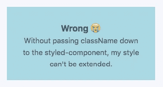
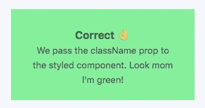

# 对 React 组件的一个小改动，可以让您扩展样式

> 原文：<https://javascript.plainenglish.io/are-your-react-components-style-extendible-17148ba98c00?source=collection_archive---------6----------------------->

## 用 React 和 styled-components 创建样式可扩展组件


Randy Fath [https://unsplash.com/photos/ymf4_9Y9S_A](https://unsplash.com/photos/ymf4_9Y9S_A)

最近，我试图从我们公司的组件库中扩展一个组件，使其风格更适合特定的用例。

组件的底层功能相对复杂，而且写得很好，所以我真的不想重写它。

我使用了标准的样式化组件扩展:

```
const myThing = styled(existingComponent)`
  color: snazzyNewColor; ... or some slightly more useful styles
`
```

但不幸的是，没有应用额外的造型！

我遇到了这样一种情况，我的样式化组件没有扩展现有组件。

稍微浏览了一下[样式组件文档](https://styled-components.com/docs/basics#styling-any-components)，我发现了这个:

> styled 方法在您自己的或任何第三方组件上都可以完美地工作，只要它们将传递的 className **prop** 附加到 DOM 元素上。

## 传递类名属性

如果我们想要扩展一个组件的样式，那么我们首先必须确保组件将`className`属性传递给它最外面的元素。

让我们举一个简单的彩色 div 的例子:

```
// A basic styled-componentconst StyledOriginal = styled.div`
  background: lightBlue;
  width: 300px;
  height: 150px;
  text-align: center;
  padding: 2rem;
` // An example React component which contains a styled-componentconst OriginalComponent = () => {
  return (
    <StyledOriginal>
      <h3>Wrong 😭</h3>
      <p>Without passing className down to the styled-component, my style can't be extended.</p>
    </StyledOriginal>
  )
} // We attempt to extend the original component and expect the background to be greenconst ReStyledComponent = styled(OriginalComponent)`
  background: lightGreen;
`
```

如果我们渲染我们的`<ReStyledComponent />`，你希望背景是浅蓝色还是浅绿色？

…

…



结果是浅蓝色。我是不是泄露了一点？

我们的风格不会被覆盖。

让我们再试一次，这一次我们将确保传递我们的`className`道具:

```
// The same styled-component
const StyledOriginal = styled.div`
  background: lightBlue;
  width: 300px;
  height: 150px;
  text-align: center;
  padding: 2rem;
`// The same React component, but this time with className
const OriginalComponent = ({ className }) => {
  return (
    <StyledOriginal className={className} >
      <h3>Correct 👌</h3>
      <p>We pass the className prop to the styled component. Look mom I'm green!</p>
    </StyledOriginal>
  )
}// We attempt to extend the original component and expect the background to be green
const ReStyledComponent = styled(OriginalComponent)`
  background: lightGreen;
`
```

这一次我们得到了想要的结果和风格的改变:



*注意:这不是特定于样式化组件的。如果最外面的元素是原始 React 组件中的一个简单的* `*<div>*` *，这个问题仍然会发生。*

## 如果我的组件上的类名已经被使用了怎么办？

可能会有这样的情况，当你传递一个`className`道具时，你会想要将一个`className`应用到你的组件。这开始变得复杂。

谢天谢地，我们可以使用[扩展操作符](https://zhenyong.github.io/react/docs/jsx-spread.html)来帮助我们:

```
const OriginalComponent = ({ title, bodyText, ...rest }) => {
  return (
    <StyledOriginal
      className="in-use"
      {...rest}
    >
      <h3>{ title } 👌</h3>
      <p>{ bodyText }</p>
    </StyledOriginal>
  )
}
```

在这里，我们将“剩余的”道具传递给最外层的元素。

这意味着默认情况下会通过`className`道具。

## **TLDR:**

*   将一个`className`或`...rest`道具向下传递到组件的最外层元素，使其样式可扩展

看看[这个 Codepen 的一个活生生的例子](https://codepen.io/kitsonbroadhurst/pen/ZEbxwJj?editors=0010)。

干杯

装备

[](https://medium.com/javascript-in-plain-english/youre-missing-a-trick-with-your-styled-components-in-react-e3dfcd586f75) [## 您错过了 React 中样式化组件的一个技巧

### 为组件添加显示名称以帮助识别它们

medium.com](https://medium.com/javascript-in-plain-english/youre-missing-a-trick-with-your-styled-components-in-react-e3dfcd586f75) [](https://medium.com/@kitson.broadhurst/simple-form-validation-with-react-hooks-usestate-and-useeffect-57620d808cc8) [## 带有 React 挂钩的简单表单验证— useState 和 useEffect

### 自从 Hooks 做出反应以来，我们都在学习编写函数组件的新的小技巧和细微差别。

medium.com](https://medium.com/@kitson.broadhurst/simple-form-validation-with-react-hooks-usestate-and-useeffect-57620d808cc8)