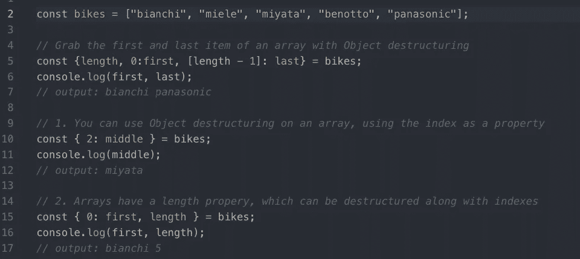

# JavaScript 中的数组和对象去结构化

> 原文：<https://javascript.plainenglish.io/array-and-object-de-structuring-in-javascript-da3e73867781?source=collection_archive---------7----------------------->



# 背景

代码不仅仅是让它工作。代码也是关于可读性和简洁的，比如适当的缩进，适当的命名约定，等等。代码也应该是自文档化的(这是我推荐您阅读的另一个主题)。可读和简洁代码的一个常见约定是数组和对象去结构化。数组和对象的分解是“分解”值并将这些值分配给不同变量的语法技巧。

# 数组去结构化

就我目前所见，数组去结构没有对象去结构常见，但我确实经常看到。那么，数组分解是如何工作的呢？

通常，您会看到这样的数组:

```
const colors = ["red", "blue", "green"]
```

为了访问`colors`中的值，您可以根据它们的索引来访问它们。所以，

```
colors[0] = "red"
colors[1] = "blue"
colors[2] = "green"
```

但是假设您需要在整个代码库中多次访问这些值。试图记住他们的特定颜色的索引很容易混淆并导致错误。想象一下，不断检查以确保为数组输入了正确的索引号。更不用说，如果有一个错误或者你需要改变它，你需要调试或者寻找它，但是你看到的都是`colors[0]`、`colors[1]`或者`colors[2]`。数组分解将帮助您缓解这个难题。

首先，我将向您展示数组分解语法，然后我将分解它在做什么。

```
const [ red, blue, green ] = colors
```

哇…就一句台词？没错。

所以，让我们打开这一个班轮。

在`const [ red, blue, green ]`部分，我实例化了三个新变量:`red`、`blue`、`green`。在部分`= colors`中，我基于`colors`数组声明变量`red`、`blue`和`green`的值。但是 JavaScript 如何知道`colors`数组中的哪个值声明给了哪个变量呢？

注意`red`、`blue`和`green`是如何在数组括号内的。*声明变量的索引与用于确定使用数组中哪个值的索引相同。*例如，`blue`在索引`1`处声明。这意味着`blue`将等于`color[1]`处的值，在本例中为`"blue"`。这里，变量的实例化顺序是决定因素。本质上，下面的代码显示了数组分解正在做什么。

```
const red = colors[0]
const blue colors[1]
const green = colors[2]console.log(red) // "red"
console.log(blue) // "blue"
console.log(green) // "green"
```

那么在哪里可以找到使用数组分解的例子呢？我见过最常见的地方是[反应钩](https://reactjs.org/docs/hooks-intro.html)。如果您打算使用需要状态的严格功能组件，您将需要理解数组分解。

# 对象去结构化

对象分解和数组分解的工作原理是一样的。但是让我们从头开始。

通常，您会看到这样声明的对象:

```
const colors = { red: "red", blue: "blue", green: "green" }
```

为了访问键-值对中的值，可以根据它们的键来访问它们。所以，

```
colors.red = "red"
colors.blue = "blue"
colors.green = "green"
```

现在，让我们分解这个对象！

```
const { red, blue, green } = colors
```

谢天谢地，对象分解也只有一行！如果你能够遵循数组分解，这将非常非常相似。

在部分`const { red, blue, green }`中，我实例化了三个新变量:`red`、`blue`、`green`。在部分`= colors`中，我基于`colors`对象声明变量`red`、`blue`和`green`的值。但是 JavaScript 如何知道`colors`对象中的哪个值声明给了哪个变量呢？

注意`red`、`blue`和`green`是如何在对象括号内的。*变量名本身将被用作键，以确定从对象中使用哪个键-值对。例如，我声明了一个名为`blue`的变量。这意味着在`colors`对象中，JavaScript 将寻找一个名为 blue 的键，并将与该键相关的值赋给变量`blue`。在这里，变量名是决定因素。本质上，下面的代码显示了对象分解正在做什么。*

```
const red = colors.red
const blue = colors.blue
const green = colors.greenconsole.log(red) // "red"
console.log(blue) // "blue"
console.log(green) // "green"
```

使用对象分解的一个非常常见的例子是在 React 组件中传递属性。由于`props`(在函数组件中)或`this.props`(在类中)已经是对象，使用与父组件中相同的变量名可以帮助你分解 props。下面是一个例子。

```
// App.jsimport React, { Component } from 'react'
import Calendar from './Calender'class App extends Component {
  state = {
    month: Feburary
    date: 9
    year: 2020
  } render() {
    return (
      <div>
        <Calendar 
          month={this.state.month} 
          date={this.state.date}
          year={this.state.year}
        />
      </div>
    )
  }
}// Calendar.jsimport React from 'react'function Calendar(props) {
  // object de-structuring
  const { month, date, year } = props
  return (
    <h1>Today is {month} {date}, {year}</h1>
  )
}export default Calendar 
```