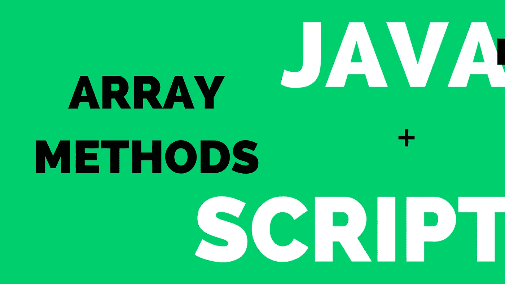
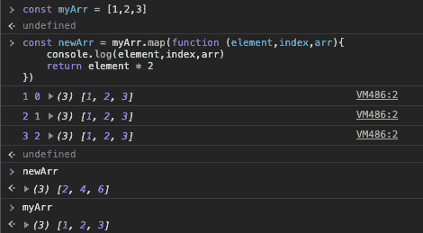
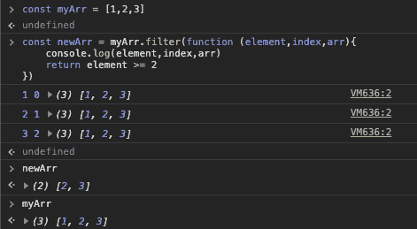
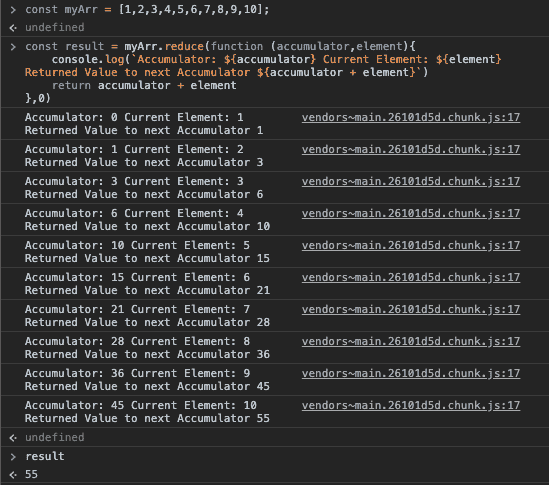
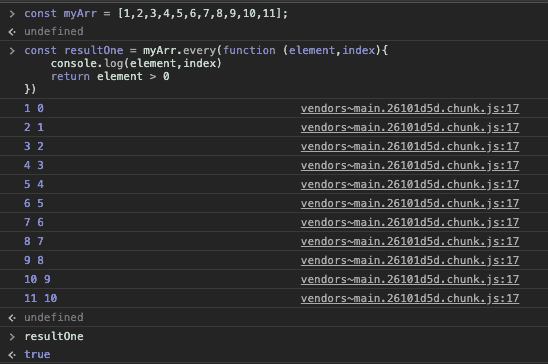
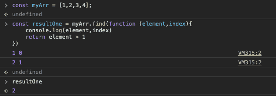
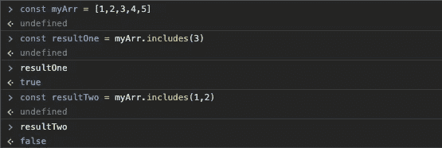
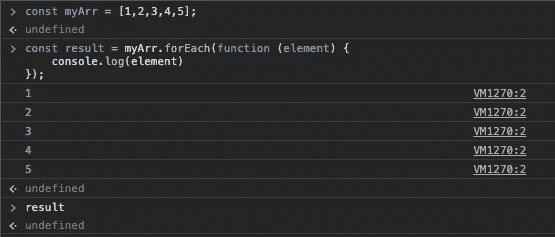

# JavaScript 中的高阶数组方法

> 原文：<https://javascript.plainenglish.io/array-methods-in-javascript-238455cc5f6c?source=collection_archive---------7----------------------->

这里是 JavaScript 中最常用的数组方法，我以这样一种方式整理出来，JavaScript 的官方文档很容易解释。好吧，喝杯咖啡，让我们深入了解这些概念。

# 1.地图()

对数组中的每个元素执行提供的函数。

**传递的参数**:传递了三个内置参数的回调函数。

*   当前值-从数组传递到函数中的当前值。
*   Index —数组中当前元素的索引值。
*   数组—迭代数组本身可以作为参数传递。

**返回值:**回调函数返回一个新数组。

这里我声明了一个名为(myArr)的数组，并使用了 map()方法。查看回调函数如何对数组中的每个元素执行，并通过乘以 2 返回元素。现在，在不改变原始数组(myArr)的情况下，形成了一个名为(newArr)的新数组。

# 2.过滤器()

同 map()方法对数组中的每个元素执行回调函数，但是返回的数组只包含指定为条件的 true 元素，所以返回满足条件的元素。

**传递的参数:**传递了三个内置参数的回调函数。

*   当前值-从数组传递到函数中的当前值。
*   Index —数组中当前元素的索引值。
*   数组—迭代数组本身可以作为参数传递。

**返回值:**只返回满足条件的元素。

这里我声明了一个名为(myArr)的数组，并使用了 filter()方法。查看回调函数如何对数组中的每个元素执行，并返回满足条件的元素(仅 true)。现在，在不改变原始数组(myArr)的情况下，形成了一个名为(newArr)的新数组，并且看到(newArr)只包含大于等于 2 的元素。

# 3.减少()

Reduce()方法用于将数组缩减为单个值。例如:假设在一个数组中有[1，2，3…..100]而你想知道一个数组中所有元素的总和，只需用 reduce()方法就能找到值。

**传递的参数:**一个带四个参数的回调函数。

*   累加器—它保存数组中每次迭代的返回值，默认情况下，如果没有设置初始值，它将采用迭代中第一个元素的值，或者可以设置初始值。
*   当前值-从数组传递到函数中的当前值。
*   Index —数组中当前元素的索引值。
*   数组—迭代数组本身可以作为参数传递。

**返回值:**单个值(即从数组中减去)。

在这里你可以看到我有一个名为(myArr)的数组，一个 reduce()方法被应用于这个 myArr。我已经将累加器设置为初始值零(见后面的花括号)。因此，每次累加累加器和元素时，它都将值返回给累加器，在最后一次迭代中，最后一个值返回给(result)变量。

# 4.一些()

Some()方法用于检查数组中是否至少有一个元素满足函数中设置的任何条件，并在通过条件的元素处停止，并且不迭代元素。

**传递的参数:**传递了三个内置参数的回调函数。

*   当前值-从数组传递到函数中的当前值。
*   Index —数组中当前元素的索引值。
*   数组—迭代数组本身可以作为参数传递。

**返回值:**根据满足的条件返回布尔值，真或假。

在这里，我有一个名为(myArr)的数组，并使用了 some()方法，条件是元素应该大于 1，因为我们在数组中有大于 1 的元素 2…10，所以迭代在 2 处停止，因为 2 认为它大于 1，并将真值返回给(resultOne)变量。

# 5.每隔()

除了数组中的所有元素都应该满足条件之外，每个()方法都与 some()方法相同。它还返回布尔值 true 或 false。

**传递的参数:**传递了三个内置参数的回调函数。

*   当前值-从数组传递到函数中的当前值。
*   Index —数组中当前元素的索引值。
*   数组—迭代数组本身可以作为参数传递。

**返回值:**根据满足的条件返回布尔值，真或假。

这里我有一个名为(myArr)的数组，并使用了 every()方法，条件是元素应该大于 0，因为数组中有从 1 到 10 的大于 0 的元素，所以可以看到数组中所有元素的迭代运行，并将真值返回给(resultOne)变量。

# 6.查找()

它用于查找满足函数中提供的条件的元素的值。它返回数组中第一个出现的元素。

**传递的参数:**传递了三个内置参数的回调函数。

*   当前值-从数组传递到函数中的当前值。
*   Index —数组中当前元素的索引值。
*   数组—迭代数组本身可以作为参数传递。

**返回值:**返回数组中满足条件的元素的第一个匹配项。

这里我有一个名为(myArr)的数组，并使用了 find()方法，条件是元素应该大于 1，因为数组中有 2…4 个大于 1 的元素，所以迭代在 2 处停止，因为即使有其他元素满足相同的条件，条件也是满足的，因为 2 是满足条件的第一个元素，只返回第一个出现的元素，并将该元素返回到(resultOne)变量。

> 注意:与 some()方法相同，当找到第一个元素时，迭代停止，并且不对数组中的其他元素运行。

# 7.包括()

检查给定值是否在数组中找到，如果找到，则返回一个布尔值。

**传递的参数:**

*   Value —要在数组中搜索的值。
*   fromIndex —从数组中的哪个索引位置开始搜索。默认情况下，该值为 0。

**返回值:**布尔值，如果在数组中找到该值，则为 true 如果在数组中找不到该值，则为 false。

这里我声明了一个名为(myArr)的数组，并使用了 includes()方法。在名为 resultOne 的函数中，我传递了一个值 3，因为 3 在(myArr)中，所以它返回一个真值。在第二个名为 resultTwo 的函数中，我传递了 1，还传递了另一个值来指定应该在哪个索引位置进行搜索。在我的例子中，我指定了 2(索引位置),所以搜索从 3 开始，因为在(myArr)中值 2 不在 3 之后，它返回 false。

# 8.forEach()

对数组中的每个元素执行一次提供的函数。

**传递的参数:**传递了三个内置参数的回调函数。

*   当前值-从数组传递到函数中的当前值。
*   Index —数组中当前元素的索引值。
*   数组—迭代数组本身可以作为参数传递。

这里我声明了一个名为(myArr)的数组，并使用了 forEach()方法。查看回调函数如何对数组中的每个元素执行，并打印数组中的每个元素。当我打印结果变量时，它显示 undefined，因为 forEach 返回 undefined。

你觉得这个帖子有用吗？上面讲解的八种数组方法你学会了吗？尽管如此，JavaScript 中还有其他数组方法。参考 [MDN](https://developer.mozilla.org/en-US/docs/Web/JavaScript/Reference/Global_Objects/Array#) 。

感谢阅读🚀。
👨‍💻推特 |⚓️ [领英](https://www.linkedin.com/in/kishoreio/)🌐 [Kishore.io](https://kishore.io/)