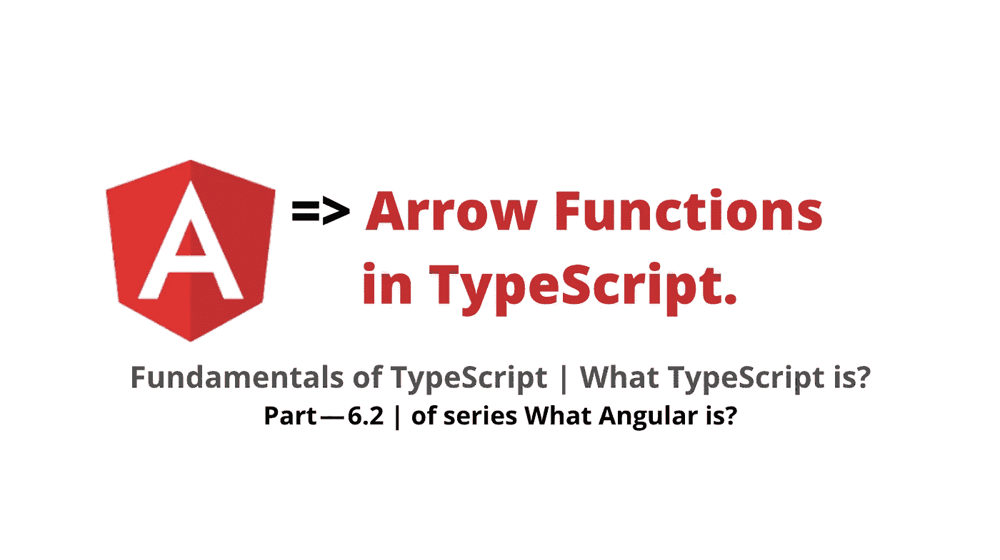
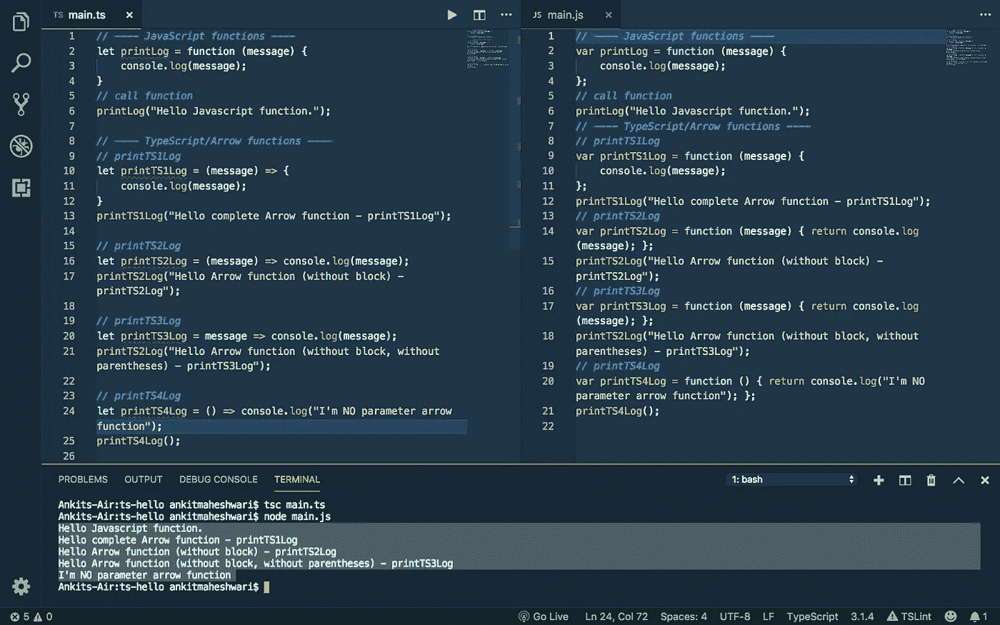
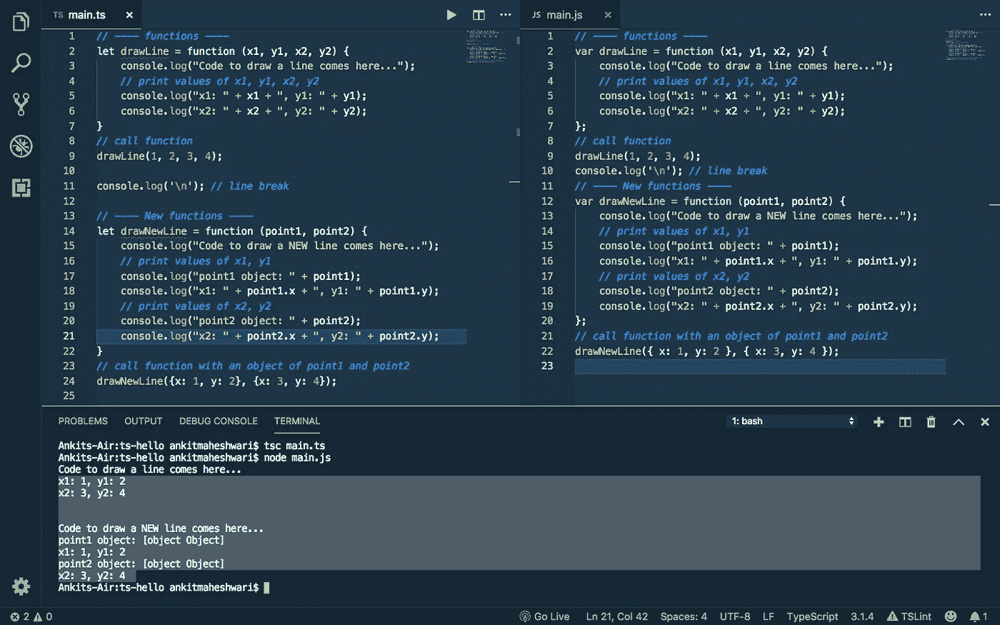
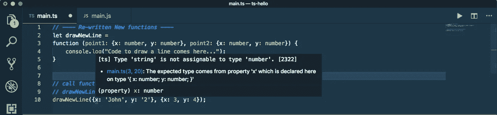

# JavaScript/TypeScript/Angular 中的箭头函数

> 原文：<https://javascript.plainenglish.io/arrow-functions-in-typescript-part-6-2-of-series-what-angular-is-%EF%B8%8F-what-typescript-is-d4584d87d01b?source=collection_archive---------3----------------------->

## 什么是有角？(第 6.2 部分)/什么是 TypeScript？

工作原理… |如何开始…

> *如果*你还没有涉及到本系列的 [Part — 6.1](https://medium.com/@AnkitMaheshwariIn/type-annotations-fundamentals-of-typescript-part-6-1-823ab6f62ead) ，我推荐你查看这个链接→[Type Annotations—Fundamentals of TypeScript | Part—6.1 |什么是 Angular？🤷🏻‍♂️什么是打字稿？](https://medium.com/@AnkitMaheshwariIn/type-annotations-fundamentals-of-typescript-part-6-1-823ab6f62ead)



# 打字稿基础👇

1.  [类型标注](https://medium.com/@AnkitMaheshwariIn/type-annotations-fundamentals-of-typescript-part-6-1-823ab6f62ead)
2.  **箭头功能**
3.  接口
4.  班级
5.  构造器
6.  访问修饰符
7.  性能
8.  模块

> **点击这里** → [知道什么是 TypeScript？TypeScript 概念和如何安装 TypeScript](https://medium.com/@AnkitMaheshwariIn/type-annotations-fundamentals-of-typescript-part-6-1-823ab6f62ead)

# 6.2 箭头功能

**JavaScript 函数:**这个函数被分配给一个名为`printLog`的变量，它接受一个`message`对象，在这个函数块中，它只是控制台中的`logs`。

```
let printLog = function (message) {
    console.log(message);
} 
```

# ⭐️打字稿功能 **:**

**TS 功能类型— 1**

*   这种声明函数的模式`does not need function keyword`声明一个函数。
*   我们可以在大括号内`start by adding the parameters`——在我们的例子中，参数是消息。
*   然后我们添加一个箭头——这就是为什么我们称这个箭头函数。然后代码块{ }

```
let printTS1Log = (message) => {
    console.log(message);
}
```

**TS 功能类型— 2**

*   单行箭头函数——不需要花括号{ }——代码更短更简洁。在 C#中，我们称之为 lambda 表达式。在 TypeScript 中，我们称之为箭头函数。

```
let printTS2Log = (message) => console.log(message);
```

**TS 功能类型— 3**

*   参数(消息)周围的括号在单行箭头函数中也是可选的。但是放一个括号总是好的——它使代码更具可读性。

```
let printTS3Log = message => console.log(message);
```

**TS 功能类型— 4**

*   但是在箭头函数中缺少参数时，括号总是必需的。

```
let printTS4Log = () => console.log("I'm NO parameter arrow function");
```

# 让我们试试这段代码…

*   首先传输代码`tsc main.ts`
*   然后运行代码`node main.js`

看下面👇左窗口是 TypeScript 文件，右窗口是 JavaScript 文件——命令`tsc main.ts`将 ts 代码转换成 JavaScript 代码。



接下来…

# TypeScript 中的⭐️自定义类型:

首先声明一个函数`drawLine()`——这个函数取一个点(`x1, y1)`和另一个点`(x2, y2)`，并简单地在屏幕上用这两个点画一条线。

```
let drawLine = function (x1, y1, x2, y2) {
    console.log("Code to draw a line comes here...");
}
```

现在，将所有的参数封装在一个对象中总是一个好的做法——当一个函数需要传递这么多参数的时候。

所以在上面的例子中，对于一个函数`drawLine()`，我们可以传递两个点作为对象。像这样...

```
let drawNewLine = function (point1, point2) {
    console.log("Code to draw a line comes here...");
}
```

然后我们可以通过传递一个带有两个属性`x`和`y`的对象(point1 & point2)来调用这个函数`drawNewLine()`。

```
drawNewLine({x: 1, y: 2}, {x: 3, y: 4}); // or we can write the same code like this...drawNewLine({
    x: 1,
    y: 2
  },
  {
    x: 3,
    y: 4
});// or we can write the same code like this...point1 = {
    x: 1,
    y: 2
}
point2 = {
    x: 3,
    y: 4
}
drawNewLine(point1, point2);
```

**注意**:我们可以将`point1`和`point2`的对象作为参数传递，而不是传递所有的参数`x1, y1, x2, y2`,`x`和`y`的值可以直接从各自的点获取。

查看下面的代码👇和终端中代码的输出。



# 我们可以通过类型来注释参数，以避免传递不正确的参数。

就像上面的例子一样，我可以在`x`和`y`的值中传递`strings`，这将成为一个问题！因为线不能用线来画，所以它需要数字。看下面👇错误的代码。

```
drawNewLine({x: 'John', y: '2'}, {x: 3, y: 4});
```

# 所以我们需要用自定义类型或自定义对象来注释参数。

用**内联注释**重写函数

```
let drawNewLine = function (**point1: {x: number, y: number}, point2: {x: number, y: number}**) {
    console.log("Code to draw a line comes here...");
}
```

现在，看下面的代码👇当鼠标悬停在属性`x` — `Type 'string' is not assignable to type 'number'.`上时，出现错误



接下来，解决`Type Annotation`问题的更简单、更好的方法是使用`Interfaces`。我们将在下一部分讨论这一点，所以下一部分再见👋👋

> *如果*你还没有涉及到本系列的 [Part — 6.1](https://medium.com/@AnkitMaheshwariIn/type-annotations-fundamentals-of-typescript-part-6-1-823ab6f62ead) ，我推荐你查看这个链接→[Type Annotations—Fundamentals of TypeScript | Part—6.1 |本系列的什么是 Angular？🤷🏻‍♂️什么是打字稿？](https://medium.com/@AnkitMaheshwariIn/type-annotations-fundamentals-of-typescript-part-6-1-823ab6f62ead)
> 
> *敬请期待部分—6.3* [*https://medium.com/@AnkitMaheshwariIn*](https://medium.com/@AnkitMaheshwariIn)

如果你不介意给它一些掌声👏 👏既然有帮助，我会非常感谢:)帮助别人找到这篇文章，所以它可以帮助他们！

永远鼓掌…


# 了解更多信息