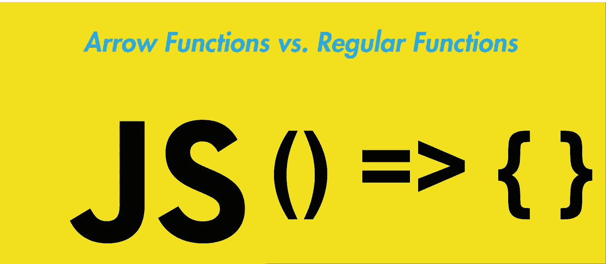

# JavaScript 中的箭头函数与常规函数

> 原文：<https://javascript.plainenglish.io/arrow-functions-vs-regular-functions-in-javascript-f98687f23a6d?source=collection_archive---------1----------------------->

## 它们如何工作以及使用哪一个



Arrow & regular functions? Let the showdown begin!

您是否注意到 JavaScript 中除了“普通”函数之外还有另一种类型的函数，包含 function-keyword？你当然有。但是你知道两者的区别吗，更何况箭头函数看起来酷多了？无论如何，这篇文章很好地总结了这两者，以便您在将来做出更好的决定:)

# 基本语法

这里基本上是一样的功能。首先，作为常规的一个，第二个是 ES6 箭头功能:

```
function add(a, b) {
   return a + b;
}add(2, 2)   // 4
```

箭头功能:

```
const add = (a, b) => {
   return a + b;
};add(2, 2)   // 4
```

所以我们看到这两个函数在这里有相同的效果。但引人注目的是，我们将箭头函数定义为一个变量。当我们定义一个变量时，我们可以用几种方式在 JavaScript 中定义它。例如，我们可以使用一个**字母**或者甚至一个**变量**来代替我们函数的**常量**。不同的变量类型做什么是一个非常特殊的主题，我将在另一篇文章中讨论。

# 对于箭头函数，有一些很酷的快捷键

如果我们从头开始引用我们的 Arrow 函数，我们可以通过简单地省略 **return** 关键字并使用圆括号代替花括号，或者甚至完全省略括号来使它变得更短。

```
const add = (a, b) => {
   return a + b;
}// or:
const add = (a, b) => ( a + b )// or:
const add = (a, b) => a + b
```

## 现在它变得更小了:当我们希望括号中只有一个参数时，我们可以省略它们

```
const multiply = a => a * 2multiply(2)  // 4
```

# 够审美。现在真正的区别在哪里？

## 让我们澄清几个误解:

*   两者都可以匿名
*   两者都可以使用一个最多无限的参数并返回结果
*   现代 JavaScript 支持这两者

## 差异:

*   最重要的是:箭头函数不绑定自己的**这个**
*   箭头函数没有一个**参数**对象

**this** 表示调用我们函数的对象，在普通函数中
在 Arrow 函数中，然而 **this** 关键字总是表示定义 Arrow 函数的对象，所以 **this** 在封闭上下文中有其原始含义。
让我们来看一个例子:

```
const speed = 100;const Car = {
 speed: 200,
 speedUp: function() {
    this.speed++;
    return this.speed;
 }
};console.log(Car.speedUp()); *// 201*
```

所以在普通函数中，使用**这个**关键字，我们可以访问我们在上下文中定义的变量。所以在我们的例子中，全局作用域
**const speed = 100；** 将被忽略，但我们将使用物体内部的速度变量。
区分变量内部的上下文和外部的上下文，是**这个**关键字的主要目的。

如果我们现在将**加速**功能改为箭头功能，这将不再有效。两个**速度**变量都不会被使用。

```
const speed = 100;const Car = {
 speed: 200,
 speedUp: () => {
    this.speed++;
    return this.speed;
 }
};console.log(Car.speedUp()); *// NaN*
```

# 何时以及为什么要使用箭头函数？

*   箭头函数更容易阅读和编写，尤其是在更复杂的代码中，例如，在使用 currying 时:

```
const add = x => y => x + y; 
// vs.
function add(x) { 
  return function(y) { 
    return x + y; 
  }; 
}
```

*   作用域的安全性:使用箭头函数来保证来自封闭上下文的原始 **this** 将被使用。这个例子将很好地工作，由于这个好处:

```
function Car() {
  this.speed = 0;
  setInterval(() => {
    this.speed++;
    console.log(this.speed);
  }, 1000);
}Car();   // will give out 1, 2, 3 etc.
```

# 何时以及为什么使用常规函数？

*   函数声明被 ***吊起*** ，所以可以在声明之前使用

```
// this will work:
hello();
function hello() {
  console.log(“hello”);
}// this will not work:
hello();
const hello = () => {
  console.log(“hello”);
};
```

*   全局范围内的**窗口**对象可以直接寻址

最后一切都由你决定，你可以自由决定你要用哪一个。没有明显的赢家。

**关于我，作者:)** 嗨！非常感谢您的阅读，我叫路易斯，是一名来自德国的 18 岁学生。我热爱 Web 开发，包括后端和前端。我最喜欢的技术是 React，Vue，React Native 和 Node.js。

请务必关注我，了解更多相关内容，并随时查看我的 IG @ Louis . jsx & @ coding culture shop

祝您愉快！